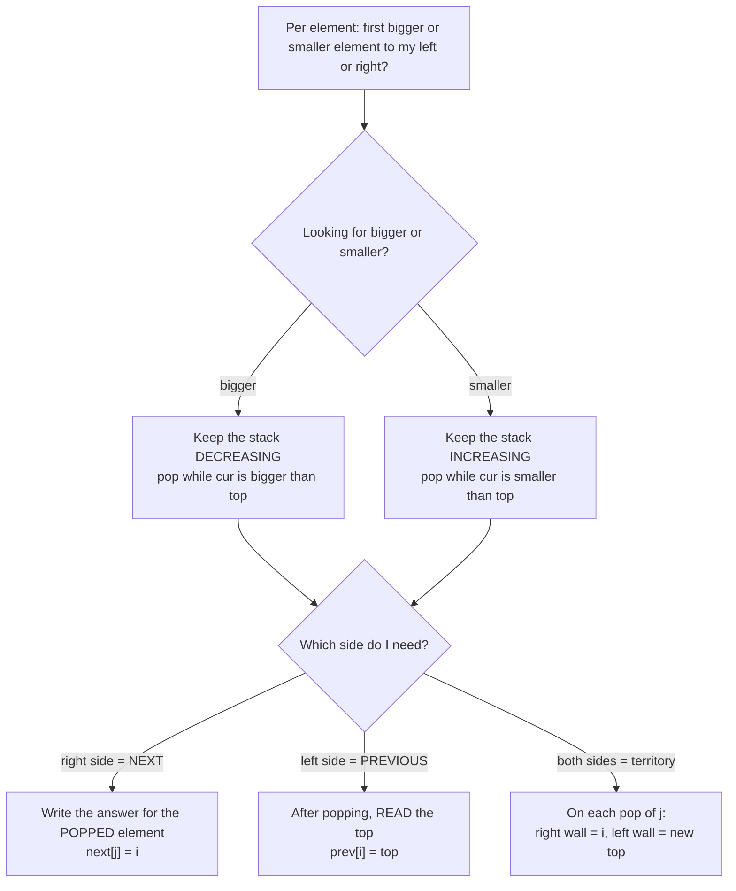
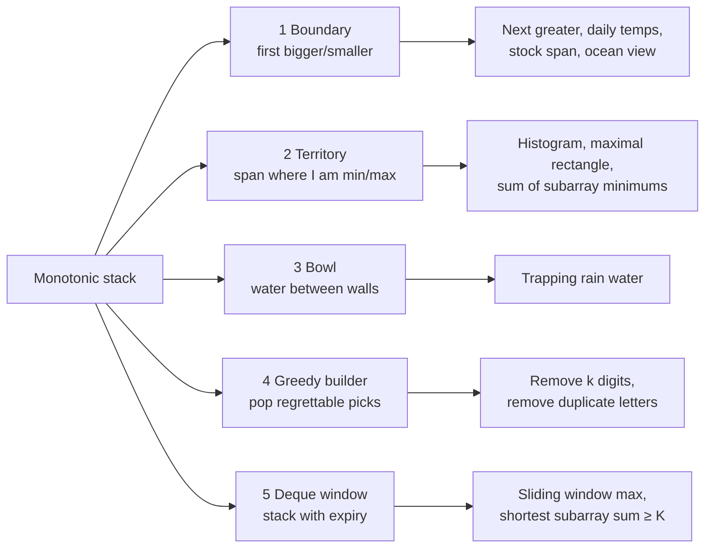

# MM01: Monotonic Stack, the mental model

> Goal: never memorize a monotonic-stack solution again. You **derive** it from one picture and two decisions.
> Interactive trainer (predict each pop before it happens): [07-Revision/visualizers/monotonic-stack-trainer.html](../07-Revision/visualizers/monotonic-stack-trainer.html) (open it in a browser).
> Code for everything below compiles and is tested.

---

## 1. The one question behind every monotonic-stack problem

> **"For each element: who is the *first* element to my left / right that is bigger / smaller than me?"**

That's 4 arrays: **next greater**, **next smaller**, **previous greater**, **previous smaller**.
Every problem in this file is "compute one or two of these, then combine them".
Brute force asks it with a nested scan, O(n²). The stack answers all n of them in O(n).

## 2. Picture A: the waiting room (for NEXT)

Scan left to right. Each element walks in and **waits until someone beats it**.
When a newcomer arrives, every waiting element it beats gets its answer (the newcomer) and **leaves**.

```
 next GREATER of [2, 1, 5, 3]

 i=0  2 arrives        room: [2]              nobody to beat
 i=1  1 arrives        room: [2, 1]           1 beats nobody
 i=2  5 arrives        1 leaves → next[1]=5   2 leaves → next[0]=5
                       room: [5]
 i=3  3 arrives        room: [5, 3]           3 can't beat 5
 end                   5 and 3 never got beaten → next = -1
```
**You don't memorize the stack's order. It falls out.** If a bigger element arrives after a smaller one, the smaller one is gone. So whatever is still waiting must be **decreasing**. Looking for *greater* gives a *decreasing* stack; looking for *smaller* gives an *increasing* stack. **The stack's order is always the opposite of what you're looking for.**

## 3. Picture B: looking back over the crowd (for PREVIOUS)

Same scan, same pops, just read at a different moment. After the newcomer has removed everyone it beats, **the element on top is the first one to its left it could not beat**. That's its *previous* greater (or smaller).

```
 NEXT answer:     written for the element that LEAVES      (at pop time)
 PREVIOUS answer: read for the element that ARRIVES        (top, after popping)
```

## 4. The big unlock: one pop gives TWO walls

When element `j` is popped by the arrival of `i`:

```
        left wall              j                right wall
   ... [ st.top() ] ...... [ popped ] ...... [ i = newcomer ] ...
         first one to the                     first one to the
         LEFT that beats j                    RIGHT that beats j
```
- **right wall of j = i** (the first element to the right that beats j)
- **left wall of j = the element now under j in the stack** (the first element to the left that beats j)

Everything strictly between the two walls is "dominated" by j. Call that span **j's territory**: the widest window where j is the minimum (or maximum). Most hard monotonic-stack problems are **"compute every element's territory, then combine"**.

---

## 5. Largest Rectangle in Histogram: how to choose left and right for bar i

### Step 1: guess the shape of the answer
Every rectangle is as tall as its **shortest** bar. So ask, for each bar i: *"What's the widest rectangle in which bar i is the shortest bar?"* The answer is the max over all i.

### Step 2: how far can bar i stretch?
It stretches left and right **while bars are at least as tall as h[i]**, and stops at the **first shorter bar** on each side.

```
 heights [2, 1, 5, 6, 2, 3]       bar i = 2 (h = 5)

            6
         5  █                      left:  i=1 has h=1 < 5  → STOP → L = 1
         █  █                      right: i=3 has h=6 ≥ 5  → keep going
         █  █     3                       i=4 has h=2 < 5  → STOP → R = 4
   2     █  █  2  █
   █  1  █  █  █  █                width = R - L - 1 = 4 - 1 - 1 = 2
   █  █  █  █  █  █                area  = 5 × 2 = 10   ← the answer
 i:0  1  2  3  4  5
          L ←[ 2  3 ]→ R
```
- **L[i] = previous smaller** bar's index (−1 if none)
- **R[i] = next smaller** bar's index (n if none)
- **area(i) = h[i] × (R[i] − L[i] − 1)**

"First smaller to the left/right" is exactly the monotonic-stack question, with an increasing stack.

### Step 3: the easy version, two passes (code this first if you're nervous)
```cpp
int largestRectangleTwoPass(const vector<int>& h) {
    int n = h.size();
    vector<int> L(n), R(n);
    vector<int> st;
    for (int i = 0; i < n; ++i) {                       // previous smaller: read top after popping
        while (!st.empty() && h[st.back()] >= h[i]) st.pop_back();
        L[i] = st.empty() ? -1 : st.back();
        st.push_back(i);
    }
    st.clear();
    for (int i = n - 1; i >= 0; --i) {                  // next smaller: same thing, scanning from the right
        while (!st.empty() && h[st.back()] >= h[i]) st.pop_back();
        R[i] = st.empty() ? n : st.back();
        st.push_back(i);
    }
    int best = 0;
    for (int i = 0; i < n; ++i) best = max(best, h[i] * (R[i] - L[i] - 1));
    return best;
}
```

### Step 4: the one-pass version (section 4's "two walls per pop")
```cpp
int largestRectangle(const vector<int>& h) {
    int n = h.size(), best = 0;
    vector<int> st;                                      // indices; heights increasing bottom → top
    for (int i = 0; i <= n; ++i) {
        int cur = (i == n) ? 0 : h[i];                   // height-0 sentinel flushes everyone at the end
        while (!st.empty() && h[st.back()] > cur) {
            int j = st.back(); st.pop_back();            // j's RIGHT wall = i
            int left = st.empty() ? -1 : st.back();      // j's LEFT wall = the bar under it
            best = max(best, h[j] * (i - left - 1));
        }
        st.push_back(i);
    }
    return best;
}
```

### Model sentence → code line (this is how you regenerate the code in an interview)
| Say this | Write this |
|---|---|
| A bar waits until a **shorter** bar shows up on its right | `while (!st.empty() && h[st.back()] > cur)` |
| That shorter newcomer is the popped bar's **right wall** | `j = st.back(); st.pop_back();` (the right wall is `i`) |
| The bar **under** it in the stack is its **left wall** | `left = st.empty() ? -1 : st.back();` |
| Width is **strictly between** the walls | `i - left - 1` |
| A height-0 bar at the end makes **everyone** leave | loop to `i <= n` with `cur = 0` at `i == n` |
| The newcomer starts waiting | `st.push_back(i);` |

### Hand trace: do this on paper once, then check yourself
`h = [2, 1, 5, 6, 2, 3]`, plus a sentinel at i = 6

| i | cur | popped j → (left wall, right wall, width, area) | stack after (index:h) |
|---|---|---|---|
| 0 | 2 | none | 0:2 |
| 1 | 1 | j=0 → (−1, 1, 1, **2**) | 1:1 |
| 2 | 5 | none | 1:1, 2:5 |
| 3 | 6 | none | 1:1, 2:5, 3:6 |
| 4 | 2 | j=3 → (2, 4, 1, **6**) · j=2 → (1, 4, 2, **10**) | 1:1, 4:2 |
| 5 | 3 | none | 1:1, 4:2, 5:3 |
| 6 | 0 | j=5 → (4, 6, 1, **3**) · j=4 → (1, 6, 4, **8**) · j=1 → (−1, 6, 6, **6**) | 6:0 |

Max = **10**. Notice that the pops at i=4 come out **tallest first**, and each popped bar's left wall is simply what's underneath it.

### Duplicates: strict or non-strict pop?
Trace `h = [3, 1, 3, 2, 2]` with the strict pop `>`:
- Bar 4 (h=2) is popped by the sentinel with left wall = bar 3 (also h=2) → width 1, area 2. That's an **underestimate**.
- Bar 3 (h=2) is popped next with left wall = bar 1 (h=1) → width 3, area **6**. That's the true answer.

**Rule:** among equal bars, *one of them* always computes the full width, so **max problems don't care** whether you pop with `>` or `>=`.
**Counting problems do care** (section 7, family 2): use strict on one side and non-strict on the other, so each subarray is counted exactly once. The one-pass template gives you that asymmetry for free.

---

## 6. The two decisions (this is the whole template)



The generic template. Every problem in this file is a small edit of it:
```cpp
// beats(x, y): does arriving value x resolve waiting value y?
//   looking for GREATER: x > y      looking for SMALLER: x < y
vector<int> nxt(n, n), prv(n, -1), st;                  // st holds INDICES (you need distances/widths)
for (int i = 0; i < n; ++i) {
    while (!st.empty() && beats(a[i], a[st.back()])) {
        nxt[st.back()] = i;                              // NEXT: born at pop time
        st.pop_back();
    }
    prv[i] = st.empty() ? -1 : st.back();                // PREVIOUS: read after popping
    st.push_back(i);
}
// leftovers in st have no NEXT answer (they keep n / -1)
```
> **Strictness detail:** with a strict `beats`, `nxt` is the *strictly* greater/smaller one, but `prv` is the previous one that *wasn't beaten* (≥ or ≤). If you need strict on both sides, run a second pass from the right.

**Three extra knobs you'll meet:**
| Knob | Do this |
|---|---|
| Need distance or width | store **indices**, never values |
| Circular array (LC 503) | loop `i` from 0 to `2n−1`, use `i % n`, push only when `i < n` |
| Previous answers are easier from the right | scan **right → left**, and "previous" becomes "next" |

**Why it's O(n):** each index is pushed once and popped at most once, so at most 2n stack operations, even with the nested `while`.

---

## 7. The five families (and one cousin)



### Family 1: Boundary ("who's the first one that beats me?")
The answer is the boundary itself (an index, a value, or a distance).
- **Daily temperatures:** next greater, answer `i − j` at pop time.
- **Stock span:** previous greater, span = `i − top` after popping (or `i + 1` if the stack is empty). Pop while `price[top] <= price[i]`.
- **Buildings with an ocean view:** a building sees the ocean if nothing to its right is ≥ it. Pop while `h[top] <= h[i]`. The answer is the **leftovers** in the stack (elements that never got beaten).

### Family 2: Territory ("in how much space am I the boss?")
> **Why is "sum of subarray minimums" a stack problem at all?** It isn't, until you **flip** the sum: instead of visiting every subarray, count for each element how many subarrays it is the minimum of. Only then does "first smaller on each side" appear. The full reasoning, five solution levels and a practice ladder are in [MM03: Stuck at O(n²)?](MM03-Stuck-At-Brute-Force.md).

Compute both walls, then combine:
| Problem | Combine with |
|---|---|
| Largest rectangle (LC 84) | `h[j] × (R − L − 1)` |
| Maximal rectangle in a 0/1 matrix (LC 85) | each row becomes a histogram of column heights → LC 84 per row |
| **Sum of subarray minimums** (LC 907) | `a[j] × (j − L) × (R − j)`, the number of subarrays inside j's territory that contain j |
| Sum of subarray ranges (LC 2104) | Σ a[j] × (#subarrays where j is max − #subarrays where j is min): two stacks |
| Max subarray min-product (LC 1856) | `a[j] × (prefix[R] − prefix[L+1])` |

```cpp
// LC 907: each a[j] is the minimum of (j - L) * (R - j) subarrays.
// One-pass template: R = next strictly smaller, L = previous smaller-or-equal → each subarray counted once.
int sumSubarrayMins(const vector<int>& a) {
    const long long MOD = 1'000'000'007;
    int n = a.size(); long long total = 0;
    vector<int> st;
    for (int i = 0; i <= n; ++i) {
        int cur = (i == n) ? INT_MIN : a[i];             // sentinel smaller than everything
        while (!st.empty() && a[st.back()] > cur) {
            int j = st.back(); st.pop_back();
            int L = st.empty() ? -1 : st.back();
            total = (total + (long long)a[j] * (j - L) % MOD * (i - j)) % MOD;
        }
        st.push_back(i);
    }
    return (int)total;
}
```

### Family 3: Bowl ("water fills in horizontal layers")
Trapping rain water, stack version. Keep a **decreasing** stack (you're waiting for a taller right wall). When a taller bar arrives, pop the **floor**. Under it is the **left wall**, and the newcomer is the **right wall**. Fill one horizontal layer:
```
   left wall        right wall          water += (min(h[left], h[i]) − h[floor])
      █   ~~~~~~~~~~~   █                        × (i − left − 1)
      █   ~~~ █floor    █
```
```cpp
int trapStack(const vector<int>& h) {
    int water = 0; vector<int> st;
    for (int i = 0; i < (int)h.size(); ++i) {
        while (!st.empty() && h[st.back()] < h[i]) {
            int floor = st.back(); st.pop_back();
            if (st.empty()) break;                       // no left wall: water spills out
            int left = st.back();
            water += (min(h[left], h[i]) - h[floor]) * (i - left - 1);
        }
        st.push_back(i);
    }
    return water;
}
```

### Family 4: Greedy builder ("pop the last pick if a better one arrives and you can afford to drop it")
Here the stack **is the answer being built**. Pop when (a) the top is worse than the newcomer **and** (b) dropping it is still allowed (you have budget left, or it reappears later).
- **Remove K digits** (LC 402): to get the smallest number, a bigger digit before a smaller one is a regret. Pop while `k > 0 && top > cur`. Afterwards, trim any remaining k from the end and strip leading zeros.
- **Remove duplicate letters / smallest subsequence of distinct chars** (LC 316/1081): pop while `top > cur && top appears again later && cur not already in the stack`.
```cpp
string removeKdigits(const string& num, int k) {
    string st;                                           // std::string as the stack
    for (char c : num) {
        while (k > 0 && !st.empty() && st.back() > c) { st.pop_back(); --k; }
        st.push_back(c);
    }
    st.resize(st.size() - min<size_t>(k, st.size()));   // still have budget → drop from the end
    size_t nz = st.find_first_not_of('0');
    return nz == string::npos ? "0" : st.substr(nz);
}
```

### Family 5: Monotonic deque ("a stack whose bottom expires")
Same waiting-room rule at the back, plus **elements fall off the front when they leave the window**.
- **Sliding window maximum** (LC 239): decreasing deque of indices; the front is the max.
- **Shortest subarray with sum ≥ K, negatives allowed** (LC 862): an increasing deque over prefix sums. Pop the front while `P[i] − P[front] >= K` (record the length). Pop the back while `P[back] >= P[i]` (a later, smaller prefix is a better start).
```cpp
int shortestSubarray(const vector<int>& a, int K) {
    int n = a.size(), best = INT_MAX;
    vector<long long> P(n + 1, 0);
    for (int i = 0; i < n; ++i) P[i + 1] = P[i] + a[i];
    deque<int> dq;
    for (int i = 0; i <= n; ++i) {
        while (!dq.empty() && P[i] - P[dq.front()] >= K) { best = min(best, i - dq.front()); dq.pop_front(); }
        while (!dq.empty() && P[dq.back()] >= P[i]) dq.pop_back();
        dq.push_back(i);
    }
    return best == INT_MAX ? -1 : best;
}
```

### Cousin: collision stack ("the most recent unresolved thing")
Not always monotonic, but the same instinct: **asteroid collision** (LC 735), **car fleet** (LC 853), valid parentheses, decode string, basic calculator.

---

## 8. Problem ladder (solve in order; say the family and the two decisions before coding)

| # | Problem | Family | Looking for | Stack order | Answer computed |
|---|---|---|---|---|---|
| 1 | Next Greater Element I (LC 496) | Boundary | next greater | decreasing | at pop |
| 2 | Daily Temperatures (LC 739) | Boundary | next greater, as a distance | decreasing | at pop: `i − j` |
| 3 | Next Greater Element II (LC 503) | Boundary, circular | next greater | decreasing | at pop; loop 2n |
| 4 | Online Stock Span (LC 901) | Boundary | previous greater | decreasing | after pop: `i − top` |
| 5 | Buildings With an Ocean View (LC 1762) | Boundary | no ≥ to the right | decreasing | the leftovers |
| 6 | **Largest Rectangle in Histogram (LC 84)** | Territory | prev and next smaller | increasing | at pop: `h × (i − top − 1)` |
| 7 | Maximal Rectangle (LC 85) | Territory | LC 84 per row | increasing | per row |
| 8 | **Sum of Subarray Minimums (LC 907)** | Territory count | both smaller walls | increasing | `a·(j−L)·(R−j)` |
| 9 | Sum of Subarray Ranges (LC 2104) | Territory count ×2 | min and max walls | increasing + decreasing | max-count − min-count |
| 10 | Max Subarray Min-Product (LC 1856) | Territory + prefix sums | both smaller walls | increasing | `a·(P[R] − P[L+1])` |
| 11 | **Trapping Rain Water (LC 42)** | Bowl | taller right wall | decreasing | layer at each pop |
| 12 | Remove K Digits (LC 402) | Greedy builder | a smaller digit kicks a bigger one out | increasing | the final stack |
| 13 | Remove Duplicate Letters (LC 316) | Greedy builder + constraint | a smaller char kicks a bigger one if it reappears | increasing | the final stack |
| 14 | 132 Pattern (LC 456) | Boundary, scan from the right | track the best "2" popped so far | decreasing | while popping |
| 15 | **Sliding Window Maximum (LC 239)** | Deque | window max | decreasing deque | the front |
| 16 | Shortest Subarray with Sum ≥ K (LC 862) | Deque on prefix sums | the smallest earlier prefix | increasing deque | pop the front |

Bold = most likely in an interview. Rows 1, 2, 6, 11 and 15 already have tested stubs in `06-Practice/day2.cpp` (`nextGreater`, `largestRectangle`, `maxSlidingWindow`) and `day1.cpp` (`trap`).

## 9. Recognition triggers
- "next / previous **greater / smaller**", "**first** element to the right that…", "how many days until…"
- "how far can it **extend**", "**width / area** limited by the shortest", "**visible**", "can see", "ocean view"
- "for **every subarray**, its min / max…" → territory counting
- "remove k … to make the **smallest / largest**", "**lexicographically smallest** subsequence" → greedy builder
- "max / min of **every window**" → deque
- **Constraint smell:** n ≈ 10⁵ and the brute force is "for each i, scan left/right until…" → O(n) stack.

## 10. Practice (predict, then verify)
1. **Trace on paper** `h = [6, 2, 5, 4, 5, 1, 6]` with the one-pass histogram code. Write every pop with (left wall, right wall, width, area).
   <details><summary>check</summary>Pops: j0 at i1 (−1,1,1,6) · j2 at i3 (1,3,1,5) · j4 at i5 (3,5,1,5) · j3 at i5 (1,5,3,<b>12</b>) · j1 at i5 (−1,5,5,10) · sentinel i7: j6 (5,7,1,6) · j5 (−1,7,7,7). Max = 12.</details>
2. **Trace** next greater on `[13, 7, 6, 12]`. Which elements leave when 12 arrives, and in what order?
   <details><summary>check</summary>6 leaves first (top), then 7. Both get 12. 13 and 12 are leftovers → −1.</details>
3. **Transfer:** "For each day, how many consecutive previous days (including today) had a price ≤ today's?" Name the family, the stack order, and when the answer is computed.
   <details><summary>check</summary>Boundary, previous greater (strict) → decreasing stack, pop while `price[top] <= price[i]`, answer after popping: `i − top` (or `i + 1` if the stack is empty). That's Online Stock Span.</details>
4. **Transfer:** "Sum over all subarrays of (max − min)." What do you compute, and how many stacks?
   <details><summary>check</summary>Territory counting twice: Σ a[i]·(#subarrays where it's max) − Σ a[i]·(#subarrays where it's min). One increasing stack (min territories) plus one decreasing stack (max territories), strict/non-strict asymmetry on each.</details>
5. **Transfer:** "Smallest number after removing k digits from `1432219`, k = 3." Simulate the stack.
   <details><summary>check</summary>1 → 14 → 4 kicked by 3 (k=2): 13 → 3 kicked by 2 (k=1): 12 → 122 → 2 kicked by 1 (k=0): 121 → 1219. Answer "1219".</details>

## 11. Recall check (close the file)
1. Draw the waiting room for next greater. Why is the stack decreasing?
2. At the moment of a pop, which two facts do you learn about the popped element?
3. Histogram: the formula for bar i's area, and where L and R come from.
4. Equal heights: why does max-area not care about `>` vs `>=`, but sum of subarray minimums does?
5. Say the six model sentences and write the six matching code lines.
