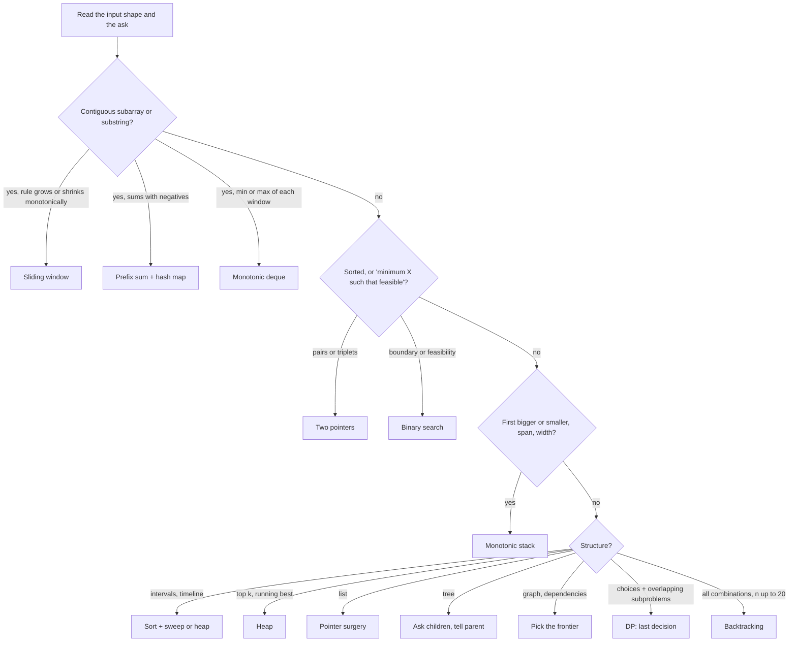
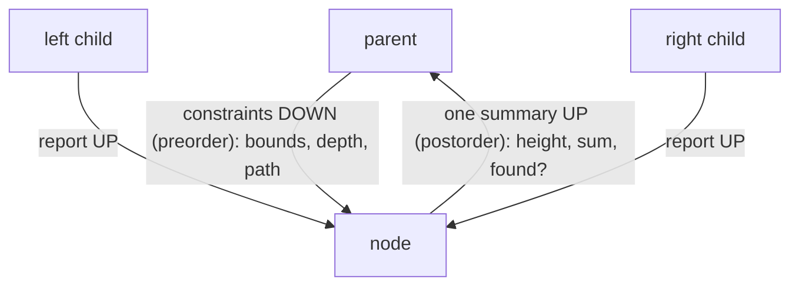
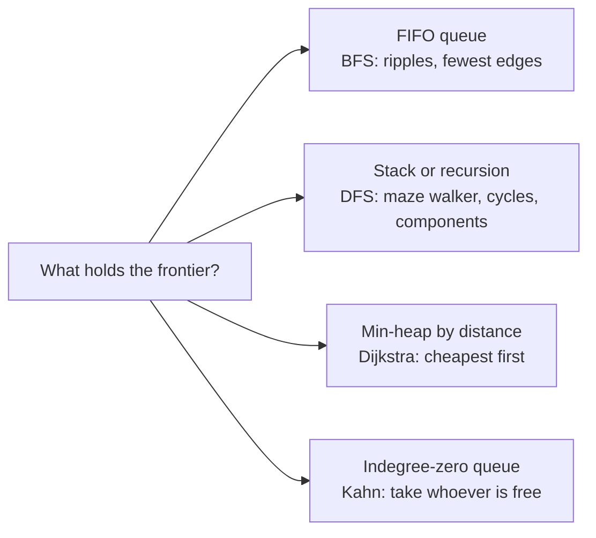

# MM02: Mental Models Atlas (one picture, one sentence, a few decisions per pattern)

> The P01–P12 files are the full reference. This atlas is the **compressed visual layer** you redraw from memory.
> Monotonic stack has its own deep file: [MM01](MM01-Monotonic-Stack-Mental-Model.md). So do SCC (Kosaraju, Tarjan) and bipartite: [MM04](MM04-SCC-Kosaraju-Mental-Model.md).

---

## How to make a pattern stick, and come out fast as code

Diagrams help you **understand** a pattern. On their own they create *recognition* ("I've seen this"), not *recall* ("I can produce this under pressure"). What makes a pattern last, and makes the code come out fast, is **producing it yourself**. So every pattern below is packaged as five things, and your practice loop uses all five:

| Layer | What it is | Why it works |
|---|---|---|
| **Picture** | a tiny drawing you can redraw in 20 seconds | gives the idea a visual hook to hang on (dual coding) |
| **Model sentence** | one sentence that stays true every loop iteration | the invariant *is* the algorithm |
| **Decisions** | the 2–3 choices that turn the template into *this* problem | you adapt instead of memorizing 50 solutions |
| **Sentence → code** | each sentence of the model becomes one line of code | you **regenerate** code instead of recalling it, which is faster and survives stress |
| **Predict-a-trace** | run a 5-element input by hand **before** checking | retrieval plus error correction; the trainer HTML automates this for the monotonic stack |

**Practice loop (10 minutes a day):**
1. Pick 3 patterns. Redraw each picture and say its sentence **from memory**, then check.
2. Write the sentence → code lines from memory (no full problem) and diff them against this file.
3. Do the **recognition drill** at the end: mixed problems, name the pattern and decisions only. Interviews test *choosing* the pattern far more than executing a known one, so mixed practice beats doing 10 sliding-window problems in a row.
4. Space it out: day 1, day 3, day 7. Each pass should be faster.

---

## 0. Which pattern? (first 30 seconds)


The full keyword table is in [00-Pattern-Map.md](00-Pattern-Map.md).

---

## 1. Sliding window: the caterpillar
```
 a: [ 2  3  1  2  4  3 ]      target sum ≥ 7, shortest window
      L-----R                 head (R) moves EVERY step
         L-----R              tail (L) moves only to REPAIR (or squeeze) the window
```
**Model:** the head always advances. The tail advances only while the window is broken (longest) or still valid (shortest).
**Decisions:** longest vs shortest · what the window remembers (sum / count map / distinct count) · is validity monotone? (negatives in sums break it → prefix sums)

| Say | Write |
|---|---|
| The head eats one more element | `for (int r = 0; r < n; ++r) { add(a[r]);` |
| Broken? The tail moves until it's fixed | `while (broken()) remove(a[l++]);` |
| A fixed window is a candidate | `best = max(best, r - l + 1);` |
| *(shortest)* While valid: record, then squeeze | `while (valid()) { best = min(best, r - l + 1); remove(a[l++]); }` |

**Triggers:** longest/shortest contiguous …, at most k distinct, all positives with a sum target, anagram in a string.
**Trace:** the longest substring with ≤ 2 distinct characters in `eceba`. <details><summary>check</summary>`ece`, length 3. When `b` arrives the window `eceb` has 3 distinct, so the tail moves past `e`, `c` → `eb`.</details>

## 2. Two pointers: the squeeze
```
 sorted: 1  2  4  7  11  15      target 15
         l→               ←r     1+15 = 16 > 15  → 15 can't pair with anything ≥ 1 → r moves
         l→            ←r        1+11 = 12 < 15  → 1 can't pair with anything ≤ 11 → l moves
```
**Model:** each step throws away one element that provably can't be part of any better answer.
**Decisions:** opposite ends (pairs, area, palindrome) vs same direction (read/write compaction) · how duplicates are skipped.

| Say | Write |
|---|---|
| Start at both ends | `int l = 0, r = n - 1; while (l < r) {` |
| Too small → only a bigger left value can help | `if (s < t) ++l;` |
| Too big → only a smaller right value can help | `else if (s > t) --r;` |
| Match → record, move both, skip equal neighbours | `else { rec(); ++l; --r; while (l < r && a[l] == a[l-1]) ++l; }` |

## 3. Binary search: find the first T
```
 i:      0  1  2  3  4  5  6  7
 ok(i):  F  F  F  F  T  T  T  T
                     ▲ answer = first T          invariant: answer ∈ [lo, hi]
```
**Model:** never search for a value. Search for the **boundary of a yes/no question** that flips once.
**Decisions:** what's the question (index search vs **answer search**: "can we do it with capacity X?") · first T or last T · the bounds.

| Say | Write |
|---|---|
| The answer always lives in [lo, hi] | `int lo = LO, hi = HI;   // hi is known-true` |
| Look in the middle | `int mid = lo + (hi - lo) / 2;` |
| mid says yes → the answer is mid or left of it | `if (ok(mid)) hi = mid;` |
| mid says no → the answer is strictly right of it | `else lo = mid + 1;` |
| One candidate left | `return lo;` |

**Trace:** the first index with `a[i] ≥ 6` in `[1, 3, 5, 7, 9]`, lo=0, hi=5. <details><summary>check</summary>mid 2 (5) no → lo 3 · mid 4 (9) yes → hi 4 · mid 3 (7) yes → hi 3 · return 3.</details>

## 4. Prefix sum + hash map: subtract two prefixes
```
 a:      3   4   7   2  -3   1   4   2           k = 7
 P:  0   3   7  14  16  13  14  18  20
     a[i..j) sums to k   ⟺   P[j] − P[i] = k   ⟺   P[i] = P[j] − k
     at each j ask the map: "how many earlier prefixes equal P[j] − k?"
```
**Model:** a range question becomes a **pair** question on prefixes, and pairs are Two Sum: "have I seen my complement?"
**Decisions:** count (store counts) vs longest (store the **first** index) vs exists · mod-k variants (store `P mod k`) · 0/1 → ±1 tricks.

| Say | Write |
|---|---|
| The empty prefix exists once | `unordered_map<long long,int> cnt{{0, 1}};` |
| Extend the prefix | `s += x;` |
| How many earlier prefixes complete me? | `if (auto it = cnt.find(s - k); it != cnt.end()) ans += it->second;` |
| Remember myself for later | `++cnt[s];` |

## 5. Heap: the bouncer of a k-seat club
```
 stream  ──►  [ min-heap, k seats ]  ──► top = the weakest member = k-th largest
              new x stronger than top?  x gets in, the weakest is thrown out
```
**Model:** the heap only knows who is weakest right now, and that's all top-k needs.
**Decisions:** largest-k → **min**-heap; smallest-k → max-heap · two heaps for a median · a heap of (value, source) for k-way merge · stale entries instead of decrease-key.

| Say | Write |
|---|---|
| A club of the k best so far | `priority_queue<int, vector<int>, greater<int>> h;` |
| Everyone tries to get in | `h.push(x);` |
| Over capacity → the weakest leaves | `if ((int)h.size() > k) h.pop();` |
| The weakest member is the answer | `return h.top();` |

## 6. Intervals & sweep line: events on a timeline
```
 time →    0    5    10   15   20        30
 A         [=============================)      +1 at 0,  −1 at 30
 B              [====)                          +1 at 5,  −1 at 10
 C                        [====)                +1 at 15, −1 at 20
 active:   1    2    1    2    1    ...  0      peak = 2 rooms
```
**Model:** turn each interval into a start event and an end event, sort them, and walk the timeline keeping a running count (or an active set).
**Decisions:** half-open vs closed (which event goes first at a tie) · what the active set holds (count / multiset of heights / Fenwick over y) · merging = sort by start, compare with the last kept.

| Say | Write |
|---|---|
| Each interval becomes two events | `ev.push_back({s, +1}); ev.push_back({e, -1});` |
| Walk time in order; ends before starts at ties | `sort(ev.begin(), ev.end());` (`-1` sorts before `+1`) |
| The running count is how many are active | `for (auto [t, d] : ev) { cur += d; best = max(best, cur); }` |

## 7. Linked list: three boxes
```
   prev       cur        nxt
   [  ]  ◄─── [  ]   ✂   [  ] ──► ...
   1 save nxt   2 cur->next = prev   3 prev = cur   4 cur = nxt
```
**Model:** you may only cut a link after you've saved where it went.
**Decisions:** does the head change? (→ dummy node) · need the middle or a cycle? (→ slow/fast) · compose middle + reverse + merge for the "hard" ones.

| Say | Write |
|---|---|
| Never lose the rest: save it first | `ListNode* nxt = cur->next;` |
| Rewire | `cur->next = prev;` |
| Step both | `prev = cur; cur = nxt;` |
| The head might change → a fake node in front | `ListNode dummy(0, head); … return dummy.next;` |
| Middle or cycle → two speeds | `slow = slow->next; fast = fast->next->next;` |

## 8. Trees: every node is a manager

**Model:** a node takes constraints from its boss, collects one report from each child, sends one summary up, and updates the global answer on the side.
**Decisions:** what does the parent need from me (the return value)? · what do my children need from me (a parameter)? · is the answer the return value or a global (a path *through* me)?

| Say *(diameter example)* | Write |
|---|---|
| An empty subtree reports zero | `if (!n) return 0;` |
| Collect both reports | `int L = go(n->left), R = go(n->right);` |
| The best path through me updates the global | `best = max(best, L + R);` |
| Send my summary up | `return 1 + max(L, R);` |

## 9. Graphs: the frontier decides the algorithm

| Algorithm | Picture | Model sentence |
|---|---|---|
| **BFS** | ripples on a pond | everything at distance d is reached before anything at d+1 |
| **DFS (3 colours)** | walking a maze with chalk | gray = on my current path; meeting gray again = a cycle |
| **Kahn topo** | taking courses | repeatedly take whoever has no remaining prerequisites; anyone never freed is on a cycle |
| **Dijkstra** | ripples through mud | always expand the cheapest known node; ignore outdated heap entries |
| **Union-Find** | bosses | `find` walks up to the top boss (flattening the path); `union` makes one boss report to the other |
| **Bipartite** | two teams of rivals | every edge flips the team; an odd cycle brings you back to the wrong team |
| **Kosaraju SCC** | one-way streets, water flows downhill ([MM04](MM04-SCC-Kosaraju-Mental-Model.md)) | **Finish, Flip, Flood:** the last finisher is at the top; flipping puts it at the bottom; a flood from the bottom can't leak |

| Say *(BFS)* | Write |
|---|---|
| Start the ripple | `q.push(s); dist[s] = 0;` |
| Take the oldest | `int u = q.front(); q.pop();` |
| Each new neighbour is one ring further (mark it now) | `if (dist[v] == -1) { dist[v] = dist[u] + 1; q.push(v); }` |

| Say *(Kahn)* | Write |
|---|---|
| Count each node's prerequisites | `for (auto [u, v] : edges) ++indeg[v];` |
| The free ones start | `for (i…) if (indeg[i] == 0) q.push(i);` |
| Taking u frees its dependents | `for (int v : adj[u]) if (--indeg[v] == 0) q.push(v);` |
| Someone never freed → a cycle | `return order.size() == n ? order : {};` |

## 10. Dynamic programming: the last decision
```
 climbing stairs f(5):                  edit distance grid (rows = word1, cols = word2):
            f5                                 ""  r  o  s
          /    \                           ""   0  1  2  3
        f4      f3   ◄─ repeated!          h    1  ↖  ←          dp[i][j] comes from
       /  \    /  \                        o    2  ↑  ·             ↖ match / replace
     f3   f2  f2   f1                                                ↑ delete    ← insert
```
**Model:** the answer = the best over the **last decision**. The state = the smallest description of "what's left" that makes the future independent of the past. Repeated subtrees mean you cache (memo) or fill a table (bottom-up).
**Decisions (the 5 steps):** state in words → transition (the last choice) → base cases → fill order → where the answer lives.

| Say *(coin change, min coins)* | Write |
|---|---|
| dp[a] = the fewest coins that make amount a | `vector<int> dp(A + 1, INF); dp[0] = 0;` |
| Fill small amounts first | `for (int a = 1; a <= A; ++a)` |
| The last coin used was c | `for (int c : coins) if (c <= a) dp[a] = min(dp[a], dp[a - c] + 1);` |
| The answer is at the end | `return dp[A] >= INF ? -1 : dp[A];` |

## 11. Backtracking: walk the decision tree
```
                    []
         ┌──────────┼──────────┐
        [1]        [2]        [3]          subsets of [1,2,3]
      ┌──┴──┐       │                       each node = one partial choice
   [1,2]  [1,3]   [2,3]                     down = choose, up = un-choose
     │
  [1,2,3]
```
**Model:** go depth-first through the tree of choices. Choose on the way down; un-choose on the way up, so every sibling starts clean.
**Decisions:** record at every node (subsets) or only at leaves (permutations, full combinations) · reuse allowed (recurse with `i`) or not (`i + 1`) · pruning · skipping duplicates.

| Say | Write |
|---|---|
| Record this node | `res.push_back(path);` |
| Try each remaining option | `for (int i = start; i < n; ++i) {` |
| Choose | `path.push_back(a[i]);` |
| Explore deeper | `bt(i + 1);` |
| Un-choose: leave it as you found it | `path.pop_back(); }` |

## 12. Monotonic stack and deque
See [MM01](MM01-Monotonic-Stack-Mental-Model.md): the waiting room, two walls per pop, and the five families.

---

## Recognition drill (mixed on purpose). Name the pattern + decisions in 60 seconds each, no code.
1. Minimum number of arrows to burst all balloons (intervals on a line).
2. Longest subarray with sum ≤ k, all elements positive.
3. The k closest points to the origin.
4. Count subarrays with equal numbers of 0s and 1s.
5. Minimum number of days to make m bouquets (flowers bloom on day[i]; you need k adjacent).
6. Number of provinces (connected cities).
7. The next warmer day for each day.
8. Word break (can s be split into dictionary words?).
9. Reorder list L0 → Ln → L1 → Ln−1 → …
10. Car pooling: can a car with capacity C serve all trips (from, to, passengers)?
11. Order to build modules given their dependencies; report impossible.
12. Generate all valid IP addresses from a digit string.

<details><summary>answers</summary>

1. Intervals, greedy: sort by **end**, shoot at the end, skip the overlapping ones.
2. Sliding window (longest): positives make the rule monotone.
3. Heap: a **max**-heap of size k on distance (or `nth_element`).
4. Prefix sum + hash: map 0 → −1, count the prefixes with an equal sum.
5. Binary search on the answer (days); `ok(d)` greedily counts the bouquets.
6. Union-Find (or DFS) components.
7. Monotonic stack: next greater, decreasing stack, answer at pop time.
8. DP on prefixes: `dp[i]` = can `s[0..i)` be split; the transition tries the last word (a trie speeds it up).
9. Linked list: middle + reverse the second half + alternate merge.
10. Sweep line: `+p` at from, `−p` at to (process ends first at ties), running sum ≤ C. Or a difference array.
11. Kahn topological sort; output < n → a cycle.
12. Backtracking with pruning: 4 parts, each 0–255, no leading zeros.
</details>
