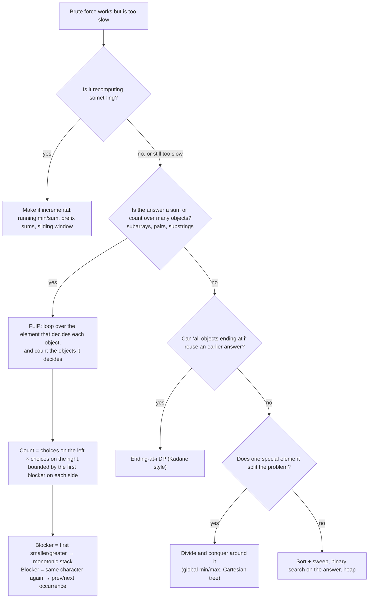

# MM03: Stuck at O(n²)? The escape routes (worked example: Sum of Subarray Minimums, LC 907)

> Use this file when you can see the brute force but can't see how to beat it.
> Every code block here was compiled and checked against the brute force on 4,000 random arrays (duplicates included).

---

## 1. Why LC 907 felt impossible to map (and why that's normal)

1. **You enumerated what the problem names.** It says "subarrays", so you listed subarrays. Any method that touches subarrays **one at a time** can never beat n² (there are n(n+1)/2 of them). To go below n² you must **count subarrays in batches without visiting them**. That's the real signal: *"the answer is a sum over ~n² objects and n is large → I must count them in groups."*
2. **The missing move is a math move, not a data structure.** It's *swapping the order of summation*: "for each subarray, add its min" becomes "for each element, add its value × the number of subarrays where it's the min". The monotonic stack shows up only **after** that flip, as a tool to do the counting. So searching the statement for "next smaller" could never work. It's a **two-hop** problem: flip → territory → stack.
3. **Your pattern index is keyed by technique, not by question shape.** "Next greater/smaller" is a technique. The trigger you need is the *question shape*: **"sum or count, over all subarrays/pairs/substrings, of something decided by one element"** → contribution technique.
4. **You skipped the warm-up.** The flip is easy to see on "sum of all subarray sums" (section 4). Jumping straight to the min version is a two-step leap. With the small step first, the big one feels obvious.

None of this is about speed. It's one missing reframing move plus one missing trigger, and both can be learned.

---

## 2. The escape routes (run this checklist whenever you're stuck at brute force)



| Route | Question to ask yourself | Typical win |
|---|---|---|
| 1. Incremental | "What does the inner loop recompute from scratch?" | O(n³) → O(n²) |
| 2. **Flip / contribution** | "Who *decides* each object's value? Can I loop over the deciders and count?" | O(n²) → O(n) or O(n log n) |
| 3. Boundary of influence | "For a fixed decider, where does its influence stop?" | gives the counts in O(n) |
| 4. Ending-at-i DP | "If I know the answer for all objects ending at an earlier index, can I extend it?" | O(n) |
| 5. Divide around a special element | "Does the global min/max split the problem in two?" | O(n log n) |

---

## 3. LC 907 solved five ways (each level comes from one of the routes)

**Problem:** the sum of `min(subarray)` over all contiguous subarrays.

### Level 0: brute force, O(n³)
```cpp
long long sumMinsCubic(const vector<int>& a) {
    int n = a.size(); long long total = 0;
    for (int l = 0; l < n; ++l)
        for (int r = l; r < n; ++r) {
            int m = INT_MAX;
            for (int k = l; k <= r; ++k) m = min(m, a[k]);
            total += m;
        }
    return total;
}
```

### Level 1: route 1 (incremental), O(n²)
*The thought:* "When r grows by one, the min of `a[l..r]` is just `min(old min, a[r])`."
```cpp
long long sumMinsQuadratic(const vector<int>& a) {
    int n = a.size(); long long total = 0;
    for (int l = 0; l < n; ++l) {
        int m = INT_MAX;
        for (int r = l; r < n; ++r) { m = min(m, a[r]); total += m; }   // running min, no re-scan
    }
    return total;
}
```
This is where you got stuck. It's still one visit per subarray, so it can't go lower. To go lower you need to change **what you loop over**.

### Level 2: route 5 (divide around the boss), O(n log n) average, O(n²) worst
*The thought:* "The smallest element of the whole array is the min of **every** subarray that contains it. The remaining subarrays lie entirely to its left or entirely to its right."
```cpp
long long dc(const vector<int>& a, int l, int r) {             // sum of mins of all subarrays inside [l, r]
    if (l > r) return 0;
    int m = min_element(a.begin() + l, a.begin() + r + 1) - a.begin();   // the boss of [l, r]
    return (long long)a[m] * (m - l + 1) * (r - m + 1)        // subarrays containing m: left choices × right choices
         + dc(a, l, m - 1) + dc(a, m + 1, r);                 // the rest are entirely left or right of m
}
```
The worst case is sorted input (a linear scan per level and n levels of recursion). A sparse table for range-min makes it O(n log n), and a Cartesian tree makes it O(n). **The key point:** this level already contains the flip. `(m − l + 1) × (r − m + 1)` *is* "the number of subarrays where the boss is the min."

### Level 3: route 2 + 3 (flip + boundary of influence), O(n)
*The thought:* "Every subarray has exactly one owner, its minimum. Group the subarrays by owner."

```
 a = [3, 1, 2, 4]                       the same 10 subarrays, regrouped by owner (= their minimum)
 subarray     min  owner
 [3]           3   i0                   i0 (3): [3]                               1 subarray  × 3 = 3
 [3,1]         1   i1                   i1 (1): [1] [3,1] [1,2] [3,1,2]
 [3,1,2]       1   i1                           [1,2,4] [3,1,2,4]                 6 subarrays × 1 = 6
 [3,1,2,4]     1   i1                   i2 (2): [2] [2,4]                         2 subarrays × 2 = 4
 [1]           1   i1                   i3 (4): [4]                               1 subarray  × 4 = 4
 [1,2]         1   i1                                                                    total = 17
 [1,2,4]       1   i1
 [2]           2   i2                   i1 owns 6 = (2 choices of left end: 0 or 1)
 [2,4]         2   i2                                × (3 choices of right end: 1, 2 or 3)
 [4]           4   i3
```
For element i: the left end can move left until the **first smaller element** (`L`), and the right end can move right until the **first smaller element** (`R`). Count = `(i − L) × (R − i)`. "First smaller on each side" is the monotonic-stack question, the same walls as the histogram.
**Duplicates:** make one side stop at *strictly smaller* and the other at *smaller-or-equal*, so a subarray with two equal minimums gets exactly one owner.
```cpp
long long sumMinsContribution(const vector<int>& a) {
    int n = a.size();
    vector<int> L(n), R(n), st;
    for (int i = 0; i < n; ++i) {                      // L = previous STRICTLY smaller
        while (!st.empty() && a[st.back()] >= a[i]) st.pop_back();
        L[i] = st.empty() ? -1 : st.back();
        st.push_back(i);
    }
    st.clear();
    for (int i = n - 1; i >= 0; --i) {                 // R = next smaller-OR-EQUAL (the tie-break)
        while (!st.empty() && a[st.back()] > a[i]) st.pop_back();
        R[i] = st.empty() ? n : st.back();
        st.push_back(i);
    }
    long long total = 0;
    for (int i = 0; i < n; ++i) total += (long long)a[i] * (i - L[i]) * (R[i] - i);
    return total;                                      // LeetCode wants this % 1e9+7
}
```
(The one-pass version, computing both walls at each pop, is in [MM01 §7](MM01-Monotonic-Stack-Mental-Model.md).)

### Level 4: route 4 (ending-at-i DP), O(n)
*The thought:* "Let `dp[i]` = the sum of the mins of all subarrays **ending at i**. Let p = the previous strictly smaller index.
- Subarrays starting in `(p, i]` have min `a[i]`: there are `i − p` of them.
- Subarrays starting at or before p: everything in `(p, i]` is ≥ `a[i]` > `a[p]`, so their min equals the min of the same subarray cut at p. Their sum is exactly `dp[p]`."
```cpp
long long sumMinsDP(const vector<int>& a) {
    int n = a.size(); long long total = 0;
    vector<long long> dp(n);                           // dp[i] = sum of mins of subarrays ENDING at i
    vector<int> st;
    for (int i = 0; i < n; ++i) {
        while (!st.empty() && a[st.back()] >= a[i]) st.pop_back();
        int p = st.empty() ? -1 : st.back();           // previous strictly smaller
        dp[i] = (long long)a[i] * (i - p) + (p >= 0 ? dp[p] : 0);
        total += dp[i];
        st.push_back(i);
    }
    return total;
}
```
Same stack, different way of thinking. If the "owner" picture doesn't click for you on some problem, the "ending at i" picture often will.

| Level | Route | Time | What it teaches |
|---|---|---|---|
| 0 | brute force | O(n³) | the baseline; say it in 10 seconds and move on |
| 1 | incremental | O(n²) | remove recomputation |
| 2 | divide around the min | O(n log n) avg | the boss owns every subarray containing it (the flip in disguise) |
| 3 | flip + boundaries | O(n) | **contribution technique**: owner × count, counts from the walls |
| 4 | ending-at-i DP | O(n) | extend the answer from the previous smaller index |

**In an interview:** say Level 0 → 1 quickly, then *"Instead of visiting subarrays, I'll count, for each element, how many subarrays it's the minimum of"* → Level 3. Mention Level 4 as an alternative if asked.

---

## 3a. Where `(i − L) × (R − i)` comes from, slowly

A subarray is just a pair **(l, r)**: where it starts and where it ends. So "how many subarrays have `a[i]` as their minimum?" means "how many pairs (l, r) work?"

**Example:** `a = [2, 5, 4, 6, 3]`, element `a[2] = 4`.

```
 index:   0   1   2   3   4
 value:   2   5   4   6   3
          ▲       ▲       ▲
        wall     me      wall          L = 0 (2 < 4)      R = 4 (3 < 4)
          └─ l may be 1 or 2           r may be 2 or 3 ─┘
```
**Rule 1, the subarray must contain me:** `l ≤ 2 ≤ r`.
**Rule 2, nothing smaller than me may be inside:** l can't reach index 0 (value 2) and r can't reach index 4 (value 3).

So the **start** can be any index in `L+1 … i` = {1, 2}. That's `i − L = 2 − 0 = 2` choices.
The **end** can be any index in `i … R−1` = {2, 3}. That's `R − i = 4 − 2 = 2` choices.
(Counting integers: from `L+1` to `i` there are `i − (L+1) + 1 = i − L` of them; from `i` to `R−1` there are `R − i`.)

**Any start works with any end**, so lay them out as a grid. Every cell is one subarray:
```
                 end r = 2       end r = 3
 start l = 1     [5, 4]          [5, 4, 6]
 start l = 2     [4]             [4, 6]
```
2 rows × 2 columns = **4 subarrays**, and the min of each is 4. That's the whole formula: **(number of possible starts) × (number of possible ends)**, the same reason 2 shirts × 3 trousers = 6 outfits.

**Duplicates:** `[2, 2]` has the subarray `[2, 2]` with two equal minimums. If both elements claimed it, it would be counted twice. So one side stops at an *equal* value and the other doesn't. Then exactly one of them owns each such subarray.

## 3b. No stack needed: three easier ways to find the walls

The formula and the wall-finding are **two separate ideas**. Learn them separately:
1. Get the formula right with the dumbest possible wall-finder.
2. Then speed up only the wall-finder.

**Way 1: walk (O(n²) worst case, obvious to write).** From i, step left until you hit a smaller value; step right likewise.
```cpp
long long minsWalk(const vector<int>& a) {
    int n = a.size(); long long total = 0;
    for (int i = 0; i < n; ++i) {
        int L = i - 1; while (L >= 0 && a[L] >= a[i]) --L;   // stop at the first STRICTLY smaller
        int R = i + 1; while (R < n && a[R] > a[i]) ++R;     // stop at the first smaller-OR-EQUAL
        total += (long long)a[i] * (i - L) * (R - i);
    }
    return total;
}
```

**Way 2: walk with jumps (amortized O(n), no stack, one array per side).** Change `--L` to `L = left[L]`. That's the only change.
*Why it's allowed:* if `a[L] ≥ a[i]`, everything between `left[L]` and `L` is ≥ `a[L]` (that's what `left[L]` means), so it's also ≥ `a[i]`, and none of it can be my wall. **Skip that whole block in one jump.**
```cpp
long long minsJump(const vector<int>& a) {
    int n = a.size(); vector<int> left(n), right(n);
    for (int i = 0; i < n; ++i) {
        int L = i - 1;
        while (L >= 0 && a[L] >= a[i]) L = left[L];          // "not smaller? ask who THEY were blocked by"
        left[i] = L;
    }
    for (int i = n - 1; i >= 0; --i) {
        int R = i + 1;
        while (R < n && a[R] > a[i]) R = right[R];
        right[i] = R;
    }
    long long total = 0;
    for (int i = 0; i < n; ++i) total += (long long)a[i] * (i - left[i]) * (right[i] - i);
    return total;
}
```
The same trick gives next greater without a stack: `j = i + 1; while (j < n && a[j] <= a[i]) j = nxt[j]; nxt[i] = j;` (scanning i from right to left).
*Fun fact for the interview:* the chain `i−1 → left[i−1] → left[left[i−1]] → …` **is** the monotonic stack. A jump is a pop. You've built the stack without writing one.

**Way 3: sort, then place walls (O(n log n), using a `std::set`).** Process elements from smallest to largest (ties left to right). Everything already placed is smaller (or an equal value on my left), so it's a wall. My walls are the nearest placed indices on each side.
```cpp
long long minsSet(const vector<int>& a) {
    int n = a.size();
    vector<int> order(n); iota(order.begin(), order.end(), 0);
    stable_sort(order.begin(), order.end(), [&](int x, int y) { return a[x] < a[y]; });
    set<int> walls = {-1, n};                         // sentinels: the array edges
    long long total = 0;
    for (int i : order) {
        auto it = walls.lower_bound(i);               // nearest wall on the right
        int R = *it, L = *prev(it);                   // nearest wall on the left
        total += (long long)a[i] * (i - L) * (R - i);
        walls.insert(i);                              // I'm a wall for every bigger element
    }
    return total;
}
```

| Way | Time | Extra memory | When to use it |
|---|---|---|---|
| Walk | O(n²) worst | none | first draft; small n; checking your formula |
| **Walk with jumps** | **O(n) amortized** | 2 arrays | **the easiest O(n) to derive under pressure** |
| Sort + set | O(n log n) | set + order array | if "smallest first, walls appear" is your natural picture |
| Monotonic stack | O(n) | 1 stack | the standard answer; say "the jump chain is the stack" |

All four were checked against brute force on 5,000 random arrays (negatives and duplicates), and the jump version handles 2 million sorted, reverse or all-equal elements in about 40 ms.

**Sum of Subarray Ranges (LC 2104):** Σ(max − min) = Σmax − Σmin. The max side is the min side with the comparisons flipped. Its constraint is n ≤ 1000, so the O(n²) "fix l, extend r, track a running min and max" **is accepted**, and the O(n) version is the follow-up. Say both in an interview.

---

## 4. The flip in its simplest form (do this first if Level 3 felt like magic)

**Sum of all subarray sums.** Brute force is O(n²). Flip: element i appears in every subarray with left end in `[0, i]` and right end in `[i, n−1]`:
```
 count(i) = (i + 1) × (n − i)          total = Σ a[i] × (i + 1) × (n − i)        O(n)
```
Nothing blocks the influence here, so the territory is the whole array. In LC 907 the territory is cut short by the first smaller element on each side, and **finding those blockers is the only job the stack does.**

---

## 5. Practice ladder for the flip (say owner, blocker, count before coding)

| # | Problem | Owner | Blocker on each side | Count |
|---|---|---|---|---|
| F1 | Sum of all subarray sums | every element | none | `(i+1)(n−i)` |
| F2 | Sum of subarray minimums (LC 907) | the minimum | first smaller (strict on one side) | `(i−L)(R−i)` |
| F3 | Sum of subarray maximums | the maximum | ? | ? |
| F4 | Sum of subarray ranges (LC 2104) | ? | ? | ? |
| F5 | Count unique characters of all substrings (LC 828) | ? | ? | ? |
| F6 | Sum of total strength of wizards (LC 2281, hard) | ? | ? | ? |

<details><summary>F3 hint</summary>Same as F2 with the comparisons flipped: the blocker is the first <b>greater</b> element. Use a decreasing stack.</details>
<details><summary>F4 hint</summary>max − min summed over all subarrays = (F3) − (F2). Two stacks, one pass each.</details>
<details><summary>F5 hint</summary>The owner is each character occurrence that is <b>unique</b> inside the substring. The blocker is the previous and next occurrence of the <b>same character</b> (no stack: keep the last index per letter). Count = <code>(i − prev) × (next − i)</code>.</details>
<details><summary>F6 hint</summary>The owner is the weakest wizard (the min), with blockers from the stack as in F2. Each owner needs the sum of subarray sums inside its territory restricted to subarrays containing it, which takes prefix sums of prefix sums. Do F1 to F5 first.</details>

---

## 6. Add these triggers to your pattern map
- **"sum / count over all subarrays (or substrings, or pairs) of min / max / something decided by one element"** → **flip (contribution)**, then find the blockers.
- **Blockers are "first smaller/greater"** → monotonic stack. **Blockers are "same value/char again"** → previous/next occurrence arrays.
- **The answer is a sum over ~n² objects and n ≥ 10⁴** → you *must* count in groups; visiting objects one by one can't pass.

## 7. Recall check
1. Why can't any one-at-a-time enumeration of subarrays beat O(n²)?
2. Say the flip in one sentence.
3. For element i in LC 907: what are L and R, and why is the count `(i − L) × (R − i)`?
4. Why must exactly one side be strict?
5. Explain the `dp[i] = dp[p] + a[i] × (i − p)` recurrence in two sentences.
6. Which route turns "sum of all subarray sums" into O(n), and what's the count?
