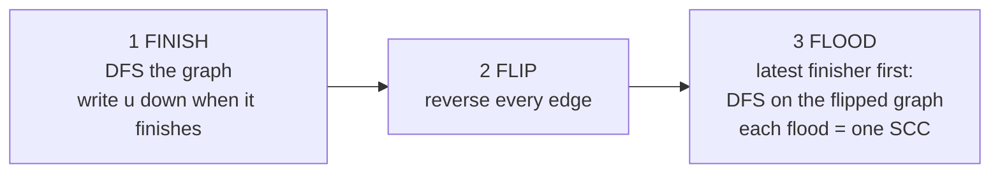

# MM04: SCC (Kosaraju, Tarjan) and Bipartite, the mental models

> Goal: stop memorizing Kosaraju. Rebuild it in under a minute from **one picture and three words: Finish, Flip, Flood.**
> Interactive trainers (open in a browser):
> - [kosaraju-trainer.html](../07-Revision/visualizers/kosaraju-trainer.html): step through both passes, turn on **Predict** to call each flood before it happens, and try the two **Bug** modes to watch a flood leak.
> - [bipartite-trainer.html](../07-Revision/visualizers/bipartite-trainer.html): watch BFS paint the layers, switch to the **BFS layers** view to see an odd cycle as an edge inside one column, and try the "no outer loop" bug.
>
> All code here uses plain, separate functions (no recursive lambdas). It compiles and is tested with GCC 14 and Clang 19 under ASan/UBSan.
> Practice: `06-Practice/day3.cpp` → `countSCC`, `isBipartite`, and **MM04-1 to MM04-6**.

---

## 0. Names (say them with confidence)

| Name | Say it | Who |
|---|---|---|
| **Kosaraju** | **ko-sa-RAA-ju** (a Telugu surname; it ends like "Raju") | S. Rao Kosaraju. Micha Sharir published it independently, so books also say "Kosaraju–Sharir". |
| **Tarjan** | **TAR-jun** | Robert Tarjan (also behind the union-find analysis and splay trees). |

In the interview you can also just say "the two-pass SCC algorithm" and "Tarjan's one-pass algorithm".

## 1. The picture: a city of one-way streets

An **SCC (strongly connected component)** is a **neighborhood**: from any house in it you can drive to any other house in it **and back**.

Shrink every neighborhood to one dot, and the streets between neighborhoods form a **DAG**. Traffic between neighborhoods only flows one way, "downhill". (If two neighborhoods could reach each other, they would be one neighborhood.)

Running example (used in this whole file, and the first preset in the trainer):
```
 edges: 0→1  1→2  2→0  3→4  4→3  4→0  5→3

   5 ───→ 3 ⇄ 4 ───→ 0 ───→ 1
                      ↖    ↙
                        2

 neighborhoods:   [5]   ───→   [3 4]   ───→   [0 1 2]
                  TOP                          BOTTOM
            (source: nothing                (sink: nothing
               comes in)                       goes out)
```

## 2. The problem: a DFS leaks downhill

Think of a DFS as **pouring water** on a node. The water fills that node's neighborhood, then runs **downhill into every neighborhood below it**.

- DFS from 5 reaches 5, 3, 4, 0, 1, 2. Three neighborhoods mixed together. Useless.
- DFS from 0 reaches only 0, 1, 2. **Exactly one neighborhood.**

Why did 0 work? Because `[0 1 2]` is at the **bottom**: no street leaves it, so the water has nowhere to leak.

> **Key observation:** a DFS that starts in the **bottom** neighborhood collects **exactly that neighborhood**.

The plan writes itself: flood the bottom neighborhood and label it. Labeled nodes act as **walls**, so the neighborhood just above it is now a "bottom". Flood that one. Repeat, bottom to top.

## 3. The catch, and the trick

**The catch:** you can't see where the bottom is.

**The trick:** a DFS *can* tell you where the **top** is: **the node that finishes last is in a top neighborhood.** Then **flip every street**, and the top becomes the bottom.

### Why does the top finish last? (the 2-case argument; say it if they ask "why does this work?")
"Finish" = the moment `dfs(u)` returns, after everything reachable from u is done.
Take a street from neighborhood **A** down to neighborhood **B** (A → B).
- **Case 1: the DFS enters A first.** From A it can reach all of B, so all of B is visited and finished **before** that first A node returns. A finishes later.
- **Case 2: the DFS enters B first.** B can't reach A (otherwise they would be one neighborhood), so B finishes completely **before** A is even touched. A finishes later.

Either way: **upstream finishes later than downstream.** So the very last finisher has nothing upstream of it: it's in a **top** neighborhood.

The running example is Case 2: the DFS starts at 0 (the bottom), so 2, 1, 0 finish first. 5 is visited last of all, and it finishes last, exactly as the argument says.

### Why doesn't flipping change the neighborhoods?
u and v are in the same neighborhood ⇔ there is a path u → v **and** a path v → u. Flip every edge: the first path becomes v → u and the second becomes u → v. **Both still exist.** So the neighborhoods stay identical; only the streets **between** them change direction: **top ↔ bottom**.

## 4. Kosaraju = Finish, Flip, Flood



> **The sentence to remember:** *The last to finish is at the top. Flipping puts it at the bottom. A flood that starts at the bottom can't leak.*

Why it keeps working after the first flood: take the latest finisher that isn't labeled yet. Among the unlabeled neighborhoods it's at the top, so after the flip it's at the bottom. Its flood can only run through its own neighborhood or into neighborhoods that are already labeled, and those are walls.

## 5. The code: two plain DFS functions + a short driver

```cpp
// FINISH: a normal DFS. Write u down when everything it can reach is done.
void dfsFinish(int u, const vector<vector<int>>& adj, vector<bool>& visited, vector<int>& order) {
    visited[u] = true;
    for (int v : adj[u])
        if (!visited[v]) dfsFinish(v, adj, visited, order);
    order.push_back(u);                       // u finishes AFTER all its descendants
}

// FLOOD: a normal DFS on the flipped graph. Label everything reached with id.
void dfsFlood(int u, const vector<vector<int>>& radj, vector<int>& comp, int id) {
    comp[u] = id;
    for (int v : radj[u])
        if (comp[v] == -1) dfsFlood(v, radj, comp, id);   // already labeled = a wall
}

// Returns the number of SCCs. comp[v] = SCC id of v (ids come out top neighborhood first).
int kosaraju(int n, const vector<vector<int>>& adj, vector<int>& comp) {
    // 1. FINISH
    vector<bool> visited(n, false);
    vector<int> order;
    for (int u = 0; u < n; ++u)
        if (!visited[u]) dfsFinish(u, adj, visited, order);

    // 2. FLIP
    vector<vector<int>> radj(n);
    for (int u = 0; u < n; ++u)
        for (int v : adj[u]) radj[v].push_back(u);

    // 3. FLOOD, latest finisher first
    comp.assign(n, -1);
    int count = 0;
    for (int i = n - 1; i >= 0; --i) {
        int u = order[i];
        if (comp[u] == -1) {
            dfsFlood(u, radj, comp, count);
            ++count;
        }
    }
    return count;
}
```
- **Both DFS functions are the DFS you already write for "number of islands".** `dfsFinish` adds one line at the end. `dfsFlood` uses `comp` as its visited array.
- Input as an edge list? Build both graphs in one loop: `for (auto [u, v] : edges) { adj[u].push_back(v); radj[v].push_back(u); }`
- **O(V + E)** time, O(V + E) extra space for `radj`.
- On LeetCode you can make `adj`, `radj`, `visited`, `order` and `comp` members of the `Solution` class. Then the helpers take only `u` (and `id`).

### Model sentence → code line (regenerate the code from these)
| Say this | Write this |
|---|---|
| A node finishes only when everything it reaches is done | `order.push_back(u);` **after** the neighbor loop |
| The graph can be disconnected, so every node gets a pass-1 DFS | `for (u…) if (!visited[u]) dfsFinish(u, …);` |
| Flip every street | `radj[v].push_back(u);` |
| Start from the latest finisher | `for (int i = n - 1; i >= 0; --i) { int u = order[i]; … }` |
| A labeled node is a wall | `if (comp[v] == -1)` |
| Each new flood is one new SCC | `dfsFlood(u, radj, comp, count); ++count;` |

### Aside: what is that `auto&& self` lambda?
You'll see this in other people's solutions:
```cpp
auto dfs = [&](auto&& self, int u) -> void { /* ... */ self(self, v); /* ... */ };
dfs(dfs, start);
```
A lambda can't call itself by name, because the name `dfs` doesn't exist yet while the lambda is being defined. The workaround passes the lambda **to itself** as an extra parameter, `self`. `auto&&` just means "accept whatever type this is" (a lambda's type has no name you could write). `self(self, v)` is the recursive call. It's only a syntax trick: a separate function does exactly the same job and is easier to read, so use separate functions.

## 6. Hand trace on the running example (do it on paper once)

Adjacency in input order: `0:[1]  1:[2]  2:[0]  3:[4]  4:[3,0]  5:[3]`

### Pass 1: FINISH
| Outer loop | Call stack (bottom → top) | What happens | `order` after |
|---|---|---|---|
| u = 0 | 0 | visit 0 | |
| | 0 1 | visit 1 | |
| | 0 1 2 | visit 2; edge 2→0: 0 already visited | |
| | 0 1 | **2 finishes** | 2 |
| | 0 | **1 finishes** | 2 1 |
| | | **0 finishes** | 2 1 0 |
| u = 3 | 3 | visit 3 | |
| | 3 4 | visit 4; edges 4→3 and 4→0: already visited | |
| | 3 | **4 finishes** | 2 1 0 4 |
| | | **3 finishes** | 2 1 0 4 3 |
| u = 5 | 5 | visit 5; edge 5→3: already visited | |
| | | **5 finishes** | 2 1 0 4 3 **5** |

5 finished last, and it's in the top neighborhood. (The DFS started at the bottom: Case 2.)

### Pass 2: FLIP, then FLOOD (latest first: 5, 3, 4, 0, 1, 2)
Flipped adjacency: `0:[2,4]  1:[0]  2:[1]  3:[4,5]  4:[3]  5:[]`

| Take | Already labeled? | Flood on the flipped graph | Walls hit | SCC |
|---|---|---|---|---|
| 5 | no | 5 (no flipped edges out of 5) | none | **#0 = {5}** |
| 3 | no | 3 → 4 | 3→5 (5 is #0) | **#1 = {3, 4}** |
| 4 | yes, skip | | | |
| 0 | no | 0 → 2 → 1 | 0→4 (4 is #1) | **#2 = {0, 1, 2}** |
| 1, 2 | yes, skip | | | |

3 SCCs. The ids came out **top first**: #0 [5] → #1 [3 4] → #2 [0 1 2]. That's a topological order of the neighborhoods, for free.

## 7. The two classic bugs (both are "the flood leaked")

The smallest graph that shows them: `0 → 1` (two SCCs, {0} and {1}). Pass 1 gives `order = [1, 0]`.

| Version | Flood starts at | It follows | Reaches | Result |
|---|---|---|---|---|
| **Correct** | 0 (latest finisher) | flipped edges: none leave 0 | {0}, then {1} | 2 SCCs ✓ |
| **Bug 1: skip the flip** | 0 | original edge 0→1 | {0, 1} | 1 SCC ✗ (leaked downhill) |
| **Bug 2: earliest finisher first** | 1 | flipped edge 1→0 | {1, 0} | 1 SCC ✗ (started at the top of the flipped graph) |

On the running example, either bug floods all six nodes into one "SCC". Try both in the trainer.

Two more ways to lose points:
- **Forgetting the outer loop in pass 1** (a disconnected graph): some nodes never enter `order`.
- **Recursion depth:** a chain of 10⁵ nodes overflows the call stack. Say *"for production I'd make both DFS passes iterative"*. The iterative version is `countSCC` in `06-Practice/solutions/day3_sol.cpp`. (E2 has the 50M-node netlist version of this follow-up.)

## 8. Tarjan: one DFS, "how far back up can I climb?"

Use it when they ask for **one pass**, or as the bridge to **bridges / articulation points** (the same `low` idea).

**Picture.** The DFS keeps a stack of **open** nodes: visited, but not yet assigned to an SCC. Each node gets a ticket number `disc[u]` when it's visited. Then it asks: *"Through my DFS subtree plus one more edge, what's the smallest ticket of an **open** node I can climb back to?"* That's `low[u]`.

If `low[u] == disc[u]`, nobody below u can climb above u. So u is the **head** of a closed neighborhood: pop the stack down to u, and those nodes are one SCC.

```cpp
struct Tarjan {
    const vector<vector<int>>& adj;
    vector<int> disc, low, comp, stk;
    vector<bool> onStack;
    int timer = 0, count = 0;

    explicit Tarjan(const vector<vector<int>>& g)
        : adj(g), disc(g.size(), -1), low(g.size(), 0), comp(g.size(), -1), onStack(g.size(), false) {
        for (int u = 0; u < (int)g.size(); ++u)
            if (disc[u] == -1) dfs(u);
    }

    void dfs(int u) {
        disc[u] = low[u] = timer++;
        stk.push_back(u);
        onStack[u] = true;
        for (int v : adj[u]) {
            if (disc[v] == -1) {                 // tree edge: explore v, then inherit how far v climbs
                dfs(v);
                low[u] = min(low[u], low[v]);
            } else if (onStack[v]) {             // edge back to an OPEN node
                low[u] = min(low[u], disc[v]);
            }                                    // else: v's SCC is already closed, ignore it
        }
        if (low[u] == disc[u]) {                 // u is the head: pop its SCC
            while (true) {
                int w = stk.back(); stk.pop_back();
                onStack[w] = false;
                comp[w] = count;
                if (w == u) break;
            }
            ++count;
        }
    }
};
// usage: Tarjan t(adj);   t.count = number of SCCs, t.comp[v] = SCC id of v
```
It's a struct only so that `dfs` takes just `u`: the shared arrays live in members instead of a long parameter list.

**Trace on the running example** (visit order 0, 1, 2, then 3, 4, then 5):
| Node | disc | low | Why | Popped as |
|---|---|---|---|---|
| 0 | 0 | 0 | 2→0 climbs back to ticket 0 | head of **#0 = {0, 1, 2}** |
| 1 | 1 | 0 | inherits from 2 | |
| 2 | 2 | 0 | edge 2→0, and 0 is open | |
| 3 | 3 | 3 | nobody below climbs above 3 | head of **#1 = {3, 4}** |
| 4 | 4 | 3 | 4→3 is open; **4→0 is ignored: {0, 1, 2} is already closed** | |
| 5 | 5 | 5 | 5→3 is ignored: {3, 4} is already closed | head of **#2 = {5}** |

Tarjan closes the **bottom first** (#0 = [0 1 2]), so its ids come out in **reverse** topological order. Kosaraju's come out in topological order.

**The trap:** update `low` from `disc[v]` **only if v is on the stack**. Drop that check here, and 4→0 gives `low[4] = 0`, then `low[3] = 0`: 3 never sees `low == disc`, so 3 and 4 (and later 5) are stranded on the stack and never labeled.

| | **Kosaraju** | **Tarjan** |
|---|---|---|
| Passes | 2 DFS + the flipped graph | 1 DFS |
| Extra memory | the flipped graph (E) | disc, low, stack, onStack (V) |
| What you must remember | Finish, Flip, Flood (the picture gives you both "why"s) | `low == disc` → pop; the onStack rule |
| SCC ids come out | topological (top first) | reverse topological (bottom first) |
| Use it when | **default**: easiest to write and to explain | they want one pass, or bridges / articulation points come next |

## 9. What you do with SCCs (the follow-ups)

| Question | Do this |
|---|---|
| Count / list the SCCs | Kosaraju |
| Is the **whole** graph strongly connected? | No full Kosaraju needed: a DFS from node 0 reaches everyone **in the graph and in the flipped graph** (the flip trick again) |
| Which nodes lie on a cycle / **combinational loop**? | nodes whose SCC has 2+ nodes, plus nodes with a self-loop (MM04-2) |
| Fewest edges to add so everyone reaches everyone | condense; answer = max(#top SCCs, #bottom SCCs), or 0 if there's only one SCC (MM04-3) |
| Longest / max-value path when cycles are allowed | condense (sum each SCC's values), then DP on the DAG in Kosaraju id order |
| 2-SAT | build the implication graph; unsatisfiable ⇔ x and ¬x share an SCC |

- **AMD / EDA:** a combinational loop in a netlist is an SCC with 2+ cells (or a self-loop). It breaks levelization and static timing analysis, so the tool must find and report it.
- **Backend (Agoda-style):** circular dependencies between services (an SCC = "must deploy together"), deadlock detection in a wait-for graph.

## 10. Bipartite: two teams of rivals

**Definition.** Color every node with one of two colors so that every edge joins different colors.
**The one fact:** bipartite ⇔ **no odd-length cycle**.

**Picture.** Each edge says "these two can't be on the same team". Walk around a cycle and the team flips at every step. An even cycle brings you back to your own team; an odd one doesn't, which is a contradiction.
```
 even cycle: OK            odd cycle: conflict
 A(0) ─ B(1)               A(0) ─ B(1)
  │      │                   \    /
 D(1) ─ C(0)                  C(?)    ← must differ from both A and B
```
```cpp
bool isBipartite(const vector<vector<int>>& adj) {
    int n = adj.size();
    vector<int> color(n, -1);
    for (int s = 0; s < n; ++s) {
        if (color[s] != -1) continue;            // trap: the graph may be disconnected
        color[s] = 0;
        queue<int> q;
        q.push(s);
        while (!q.empty()) {
            int u = q.front(); q.pop();
            for (int v : adj[u]) {
                if (color[v] == -1) { color[v] = 1 - color[u]; q.push(v); }
                else if (color[v] == color[u]) return false;   // same team = odd cycle
            }
        }
    }
    return true;
}
```
**Say before typing:** "all colors −1; loop over every node; BFS; an uncolored neighbor gets the other color; a same-colored neighbor means fail."
- **Traps:** a disconnected graph (that's the outer loop); a self-loop is never bipartite; with an edge list, add both directions.
- **Follow-ups:** return the two groups (the `color` array) · Possible Bipartition (LC 886: build the graph from the dislikes, MM04-5) · edges arrive one at a time → DSU with parity · show the odd cycle (MM04-6, below).
- **AMD / EDA:** double-patterning lithography. Shapes too close together must go on different masks, which is 2-coloring the conflict graph; an odd cycle is a mask conflict that can't be resolved. AMD interview reports list a "bipartite graph exercise".

### Why the odd cycle is the whole story: BFS layers
BFS paints in **layers** (distance from the start), and a node's team is its **layer mod 2**. Every edge joins either two neighboring layers (opposite teams, fine) or two nodes in the **same** layer. A same-layer edge u–v is the only way to fail, and it always closes an odd cycle: walk u and v up the BFS tree until they meet. If they meet k layers up, the cycle is k + k + 1 = **2k + 1** edges long.
```
 layer:    0         1         2
           0 ─────── 1 ─────── 2
           │                   │   ← edge 2–3: both ends in layer 2
           └──────── 6 ─────── 3

 walk up: 2 → 1 → 0 and 3 → 6 → 0   →   cycle 2–1–0–6–3–2: 5 edges, odd
 (the "Hexagon + hub" preset in the trainer; nodes 5 and 4 also sit in layers 1 and 2 but aren't on this cycle)
```
That's also the code for the follow-up "**show me the odd cycle**": keep `parent[]` during the BFS; on a same-color edge, walk both endpoints up in lockstep (they're at the same depth) and stitch the two paths together. `oddCycle` in `day3_sol.cpp` is 10 extra lines.

### Where bipartite graphs show up
| Kind | Examples |
|---|---|
| **Test it:** can the conflicts be split into two groups? | Possible Bipartition (LC 886) · exams in two time slots (exams that share a student can't share a slot) · **double-patterning masks (EDA)** · grids and trees are always bipartite: team = (row + col) mod 2 or depth mod 2, the chessboard argument |
| **Built bipartite:** two kinds of nodes, edges only between kinds | matching: jobs ↔ machines (Hopcroft–Karp), min-cost assignment (Hungarian); in a bipartite graph max matching = min vertex cover (König) · **EDA:** a netlist is a cells ↔ nets incidence graph; pin and I/O assignment is a bipartite matching · **backend:** users ↔ hotels (bookings, reviews) for recommendations; any many-to-many table |

Two colors take O(V + E) with one BFS; three colors is NP-complete. That gap is why "is it bipartite?" is the special, fast case worth recognizing.

## 11. Recognition triggers

- **SCC:** "directed graph" + "mutually reachable", "groups where everyone can reach everyone", "collapse the cycles", "circular dependencies", "combinational loops", "can every node reach every other node?", 2-SAT.
- **Bipartite:** "split into two groups", "dislikes / conflicts", "two colors / two masks", "odd cycle".
- **Not SCC:** "does a cycle exist?" (3-color DFS or Kahn is enough, P08-6) · "connected components" in an **undirected** graph (DFS or DSU).

## 12. Practice (predict, then verify; the trainer has these graphs as presets)

1. **Trace Kosaraju** on `0→1  1→2  2→3  3→1  3→4  4→5  5→4  6→0` (adjacency in input order). Write the finish order, then every flood.
   <details><summary>check</summary>Finish order: 5 4 3 2 1 0 6. Floods, latest first: 6 → {6}; 0 → {0} (flipped edge 0→6 is a wall); 1 → {1, 3, 2} (1→0 is a wall); 4 → {4, 5} (4→3 is a wall). 4 SCCs, in topological order: [6] → [0] → [1 2 3] → [4 5].</details>
2. **Siblings:** `0→1  0→2  1→3  2→3  3→4  4→3`. Which SCCs? Does it matter whether {1} or {2} is flooded first?
   <details><summary>check</summary>Finish order 4 3 1 2 0 → floods 0 → {0}, 2 → {2}, 1 → {1}, 3 → {3, 4}. 1 and 2 can't reach each other, so neither is above the other: either order is a valid topological order, and each flood still stops at the walls.</details>
3. **Bug hunt:** a teammate floods the **original** graph from the latest finisher. On the running example, what does the first flood return, and why?
   <details><summary>check</summary>From 5 along the original edges: 5 → 3 → 4 → 0 → 1 → 2, all six nodes. 5 is at the top, and water poured at the top runs into every neighborhood below.</details>
4. **Transfer:** "Is this directed graph strongly connected?" in O(V + E), without computing all the SCCs.
   <details><summary>check</summary>DFS from node 0 on the graph: is everyone reached? DFS from node 0 on the flipped graph: is everyone reached? Both yes ⇔ strongly connected (0 reaches everyone, and everyone reaches 0).</details>
5. **Transfer (EDA):** "Report every cell that sits on a combinational loop." (MM04-2)
   <details><summary>check</summary>Get the SCC labels and count each SCC's size. A node is on a loop if its SCC has 2+ nodes, or if it has a self-loop (a 1-node SCC is a loop only when the edge u→u exists).</details>
6. **Transfer:** "Fewest new edges so that everyone can reach everyone." (MM04-3)
   <details><summary>check</summary>Condense. Count the top SCCs (no edge comes in from another SCC) and the bottom SCCs (no edge goes out). Answer max(tops, bottoms), or 0 for a single SCC. Running example: 1 top, 1 bottom → 1 edge (for example 0 → 5).</details>
7. **Tarjan trap:** on the running example, what goes wrong if you drop `onStack[v]` and update `low` from every visited v?
   <details><summary>check</summary>4→0 makes low[4] = 0, then low[3] = 0, so 3 never sees low == disc. Then 5→3 makes low[5] = 3. Nodes 3, 4 and 5 are stranded on the stack and never labeled.</details>
8. **Bipartite, LC 886:** people 1..n and a list of "dislikes" pairs. What two things go wrong if you feed the pairs straight into `isBipartite`? (MM04-5)
   <details><summary>check</summary>The people are numbered from 1, so subtract 1 (or size the graph n + 1). And each pair is one undirected edge, so add it in both directions.</details>
9. **Bipartite proof:** on the "Hexagon + hub" graph (`0-1 1-2 2-3 3-4 4-5 5-0 6-0 6-3`), BFS from 0. Which edge is the conflict, and which odd cycle do you return? (MM04-6; check it in the bipartite trainer)
   <details><summary>check</summary>Layers: L0 {0}, L1 {1, 5, 6}, L2 {2, 4, 3}. While processing 2, the edge 2–3 joins two team-A nodes in layer 2. Walk up: 2 → 1 → 0 and 3 → 6 → 0. Cycle 2–1–0–6–3–2, 5 edges.</details>

## 13. Recall check (close the file)
1. Draw the running example's neighborhoods. Which one is the top, which one the bottom?
2. Why does a DFS from the bottom neighborhood collect exactly one SCC?
3. The two-case argument: why does the upstream neighborhood finish later?
4. Why doesn't flipping the edges change the SCCs?
5. Say "Finish, Flip, Flood" and write the six matching code lines.
6. Kosaraju's two classic bugs, shown on `0 → 1`.
7. Tarjan: when is u a head, and which edges does the onStack rule ignore?
8. Bipartite ⇔ ? And its classic trap.
