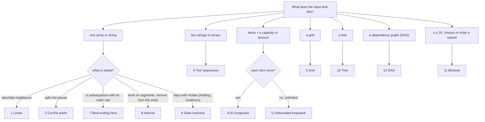

# MM05: Dynamic Programming, top-down first

> Goal: name the DP pattern in 30 seconds, write it the way you think (a recursion with a memo), then turn it into a table **mechanically**, with no new insight needed.
> Interactive trainer: [07-Revision/visualizers/dp-trainer.html](../07-Revision/visualizers/dp-trainer.html). Watch the memoized recursion and the bottom-up loops fill **the same table**, and see the call count without memo.
> Every snippet below compiles and is cross-checked: top-down = bottom-up = brute force on random inputs (GCC 14 and Clang 19, ASan/UBSan).
> Practice: the P10 stubs in `06-Practice/day3.cpp` (`rob`, `coinChangeWays`, `lengthOfLIS`, `lcs`, `editDistance`, `knapsack01`, `canPartition`, `uniquePathsWithObstacles`).

---

## 0. The 12 patterns, one sentence each (the card to memorize)

| # | Pattern | The one sentence | State | Classic problems |
|---|---|---|---|---|
| 1 | **Linear** | At each position, take it or skip it; the answer leans on the last one or two answers. | `f(i)` = answer for the first i elements | Climbing Stairs, House Robber, Min Cost Climbing Stairs |
| 2 | **Cut the prefix** | Try every place the last piece could start, and let the shorter prefix handle the rest. | `f(i)` = answer for `s[0..i)` | Word Break, Decode Ways, Palindrome Partitioning II |
| 3 | **Grid** | A cell can only be entered from above or from the left, so it's the better of those two plus itself. | `f(r, c)` = best way to reach (r, c) | Unique Paths, Min Path Sum, Triangle, Dungeon Game |
| 4 | **0/1 knapsack** | For each item, skip it or take it once, and hand the leftover capacity to the earlier items. | `f(i, w)` = best with the first i items and capacity w | Knapsack, Partition Equal Subset Sum, Target Sum |
| 5 | **Unbounded knapsack** | Same as 0/1, but a taken item stays available, so you stay on the same item. | `f(i, a)` = ways/best with the first i coin types for amount a | Coin Change (min), Coin Change II (ways), Rod Cutting |
| 6 | **Two sequences** | Look at the last character of each: a match moves both back, a mismatch drops one of them. | `f(i, j)` = answer for `a[0..i)` and `b[0..j)` | LCS, Edit Distance, Distinct Subsequences, Wildcard/Regex |
| 7 | **Best ending here (LIS)** | Every element extends the best chain that ends before it on a smaller value. | `f(i)` = best chain that **ends at** `a[i]` | LIS, Russian Doll Envelopes, Longest String Chain |
| 8 | **Interval** | Solve every segment from its two ends or its split point, shortest segments first. | `f(i, j)` = answer for the segment `i..j` | Longest Palindromic Subsequence, Matrix Chain, Burst Balloons |
| 9 | **State machine** | Each day you're in one of a few states, and each action moves you between them. | `f(i, s)` = best at the end of day i in state s | Stock with Cooldown / Fee / k Transactions, Paint House |
| 10 | **Tree** | Each node hands its parent a tiny summary: the best with me and the best without me. | `f(node)` = pair (with, without) | House Robber III, Max Path Sum, Diameter, Tree Cameras |
| 11 | **Bitmask** | The state is the set of things already used; add one more at a time. | `f(mask)` = best for the rest, given what's used | Assignment, TSP, Partition to K Equal Subsets (n ≤ 20) |
| 12 | **DAG** | Process nodes in topological order; each node takes the best over its incoming edges. | `f(v)` = best path that ends at v | Longest path in a DAG, **static timing (STA)**, Longest Increasing Path in a Matrix |

---

## 1. Your workflow: recursion → memo → table

### Step 1: write the brute-force recursion as "what is my last choice?"
Say the state in English first ("`f(i, j)` = the LCS of the first i chars of a and the first j chars of b"). Then ask what the **last** element does (match? skip? which coin? where does the last piece start?). Each option is one recursive call on a smaller state.

### Step 2: add the memo (one line in, one line out)
```cpp
if (memo[i][j] != -1) return memo[i][j];      // in: already solved
return memo[i][j] = /* the recurrence */;      // out: remember it
```
That's already a correct, accepted interview answer. The time is (number of states) × (work per state).

### Step 3: convert to bottom-up with 7 mechanical rules

| Top-down (what you wrote) | Bottom-up (what you write next) |
|---|---|
| the parameters `(i, j)` | the table's dimensions `dp[i][j]` |
| `memo[i][j]` | `dp[i][j]`: **it's the same cell** |
| the base-case `if`s | initialize those cells before the loops |
| a recursive call `f(i-1, j)` | a read of `dp[i-1][j]` |
| calls go to **smaller** i | loop i **upward**: fill the cells the calls need first |
| a loop inside the function (`for k …`) | the same loop inside the cell's computation |
| the root call `f(n, m)` | the answer `dp[n][m]` |

> **Loop rule in one line:** loops run **from the base cases toward the root call**, the opposite way the calls point. Calls go to smaller i → loop i upward. Calls go to bigger masks → loop masks downward. Calls go to shorter intervals → loop by length.

### A worked conversion: LCS, line by line
```cpp
// TOP-DOWN                                                  // f(i, j) = LCS of a[0..i) and b[0..j)
int lcsFrom(int i, int j, const string& a, const string& b, VVI& memo) {
    if (i == 0 || j == 0) return 0;                          // base case
    if (memo[i][j] != -1) return memo[i][j];
    if (a[i - 1] == b[j - 1]) return memo[i][j] = 1 + lcsFrom(i - 1, j - 1, a, b, memo);
    return memo[i][j] = max(lcsFrom(i - 1, j, a, b, memo), lcsFrom(i, j - 1, a, b, memo));
}
int lcsTopDown(const string& a, const string& b) {
    VVI memo(a.size() + 1, VI(b.size() + 1, -1));
    return lcsFrom(a.size(), b.size(), a, b, memo);          // root call
}

// BOTTOM-UP: the same state, the same recurrence
int lcsBottomUp(const string& a, const string& b) {
    int n = a.size(), m = b.size();
    VVI dp(n + 1, VI(m + 1, 0));                             // base case: row 0 and column 0 = 0
    for (int i = 1; i <= n; ++i)                             // calls went to i-1 → loop i upward
        for (int j = 1; j <= m; ++j)                         // calls went to j-1 → loop j upward
            dp[i][j] = a[i - 1] == b[j - 1] ? 1 + dp[i - 1][j - 1] : max(dp[i - 1][j], dp[i][j - 1]);
    return dp[n][m];                                         // root call → answer cell
}
```

### Step 4 (optional): shrink the table
If a row only reads the previous row (or itself), keep 1–2 rows. Say this as the follow-up after the clear 2D version. Direction matters: see patterns 4 and 5.

### When to stay top-down, and when to switch
| Stay top-down | Switch to bottom-up |
|---|---|
| only a few states are actually reachable | the recursion could go ~10⁵ deep (stack overflow) |
| the fill order is awkward (interval, bitmask, tree, DAG) | you want the 1-row space trick |
| you're short on time: memo is fully accepted | the interviewer asks for iterative, or wants the last bit of speed |

---

## 2. Pattern finder (which pattern is it?)



---

## 3. The patterns

Every card has the same parts: the sentence, the state, top-down, bottom-up, how it converts, more problems, and the trap.

### Pattern 1 · Linear: "take it or skip it; lean on the last one or two answers"
State: `f(i)` = the most loot from the first i houses (House Robber).
```cpp
int robFrom(int i, const VI& a, VI& memo) {                 // best loot from the first i houses
    if (i == 0) return 0;
    if (i == 1) return a[0];
    if (memo[i] != -1) return memo[i];
    return memo[i] = max(robFrom(i - 1, a, memo),               // skip house i-1
                         a[i - 1] + robFrom(i - 2, a, memo));   // rob it, so skip i-2
}
int robBottomUp(const VI& a) {
    int n = a.size();
    VI dp(n + 1, 0);                                      // dp[i] = robFrom(i)
    if (n >= 1) dp[1] = a[0];
    for (int i = 2; i <= n; ++i)
        dp[i] = max(dp[i - 1], a[i - 1] + dp[i - 2]);
    return dp[n];
}
```
- **Converts:** two base cases → `dp[0]`, `dp[1]`; calls to i-1 and i-2 → loop i upward. Then two variables instead of an array.
- **Also:** Climbing Stairs (`f(i) = f(i-1) + f(i-2)`), Min Cost Climbing Stairs, House Robber II (run twice: without the first, without the last).
- **Trap:** the prefix index `i` vs the element `a[i-1]`.

### Pattern 2 · Cut the prefix: "where does the last piece start?"
State: `f(i)` = can `s[0..i)` be split into dictionary words (Word Break).
```cpp
bool canSplit(int i, const string& s, const unordered_set<string>& dict, VI& memo) {   // can s[0..i) be split?
    if (i == 0) return true;
    if (memo[i] != -1) return memo[i];
    for (int j = 0; j < i; ++j)                           // the last word is s[j..i)
        if (dict.count(s.substr(j, i - j)) && canSplit(j, s, dict, memo)) { memo[i] = 1; return true; }
    memo[i] = 0;
    return false;
}
bool wordBreakBottomUp(const string& s, const unordered_set<string>& dict) {
    int n = s.size();
    vector<bool> dp(n + 1, false);
    dp[0] = true;
    for (int i = 1; i <= n; ++i)
        for (int j = 0; j < i && !dp[i]; ++j)
            if (dp[j] && dict.count(s.substr(j, i - j))) dp[i] = true;
    return dp[n];
}
```
- **Converts:** the loop over j inside the function becomes the inner loop.
- **Also:** Decode Ways (the last piece is 1 or 2 digits), Palindrome Partitioning II (the last piece is a palindrome), Perfect Squares.
- **Trap:** `substr` costs O(length); bound j by the longest word, or use a trie.

### Pattern 3 · Grid: "enter from above or from the left"
State: `f(r, c)` = the cheapest path from (0, 0) to (r, c) (Min Path Sum).
```cpp
int pathTo(int r, int c, const VVI& g, VVI& memo) {      // cheapest path from (0,0) to (r,c)
    if (r < 0 || c < 0) return INF;
    if (r == 0 && c == 0) return g[0][0];
    if (memo[r][c] != -1) return memo[r][c];
    return memo[r][c] = g[r][c] + min(pathTo(r - 1, c, g, memo),    // came from above
                                      pathTo(r, c - 1, g, memo));   // came from the left
}
int minPathSumBottomUp(const VVI& g) {
    int R = g.size(), C = g[0].size();
    VVI dp(R, VI(C));
    for (int r = 0; r < R; ++r)
        for (int c = 0; c < C; ++c) {
            if (r == 0 && c == 0) { dp[r][c] = g[0][0]; continue; }
            int up = r > 0 ? dp[r - 1][c] : INF;
            int left = c > 0 ? dp[r][c - 1] : INF;
            dp[r][c] = g[r][c] + min(up, left);
        }
    return dp[R - 1][C - 1];
}
```
- **Converts:** "out of the grid → INF" becomes the `r > 0 ? … : INF` guards.
- **Also:** Unique Paths (sum instead of min), obstacles (that cell = 0 ways), Triangle, Dungeon Game (fill from the bottom-right, because its calls point there).
- **Trap:** the first row and column have only one neighbor.

### Pattern 4 · 0/1 knapsack: "skip it or take it once"
State: `f(i, w)` = the best value using the first i items with capacity w.
```cpp
int knapFrom(int i, int w, const VI& wt, const VI& val, VVI& memo) {   // best value: first i items, capacity w
    if (i == 0) return 0;
    if (memo[i][w] != -1) return memo[i][w];
    int best = knapFrom(i - 1, w, wt, val, memo);                       // skip item i-1
    if (wt[i - 1] <= w)                                                 // take it, once: go to i-1
        best = max(best, val[i - 1] + knapFrom(i - 1, w - wt[i - 1], wt, val, memo));
    return memo[i][w] = best;
}
int knapBottomUp(const VI& wt, const VI& val, int W) {
    int n = wt.size();
    VVI dp(n + 1, VI(W + 1, 0));                          // row 0 = no items = 0
    for (int i = 1; i <= n; ++i)
        for (int w = 0; w <= W; ++w) {
            dp[i][w] = dp[i - 1][w];
            if (wt[i - 1] <= w) dp[i][w] = max(dp[i][w], val[i - 1] + dp[i - 1][w - wt[i - 1]]);
        }
    return dp[n][W];
}
int knap1D(const VI& wt, const VI& val, int W) {         // one row: capacity DESCENDING
    VI dp(W + 1, 0);
    for (int i = 0; i < (int)wt.size(); ++i)
        for (int w = W; w >= wt[i]; --w) dp[w] = max(dp[w], val[i] + dp[w - wt[i]]);
    return dp[W];
}
```
- **Converts:** both calls go to row `i-1`, so a row only reads the row above.
- **Also:** Partition Equal Subset Sum (bool: can I reach total/2?), Target Sum, Last Stone Weight II.
- **Trap:** with one row, capacity must go **descending**. Ascending would read the value you just wrote this row, which means using the same item twice.

### Pattern 5 · Unbounded knapsack: "taking an item keeps it on the table"
State: `f(i, a)` = the number of ways to make amount a with the first i coin types (Coin Change II).
```cpp
long long waysFrom(int i, int a, const VI& coins, vector<vector<long long>>& memo) {   // ways: first i coin types, amount a
    if (a == 0) return 1;
    if (i == 0) return 0;
    if (memo[i][a] != -1) return memo[i][a];
    long long ways = waysFrom(i - 1, a, coins, memo);                       // done with coin i-1
    if (coins[i - 1] <= a) ways += waysFrom(i, a - coins[i - 1], coins, memo);   // use it again: SAME i
    return memo[i][a] = ways;
}
long long coinWaysBottomUp(const VI& coins, int A) {
    int n = coins.size();
    vector<vector<long long>> dp(n + 1, vector<long long>(A + 1, 0));
    for (int i = 0; i <= n; ++i) dp[i][0] = 1;
    for (int i = 1; i <= n; ++i)
        for (int a = 1; a <= A; ++a) {
            dp[i][a] = dp[i - 1][a];
            if (coins[i - 1] <= a) dp[i][a] += dp[i][a - coins[i - 1]];   // same row
        }
    return dp[n][A];
}
long long coinWays1D(const VI& coins, int A) {           // one row: amount ASCENDING
    vector<long long> dp(A + 1, 0);
    dp[0] = 1;
    for (int c : coins)
        for (int a = c; a <= A; ++a) dp[a] += dp[a - c];
    return dp[A];
}
```
- **The whole difference from pattern 4 is one index:** "take" calls `f(i, …)` (same row) instead of `f(i-1, …)`. In the 1D version that becomes **ascending** instead of descending.
- **Also:** Coin Change (min coins: `min` instead of `+`), Rod Cutting. Combination Sum IV counts **orders** (1+2 ≠ 2+1): amount outer, coins inner.
- **Trap:** the loop order decides combinations (coins outer) vs permutations (amount outer).

### Pattern 6 · Two sequences: "compare the last characters"
State: `f(i, j)` = the answer for `a[0..i)` and `b[0..j)`. LCS is the worked example in §1. Edit distance:
```cpp
int editFrom(int i, int j, const string& a, const string& b, VVI& memo) {   // edits to turn a[0..i) into b[0..j)
    if (i == 0) return j;                                  // insert j chars
    if (j == 0) return i;                                  // delete i chars
    if (memo[i][j] != -1) return memo[i][j];
    if (a[i - 1] == b[j - 1]) return memo[i][j] = editFrom(i - 1, j - 1, a, b, memo);
    return memo[i][j] = 1 + min({editFrom(i - 1, j - 1, a, b, memo),        // replace
                                 editFrom(i - 1, j, a, b, memo),            // delete a[i-1]
                                 editFrom(i, j - 1, a, b, memo)});          // insert b[j-1]
}
int editBottomUp(const string& a, const string& b) {
    int n = a.size(), m = b.size();
    VVI dp(n + 1, VI(m + 1));
    for (int i = 0; i <= n; ++i) dp[i][0] = i;
    for (int j = 0; j <= m; ++j) dp[0][j] = j;
    for (int i = 1; i <= n; ++i)
        for (int j = 1; j <= m; ++j)
            dp[i][j] = a[i - 1] == b[j - 1] ? dp[i - 1][j - 1]
                                            : 1 + min({dp[i - 1][j - 1], dp[i - 1][j], dp[i][j - 1]});
    return dp[n][m];
}
```
- **Picture:** in the table, ↖ = both move (match or replace), ↑ = drop from a (delete), ← = drop from b (insert).
- **Also:** Distinct Subsequences, Shortest Common Supersequence, Wildcard and Regex Matching. *(EDA: diffing netlists, sequence alignment.)*
- **Trap:** the base row and column (edit distance: `i` and `j`, not 0).

### Pattern 7 · Best ending here: "extend the best chain that ends on something smaller"
State: `f(i)` = the longest increasing subsequence that **ends at** `a[i]`.
```cpp
int lisEndingAt(int i, const VI& a, VI& memo) {          // LIS that ENDS at a[i]
    if (memo[i] != -1) return memo[i];
    int best = 1;                                         // a[i] on its own
    for (int j = 0; j < i; ++j)
        if (a[j] < a[i]) best = max(best, 1 + lisEndingAt(j, a, memo));
    return memo[i] = best;
}
int lisTopDown(const VI& a) {
    VI memo(a.size(), -1);
    int ans = 0;
    for (int i = 0; i < (int)a.size(); ++i) ans = max(ans, lisEndingAt(i, a, memo));   // the best can end anywhere
    return ans;
}
int lisBottomUp(const VI& a) {
    int n = a.size(), ans = 0;
    VI dp(n, 1);
    for (int i = 0; i < n; ++i) {
        for (int j = 0; j < i; ++j)
            if (a[j] < a[i]) dp[i] = max(dp[i], 1 + dp[j]);
        ans = max(ans, dp[i]);
    }
    return ans;
}
```
- **Follow-up:** O(n log n) with `tails` (patience sorting, see P10). Reconstruct the sequence by storing the best j.
- **Also:** Russian Doll Envelopes (sort, then LIS), Longest String Chain, Number of LIS, Largest Divisible Subset.
- **Trap:** the answer is the max over **all** i, not `dp[n-1]`.

### Pattern 8 · Interval: "solve each segment from its ends or its split, shortest first"
State: `f(i, j)` = the answer for the segment `i..j`. Two flavors: **from the ends** (LPS) and **split point** (Matrix Chain).
```cpp
int lpsFrom(int i, int j, const string& s, VVI& memo) {  // longest palindromic subsequence of s[i..j]
    if (i > j) return 0;
    if (i == j) return 1;
    if (memo[i][j] != -1) return memo[i][j];
    if (s[i] == s[j]) return memo[i][j] = 2 + lpsFrom(i + 1, j - 1, s, memo);   // both ends match
    return memo[i][j] = max(lpsFrom(i + 1, j, s, memo), lpsFrom(i, j - 1, s, memo));
}
int lpsBottomUp(const string& s) {
    int n = s.size();
    if (n == 0) return 0;
    VVI dp(n, VI(n, 0));
    for (int len = 1; len <= n; ++len)                    // shorter intervals first
        for (int i = 0; i + len - 1 < n; ++i) {
            int j = i + len - 1;
            if (len == 1) dp[i][j] = 1;
            else if (s[i] == s[j]) dp[i][j] = 2 + (len > 2 ? dp[i + 1][j - 1] : 0);
            else dp[i][j] = max(dp[i + 1][j], dp[i][j - 1]);
        }
    return dp[0][n - 1];
}
int chainFrom(int i, int j, const VI& p, VVI& memo) {     // cheapest way to multiply matrices i..j (matrix k is p[k-1] x p[k])
    if (i == j) return 0;
    if (memo[i][j] != -1) return memo[i][j];
    int best = INF;
    for (int k = i; k < j; ++k)                           // the LAST multiplication splits at k
        best = min(best, chainFrom(i, k, p, memo) + chainFrom(k + 1, j, p, memo) + p[i - 1] * p[k] * p[j]);
    return memo[i][j] = best;
}
```
- **Converts:** the calls go to **shorter** segments, so the outer loop is the length. (Looping i descending and j ascending also works.) Matrix Chain bottom-up is the same triple loop: `len`, `i`, `k`.
- **Also:** Burst Balloons (k = the **last** balloon to burst in (i, j)), Minimum Cost to Cut a Stick, Strange Printer.
- **Trap:** looping `i` ascending reads `dp[i+1][…]` before it's filled.

### Pattern 9 · State machine: "a few states per day, actions move between them"
State: `f(i, s)` = the best profit at the end of day i in state s ∈ {HOLD, FREE, COOL} (Stock with Cooldown).
```cpp
const int NEG = INT_MIN / 2;
enum { HOLD, FREE, COOL };                                // own a share / can buy / just sold, must rest
int profitAt(int i, int s, const VI& p, VVI& memo) {      // best profit at the end of day i, in state s
    if (i == 0) return s == HOLD ? -p[0] : s == FREE ? 0 : NEG;
    if (memo[i][s] != INT_MIN) return memo[i][s];
    int best;
    if (s == HOLD) best = max(profitAt(i - 1, HOLD, p, memo), profitAt(i - 1, FREE, p, memo) - p[i]);   // keep, or buy today
    else if (s == FREE) best = max(profitAt(i - 1, FREE, p, memo), profitAt(i - 1, COOL, p, memo));    // rest
    else best = profitAt(i - 1, HOLD, p, memo) + p[i];                                                   // sell today
    return memo[i][s] = best;
}
int stockBottomUp(const VI& p) {                          // answer = max(FREE, COOL) on the last day
    if (p.empty()) return 0;
    int hold = -p[0], freeS = 0, cool = NEG;
    for (int i = 1; i < (int)p.size(); ++i) {
        int h = max(hold, freeS - p[i]), f = max(freeS, cool), c = hold + p[i];
        hold = h; freeS = f; cool = c;
    }
    return max(freeS, cool);
}
```
- **Picture:** draw the states as circles and the actions as arrows (buy: FREE → HOLD, sell: HOLD → COOL, rest: COOL → FREE). Each arrow is one term of the recurrence.
- **Also:** Stock with Fee, Stock III/IV (state = transactions left), Paint House (state = the last color).
- **Trap:** impossible starting states are −∞, not 0. Update all states from the **old** values (the temporaries).

### Pattern 10 · Tree: "hand the parent the best with me and without me"
State: `f(node)` = {best if I rob node, best if I don't} (House Robber III).
```cpp
pair<int, int> robTreeFrom(TreeNode* node) {              // {best if I rob node, best if I don't}
    if (!node) return {0, 0};
    auto [lRob, lSkip] = robTreeFrom(node->left);
    auto [rRob, rSkip] = robTreeFrom(node->right);
    int rob = node->val + lSkip + rSkip;                  // rob me: children must be skipped
    int skip = max(lRob, lSkip) + max(rRob, rSkip);       // skip me: each child does what's best
    return {rob, skip};
}
```
- **Converts:** nothing to convert. Each node is visited once and the post-order recursion **is** the bottom-up order, so no memo is needed. The trick is returning a pair, so you never re-solve a child.
- **Also:** Binary Tree Max Path Sum, Diameter, Binary Tree Cameras (3 states per node).
- **Trap:** a version that returns one number and recurses on grandchildren re-solves subtrees, which gets exponential.

### Pattern 11 · Bitmask: "the state is the set already used"
State: `f(mask)` = the cheapest way to give the free jobs to workers k..n−1, where k = popcount(mask) (Assignment).
```cpp
int assignFrom(int mask, const VVI& cost, VI& memo) {     // min cost to give jobs to workers k..n-1 (k = jobs used so far)
    int n = cost.size(), k = __builtin_popcount(mask);
    if (k == n) return 0;
    if (memo[mask] != -1) return memo[mask];
    int best = INF;
    for (int j = 0; j < n; ++j)
        if (!(mask >> j & 1)) best = min(best, cost[k][j] + assignFrom(mask | 1 << j, cost, memo));   // worker k takes job j
    return memo[mask] = best;
}
int assignBottomUp(const VVI& cost) {
    int n = cost.size(), full = (1 << n) - 1;
    VI dp(1 << n, INF);
    dp[full] = 0;
    for (int mask = full - 1; mask >= 0; --mask) {        // calls go to BIGGER masks, so fill big → small
        int k = __builtin_popcount(mask);
        for (int j = 0; j < n; ++j)
            if (!(mask >> j & 1)) dp[mask] = min(dp[mask], cost[k][j] + dp[mask | 1 << j]);
    }
    return dp[0];
}
```
- **Converts:** this state looks **forward** (what's left), so the loop rule flips: the calls go to bigger masks, so loop masks downward.
- **Also:** TSP (`f(mask, last city)`), Partition to K Equal Sum Subsets, Shortest Path Visiting All Nodes, Smallest Sufficient Team.
- **Trap:** only feasible for n ≤ ~20 (2ⁿ states × n work).

### Pattern 12 · DAG: "topological order; take the best over incoming edges"
State: `f(v)` = the longest path that ends at v. This **is** static timing analysis: `f(v)` is the arrival time.
```cpp
int longestEndingAt(int v, const vector<vector<PII>>& preds, VI& memo) {   // longest path that ends at v
    if (memo[v] != -1) return memo[v];
    int best = 0;                                         // a path that starts at v
    for (auto [u, w] : preds[v]) best = max(best, longestEndingAt(u, preds, memo) + w);
    return memo[v] = best;
}
int dagBottomUp(int n, const vector<array<int, 3>>& edges) {   // edges {u, v, w}
    vector<vector<PII>> succ(n);
    VI indeg(n, 0), dist(n, 0);
    for (auto [u, v, w] : edges) { succ[u].push_back({v, w}); ++indeg[v]; }
    queue<int> q;
    for (int v = 0; v < n; ++v) if (indeg[v] == 0) q.push(v);
    int ans = 0;
    while (!q.empty()) {                                  // topological order: every predecessor first
        int u = q.front(); q.pop();
        ans = max(ans, dist[u]);
        for (auto [v, w] : succ[u]) {
            dist[v] = max(dist[v], dist[u] + w);
            if (--indeg[v] == 0) q.push(v);
        }
    }
    return ans;
}
```
- **Converts:** a general graph has no "i upward" order. The topological order **is** the fill order (patterns 1–8 are DAGs whose topological order happens to be a simple loop).
- **Also:** Longest Increasing Path in a Matrix (the DAG is "to a bigger neighbor"), counting paths in a DAG, the STA trainer and `worstSlack` in day3.
- **Trap:** a cycle means it isn't a DAG, so it isn't this DP (find the cycle with SCC, MM04).

---

## 4. Practice ladder (day3 stubs first, then LeetCode)
| Pattern | In `day3.cpp` | Next on LeetCode |
|---|---|---|
| 1 Linear | `rob` | 70, 746, 213 |
| 2 Cut the prefix | | 139, 91, 132 |
| 3 Grid | `uniquePathsWithObstacles` | 64, 120, 174 |
| 4 0/1 knapsack | `knapsack01`, `canPartition` | 416, 494, 1049 |
| 5 Unbounded | `coinChangeWays` | 322, 518, 377 |
| 6 Two sequences | `lcs`, `editDistance` | 1143, 72, 115, 1092 |
| 7 Best ending here | `lengthOfLIS` | 300, 354, 1048 |
| 8 Interval | | 516, 312, 1547 |
| 9 State machine | | 309, 714, 188 |
| 10 Tree | | 337, 124, 968 |
| 11 Bitmask | | 698, 847, 1125 |
| 12 DAG | `worstSlack`, `criticalPath` | 329, 2050 |

**The drill (the same for every problem):** say the state in English → write the recursion with the memo → name the pattern's sentence → convert with the 7 rules → say the space follow-up.

## 5. Recall check (close the file)
1. Say the 12 sentences. For each, name one problem.
2. The 7 conversion rules. Which way do the loops run, and why?
3. 0/1 vs unbounded knapsack: which one index differs in the recurrence, and which loop direction changes in 1D?
4. Why does interval DP loop over the length first?
5. Why doesn't tree DP need a memo?
6. The bitmask state looks forward. Which way does its loop run?
7. Why is static timing analysis "just DP"?
