# 01-01 · Arpit Bhayani's session notes: Foundational topics in System Design

> Source: `01-01.pdf` (System Design Masterclass, Google Drive, view-only). Study notes in my own words,
> not a copy. Pages covered: 1–19 of 19. Unreadable pages: none.
> Pages 2–4 are course logistics and student testimonials; they are skipped here.

## Map of the session

<!-- diagram:f1-01 -->
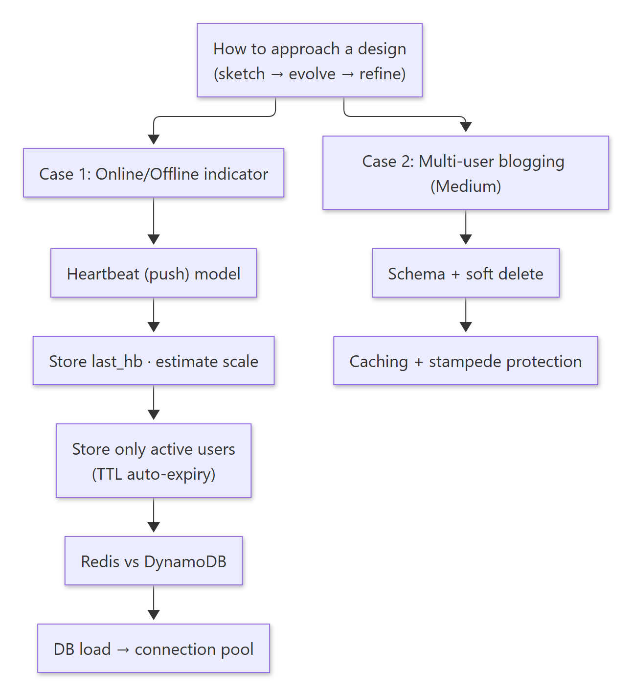

<details><summary>Diagram source (Mermaid)</summary>

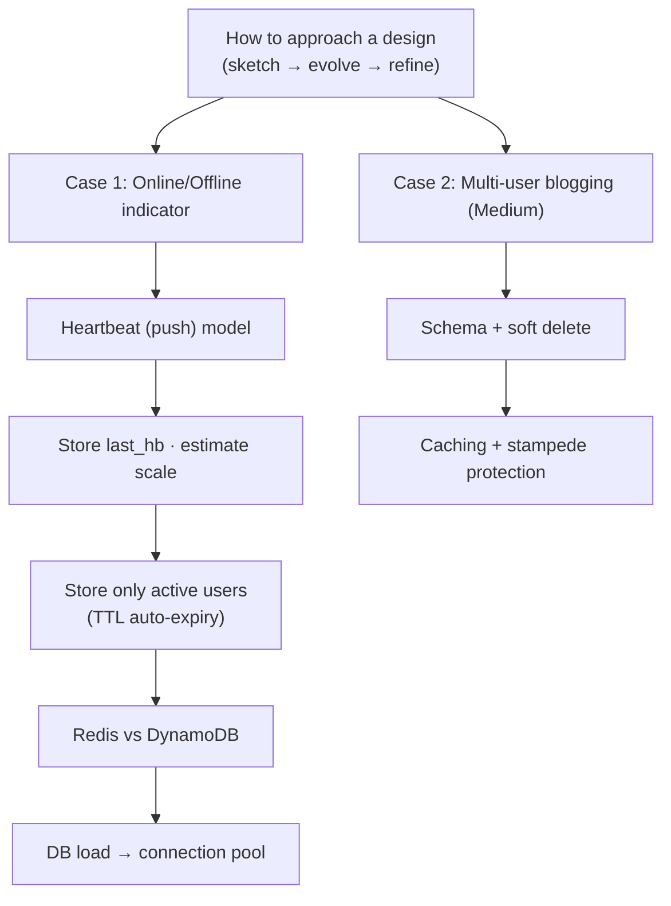

</details>

Two mental models run through the whole session:

| Mental model | What it means |
|---|---|
| **Identify patterns, Lego blocks** | Most systems are the same few blocks (clients → service → DB). The craft is in the details, not the boxes. |
| **Framework of the Opposites** | For every decision, ask "what if we did the exact opposite?" (push vs pull, store vs don't store, do it ourselves vs offload). Evaluate all `n` paths, then pick. |

---

## 1. How to approach a design: it's like sketching

> 🧠 Anchor: **Broad strokes first, details last.** Day-0 design is a rough outline; you refine in passes.

<!-- diagram:f1-02 -->
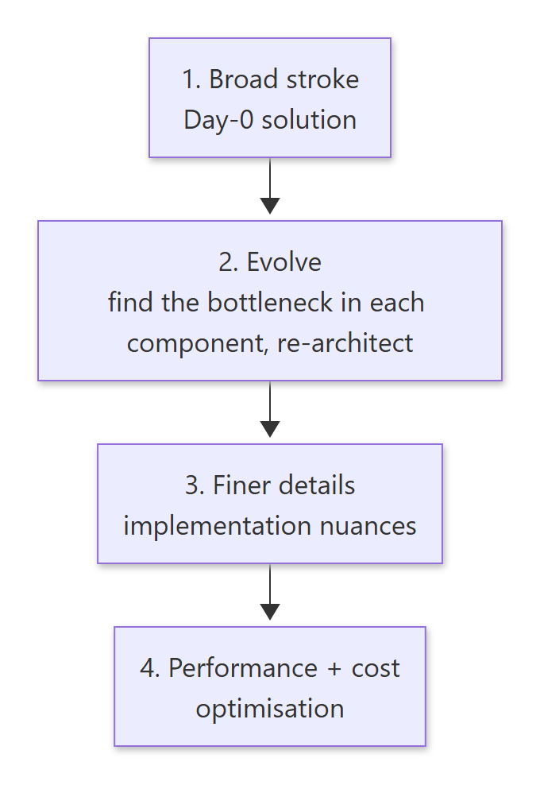

<details><summary>Diagram source (Mermaid)</summary>

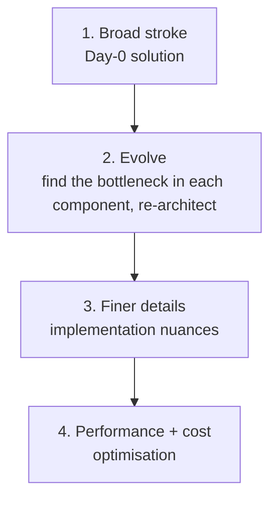

</details>

⚙️ **Mechanics**
- Almost every system *looks* like one diagram: users → a fleet of API servers → a database. The difference between systems lives in the details.
- System design is **not about drawing boxes**, and it is **not templated**. Every choice is a trade-off, and you discuss the trade-off for every single decision.
- Day 1 deliberately ignores scaling, to learn the approach first.

🏗 **So what:** In an interview, state the Day-0 design quickly, then spend your time on the bottlenecks and trade-offs. That is where the signal is.

<details><summary>🔁 Recall: What are the four passes of "design is like sketching"?</summary>

Broad stroke (Day-0) → evolve (find each component's bottleneck, re-architect) → finer implementation details → performance and cost optimisation.
</details>

---

## 2. Case study: Online/Offline indicator

Requirement: for a list of users, show a dot that is green (online) or grey (offline). Kept primitive on purpose.

### 2.1 Data model and API

> 🧠 Anchor: `user_id → bool` is a **key-value** access pattern. Batch reads.

- What we need is a map `user (int) → online? (bool)`. Access is a pure key lookup, so it is a KV problem. The database choice is still open at this point.
- Read API: `GET /status/users?ids=u1,u2,u3,u4`, one call for all the users on screen.
- Rule: **batch whenever and wherever possible.**

### 2.2 Updating status: push, not pull

> 🧠 Anchor: The server **can't pull** from a client (no persistent connection), so the client **pushes a heartbeat**.

<!-- diagram:f1-03 -->
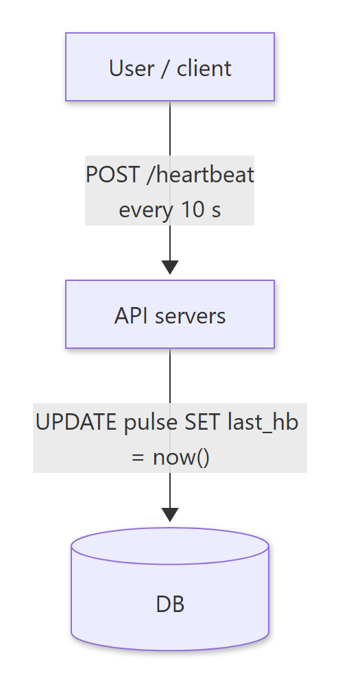

<details><summary>Diagram source (Mermaid)</summary>

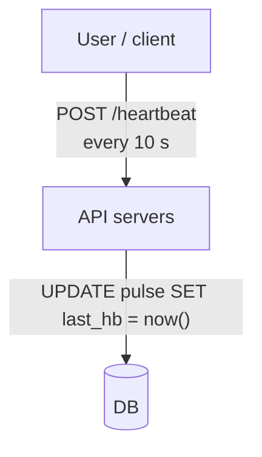

</details>

⚙️ **Mechanics**
- This is the *Framework of the Opposites* in action: pull vs push. The server can't proactively talk to the client unless a persistent connection exists, so the client sends a periodic pulse.
- `POST /heartbeat`: the authenticated user gets marked "alive".
- **When is a user offline?** When we haven't received a heartbeat for "long enough". That threshold is subjective and is business logic, e.g. **30 s**.
- Store **the time of the last heartbeat**, not a boolean:

| user_id | last_hb (epoch s) |
|---|---|
| u1 | 1000 |
| u2 | 1050 |
| u3 | 1060 |

On heartbeat: `UPDATE pulse SET last_hb = NOW() WHERE user_id = ?`. Status = `now − last_hb < 30s`.

### 2.3 Estimate the scale

> 🧠 Anchor: 2 ints = **8 bytes/row**. 1B users ≈ **8 GB**. Always do the critical calculation.

| Users | Rows | Storage (8 B/row) |
|---|---|---|
| 1 M | 1 M | 8 MB |
| 1 B | 1 B | **8 GB** |

- Each entry is `user_id` (4 B int) + `last_hb` (4 B int) = 8 B.
- **Always critically challenge your system.** That doesn't mean you must change it. It means that when there are `n` paths, you evaluate all of them.

### 2.4 Opposite: don't store every user (sparse instead of dense)

> 🧠 Anchor: **Absence == offline.** Store only active users and let entries expire.

⚙️ **Mechanics**
- All we care about is online/offline. So if a user has **no row**, return offline.
- Expire each entry 30 s after its last heartbeat (delete it). Then *total rows = active users*.
- With 1B total users but only **100k active**: 100k × 8 B = **800 KB**, instead of 8 GB.
- How to auto-delete? Opposites again:
  1. Write a **CRON job** that deletes expired rows (you own it).
  2. **Offload it to the datastore**: use a KV store with built-in TTL. ✅

### 2.5 Which KV store with TTL: Redis or DynamoDB?

> 🧠 Anchor: Every heartbeat **pushes the TTL forward** (`SET key … EX 30`). Pick the store by **context**, not by features.

| | Redis (OSS) | DynamoDB |
|---|---|---|
| In-memory, KV, TTL | ✅ (in-memory, fast) | ✅ KV + TTL |
| Durability | weaker | ✅ durable |
| Cost | in-memory DBs are expensive | NoSQL on disk is cheaper |
| Vendor | none (self-host) | AWS lock-in |
| Ops | you maintain it; needs more people | managed; easy for a lean team; multi-region |

- On every heartbeat: update the entry in Redis/DynamoDB with `ttl = 30s`.
- The context that decides it: product stage, engineering team size, business constraints, and the team's familiarity with the vendor.
- (Scaling Redis is covered in week 8.)

### 2.6 What real systems do: WebSockets

- In practice, presence systems use **WebSockets** (a persistent connection). Day 1 keeps it simple with HTTP heartbeats.
- If you use Socket.IO, it layers its own protocol on top of WebSocket (it is not the raw RFC 6455 spec), with a built-in heartbeat (`pingInterval`/`pingTimeout`) plus automatic connection monitoring and reconnection. With any other library, you can implement your own heartbeat.
- Scaling WebSockets is hard; that comes in week 2.

### 2.7 How is the DB doing? Connection pooling

> 🧠 Anchor: **10 s heartbeat × 1M active users = 6M DB writes/min.** The hidden cost is opening a new connection every time.

⚙️ **Mechanics**
- 1 user sends 6 heartbeats/min. With 1M active users that's **6M requests/min**, and each heartbeat is one DB call.
- These are micro reads/updates, so the expensive part is the **network**: each fresh TCP connection costs a 3-way handshake (plus a 2-way teardown).
- Fix: a **connection pool**, i.e. pre-established connections between the server and the DB that get reused.
- The numbers make the case: if the query itself takes ~1 ms but setting up a connection adds a lot more on top, reusing connections saves the majority of the time per call.

<!-- diagram:f1-04 -->
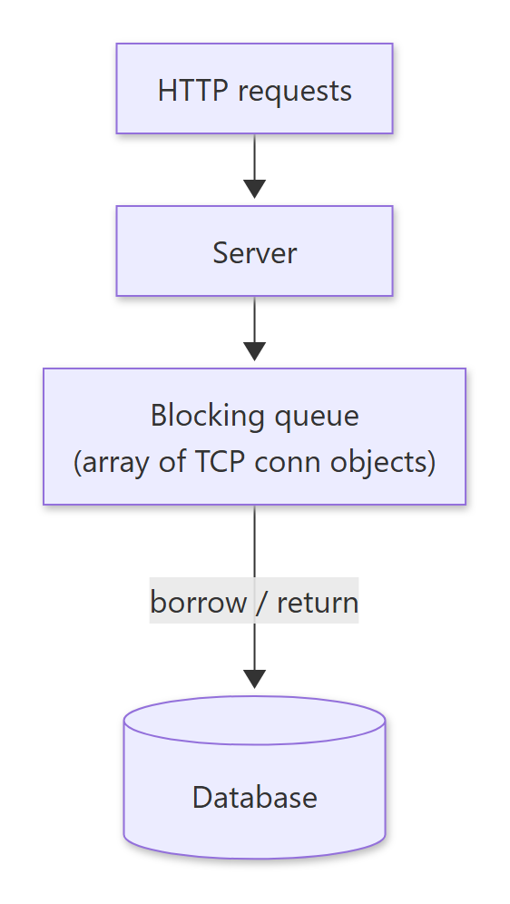

<details><summary>Diagram source (Mermaid)</summary>

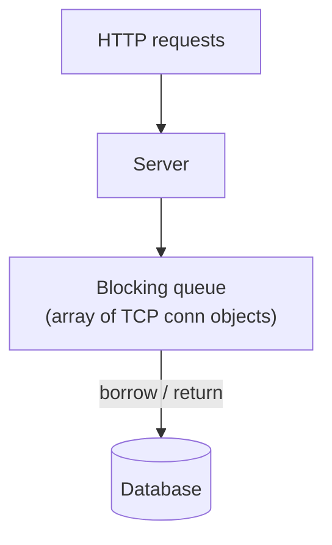

</details>

**How a pool is built:** a **blocking queue** (often a circular array) whose elements are TCP connection objects. A request takes one connection out. If none is free, it **waits until one is returned**.

🏗 **So what:** The same "heartbeat + timeout" idea is how **failure detection in distributed systems** works (simple version).

**Exercise:** implement a thread-safe connection pool using a bounded blocking queue.

<details><summary>🔁 Recall: Why does storing only active users with a TTL beat storing all users?</summary>

Absence means offline, so storage scales with *active* users (100k × 8 B = 800 KB) instead of *total* users (1B × 8 B = 8 GB), and the datastore deletes expired rows for you. No CRON job needed.
</details>

<details><summary>🔁 Recall: Redis or DynamoDB for presence? What decides it?</summary>

Context. Redis is in-memory and fast but costly and self-maintained. DynamoDB is durable, managed, multi-region and cheaper on disk, but brings AWS lock-in. A lean team favours managed; a team that already runs Redis may self-host.
</details>

<details><summary>🔁 Recall: Why does a connection pool help a heartbeat service so much?</summary>

Each heartbeat is a tiny DB update, so per-request TCP setup/teardown dominates the cost. Reusing pre-established connections removes that overhead from 6M calls a minute.
</details>

---

## 3. Case study: Multi-user blogging platform (Medium)

The foundation topics this course keeps returning to: **Database & Caching · Scaling · Delegation · Concurrency · Communication.**

Scope: one user writes many blogs; many users. We look only at the key design decisions.

### 3.1 Schema

| users | blogs |
|---|---|
| id | id |
| name | author_id |
| bio | title |
| | body |
| | is_deleted |
| | published_at |

### 3.2 Soft delete (`is_deleted`)

> 🧠 Anchor: **Delete = UPDATE `is_deleted = true`**, not `DELETE`.

- Reasons: **recoverability, archival, audit**.
- It's also easier on the database engine: a real delete removes a key from the B+ tree index, which can trigger **tree rebalancing** (nodes merge). An update doesn't change the tree's shape.

<!-- diagram:f1-05 -->


<details><summary>Diagram source (Mermaid)</summary>

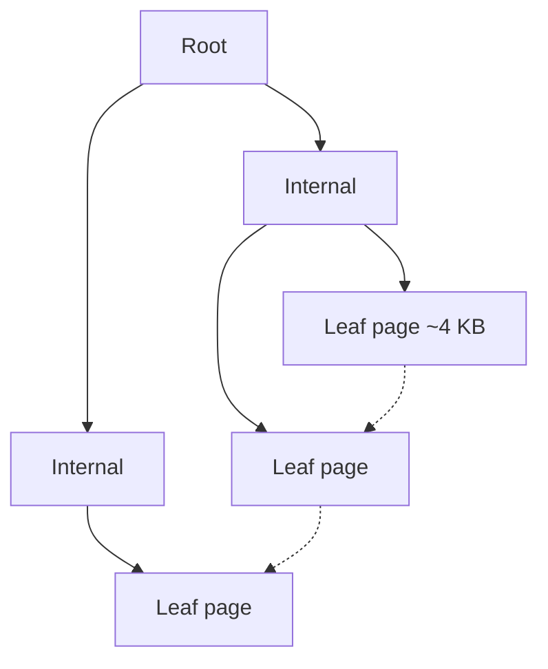

</details>

- Side note: `SELECT A, B, C FROM table` still reads the **entire row** from disk; only the projected columns are returned. Wide rows cost I/O even if you select a few columns. This also affects indexes.
- (Post-reads cover `datetime` vs `int`, and `TEXT` vs `VARCHAR`.)

### 3.3 Caching

> 🧠 Anchor: **Caches are just glorified hash tables.** Use one to avoid repeating any expensive work.

⚙️ **Mechanics**
- A cache reduces response time by saving heavy computation or I/O. Typical uses: avoid disk I/O, network I/O, or compute.
- Caches are not only RAM-based. A **CDN** is a cache too.
- Analogy: copying the topper's answers instead of solving the hard assignment yourself is caching. You skip redundant work.
- Concerns that come with a cache: **invalidation**, **co-location**, **fallback on a cache miss**, and **surges in traffic**.

<!-- diagram:f1-06 -->
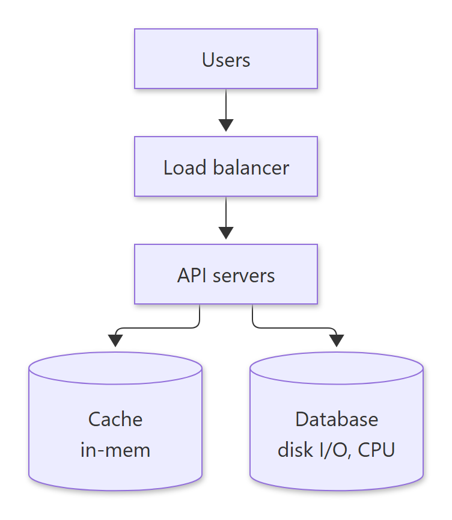

<details><summary>Diagram source (Mermaid)</summary>

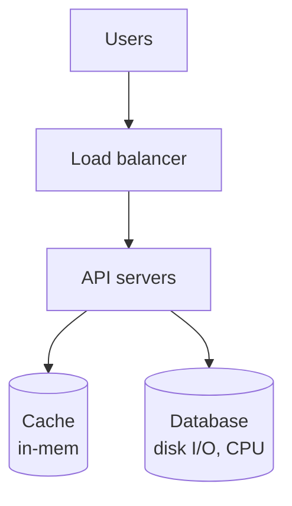

</details>

### 3.4 The problem: many concurrent misses for the same key

> 🧠 Anchor: On a miss, let **one** request go to the DB and make the others **wait** for its result.

When a popular blog isn't in cache, many API calls miss at the same moment and all hit the DB together. That's a **cache stampede** (thundering herd).

The session's fix: a semaphore per key, so the first request fetches and the rest wait.

```text
sem_map = {}   # concurrent map: key -> semaphore
res_map = {}   # key -> fetched value

get_blog(k):
    v = cache.get(k);  if v: return v
    s = sem_map.get(k)
    if s:                      # someone is already fetching k
        s.wait();  return res_map.get(k)
    else:                      # I am the first
        sem_map[k] = new Semaphore(); sem_map[k].block()
        v = db.get(k); cache.put(k, v); res_map[k] = v
        sem_map[k].signal(); sem_map.remove(k)
    return v
```

- The slides name this **debouncing**: many requests for the same key reach the cache at once, one goes through to the DB, and the others wait. CDNs do this too.

<details><summary>🔁 Recall: Name three reasons for soft delete, plus the DB-engine reason.</summary>

Recoverability, archival, audit. And an UPDATE doesn't remove an index key, so the B+ tree doesn't have to rebalance.
</details>

<details><summary>🔁 Recall: What is a cache stampede and how does the per-key semaphore stop it?</summary>

Many concurrent misses on the same key all hit the DB at once. The first request takes a per-key lock and fetches the value; the others wait on that lock and then read the stored result. One DB call instead of N.
</details>

---

## What these notes add beyond the slides

- **Name check: "debouncing" / "request hedging".** The slides note this pattern is "also called request hedging". In common usage, **request hedging** is something else: sending a *duplicate* request to a second replica when the first is slow, to cut tail latency. The pattern on the slides is usually called **request coalescing** or **single-flight** (Go's `singleflight`), or cache-stampede protection. Use those names in interviews.
- **Race in the pseudocode.** `sem_map.get(k)` followed by `sem_map[k] = …` is check-then-act. Two threads can both see "no semaphore" and both go to the DB. Use an atomic `putIfAbsent` / `computeIfAbsent` so exactly one thread wins. Also, a waiter can read `res_map` after the winner removes the semaphore, so `res_map` entries need their own cleanup (or just re-read the cache).
- **Arithmetic checked:** 1B × 8 B = 8 GB ✔, 100k × 8 B = 800 KB ✔, 10 s heartbeat → 6/min → 6M/min for 1M users ✔.
- **Heartbeat interval vs offline threshold:** a 30 s threshold with a 10 s heartbeat tolerates two lost pulses before marking someone offline. A good rule of thumb is threshold ≈ 2–3× the interval.

## One-page memory card

<!-- diagram:f1-07 -->
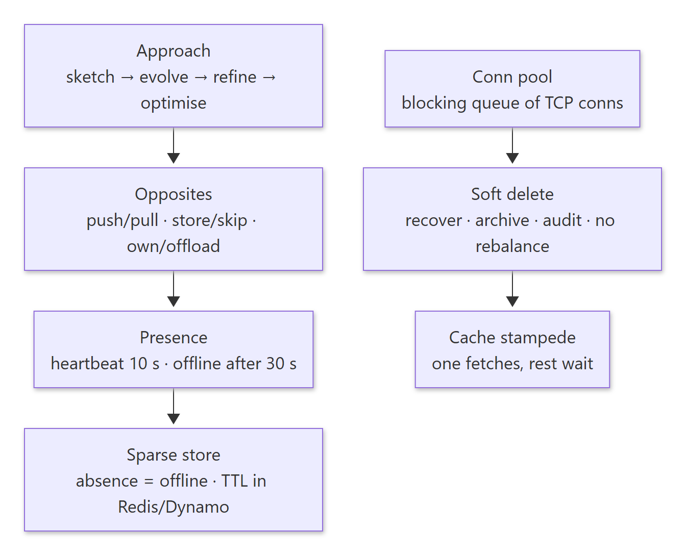

<details><summary>Diagram source (Mermaid)</summary>

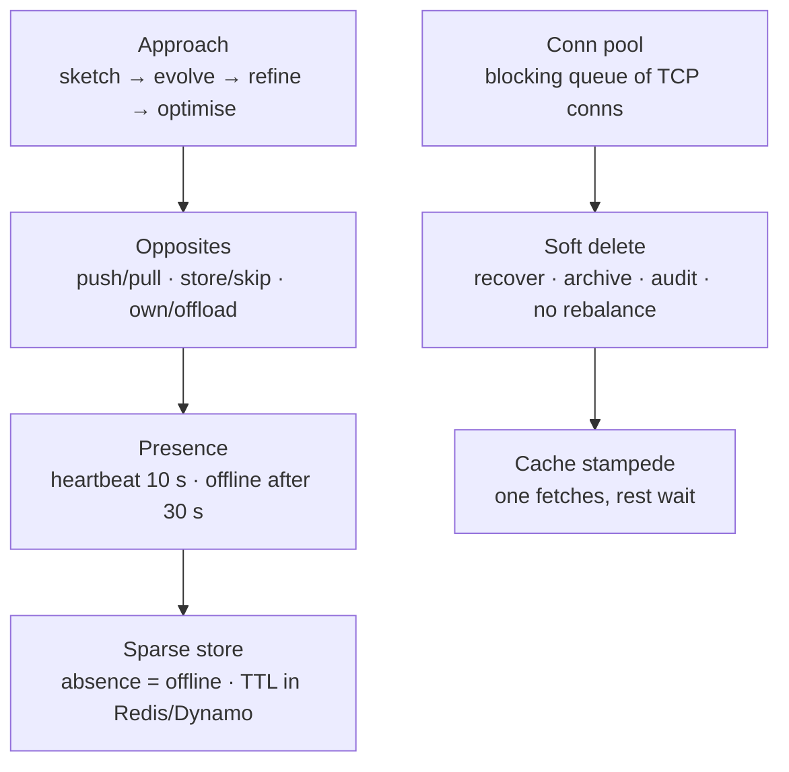

</details>
