# 01-02 · Arpit Bhayani's session notes: Foundational topics (Scaling, Delegation, Communication)

> Source: `01-02.pdf` (System Design Masterclass, Google Drive, view-only). Study notes in my own words,
> not a copy. Pages covered: 1–14 of 14. Unreadable pages: none.

## Map of the session

<!-- diagram:f2-01 -->
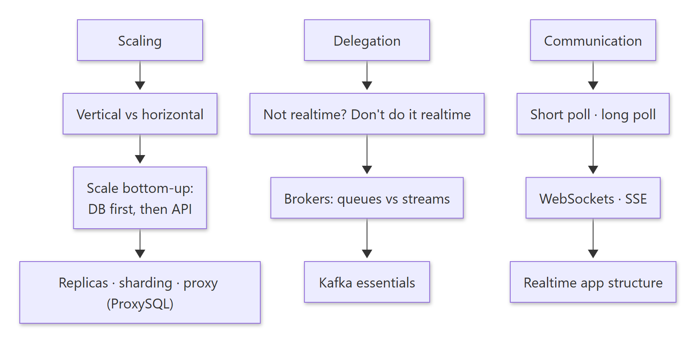

Diagram source (Mermaid)

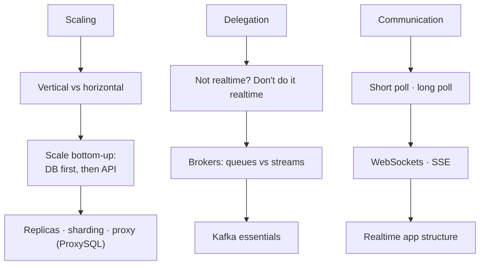

Agenda: **Scaling + ProxySQL primer · Delegation + Kafka essentials · Communication** (short poll / long poll / WebSockets / SSE).

---

## 1. Scaling

> 🧠 Anchor: Scaling = handling a large number of **concurrent** requests. Horizontal ≈ "infinite" scale, **but there's a catch.**

| | Vertical scaling | Horizontal scaling |
|---|---|---|
| How | Make the box bulkier ("Hulk"): more CPU, RAM, disk | Add more boxes |
| Gives you | Simple; no code change | Near-linear amplification + fault tolerance |
| Limit | Hardware ceiling | Your stateful components must keep up |

- Decide using **unit tech economics**: load-test one unit to find what it handles, then work out how many you need.

### 1.1 The catch: scale bottom-up

> 🧠 Anchor: Adding API servers is pointless if the **DB and cache** behind them can't take the extra concurrent load. **Scale the DB first, then the API.**

<!-- diagram:f2-02 -->
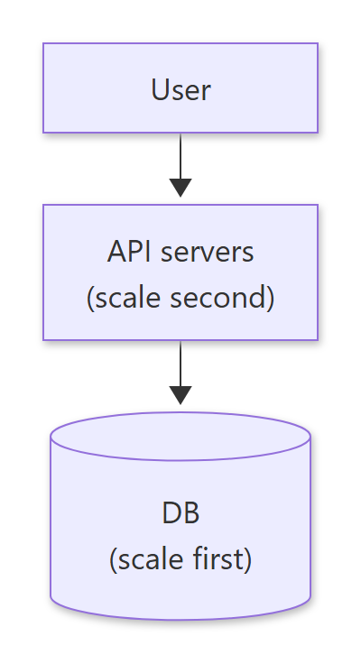

Diagram source (Mermaid)

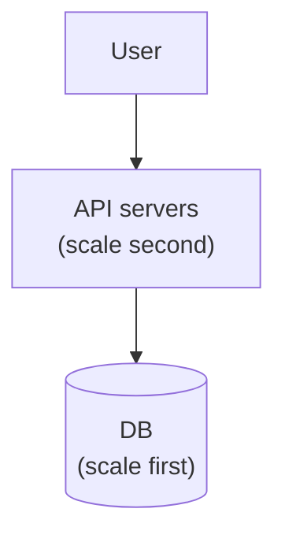

- Scaling one layer isn't enough when the layer it depends on can't keep up.

### 1.2 Ways to scale the DB

<!-- diagram:f2-03 -->
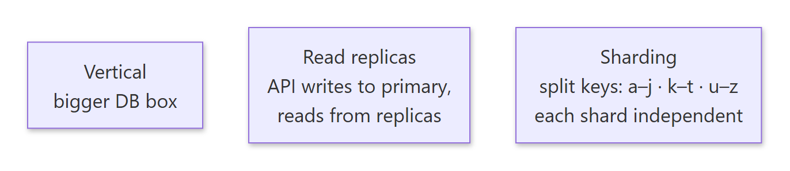

Diagram source (Mermaid)

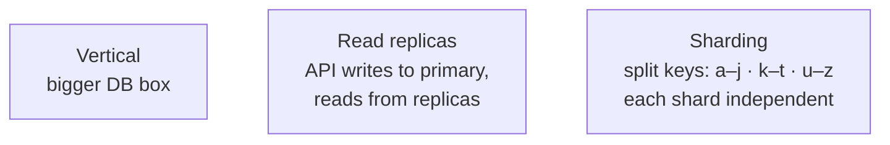

- **Who knows the topology?** Either every API server knows which DB/shard/replica to talk to, **or** you put a **proxy** in between that knows the topology and routes for you (e.g. RDS Proxy, ProxySQL).
- Proxy rules can cover **routing, caching, connection pooling**, and more.

<!-- diagram:f2-04 -->
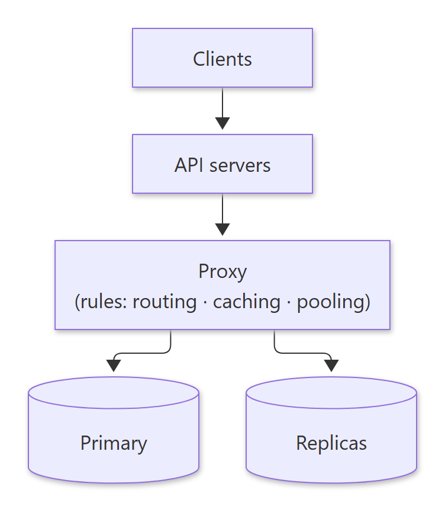

Diagram source (Mermaid)

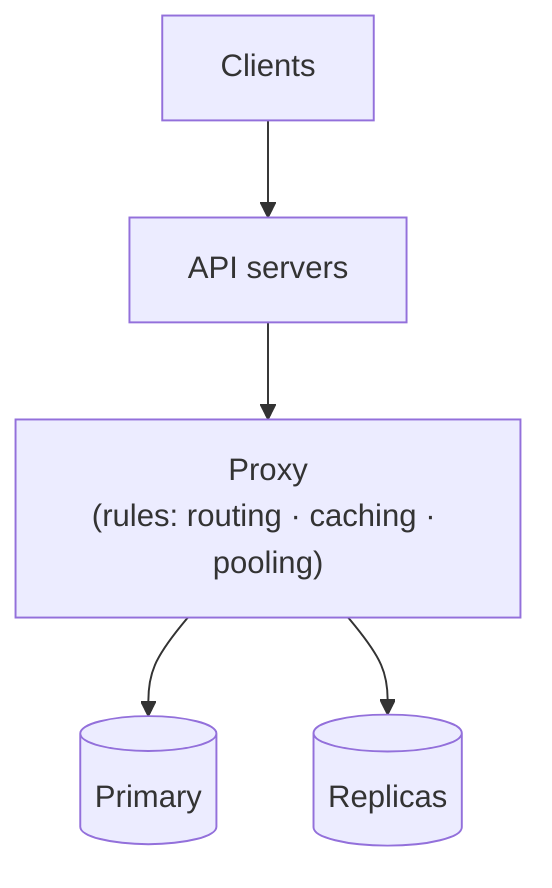

### 1.3 ProxySQL primer

⚙️ **Mechanics** (all configured with SQL against ProxySQL's admin tables, then `LOAD … TO RUNTIME; SAVE … TO DISK`)
1. **Hostgroups** represent different clusters. For example, hostgroup 10 = primary, hostgroup 20 = replicas.
2. Put **multiple replicas in the same hostgroup**. ProxySQL spreads load across them, e.g. **least-connection routing**.
3. **Query rules** route by pattern: send `^SELECT` to the replica hostgroup (20), everything else to the primary (10).
4. Rules can also route by **schema**: e.g. `analytics_db` → replicas, `transactions_db` → primary.

**Scaling ProxySQL itself:** vertically, or horizontally by running several ProxySQL nodes behind an **L4 load balancer**, each connected to all DB groups.

🔁 Recall: Why must you scale bottom-up?

The stateful layers (DB, cache) take the concurrent load from every API server. Adding API servers just pushes more load onto a DB that can't take it, so scale the DB first.

🔁 Recall: Two ways for an API to "know" DB topology?

Bake the topology into every API server, or put a topology-aware proxy (ProxySQL, RDS Proxy) in between that handles routing, pooling and caching.

---

## 2. Delegation

> 🧠 Anchor: **"What does not need to be done in realtime should not be done in realtime."** This is the mantra for performance.

Example: show "74 essays" (number of blogs) on an author's profile.

### 2.1 Delegate and respond

<!-- diagram:f2-05 -->
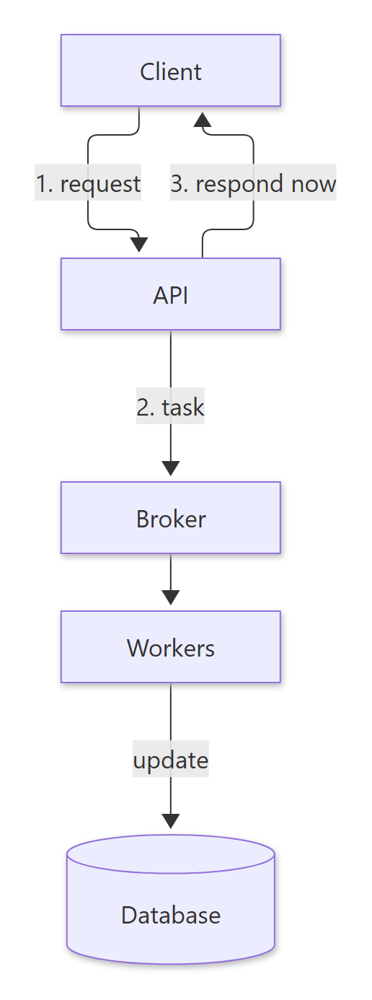

Diagram source (Mermaid)

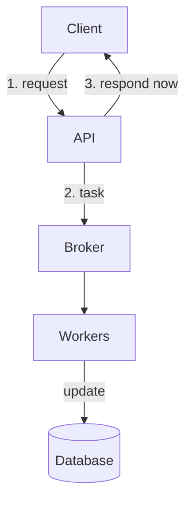

The API puts a task on a broker and responds immediately. Workers pick tasks up and do the slow part.

**What to delegate:**
- Long-running tasks that would outlast the request timeout (spinning up an EC2 instance, video encoding)
- Heavy computation or queries
- Batch writes
- Anything that can be **eventually** consistent

### 2.2 Brokers: queues vs streams

> 🧠 Anchor: **Queue** = each message goes to **one** consumer. **Stream** = each message can be read by **many** consumer groups.

| | Message queues | Message streams |
|---|---|---|
| Examples | SQS, RabbitMQ | Kafka, Kinesis |
| Delivery | Each message is consumed by one of the consumers | Messages are retained; every **consumer group** reads all of them |
| Good for | Work distribution | Fan-out of the same event to several independent systems (search, analytics) |

### 2.3 Example: `total_blogs` counter

- Store `total_blogs` **pre-computed** on `users`, to avoid joins and runtime counting.
- On publish, the API emits `ON_PUBLISH` to SQS; a worker does `total_blogs++`. Similarly, `ON_DELETE` → `total_blogs--`.
- Want to index blogs in Elasticsearch? You *could* add that logic to the same worker…

**…but that's a bad design: no separation of concerns.** Counting and search indexing belong to two different teams. Fix: use **Kafka**, so the same event is consumed by **two kinds of consumers**.

<!-- diagram:f2-06 -->

Diagram source (Mermaid)

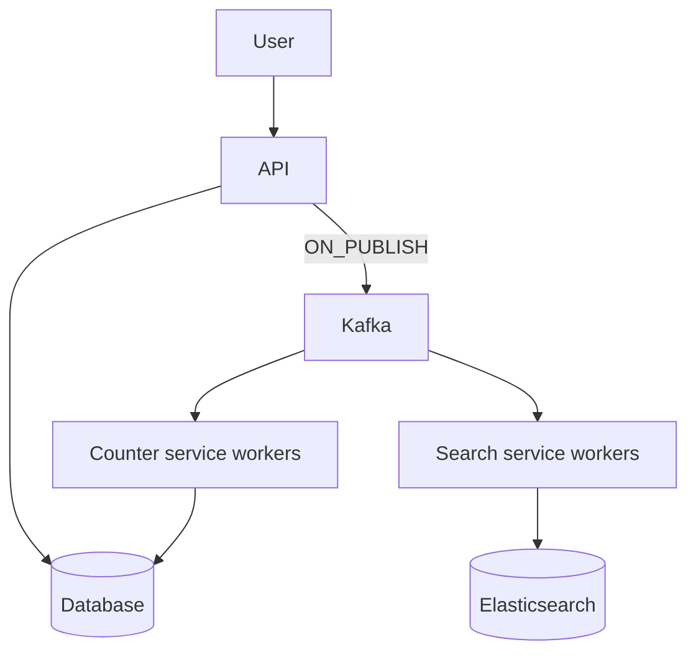

**Exercise:** set up RabbitMQ and Kafka locally, write simple producer/consumer code, and note the difference in semantics.

### 2.4 Kafka essentials

> 🧠 Anchor: Topic → **n partitions**. Hash key picks the partition. **Order only within a partition.** Consumers per group ≤ partitions.

⚙️ **Mechanics**
- Kafka is a message stream that holds messages. Messages go to a **topic**, and every topic has **n partitions**.
- The configured **hash key** decides which partition a message lands in (e.g. key by user, so all of `u1`'s events go to one partition).
- **Ordering is guaranteed within a partition only**, not across partitions.
- **Limitations:**
  - You **cannot reduce** the number of partitions after creating a topic.
  - Within one consumer group, **#consumers ≤ #partitions** is what's useful: with 3 partitions, a 4th or 5th search consumer gets no messages.
- A different consumer group (e.g. analytics) reads the same topic independently.

<!-- diagram:f2-07 -->
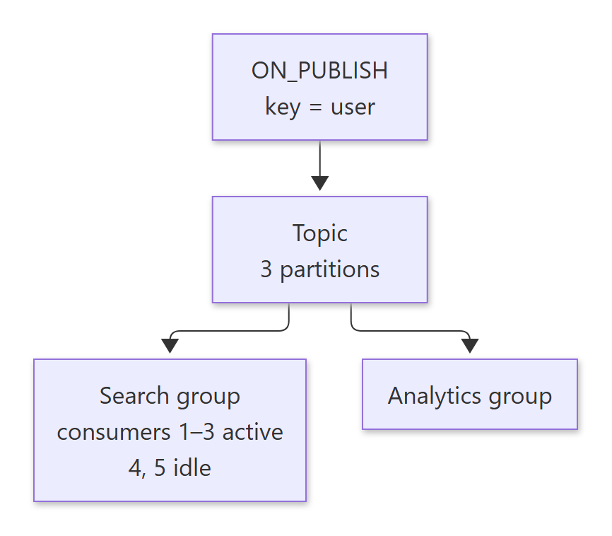

Diagram source (Mermaid)

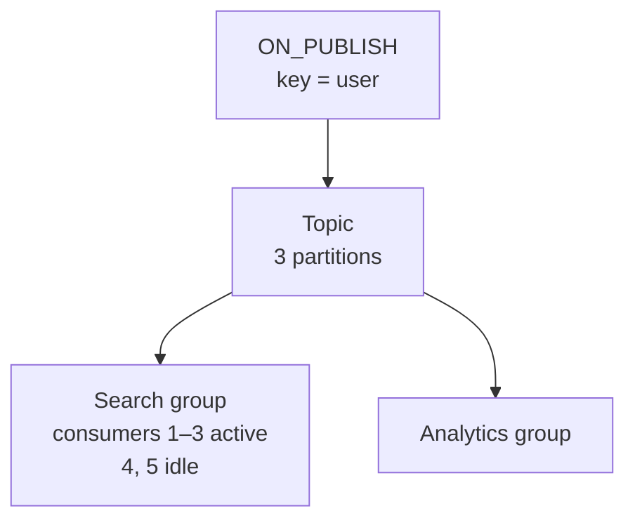

🔁 Recall: Why move from SQS to Kafka for the blog example?

Separation of concerns. The counter and the search index are different teams' jobs. A stream lets each team run its own consumer group on the same `ON_PUBLISH` event, whereas a queue hands each message to just one consumer.

🔁 Recall: What happens with 5 consumers in a group on a 3-partition topic?

Only 3 get partitions; 2 sit idle. Parallelism is capped by partition count, and partitions can't be reduced later.

---

## 3. Communication

> 🧠 Anchor: **Who initiates, and how long is the connection held?** That one question separates the four styles.

| Style | How it works | Example | Cost |
|---|---|---|---|
| Normal request/response | Client asks, server does the heavy lifting, connection open until the response (with a timeout) | Any API | — |
| **Short polling** | Client asks again every few seconds; server answers **right away** | Refreshing a cricket score; "is the server ready?" | HTTP overhead; lots of empty request/response pairs |
| **Long polling** | Client asks; server **holds the connection** and responds only when data is available (or on timeout, then the client re-asks) | Respond only when the ball is bowled | Held connections on the server |
| **WebSockets** (ws/wss) | **Bidirectional** channel kept open; **the server can push** | Realtime chat, stock ticker, live experiences, multiplayer games | Stateful connections to scale |
| **Server-Sent Events** | **Unidirectional**: server → client stream over HTTP | Stock ticker, deployment-log streaming, ads, feed updates | One direction only |

- EC2 provisioning example: short polling checks the status every few seconds; long polling gets a single response when the machine is ready.
- WebSocket advantages: **realtime** data transfer and **low communication overhead** (no per-message HTTP request).

### 3.1 How realtime apps are usually structured

> 🧠 Anchor: **Load the UI → load the initial state via REST → subscribe for live updates.**

<!-- diagram:f2-08 -->
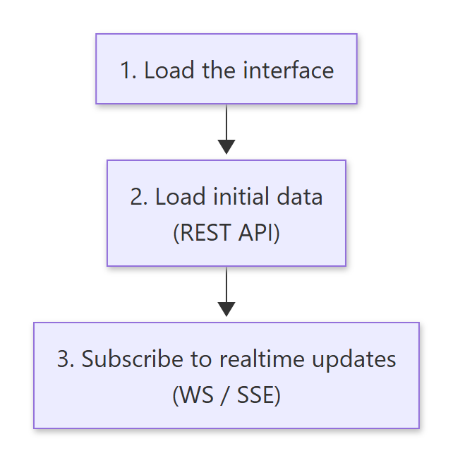

Diagram source (Mermaid)

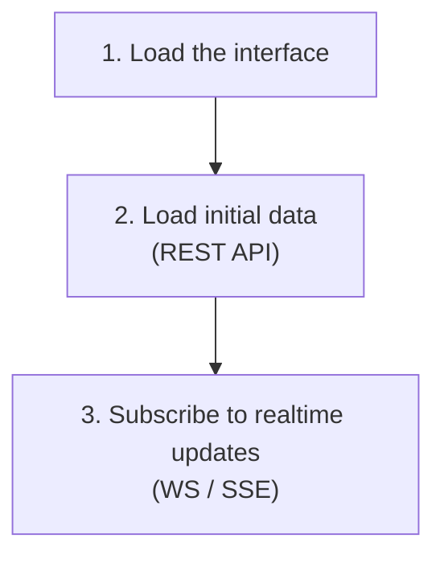

- Stock table: initial prices come from REST, then ticks stream in.
- Deployment logs: the existing log loads through a regular API, and new lines are streamed.

🔁 Recall: Short vs long polling in one line each?

Short polling: server replies immediately, client repeats every few seconds. Long polling: server holds the request and replies only when there's data (or at timeout).

🔁 Recall: When pick SSE over WebSockets?

When only the server needs to push (logs, tickers, feed updates). SSE is simpler, plain HTTP and one-way. Use WebSockets when the client also sends frequent messages (chat, games).

---

## What these notes add beyond the slides

- **Bottom-up scaling extends to caches and queues:** any stateful dependency (cache cluster, broker, third-party API with rate limits) caps how far stateless servers can scale.
- **"#consumers ≤ #partitions" is per consumer group.** Extra consumers act as hot standbys that take over a partition on rebalance, so they're not entirely useless.
- **Counters via events are eventually consistent and need idempotency.** If a worker retries `total_blogs++` after a crash, the count drifts. Use an idempotency key per event, or periodically recompute.
- **Long polling vs SSE:** both hold a connection, but long polling closes after each response and re-opens. SSE keeps one connection for many events and has built-in reconnection with `Last-Event-ID`.

## One-page memory card

<!-- diagram:f2-09 -->
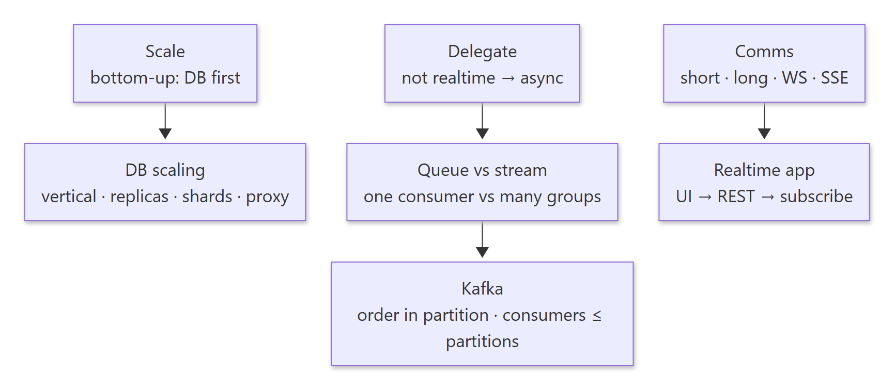

Diagram source (Mermaid)

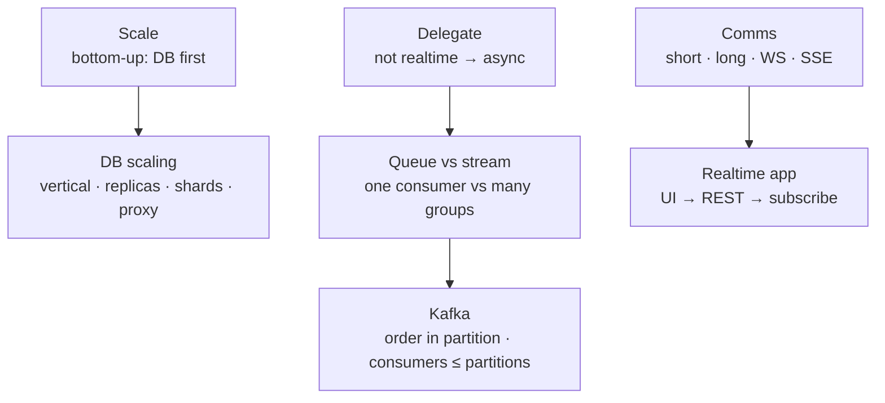

