# 02-01 · Arpit Bhayani's session notes: Databases (Pessimistic locking, Airline check-in, KV store on SQL)

> Source: `02-01.pdf` (System Design Masterclass, Google Drive, view-only). Study notes in my own words,
> not a copy. Pages covered: 1–14 of 14. Unreadable pages: none.

## Map of the session

<!-- diagram:f3-01 -->
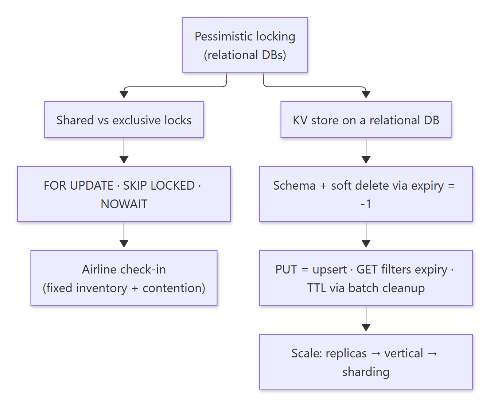

Diagram source (Mermaid)

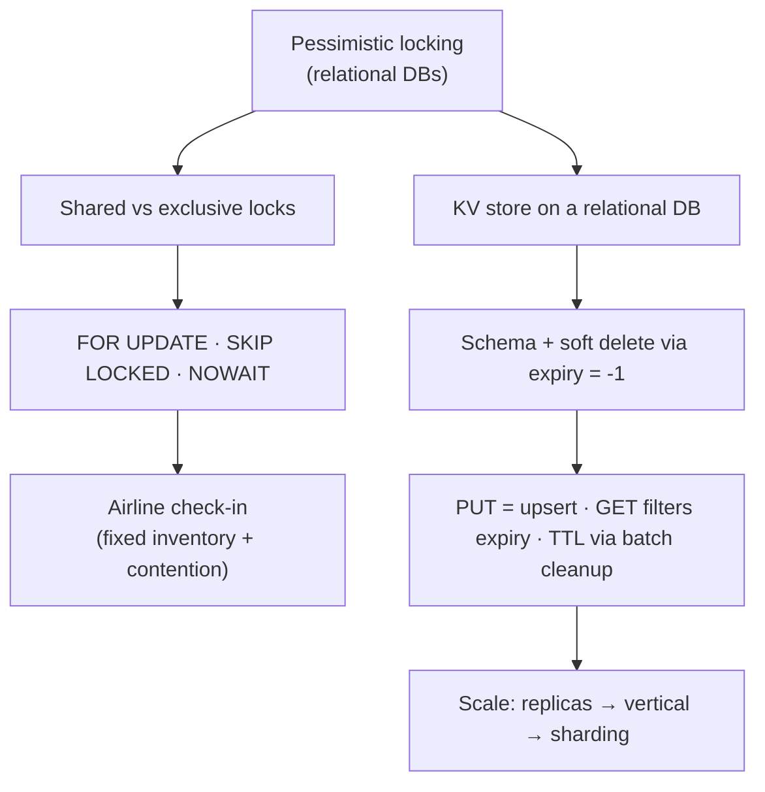

Agenda: **Pessimistic locking in relational DBs · Designing an airline check-in system · Designing a KV store on a relational DB.**

---

## 1. Pessimistic locking

> 🧠 Anchor: **Lock first, then read and update, then release.** This protects data sanity (consistency + integrity) against concurrent updates.

<!-- diagram:f3-02 -->
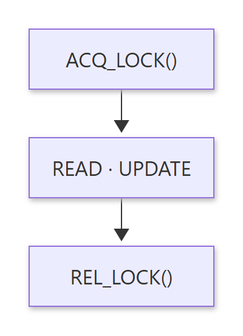

Diagram source (Mermaid)

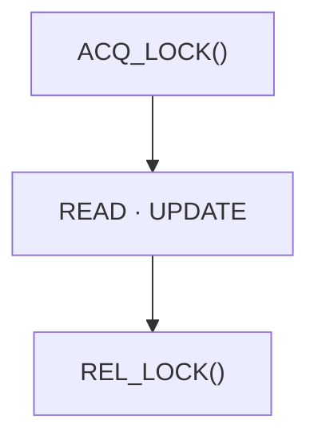

- Locks exist to protect the **sanity** of the data, meaning its consistency and integrity, when updates run concurrently.
- Two strategies: **shared locks** and **exclusive locks**. Locks are released when the transaction **commits or rolls back**.
- **Risk: deadlock.** T1 holds row 1 and wants row 2; T2 holds row 2 and wants row 1. The database detects the cycle and **kills one transaction** so the other can proceed.

<!-- diagram:f3-03 -->
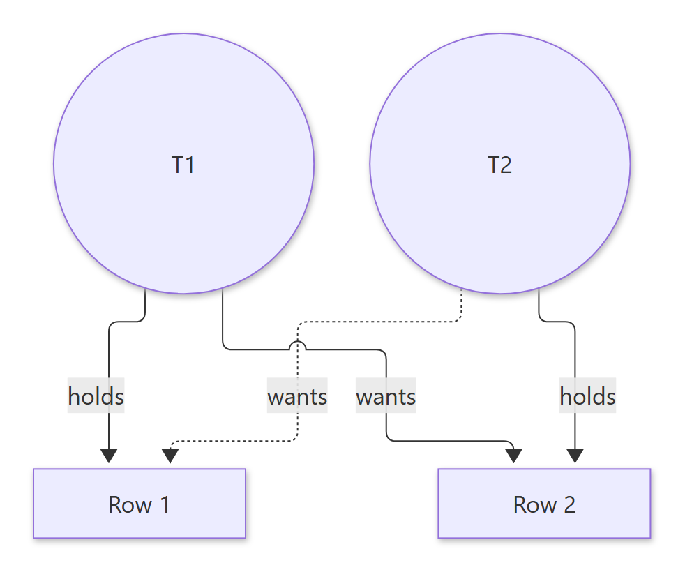

Diagram source (Mermaid)

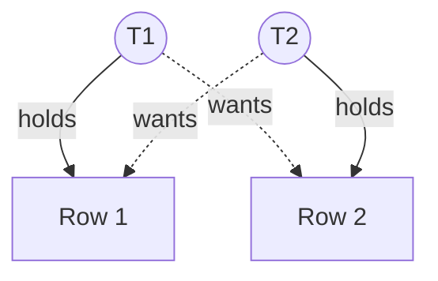

### 1.1 Exclusive locks: `SELECT … FOR UPDATE`

> 🧠 Anchor: `FOR UPDATE` = "these rows are **mine to write**." Anyone else who wants them **waits**.

- Reserved for **writing** by the current transaction. Other transactions can't take a lock on, or modify, those rows until it finishes.
- Example: T1 runs `SELECT … WHERE id IN (1,2,6) FOR UPDATE`. T2 runs `SELECT … WHERE id IN (3,4,6) FOR UPDATE`. Rows 3 and 4 are free, but **row 6 overlaps**, so T2 **waits** for T1.

### 1.2 Variations: `SKIP LOCKED` and `NOWAIT`

| Clause | Behaviour if the row is already locked | Use it for |
|---|---|---|
| `FOR UPDATE` | **Wait** for the lock | Correctness when you need *that* row |
| `FOR UPDATE SKIP LOCKED` | **Drop locked rows** from the result set and carry on | "Give me *any* free item": seats, job queues, coupons |
| `FOR UPDATE NOWAIT` | **Fail immediately** with an error (MySQL: `ERROR 3572 … NOWAIT is set`) | Fail fast instead of piling up waiters |

**Exercise:** read about shared locks and code them up for different use cases.

🔁 Recall: What do FOR UPDATE, SKIP LOCKED and NOWAIT each do when the row is locked?

FOR UPDATE waits. SKIP LOCKED leaves the locked row out of the result and moves on. NOWAIT errors out immediately.

🔁 Recall: How does a relational DB resolve a deadlock?

It detects the wait-for cycle and rolls back one of the transactions (the victim) so the other can proceed. Your app must retry the victim.

---

## 2. Airline check-in system

> 🧠 Anchor: **Fixed inventory + contention.** 120 people pick seats at the same moment, and no seat may be given twice.

Requirements:
- Multiple airlines; each airline has multiple planes (flights); each flight has **120 seats**; each flight has multiple **trips**.
- A user books a seat on one trip of a flight.
- **Handle many people trying to pick seats on the same plane at the same time.**

**Similar systems** (same shape: fixed inventory + contention): CoWIN vaccine slots, IRCTC train tickets, BookMyShow, flash sales.

The session demonstrates it with locking. Here's how the clauses above map onto it:

<!-- diagram:f3-04 -->
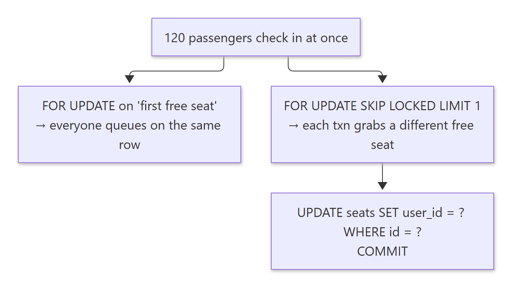

Diagram source (Mermaid)

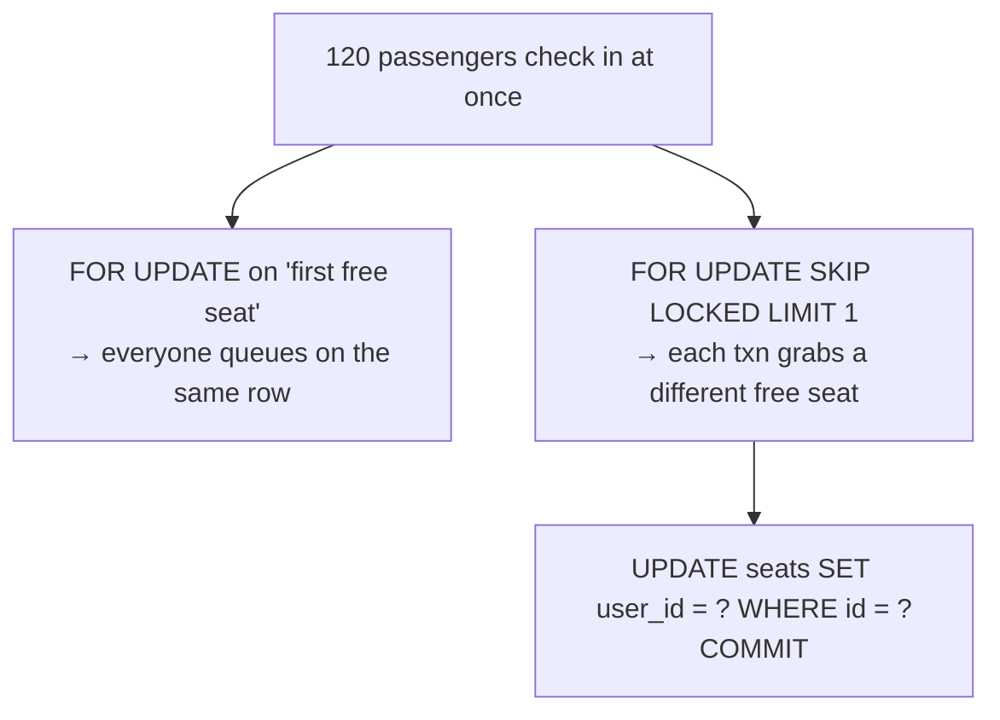

- With plain `FOR UPDATE`, every transaction tries to lock the **same** "first free seat" row, so they serialise and run slowly.
- With `SKIP LOCKED`, each transaction skips seats others are holding and takes the next free one, so all 120 proceed in parallel and no seat is double-booked.

**Exercise:** implement the full example, plus shared locks for different use cases.

🔁 Recall: Why is SKIP LOCKED the right tool for seat allocation?

Users don't need a *specific* seat. Concurrent transactions skip rows others have locked and each grabs a different free seat, so there's no serial queue and no double allocation.

---

## 3. Designing a KV store on a relational database

> 🧠 Anchor: An HTTP-based, distributed **KV store backed by MySQL**: storage/compute separation, like DocumentDB on Aurora.

**Requirements:** horizontally scalable; `GET`, `PUT`, `DEL`, `TTL`. All operations are **synchronous** (per key).
**Brainstorm:** storage, optimising storage, insert, update, TTL.

### 3.1 Schema

> 🧠 Anchor: Fold `is_deleted` into `expired_at`: **`expired_at = -1` means deleted.** One less column on every row.

<!-- diagram:f3-05 -->
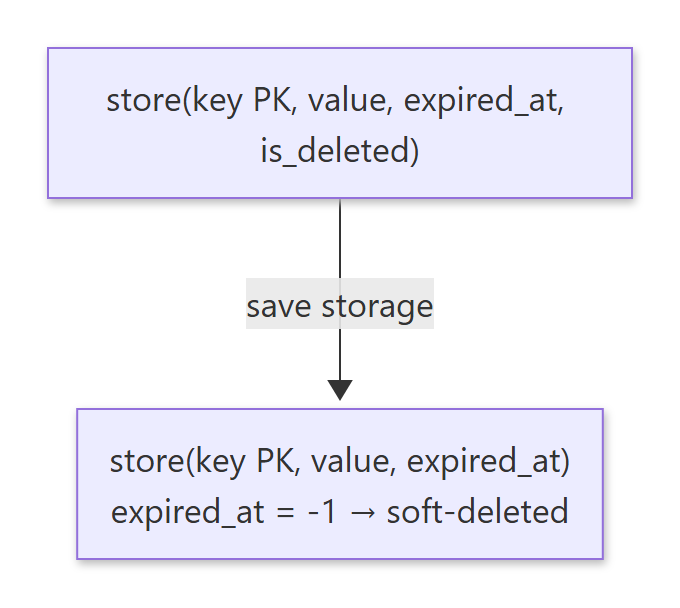

Diagram source (Mermaid)

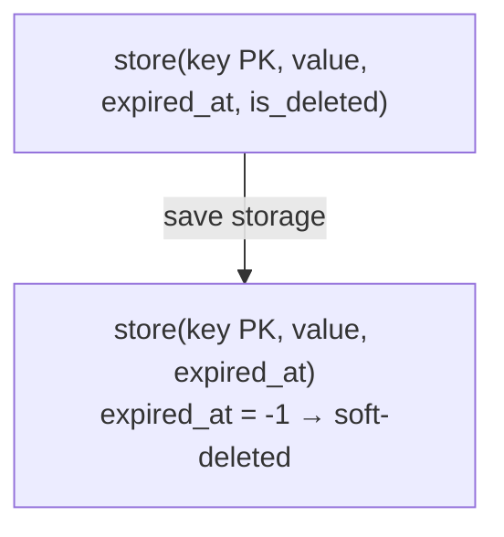

- Start on a **single MySQL node** and scale as demand grows.
- `expired_at` = an **absolute** expiry time. Index it.
- **Saving storage:** why keep a separate `is_deleted` column? Use a **special value**, `-1`, in `expired_at` to mark deletion.
- **Hard delete:** a separate batch/periodic cleanup job removes soft-deleted and expired rows. This minimises I/O and B-tree rebalancing during normal operation.

### 3.2 Operations

| Op | Implementation |
|---|---|
| `PUT(k, v, ttl)` | **Upsert**, not "GET, then INSERT or UPDATE". MySQL: `REPLACE INTO store VALUES (k, v, expiry)`; PostgreSQL: `INSERT … ON CONFLICT … DO UPDATE` |
| Concurrent `PUT`s | Locks protect integrity: one updates, the others wait (`SELECT … FOR UPDATE [NOWAIT]` then `UPDATE … WHERE key = k`) |
| `GET(k)` | `SELECT * FROM store WHERE key = k AND expired_at > NOW()`, so expired rows are filtered out on read |
| `DEL(k)` | Soft delete: `UPDATE store SET expired_at = -1 WHERE key = k AND expired_at > NOW()` (no hard delete, less disk load) |
| TTL / GC | CRON every *t* minutes: `DELETE FROM store WHERE expired_at <= NOW() LIMIT 1000`. That catches both expired and soft-deleted (-1) rows |

- Why the `AND expired_at > NOW()` on DEL? Don't touch rows that are already expired or deleted, which avoids useless writes.
- Why **`LIMIT 1000`** on the cleanup? Without it, one giant DELETE locks many rows, bloats the undo log, spikes replication lag, and can stall live traffic. Delete in small batches.
- The rejected first attempt was `INSERT` with a `created_at`. It breaks on a second `PUT` for the same key, so use an upsert.

### 3.3 Scaling the KV store

> 🧠 Anchor: **Stateless KV-API servers scale freely. The DB scales in steps:** read replicas → vertical → shard.

<!-- diagram:f3-06 -->
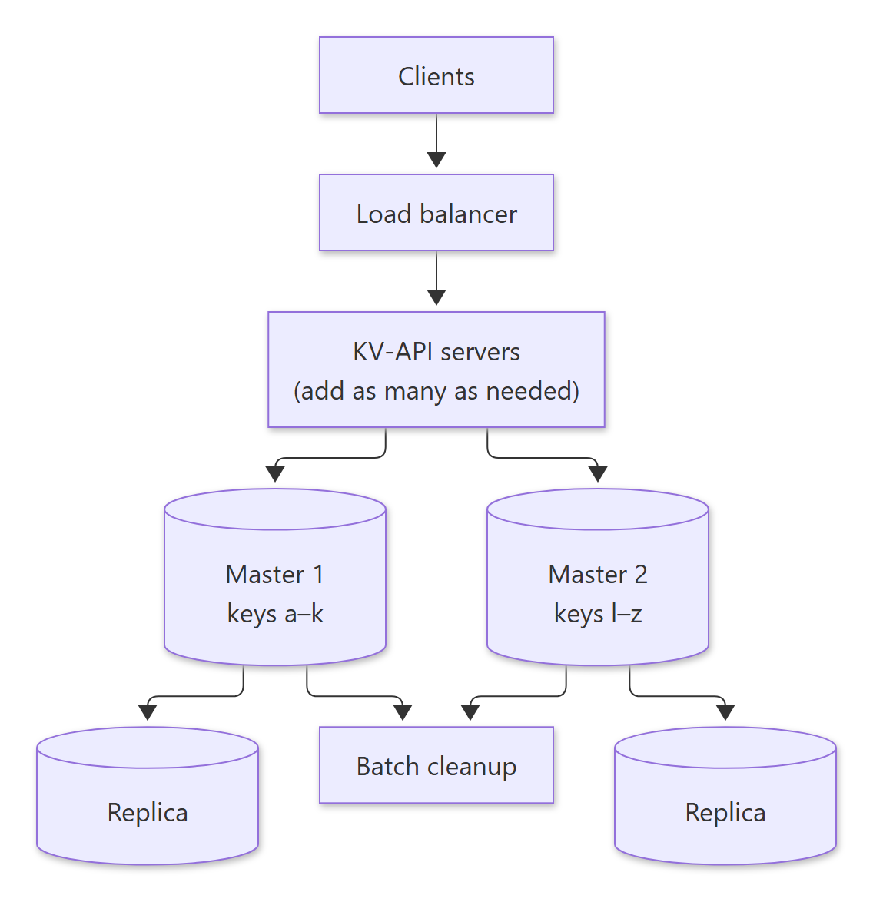

Diagram source (Mermaid)

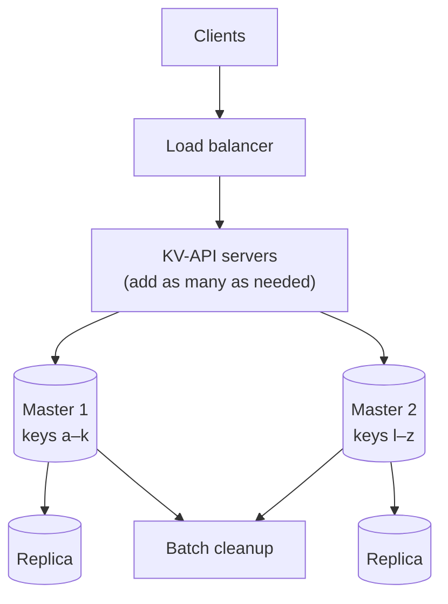

1. **Add KV-API servers** as load grows, as long as MySQL can handle it.
2. **Read-heavy (90:10)** and one DB can't cope → add **read replicas** (route with a proxy / ProxySQL). Replicas have **lag**.
   - Add replicas only when **reading stale data is OK** and **reads ≫ writes** (e.g. 99:1).
   - Let clients ask for consistency per read: `GET /key?consistent=true` sends that read to the **master** (DynamoDB offers the same option).
3. **Master overloaded with writes** → first **scale vertically**. If that's still not enough, **partition (shard)**.
   - **Range-based** (a–k → m1, l–n → m3, n–z → m2) or **hash-based** partitioning.
   - The routing map lives in a coordinator (e.g. ZooKeeper) that the API servers read. **Each master owns an exclusive fragment of the data.**
   - Each shard runs its own batch cleanup and has its own replicas.

🔁 Recall: How does the KV store implement DEL and TTL without hard deletes on the hot path?

DEL sets expired_at = -1 (soft delete). GET filters `expired_at > NOW()`. A CRON job hard-deletes rows with `expired_at <= NOW()` in batches (LIMIT 1000), which catches both expired and deleted rows.

🔁 Recall: When do you add read replicas vs shard?

Replicas: reads dominate and slightly stale reads are acceptable (offer `consistent=true` to read the master). Shard: the master can't keep up with writes even after scaling vertically.

---

## What these notes add beyond the slides

- **Exclusive locks don't block plain reads in MySQL/Postgres.** The slide says other transactions can't *read* rows locked FOR UPDATE. That's true for **locking reads** (`FOR UPDATE`, `FOR SHARE`). A plain `SELECT` uses MVCC and reads the last committed version without waiting. Know this distinction for interviews.
- **Deadlock victim selection:** the slide says the transaction that detects the deadlock kills itself. In InnoDB, the **deadlock detector** picks a victim, usually the transaction that has modified the fewest rows. Either way: catch the error and retry.
- **`REPLACE INTO` is delete + insert** in MySQL. It fires delete triggers, changes auto-increment IDs and does extra index work. `INSERT … ON DUPLICATE KEY UPDATE` is usually the better upsert.
- **`SKIP LOCKED` also turns a SQL table into a job queue** (workers `SELECT … FOR UPDATE SKIP LOCKED LIMIT n`). That's the same pattern as seat allocation.

## One-page memory card

<!-- diagram:f3-07 -->
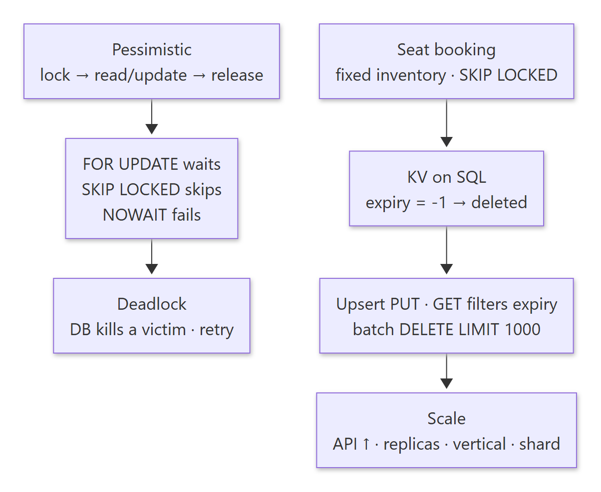

Diagram source (Mermaid)

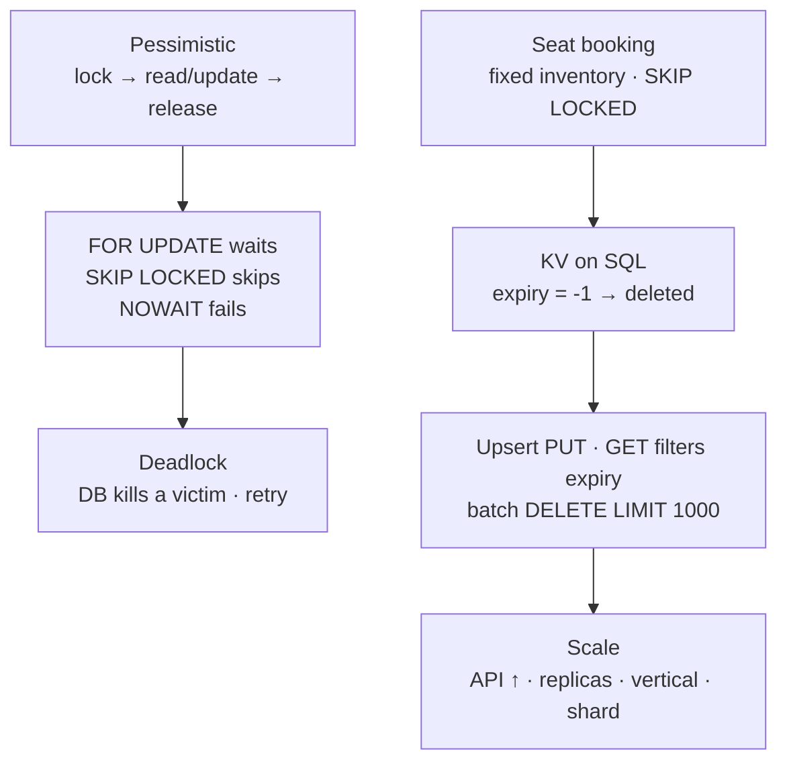

