# 02-02 · Arpit Bhayani's session notes: Non-relational databases + Slack's realtime text communication

> Source: `02-02.pdf` (System Design Masterclass, Google Drive, view-only). Study notes in my own words,
> not a copy. Pages covered: 1–19 of 19. Unreadable pages: none.

## Map of the session

<!-- diagram:f4-01 -->
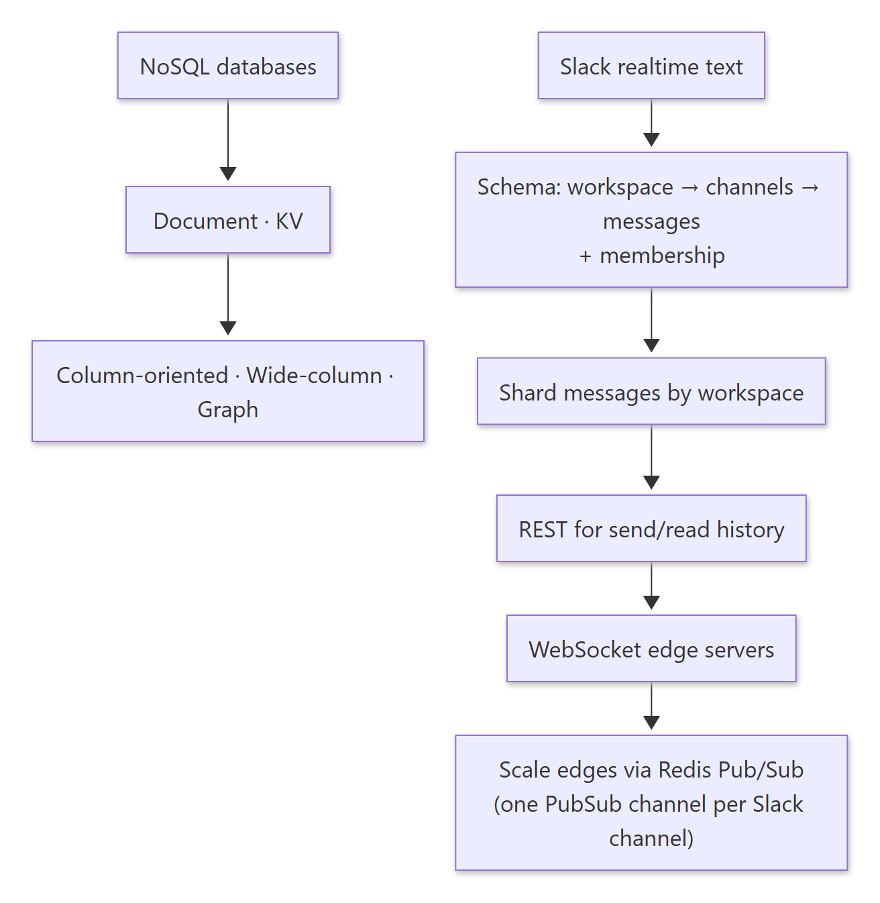

Diagram source (Mermaid)

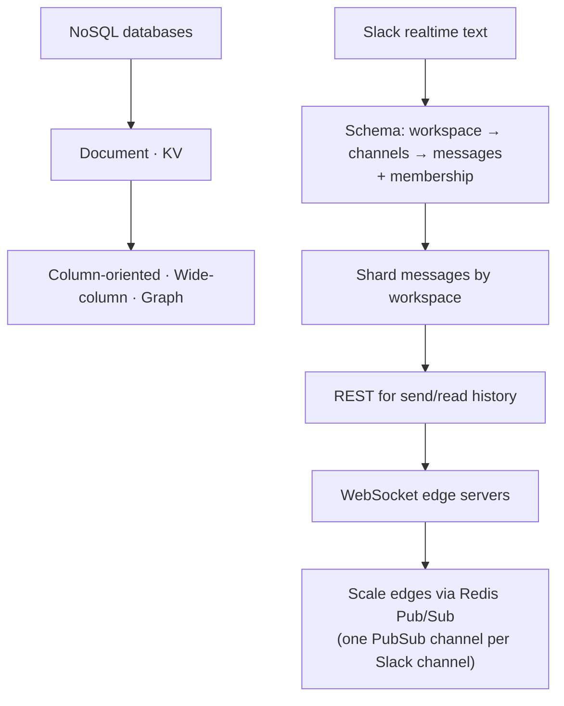

Agenda: **Non-relational databases · Designing Slack's realtime (text) communication.**

---

## 1. Non-relational (NoSQL) databases

> 🧠 Anchor: NoSQL usually trades **consistency** for **scalability and availability**, so most are **eventually consistent**. But "NoSQL scales" does **not** mean "SQL doesn't".

- Data is structured non-relationally.
- Logic check from the slides: *a → b* does not imply *¬a → ¬b*. **Anything that can be sharded scales**, SQL included.

| Type | Shape | Strengths | Examples |
|---|---|---|---|
| **Document** | Mostly JSON docs | Complex queries; **partial updates** to a document; closest to relational | MongoDB, Elasticsearch |
| **Key-value** | key → value | Key-wise access; heavily partitioned; **no complex queries** | Redis, DynamoDB, Aerospike |
| **Column-oriented** | Each column stored contiguously | Analytics: reads only the columns in the query | Redshift (data warehouses) |
| **Wide-column** | Column families; a family's columns stay together on disk across rows | Huge write-heavy tables, flexible columns | Cassandra |
| **Graph** | Nodes + edges | Social behaviour, recommendations, **fraud detection** | Neo4j, Neptune, Dgraph, TigerGraph |

### 1.1 Row-oriented (OLTP) vs column-oriented (OLAP)

> 🧠 Anchor: `SELECT avg(price) WHERE ts = …` on a 100-column table needs **2 columns**. A row store reads all 100 and throws away 98.

<!-- diagram:f4-02 -->
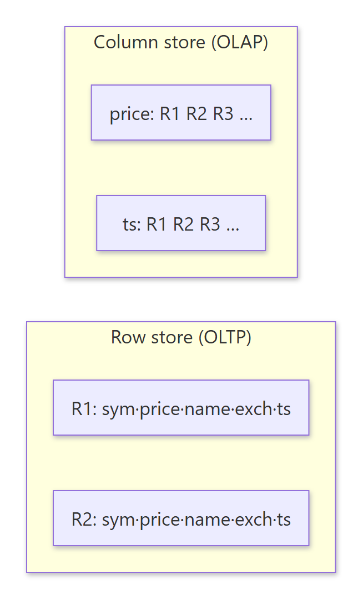

Diagram source (Mermaid)

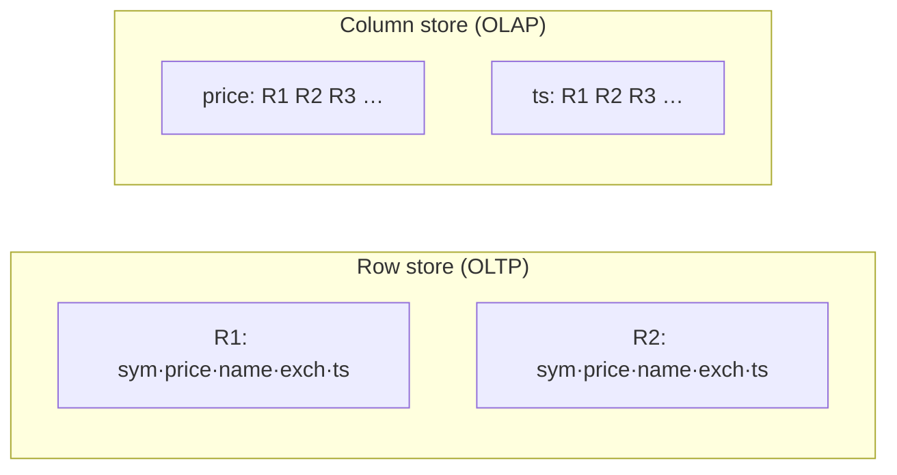

- A column store reads only the columns in the query and doesn't even skim the others. That's why it suits **massive analytics and data warehouses** (e.g. Redshift).

**Post-reads and exercises:**
1. The C-Store paper (*C-Store: A Column-Oriented DBMS*).
2. Load data into Neo4j and paginate 1,000 entries.
3. Read how Redshift stores data (AWS docs).
4. Load sample data into MongoDB and Elasticsearch, then try aggregations and facets.

🔁 Recall: Why is a column store faster for analytics?

Analytic queries touch few columns over many rows. A column store reads only those columns' contiguous blocks (and compresses them well); a row store must read every full row.

🔁 Recall: Name a graph DB use case the slides call "solid".

Fraud detection (also social behaviour modelling and recommendations).

---

## 2. Designing Slack's realtime text communication

**Requirements:** multiple users, multiple channels · users DM, or message in a channel · realtime chat · scroll back through historical messages.

**Similar systems:** realtime chat, interactions, realtime polls, creator tools.

**Brainstorm topics:** channels, messages, checkpoints, realtime communication (membership). The hard parts:
1. Message persistence and fan-out
2. Socket membership, both realtime and semi-persistent
3. Realtime messages that fail to deliver
4. Edge servers are exposed directly on the internet

### 2.1 Data model

> 🧠 Anchor (Insight 1): **A DM is just a channel with two people.** Model channels well and DMs come free.

| workspace | channels | messages | membership |
|---|---|---|---|
| id, name | id, workspace_id, name, type (dm/group) | id, channel_id, user_id, message, ts | channel_id, user_id, **checkpoint** (last message id read) |

- An early draft queried DMs by sender and receiver (`WHERE sender = ? AND receiver = ? OR …`). Treating a DM as a channel removes that whole special case: `SELECT * FROM messages WHERE channel_id = ? ORDER BY created_at DESC`.
- `membership` can also hold per-user settings: is_pinned, is_muted, notification prefs, last_active_at.

### 2.2 Where messages live

> 🧠 Anchor: There will be a **lot** of messages, so use a **sharded DB, sharded by workspace**. All of one workspace's messages sit in one shard, so scrolling never needs a cross-shard query.

- Pick any DB you can shard (DynamoDB and Cassandra both fit). Shards are mutually exclusive.
- Access pattern: **range queries** on a channel's history, plus point updates and deletes.

### 2.3 Persistence comes first: three ways to deliver messages

> 🧠 Anchor (Insight 2): Slack is an **enterprise** product, so **persisting** a message matters more than delivering it instantly.

| # | Strategy | Example |
|---|---|---|
| 1 | **Persistence first**, then deliver | Slack |
| 2 | Realtime delivery first + **async persistence** | WhatsApp (also persists locally on the device) |
| 3 | Realtime, **no persistence** | Zoom chat |

### 2.4 The APIs (REST)

- `send_message(from_user, channel, text)`: the API server finds the right shard from the channel and stores the message there. Works for DMs and channels alike.
- `read_messages(channel_id)`: return the most recent messages, then page backwards through older ones on that shard.
- But **REST short polling is a poor UX** for something as realtime as messaging, so we need something better.

### 2.5 Realtime: WebSocket edge servers

> 🧠 Anchor: **One WebSocket per user** to our infra, multiplexing **all** realtime traffic. A fleet of **edge servers** holds those sockets.

- WebSockets are **persistent TCP** connections and they're **expensive**, and browsers limit them. So multiplex every kind of realtime traffic (chat, notifications, etc.) over **one** connection.
- Any service that needs to push to a user goes **through the edge servers**.
- Each edge server keeps a **local connection pool**: it knows which users are connected to it and how to reach them (Socket.IO manages this). For A → B on the same edge server: find B in the local pool and send.
- In Slack's case, the messaging service talks to the edge servers to deliver to recipients.

<!-- diagram:f4-03 -->
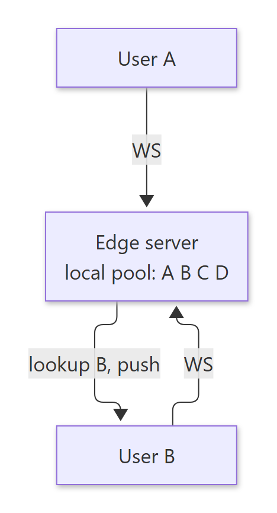

Diagram source (Mermaid)

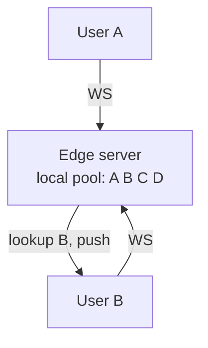

### 2.6 What if a realtime message is missed?

1. Every so often, the client calls the API to fetch the last ~50 messages and renders them, just in case some were missed.
2. The **checkpoint** (last message id read) won't have advanced, so the client asks for anything newer than it.

### 2.7 Scaling edge servers: bridge them with Pub/Sub

> 🧠 Anchor: Don't connect every edge server to every other one. **Each Slack channel gets one Pub/Sub channel**, and an edge server **subscribes** to the channels its users belong to.

- Say each edge server holds 4 users. The 5th user connects to another server. A → B works through the local pool, but **A → E** only works if the message reaches edge server 2. We have to bridge the gap.
- Full mesh between servers? With 100 edge servers that's a terrible idea.
- **Realtime Pub/Sub (Redis):**
  - A is in (c1, c2, c3), B in (c2, c4, c5), C in (c1, c3), D in (c4). So edge server 1 subscribes to c1–c5.
  - E joins, is in c3, and lands on edge server 2. Edge server 2 subscribes to c3.
  - A publish to c3 reaches **both** servers, and each pushes to its local members.

<!-- diagram:f4-04 -->
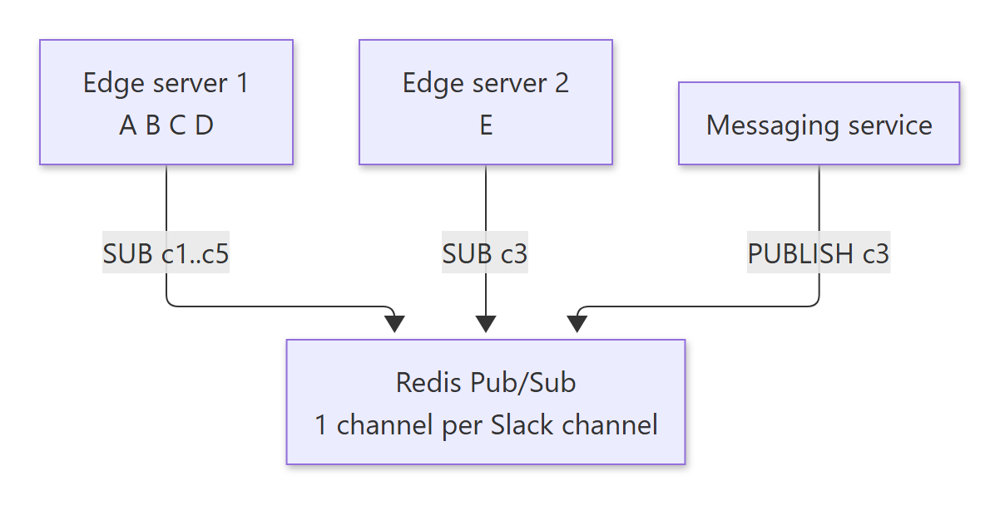

Diagram source (Mermaid)

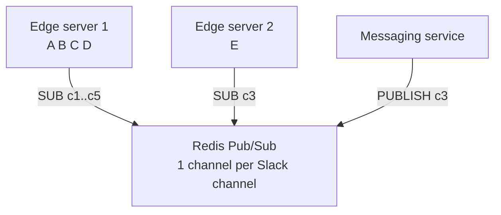

### 2.8 How many TCP connections can a box hold?

- A TCP connection is identified by `<src ip (32b), src port (16b), dst ip (32b), dst port (16b), protocol>`.
- Between one client IP and one server ip:port there can be at most ~65,535 connections, because only the source port varies. Across many clients the tuple differs, so a server isn't capped at 65k. Adding NICs/IPs (**dual-NIC** edge boxes) raises per-pair limits too.

### 2.9 Overall architecture

<!-- diagram:f4-05 -->
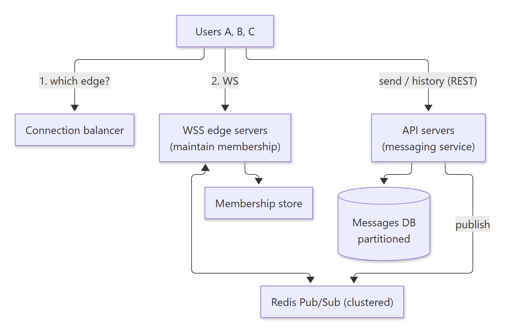

Diagram source (Mermaid)

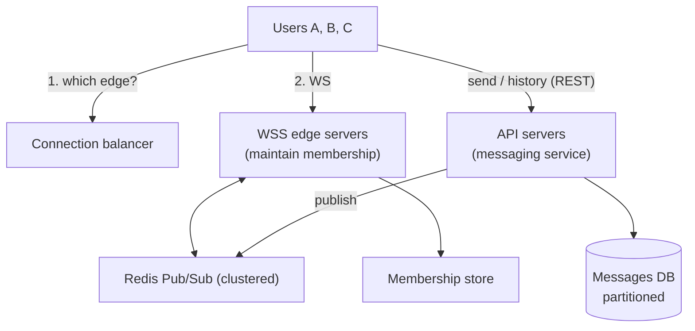

- A **connection balancer** tells a client which edge server to connect to. Edge servers are "naked" on the internet, or sit behind an L4 load balancer with stickiness.
- Edge servers maintain membership (user ↔ channel subscriptions).
- The API servers (messaging service) persist first, then publish to Redis Pub/Sub for realtime fan-out.

🔁 Recall: Why model DMs as channels?

A DM is a channel with two members. One schema, one query path (`WHERE channel_id = ?`), one fan-out mechanism. No sender/receiver OR queries.

🔁 Recall: Why shard messages by workspace?

All of a workspace's channels live on one shard, so history scrolling and channel queries never cross shards. Workspaces are naturally isolated.

🔁 Recall: How does a message from A (edge 1) reach E (edge 2)?

The messaging service publishes to the Redis Pub/Sub channel for that Slack channel. Edge 2 is subscribed because E is a member, so it receives the message and pushes it down E's WebSocket.

---

## What these notes add beyond the slides

- **Redis Pub/Sub is fire-and-forget.** If an edge server is disconnected at publish time, it never sees the message. That's why the slides' fallbacks (periodic fetch, checkpoint) are essential, not optional. For stronger delivery, use Redis Streams or Kafka.
- **Workspace sharding has a hot-spot risk:** one giant enterprise workspace can outgrow a shard. Real systems add sub-sharding (by channel) for the largest tenants.
- **The 65,535 limit is about source ports per (src ip, dst ip:port) pair.** On a server, the practical caps are file descriptors and memory per connection, not 65k.

## One-page memory card

<!-- diagram:f4-06 -->
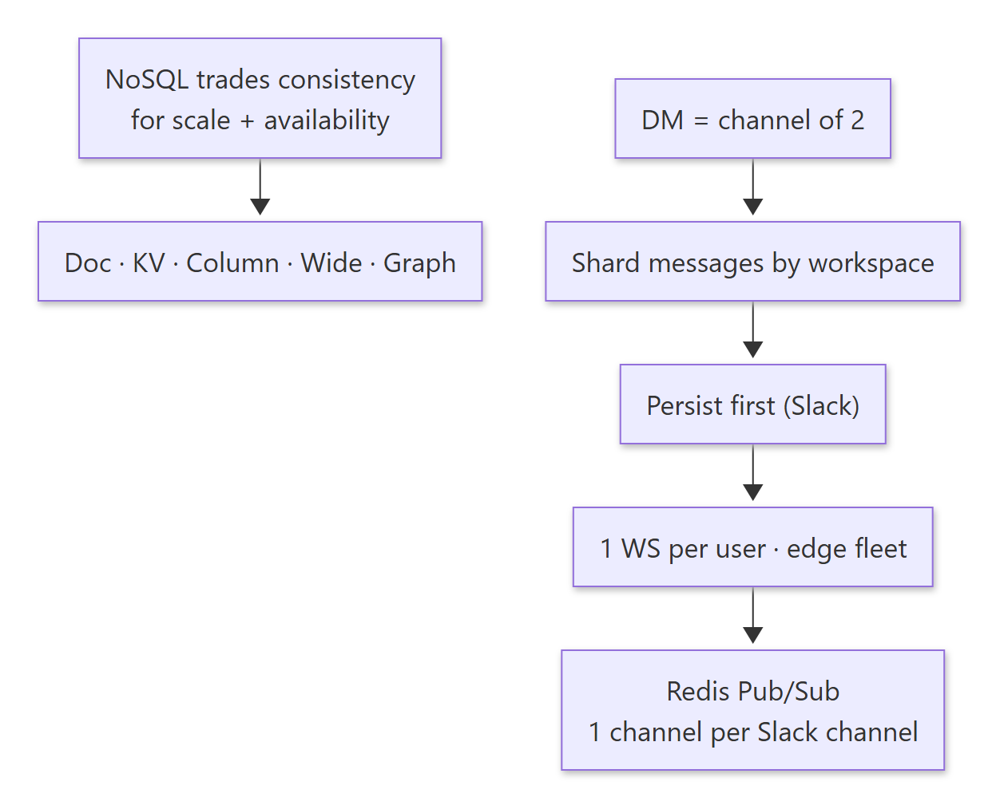

Diagram source (Mermaid)

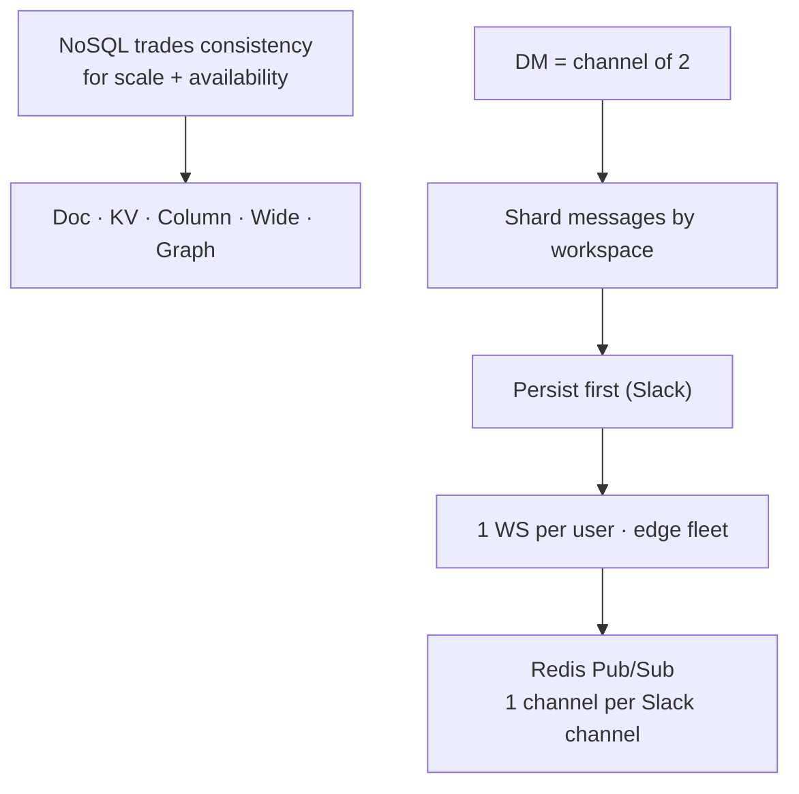

