# 03-01 · Arpit Bhayani's session notes: Distributed systems, Load balancer design, Remote & distributed locks

> Source: `03-01.pdf` (System Design Masterclass, Google Drive, view-only). Study notes in my own words,
> not a copy. Pages covered: 1–21 of 21. Unreadable pages: none.
> Page 5 is a whiteboard summary of the whole LB design; it's covered piece by piece below.

## Map of the session

<!-- diagram:f5-01 -->
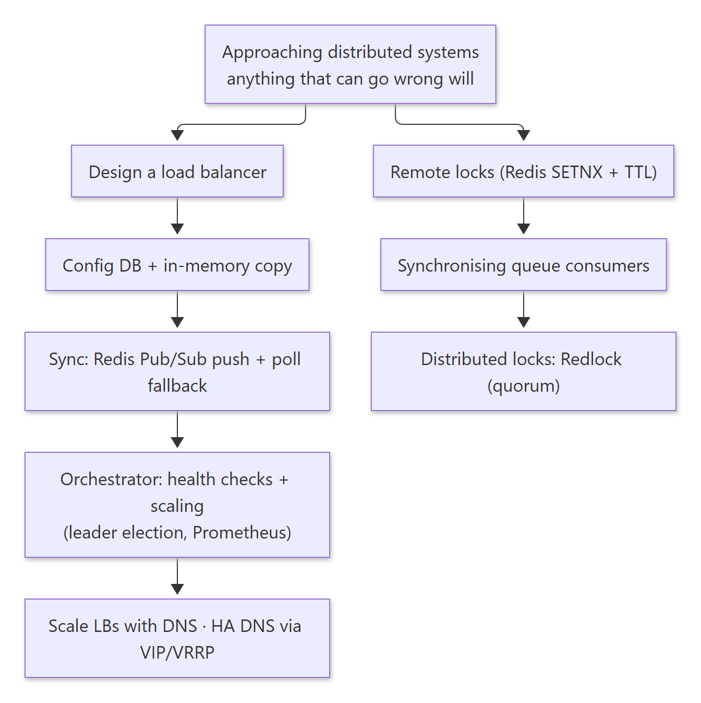

<details><summary>Diagram source (Mermaid)</summary>

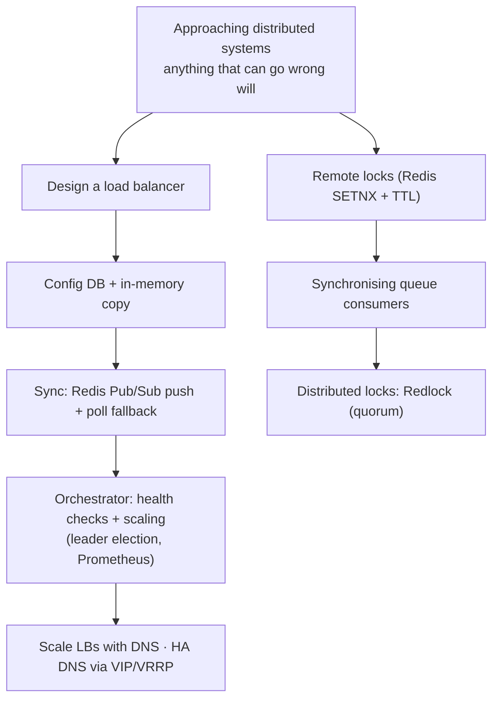

</details>

Agenda: **Approaching distributed systems · Designing a load balancer · Remote and distributed locks · Synchronising consumers.**

---

## 1. Approaching distributed systems

> 🧠 Anchor: **"Anything that can go wrong will go wrong."** This is both the best and the worst thing about distributed systems, and designing *for* it is the key to a good one.

- A distributed system = many components on many machines, working as **one coherent system** to solve a bigger problem.
- For every component, ask: what if it's down, slow, or partitioned? Then design the fallback.

---

## 2. Designing a load balancer

> 🧠 Anchor: We take LBs for granted, but they're among the most important components in any system. **Absorb the patterns used here to achieve high availability**; they recur everywhere.

**Why an LB:** fault tolerance; no over-loaded server.
**Requirements:** balance the load · tunable algorithm · scale beyond one machine.
**Terminology:** *LB server* (the balancer) and *backend server* (what it forwards to).
**Brainstorm:** LB configuration, config sync, admin console, monitoring, scaling, availability.

### 2.1 Configuration

- Each LB needs config: algorithm, backend server list, health endpoint, poll frequency, etc.
- Store **config per LB** in a **configuration DB**. A simple KV works: `lb_id → { b_servers: [...], algo: "..." }`.
- Calling the DB on every request would be catastrophic for latency, so **keep an in-memory copy on each LB server** and keep it in sync.

### 2.2 Keeping config in sync

> 🧠 Anchor: **Push for speed, poll as a safety net.**

| Approach | How |
|---|---|
| Pull | A CRON job on each LB server re-reads the config periodically |
| Push (reactive) | The LB console writes the config DB, then publishes a change on **Redis Pub/Sub**; LB servers update immediately |

<!-- diagram:f5-02 -->
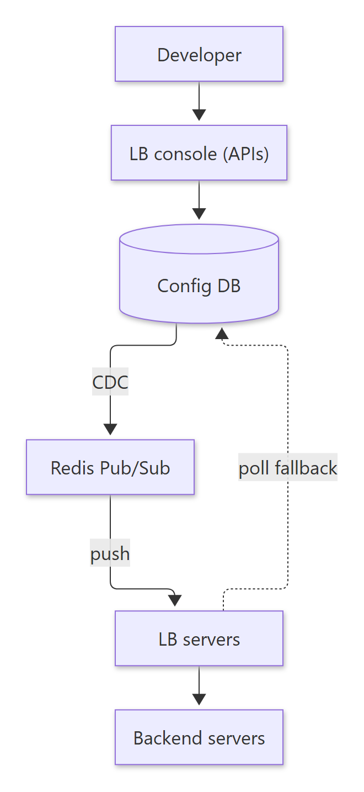

<details><summary>Diagram source (Mermaid)</summary>

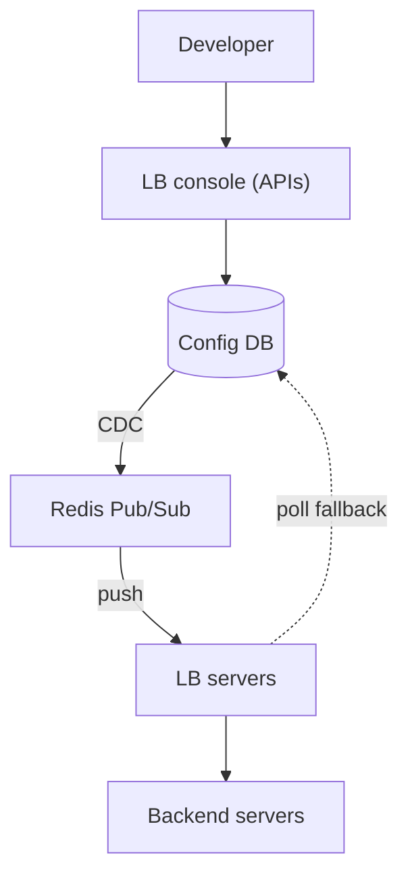

</details>

**Availability questions:**
1. **Redis Pub/Sub down?** Fall back to polling until it's back.
2. **Config DB down?** Use a replica. The config is already cached on each LB anyway, so only *config updates* are affected; reads keep working.
3. **What about the LB servers themselves?** See the orchestrator.

### 2.3 Orchestrator (focused responsibilities)

> 🧠 Anchor: The orchestrator **watches health** (backends and LB servers) and **scales** LB servers. It writes changes to the DB, and CDC/Pub/Sub carries them out to the LBs.

- Keeps an eye on the **health of backend servers**. If one is unhealthy, it updates the backend list in the DB, and that change reaches the LB servers through Pub/Sub.
- Monitors the **LB servers'** health and **scales them up and down**.
- Health check example: `GET /health` should return 200 OK, polled every ~15 s.
- Read: **φ-accrual failure detection** (gives a suspicion *level* instead of a binary up/down).

**Who monitors the orchestrator?** It recovers itself through **leader election**:
- An orchestrator **master** monitors the workers and assigns them **mutually exclusive** work.
- **Workers** do the grunt work: heartbeats and monitoring.
- If the master dies, the workers elect a new one (e.g. coordinated through ZooKeeper).

**How does it decide to scale LB servers?** On CPU, memory and number of TCP connections. Where's that data? A **monitoring component (Prometheus)**. LB servers and backends export CPU/mem/network metrics; the orchestrator queries Prometheus. The same metrics can be shown to customers in the LB console.

### 2.4 Scaling the LB tier itself: DNS

> 🧠 Anchor: What is shared and scales well? **DNS.** Put many LB servers behind one domain name.

- `lb.payments.google.com` → DNS returns one of 10.0.0.1 / 10.0.0.2 / 10.0.0.3, **balancing resolutions by weight**.
- Run your own **CoreDNS** in private infra. It just resolves names to IPs, so it's very lightweight (~**32K RPS on a 4 GB machine**), and clients cache the result, which means even fewer requests.
- This is a common pattern across many systems: route to the right geo, or hide multiple replicas behind one name.
- At AWS scale you don't run one LB infra for everything; you **shard** it.

### 2.5 High availability for DNS: Virtual IP

> 🧠 Anchor: **Two DNS servers share one Virtual IP.** If the primary dies, the secondary takes over the VIP, and **no client config changes.**

<!-- diagram:f5-03 -->
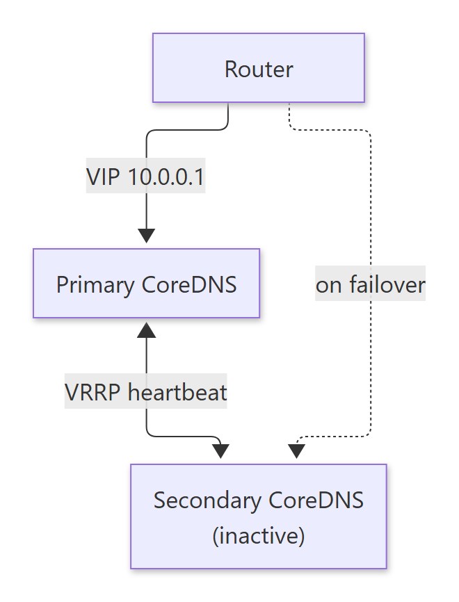

<details><summary>Diagram source (Mermaid)</summary>

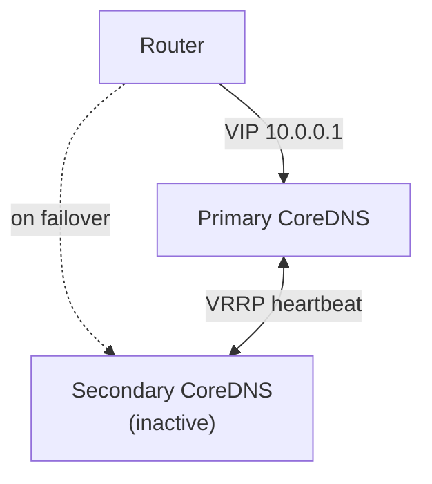

</details>

- **VRRP** (protocol) + **ARP** (announce the new MAC for the VIP) + **VIP**. The VIP is configured at the instance, router, firewall, etc.
- When the secondary detects the primary is down, it "takes over" the VIP.
- Read: **Anycast + BGP** (many machines advertising the same IP; BGP requires authorisation, since only authorised networks can advertise certain prefixes) and VRRP for redundancy and failover.

### 2.6 Final LB architecture

<!-- diagram:f5-04 -->
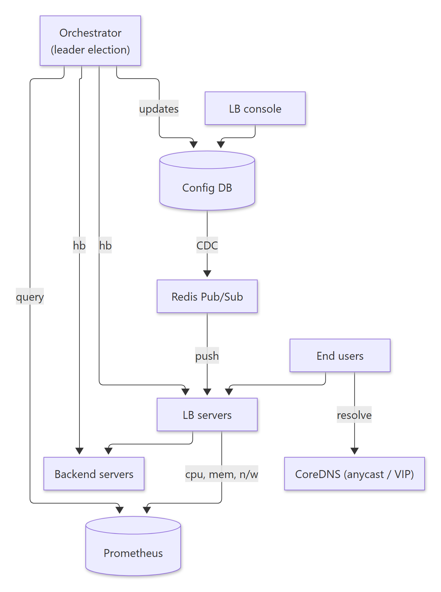

<details><summary>Diagram source (Mermaid)</summary>

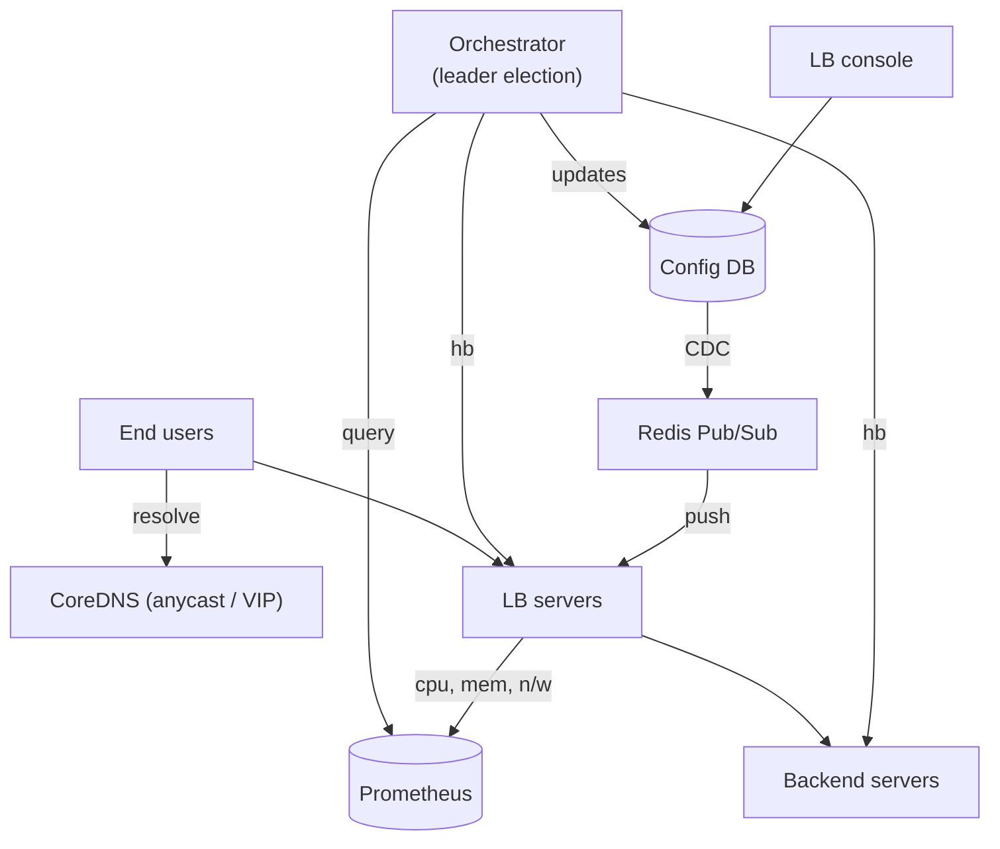

</details>

**Reads:** *Maglev: A Fast and Reliable Software Network Load Balancer* (Google) · Anycast as a load-balancing feature · φ-accrual failure detection.

<details><summary>🔁 Recall: How do LB servers get config fast and safely?</summary>

Each LB keeps an in-memory copy. Changes are pushed via config DB → CDC → Redis Pub/Sub. If Pub/Sub is down, LBs poll. If the config DB is down, the cached copy keeps traffic flowing and only updates pause.
</details>

<details><summary>🔁 Recall: How do you scale the LB tier and make DNS highly available?</summary>

Weighted DNS (CoreDNS) spreads clients across many LB servers. DNS itself runs as primary + secondary sharing a Virtual IP via VRRP; on failure the secondary claims the VIP (ARP), so clients change nothing.
</details>

<details><summary>🔁 Recall: Who watches the orchestrator?</summary>

It recovers itself: a master assigns mutually exclusive work to workers, and leader election picks a new master if it fails.
</details>

---

## 3. Remote locks

> 🧠 Anchor: Threads sync with **mutex/semaphore**, processes with **disk** (lock files), machines with a **remote lock** held by a central **lock manager**.

- Example of a process-level lock: `apt-get upgrade` can't run twice at the same time (it holds a lock file).

### 3.1 Synchronising consumers over an unprotected remote queue

- A message broker queue with **no protection**: we want **only one consumer** to read from it at a time.
- Consumer pseudocode: `ACQ_LOCK()` → `READ_MSG()` (process and delete) → `REL_LOCK()`. Everyone else waits on `ACQ_LOCK`.

**What we need from the lock manager:**
- **Atomic operations**, so two machines can't both acquire.
- **Automatic expiration**, so a crashed holder can't lock everyone out forever.

So: Redis or DynamoDB. Redis is the popular choice because it's in-memory and fast. Store `queue_id → consumer_id` with an expiry, e.g. `q7: consumer2 [EX 300]`, meaning consumer 2 holds the lock for at most 5 min.

```text
acquire_lock(q):
    me = get_my_id()
    loop:
        if redis.set(q, me, nx=True, ex=300): return     # SET if Not eXists + TTL
        # else retry

release_lock(q):              # must be ATOMIC: run as one Lua script via EVAL
    if redis.get(q) == me: redis.delete(q)
```

- Why check-then-delete in Lua? If the lock expired and someone else took it, a plain `DEL` would delete **their** lock. The `get == me` check and the delete must happen atomically.
- Where else? **MongoDB transactions** use locks on the rows they touch.

<details><summary>🔁 Recall: Two properties a lock manager must have?</summary>

Atomic acquire (SETNX-style, so only one wins) and automatic expiry (TTL, so a crashed holder doesn't deadlock everyone).
</details>

<details><summary>🔁 Recall: Why must release be a Lua script?</summary>

"Read the owner, then delete" must be atomic. Otherwise you can delete a lock that expired and was re-acquired by someone else.
</details>

---

## 4. Distributed locks: Redlock

> 🧠 Anchor: Take the remote lock and **distribute it**: **5 independent Redis masters**, and you hold the lock only if you win a **majority (> 50%)** of them.

<!-- diagram:f5-05 -->
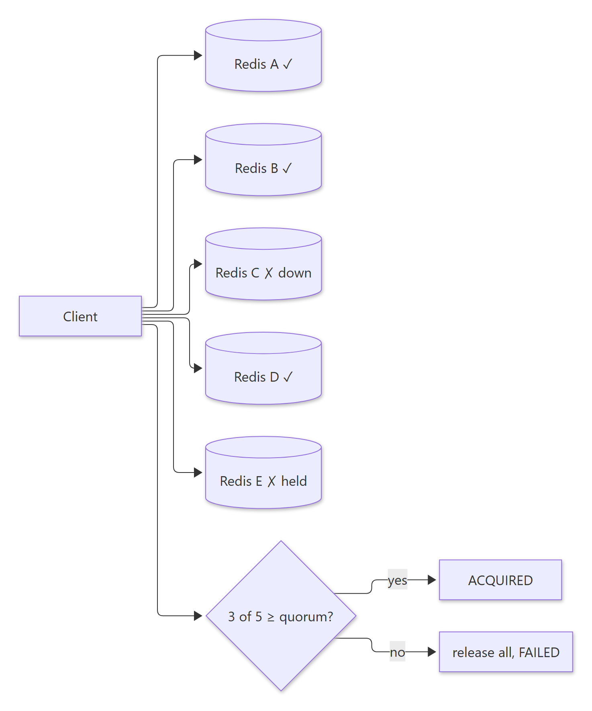

<details><summary>Diagram source (Mermaid)</summary>

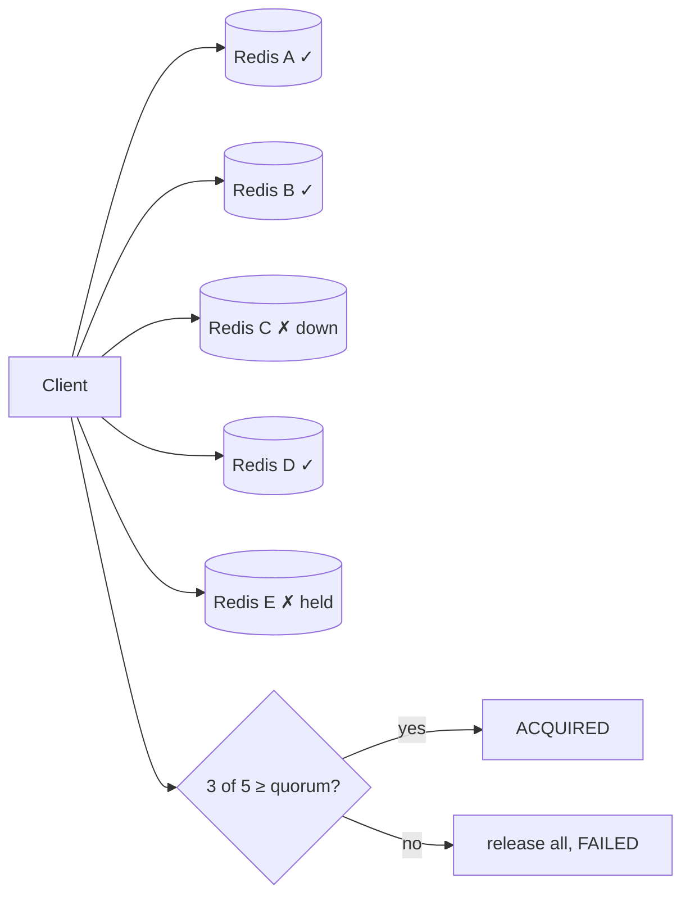

</details>

- 5 Redis master nodes, **no replication, all independent**.
- Acquire: try `SETNX` (with a timeout) on all 5. If acquired on **> 50%**, the lock is **acquired**. Otherwise release the ones you got and return **failed**.

```text
quorum = ceil(len(servers) / 2)        # 3 of 5
acquired = sum(r.set(q, me, nx=True, ex=300) for r in servers)
if acquired >= quorum: return OK
for r in servers: r.eval("if get(q) == me then del(q)")   # release
```

**Why bother? There's no single point of failure.** The trade-off:

| Setup | Throughput | Correctness | Availability |
|---|---|---|---|
| Single Redis | ↑ | ↑ | ↓ (SPOF) |
| Master + async replica | ↑ | ↓ (a lock can be lost on failover) | ↑ |
| Redlock (N independent) | ↓ | ↑ | ↑ |

- **Consensus always slows things down** (think of picking a restaurant with your friends). Lock-acquire time grows with the number of Redis nodes and with the number of competing clients.

**Reads:** *Chubby: lock service for loosely coupled distributed systems* · Martin Kleppmann's critique of Redlock and the reference implementation · distributed transactions / 2PC · JunoDB, DragonflyDB.
**Exercises:** simulate distributed locks with threads; build a load balancer.

<details><summary>🔁 Recall: How does Redlock decide a lock is held?</summary>

The client tries SETNX + TTL on N independent Redis masters. If it wins a strict majority (e.g. 3 of 5) within the timeout, it holds the lock; otherwise it releases what it got and fails.
</details>

<details><summary>🔁 Recall: Why not just use one Redis master + replica for locks?</summary>

Replication is async. The master can grant a lock, crash before replicating, and the promoted replica grants the same lock to someone else, which loses correctness.
</details>

---

## What these notes add beyond the slides

- **TTL locks need fencing tokens.** If a consumer pauses (GC, slow I/O) longer than the 300 s TTL, its lock expires, another consumer acquires it, and **both** act. Kleppmann's fix: the lock service hands out a monotonically increasing **fencing token**, and the protected resource rejects writes carrying an older token. Redlock alone doesn't provide this, and that's the core of his critique.
- **Redlock depends on bounded clock drift** across nodes, since TTLs are wall-clock based. Chubby/ZooKeeper/etcd use consensus plus sessions instead.
- **Busy-wait in `acquire_lock`:** the loop spins on Redis. Add backoff with jitter (or BLPOP-style waiting) to avoid hammering the lock manager.
- **Arithmetic checked:** quorum = ceil(5/2) = 3 ✔ (> 50% of 5).

## One-page memory card

<!-- diagram:f5-06 -->
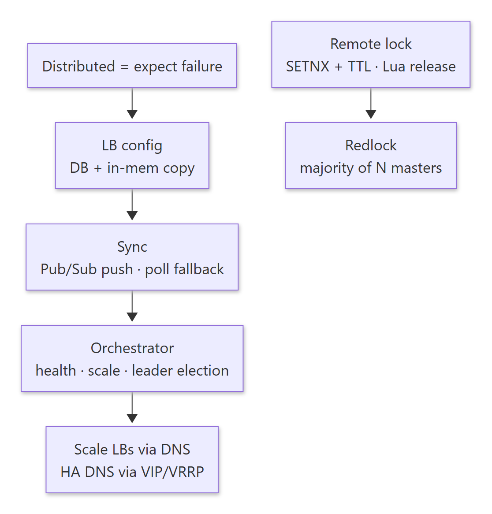

<details><summary>Diagram source (Mermaid)</summary>

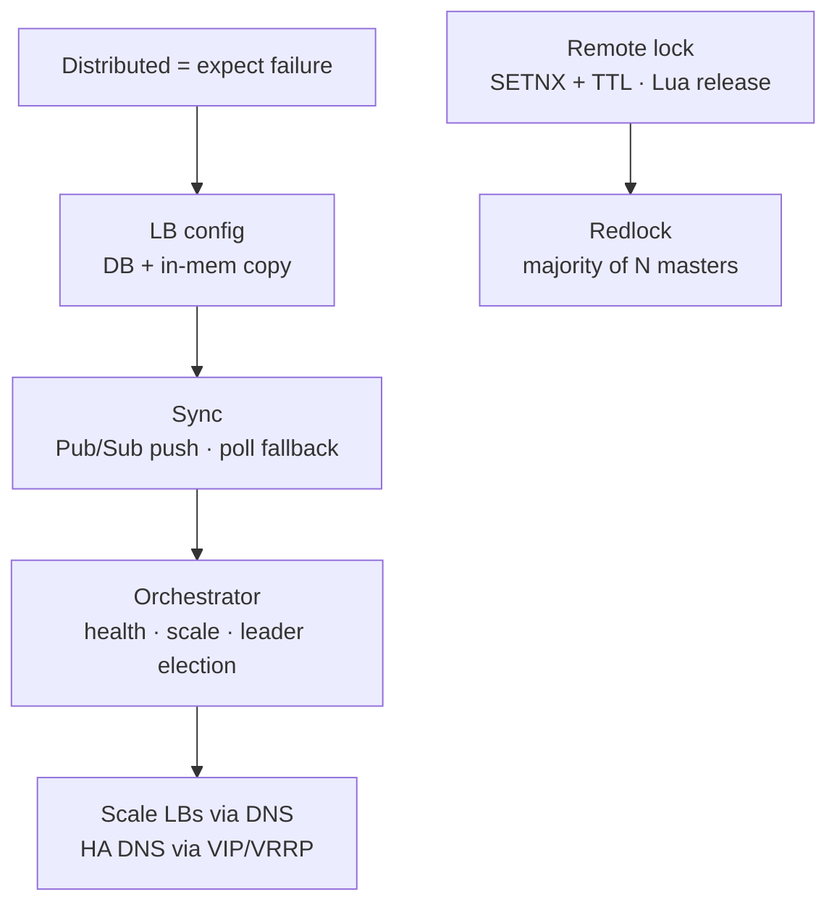

</details>
