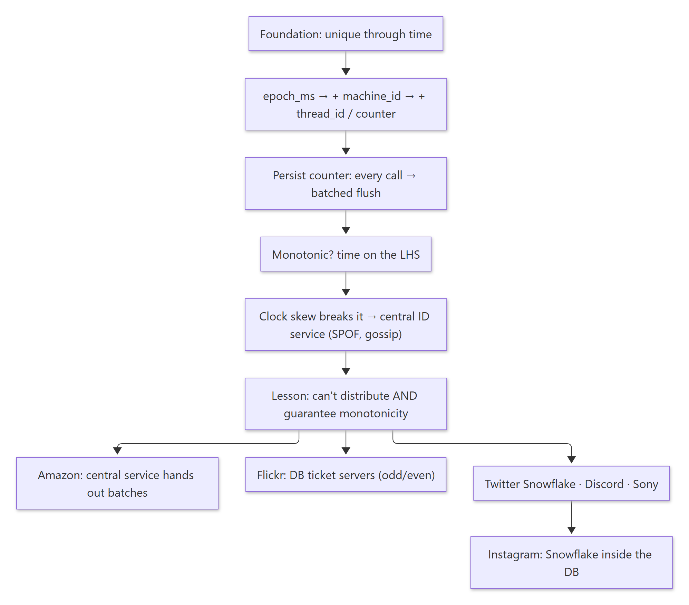
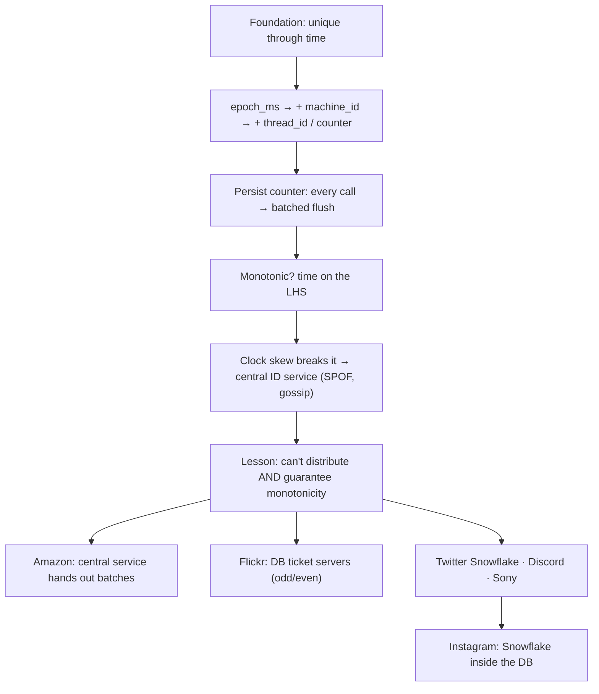
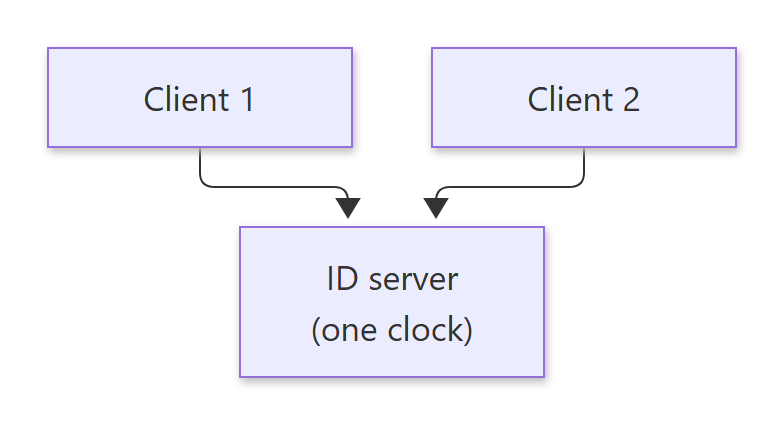
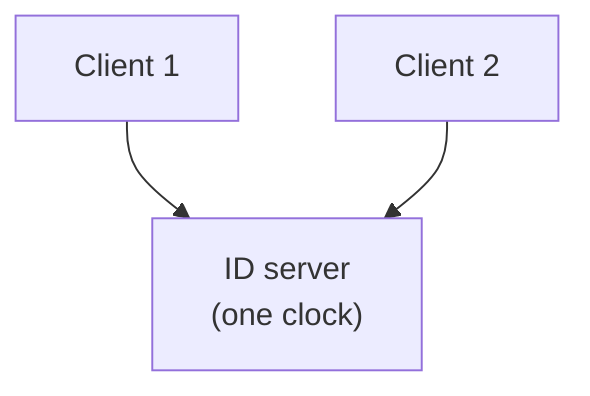
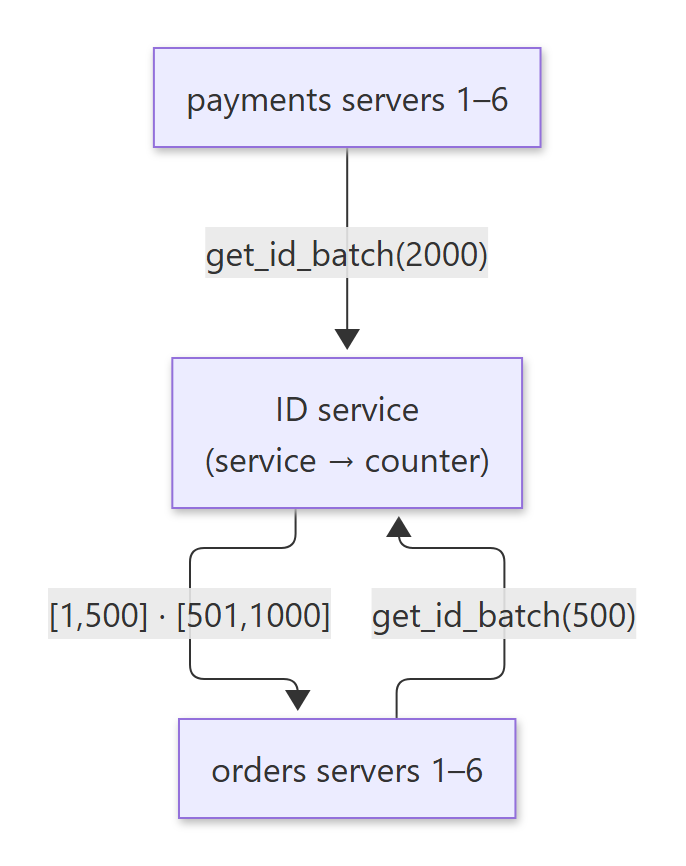
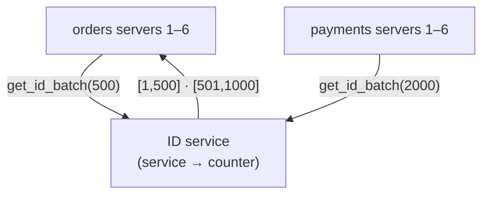
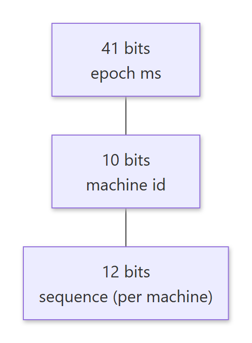
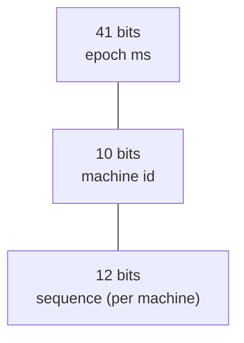
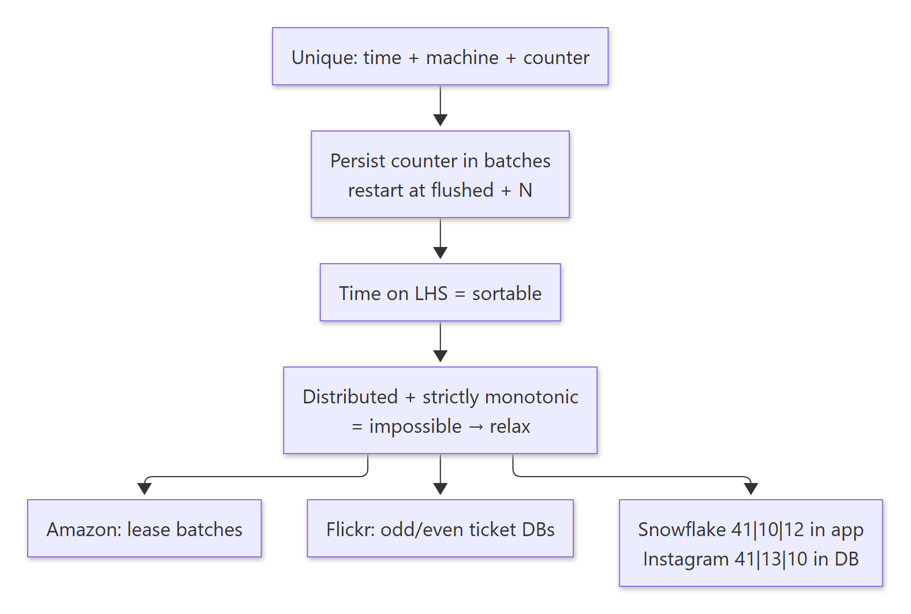
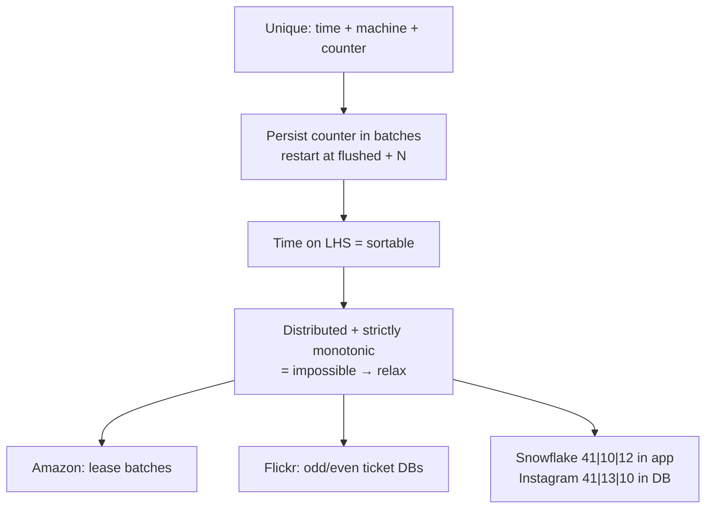

# 03-02 · Arpit Bhayani's session notes: ID generation (from a function to Snowflake)

> Source: `03-02.pdf` (System Design Masterclass, Google Drive, view-only). Study notes in my own words,
> not a copy. Pages covered: 1–23 of 23. Unreadable pages: none.

## Map of the session

<!-- diagram:f6-01 -->


<details><summary>Diagram source (Mermaid)</summary>



</details>

Agenda: **Foundation for ID generation · Monotonically increasing IDs · Central ID generation service · Database ticket servers · Twitter's "insane" idea · Instagram bettering it.**

---

## 1. The problem

> 🧠 Anchor: **Write a function that returns something unique every time it's called**, as part of the *application logic*, not a central service.

- An ID gives uniqueness to an object, row, document or event.
- **Why do we need it?** In a sharded database with independent shards (no replication), each shard's **auto-increment will collide** with the others. So instead of relying on the DB, the application **provides the ID at insert time**.

---

## 2. Building the function step by step

> 🧠 Anchor: Each fix answers "what collides now?": same ms → same machine → same thread → restart.

| Version | ID = | Breaks when |
|---|---|---|
| 1 | `epoch_ms()` (time always moves forward) | Two machines, or two calls within the same ms |
| 2 | `machine_id + epoch_ms` | Two threads on one machine in the same ms |
| 3 | `machine_id + thread_id + epoch_ms` | (alternative: a counter that resets every few minutes) |
| 4 | `machine_id + epoch_ms + counter++` (atomic) | Time is now redundant… |
| 5 | `machine_id + counter++` | Counter is in memory: a **restart regenerates the same IDs** |
| 6 | Save the counter to disk on every call | Correct, but **a disk I/O per ID** |
| 7 | **Flush every N calls** (batching) and **skip ahead by N on restart** | ✅ Safe and fast |

### 2.1 Batched flush + safe recovery

> 🧠 Anchor: On restart, **start from `last_flushed + N`**. You may skip some IDs, but you'll never repeat one.

- `counter = load() + 1000`. Under a mutex: `counter++`; if `counter % 1000 == 0`, `save_counter()`.
- Worked example with flush every 3: IDs 1, 2, **3 (flush)**, 4, 5, **6 (flush)**, 7, 8, **crash**. Disk says 6. Restart at **6 + 3 + 1 = 10**, which is safe. 7 and 8 were used, and 9 is skipped harmlessly.
- Use `O_SYNC` (or fsync) so the flushed value really is on disk.

<details><summary>🔁 Recall: Why restart at last_flushed + N + 1?</summary>

Up to N IDs may have been issued after the last flush and before the crash. Jumping past all of them guarantees no reuse; the cost is a few skipped IDs.
</details>

---

## 3. Monotonically increasing IDs

> 🧠 Anchor: **Put time on the left (most significant bits).** Then sorting by ID = sorting by time ("sortability"); the right side only breaks ties.

- Why monotonic? **Conflict resolution**: who came first? If T1 sets a = 20 and T2 sets a = 30, which one wins?
- Swap `machine + time` for **`time + machine`**. The LHS decides the order; the RHS (counter or machine id) breaks ties: `1729 0002`, `1729 0001`, `1730 0002`…
- **All ID generation algorithms put time on the LHS.**

### 3.1 Clock skew breaks it

- Clocks across machines drift. At the same instant, m2 says 23, m4 says 24, m7 and m9 say 23. The IDs come out `232, 244, 237, 239`: **not monotonic**.
- So now we're really talking about **clock synchronisation**, not ID generation.

### 3.2 Central ID service: fixes skew, adds new problems

<!-- diagram:f6-02 -->


<details><summary>Diagram source (Mermaid)</summary>



</details>

- One server runs the same `get_id`, so there's one clock and the IDs are monotonic. **But it's a SPOF**: the server or its disk can fail.
- Several ID servers behind an LB? Now they must **gossip to agree on a value**. The whole thing gets super complicated.

### 3.3 The lesson

> 🧠 Anchor: **There's no way to distribute ID generation and still guarantee monotonicity** (at high throughput). Real systems **relax a constraint**: non-integer IDs, or no strict monotonicity.

<details><summary>🔁 Recall: Why put the timestamp in the most significant bits?</summary>

Numeric order then matches creation order (sortable, roughly monotonic). Lower bits only break ties within the same millisecond.
</details>

---

## 4. Real-world approaches

### 4.1 How long do 64 bits last?

- At 500 IDs/s × 100 services: 500 × 100 × 86,400 = **4.32 billion IDs/day**.
- 2⁶⁴ ÷ 4.32 × 10⁹ ≈ **4.3 billion days**. That's effectively forever.

### 4.2 Amazon's way: a central service that hands out **batches**

> 🧠 Anchor: Don't call the ID service per ID. **Lease a range** (`[1, 500]`) and hand IDs out locally until it runs out.

<!-- diagram:f6-03 -->


<details><summary>Diagram source (Mermaid)</summary>



</details>

- The service keeps a counter per *service* (orders: 0 → 500 → 1000…). Each app server asks for a batch (500, 1000, 2000…) and asks again when it's exhausted.

### 4.3 Why not just UUIDs?

> 🧠 Anchor: **If your indexes don't fit in memory, your DB can't be fast.**

- UUIDs are **128-bit** (16 B) vs a 4 B int: bigger indexes, more disk I/O on lookups.
- They're **random**, so inserts land all over the B+ tree. That's bad for index locality, though randomness is good for security (not guessable).
- **MongoDB ObjectId**: 12 bytes = 4 B epoch seconds + 5 B random + 3 B counter. Time is on the LHS, but it's still 96 bits, so it doesn't index as well as a 64-bit int.

### 4.4 Flickr: database ticket servers

- Flickr's DB was sharded, and they needed globally unique IDs without UUIDs (which index badly).
- A **central ticket server** on MySQL: whoever wants an ID runs a query against it.

```sql
CREATE TABLE tickets (
  id   BIGINT UNSIGNED NOT NULL AUTO_INCREMENT,
  stub CHAR(1) NOT NULL DEFAULT '',
  PRIMARY KEY (id), UNIQUE KEY (stub)
);
-- one row ('a'); bump it to get the next auto-increment value:
INSERT INTO tickets (stub) VALUES ('a')
  ON DUPLICATE KEY UPDATE id = id + 1;
```

- The idea: deleting and re-inserting the single row makes MySQL generate the next auto-increment `id`. DELETE + INSERT in one transaction works but is expensive, so use an **upsert**.
- **Upserts in MySQL:** `INSERT … ON DUPLICATE KEY UPDATE` (updates the row in place) vs `REPLACE INTO` (deletes the old row and inserts a new one; the session cites it as ~**32× slower**). Both are atomic.
- **SPOF fix:** two ticket servers, one issuing **odd** and one **even** IDs, round-robin between them. If one goes down, the other keeps serving (e.g. 2, 4, 6, … 200, 202).

### 4.5 Twitter Snowflake

> 🧠 Anchor: **41 bits ms-time | 10 bits machine | 12 bits per-machine counter**, generated **inside each app server** as a library call.

<!-- diagram:f6-04 -->


<details><summary>Diagram source (Mermaid)</summary>



</details>

- Used for tweet IDs; also adopted by Discord and Instagram.
- **Not a central service.** It runs in the API servers as a native function: the ID is computed while the tweet is stored.
- **Roughly sortable**: the first 41 bits are ms, so IDs move forward every ms. You can fetch objects before or after a time, or before or after an ID.
- **Pagination:** Twitter doesn't use `LIMIT/OFFSET`. It uses `since_id` ("I've read up to this tweet, give me the next set"). That's extremely efficient (it seeks straight into the index), and sharded DBs use the same approach.
- **Discord**: same logic, but the epoch is the first second of 2015, which gives a longer usable time range.
- **Sony**: *Sonyflake*, an open-source Go implementation.
- Why it scaled Twitter: **decentralised**. No moving parts, no service, just a function call, and no extra load on the DB.

### 4.6 Instagram: Snowflake inside the database

> 🧠 Anchor: **41 bits ms since 2011 | 13 bits logical shard id | 10 bits per-shard sequence**, computed by a **PL/pgSQL function** as the column default at INSERT.

- Requirements: sortable by time (pagination, filtering, batch processing), ~64 bits to stay efficient on indexes, **no new service**.
- Instagram runs **thousands of logical shards** on **a handful (10–15) of physical DB servers**. A logical shard is just a separate database/schema on a server (the slide shows `CREATE DATABASE` on MySQL; Instagram itself used Postgres schemas). Moving a logical shard to a new server is a dump and restore.

```text
id BIGINT NOT NULL DEFAULT insta5.next_id()

next_id():
  seq_id   := nextval('insta5.table_id_seq') % 1024      -- 10 bits
  result   := (now_ms - custom_epoch) << 23              -- 41 bits time (shifted past 13+10)
  result   |= shard_id << 10                             -- 13 bits shard (5 here)
  result   |= seq_id                                     -- 10 bits sequence
```

**Exercises:**
1. Implement Snowflake both in the API and in the DB (as a stored procedure).
2. Create shards `insta_1 … insta_5` on one DB server, create a `posts` table, run `ALTER TABLE` across every shard, then stand up a second DB server and move one shard to it with a dump and restore.

<details><summary>🔁 Recall: Snowflake vs Instagram bit layout?</summary>

Snowflake: 41 ms | 10 machine | 12 sequence (in the app). Instagram: 41 ms | 13 logical shard | 10 sequence (in a Postgres function at INSERT).
</details>

<details><summary>🔁 Recall: How do Flickr's ticket servers avoid a SPOF?</summary>

Two MySQL ticket servers, one generating odd and one even IDs (auto-increment offset/step), with clients round-robining. Either can serve alone if the other fails.
</details>

<details><summary>🔁 Recall: Why does since_id pagination beat LIMIT/OFFSET?</summary>

OFFSET makes the DB walk past and discard N rows. `WHERE id > since_id LIMIT k` seeks directly in the index, so the cost stays constant however deep you page.
</details>

---

## What these notes add beyond the slides

- **Arithmetic corrections:**
  - The slide divides 2⁶⁴ by 4.32 × 10⁹ and gets "4,611,686,018 days". 2⁶⁴ ÷ 4.32 × 10⁹ ≈ **4.27 × 10⁹ days** (≈ 4.6 × 10⁹ is 2⁶² ÷ 10⁹). Either way it's millions of years, so the conclusion stands.
  - UUID vs int: 16 B vs 4 B is **4×** larger keys, not 3× (vs an 8 B BIGINT it's 2×).
- **Snowflake is 1 + 41 + 10 + 12 = 64 bits.** The top sign bit is kept 0 so IDs stay positive in signed int64. 41 bits of ms ≈ 69 years from the custom epoch, and 12 bits = 4,096 IDs per ms per machine.
- **Clock going backwards** (NTP correction) can produce duplicate Snowflakes. Real implementations refuse to generate, or wait, until the clock passes the last-seen timestamp.
- **Instagram's sequence is per table/shard**, so two shards can share a sequence value. Uniqueness comes from the shard bits.

## One-page memory card

<!-- diagram:f6-05 -->


<details><summary>Diagram source (Mermaid)</summary>



</details>
