# 04-01 · Arpit Bhayani's session notes: CDN, Photo uploads at scale, Private photos, Gravatar

> Source: `04-01.pdf` (System Design Masterclass, Google Drive, view-only). Study notes in my own words,
> not a copy. Pages covered: 1–19 of 19. Unreadable pages: none.
> The agenda also lists "Dynamic OG images"; the slides only mention it as a demo (GitHub, Reddit, Dev.to) on the last page.

## Map of the session

<!-- diagram:f7-01 -->
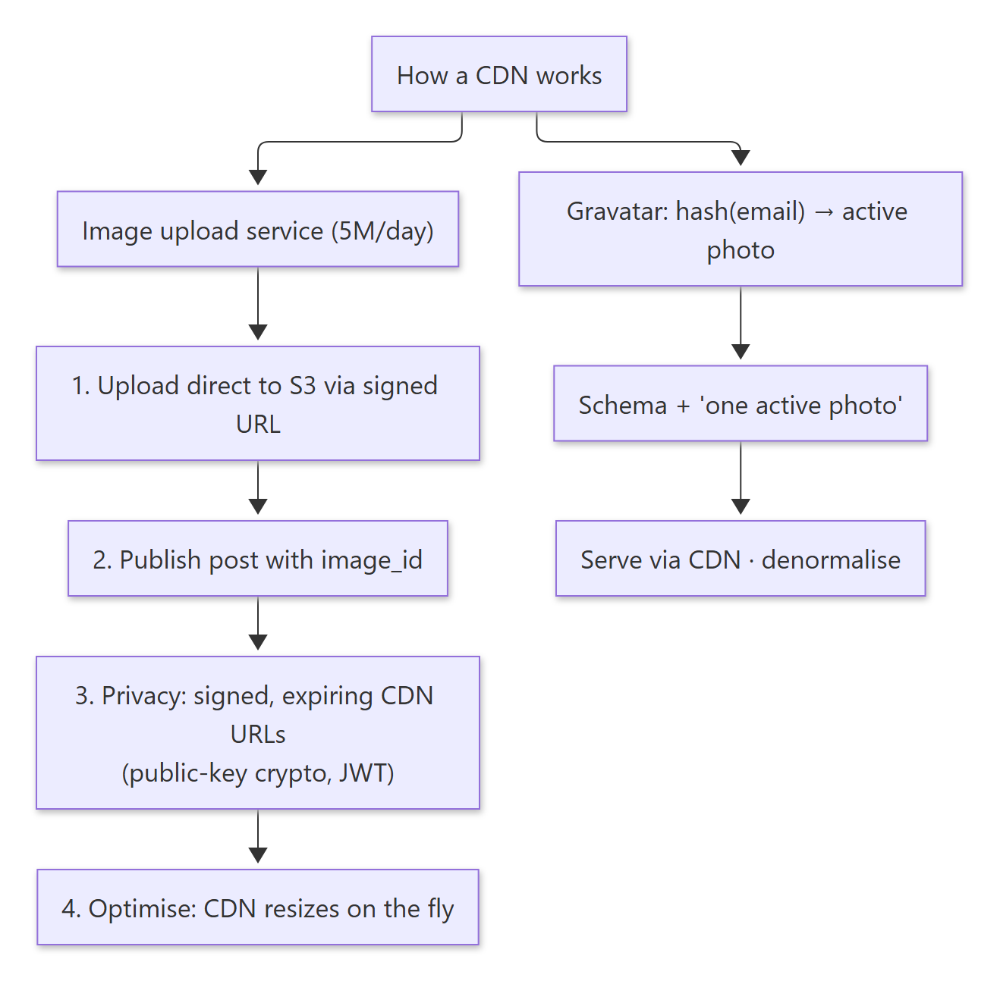

Diagram source (Mermaid)

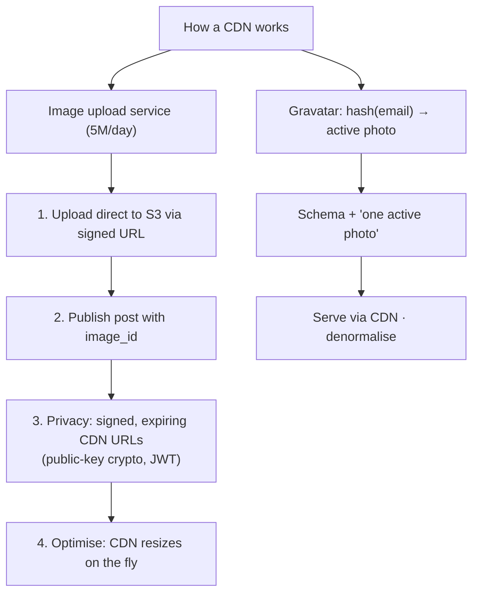
```mermaid
flowchart TB
    A["How a CDN works"] --> B["Image upload service (5M/day)"]
    B --> B1["1. Upload direct to S3 via signed URL"]
    B1 --> B2["2. Publish post with image_id"]
    B2 --> B3["3. Privacy: signed, expiring CDN URLs<br/>(public-key crypto, JWT)"]
    B3 --> B4["4. Optimise: CDN resizes on the fly"]
    A --> C["Gravatar: hash(email) → active photo"]
    C --> C1["Schema + 'one active photo'"]
    C1 --> C2["Serve via CDN · denormalise"]
```

Agenda: **How a CDN works · Uploading photos at scale · Private photos and public-key cryptography · Gravatar · Dynamic OG images.**

---

## 1. How a CDN works

> 🧠 Anchor: A CDN **sits transparently between users and your origin**. It has its own domain, forwards a miss to the origin, **caches** the response, and returns it.

<!-- diagram:f7-02 -->
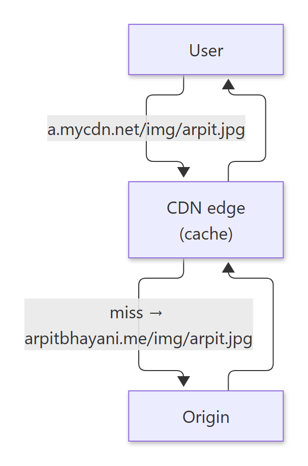

Diagram source (Mermaid)

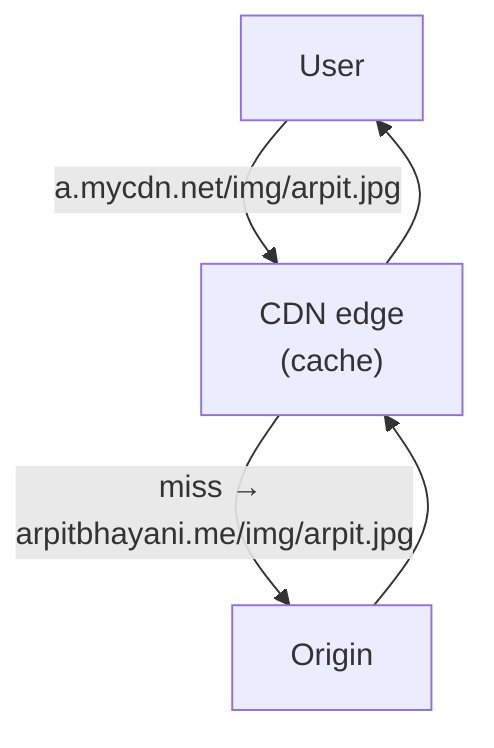
```mermaid
flowchart TB
    U["User"] -- "a.mycdn.net/img/arpit.jpg" --> CDN["CDN edge<br/>(cache)"]
    CDN -- "miss → arpitbhayani.me/img/arpit.jpg" --> O["Origin"]
    O --> CDN --> U
```

- Origin: `https://arpitbhayani.me`, serving anything (JSON, bytes, images, HTML, video).
- The CDN's own domain, e.g. `a.mycdn.net`, is configured to map to that origin.
- The user hits `a.mycdn.net/img/arpit.jpg`. The CDN finds the origin for `a.mycdn.net`, forwards the request to `arpitbhayani.me/img/arpit.jpg`, **caches it** and returns it. The next user is served from cache.
- The session builds a toy CDN to make this concrete. **Exercise:** sign up for Cloudflare, configure a CDN, and explore its features.

---

## 2. Image upload service

**Requirement:** 5M photo uploads per day.
**Brainstorm:** storage, data flow, separation of concerns, privacy, extensibility, optimisation.
**Key question: should the upload go through your API server?** **No.**

### 2.1 Why not proxy uploads through the API

> 🧠 Anchor: user → API → S3 **doubles the bandwidth**, and the API server just relays bytes, burning CPU, memory, network and disk for nothing.

<!-- diagram:f7-03 -->
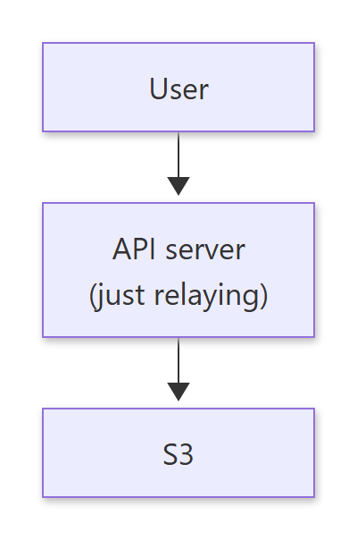

Diagram source (Mermaid)

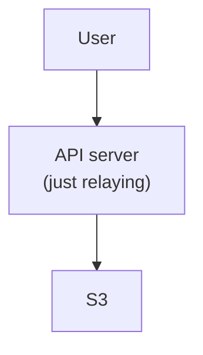
```mermaid
flowchart TB
    U["User"] --> API["API server<br/>(just relaying)"] --> S3["S3"]
```

### 2.2 Step 1: upload straight to S3 with a signed URL

> 🧠 Anchor: **Ask for permission, then upload directly.** The image service hands out a **pre-signed S3 URL** for one path; the client PUTs the bytes to S3.

<!-- diagram:f7-04 -->
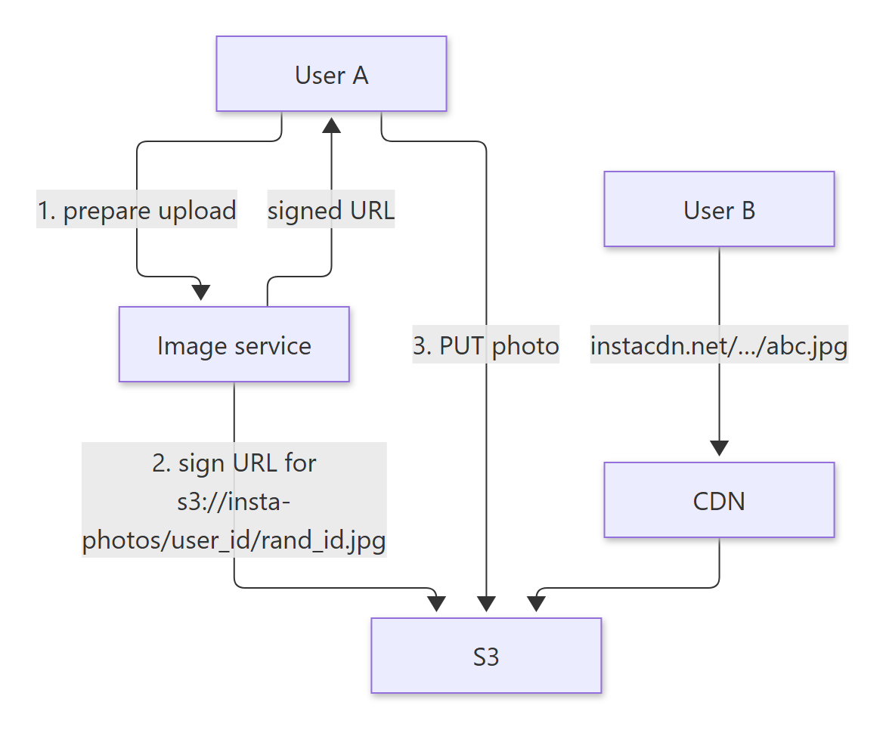

Diagram source (Mermaid)

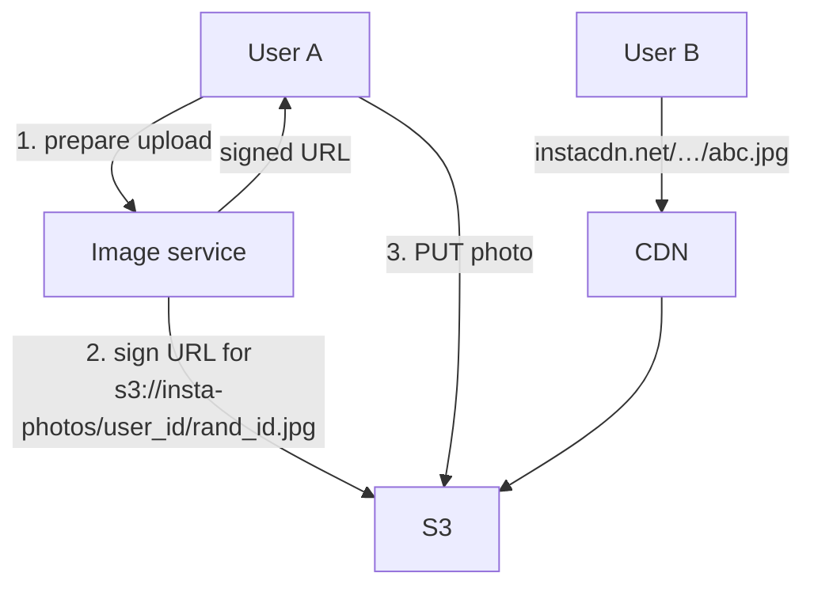
```mermaid
flowchart TB
    A["User A"] -- "1. prepare upload" --> IS["Image service"]
    IS -- "2. sign URL for<br/>s3://insta-photos/user_id/rand_id.jpg" --> S3["S3"]
    IS -- "signed URL" --> A
    A -- "3. PUT photo" --> S3
    B["User B"] -- "instacdn.net/…/abc.jpg" --> CDN["CDN"] --> S3
```

1. User A tells the **image service** it wants to upload.
2. The image service generates a **random image id** and asks S3 for a **signed URL** that lets *anyone holding it* upload to that exact path, e.g. `s3://insta-photos/<user_id>/<random_photo_id>.jpg`.
3. User A uploads **directly** to S3, and the file lands at that path.
4. Other users view it through the CDN (`instacdn.net/...`), which fetches from S3.

### 2.3 Step 2: publish the post

- The client remembers the **random image_id** it got and creates the post: `posts(id, user_id, image_id, caption)`. (LinkedIn and CDNs work the same way.)
- The photo's S3 path can be computed: `s3://insta-images/<user_id>/<image_id>`. No `img_url` column is needed, which saves space.
- The **posts service can validate** that the `image_id` belongs to the same user.
- The image service and posts service could even be the same process. On publish, the posts service emits to **Kafka**, and search, notifications and analytics consume it.

<!-- diagram:f7-05 -->
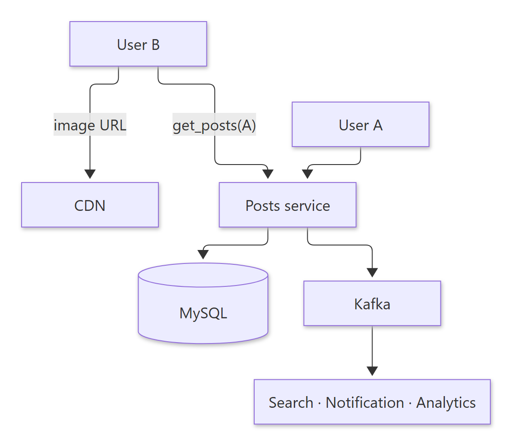

Diagram source (Mermaid)

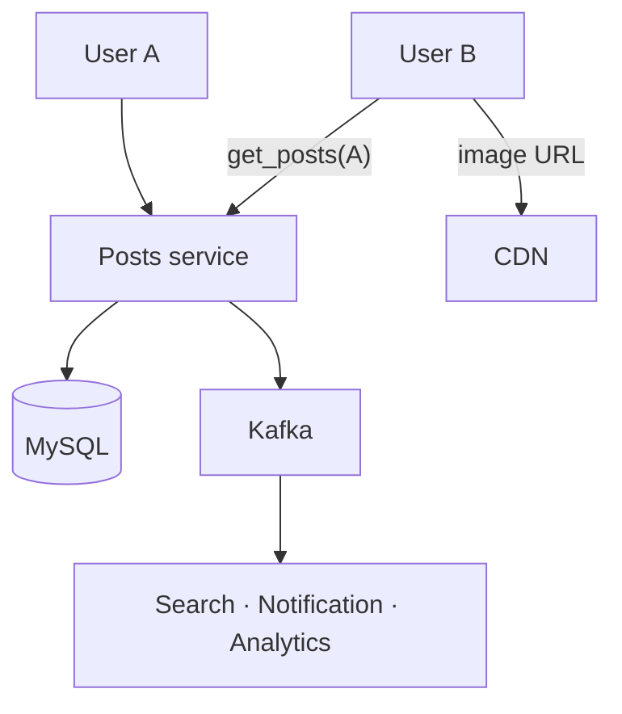
```mermaid
flowchart TB
    A["User A"] --> PS["Posts service"] --> DB[("MySQL")]
    PS --> K["Kafka"] --> O["Search · Notification · Analytics"]
    B["User B"] -- "get_posts(A)" --> PS
    B -- "image URL" --> CDN["CDN"]
```

### 2.4 Step 3: privacy (are Instagram's private photos really private?)

> 🧠 Anchor: **No, but nearly.** Every photo URL carries a **timed signature**. The CDN checks it; if it's invalid or **expired**, the URL stops working.

- URL shape: `https://instacdn.net/…/1729_4275.jpg?ig_cache_key=…&oh=…&oe=…&nc_sid=…`.
- When an `` tag requests it, the **CDN validates** the attached keys. Valid and not expired: return the image. Otherwise: bad URL.
- URLs are **short-lived** because the certificates/signatures behind them are short-lived. A leaked URL soon dies.

### 2.5 Public-key cryptography and JWT

> 🧠 Anchor: **Sign with a private key in one place; verify with the public key anywhere.** No call back to the issuer is needed.

<!-- diagram:f7-06 -->
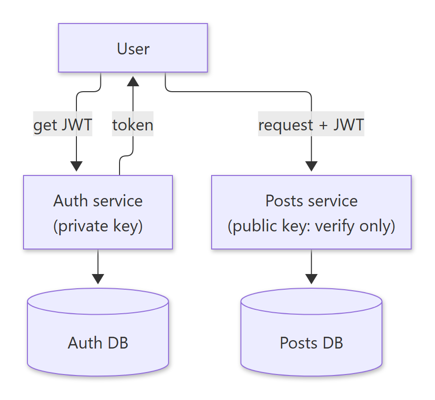

Diagram source (Mermaid)

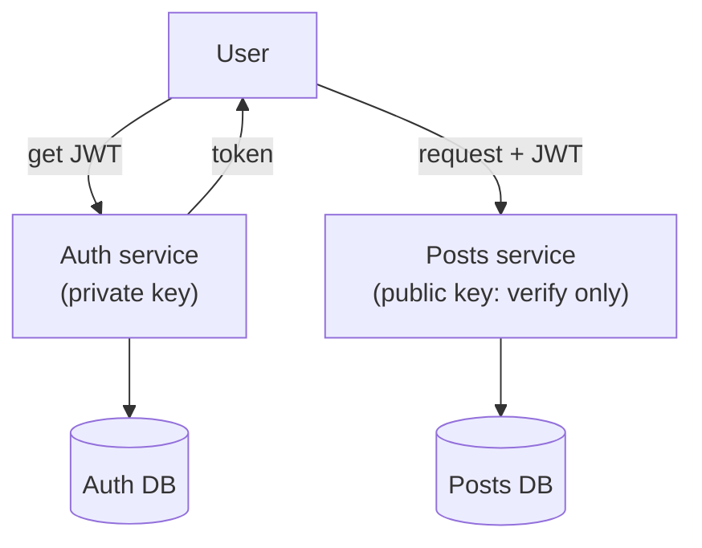
```mermaid
flowchart TB
    U["User"] -- "get JWT" --> AU["Auth service<br/>(private key)"] --> ADB[("Auth DB")]
    AU -- "token" --> U
    U -- "request + JWT" --> PS["Posts service<br/>(public key: verify only)"] --> PDB[("Posts DB")]
```

- A JWT is **header** (`alg`, `typ`) + **payload** (`sub`, name, `exp`, …) + **signature** over header·payload.
- The posts service **doesn't need to ask the auth service** whether a token is valid. Verifying the signature is all it needs.
- General rule: **when system A can't (or shouldn't) call system B but still needs to trust B's word, think public-key cryptography.**

### 2.6 Step 4: image optimisations

> 🧠 Anchor: Don't send a celebrity's 5 MB photo to every follower. Let the **CDN transform on the fly**: `…/1729_4275.jpg?w=360`.

- Users differ in geography, bandwidth, devices and processing power, so serve a resolution that suits their stats.
- Instead of building your own image optimiser, use the CDN's feature: it loads the original, resizes to 360 px, **caches the variant**, and serves it.
- **Exercise:** try image transformations on Cloudflare (or similar).

🔁 Recall: Why upload via signed URL rather than through your API?

Proxying doubles bandwidth and wastes API CPU, memory and network on relaying bytes. A signed URL lets the client upload straight to S3 for one exact path, with time-limited permission.

🔁 Recall: How are "private" Instagram photos protected?

The CDN URL carries a short-lived signature. The CDN verifies it on each request and rejects invalid or expired ones, so a shared link stops working soon after.

🔁 Recall: Why can a service verify a JWT without calling the auth service?

The auth service signs with its private key; anyone with the public key can verify the signature and expiry locally.

---

## 3. Gravatar

> 🧠 Anchor: **One embeddable URL for your profile picture everywhere:** `gravatar.com/avatar/{hash(email)}`.

- `hash("arpit@gmail.com") = 0eafd172` → `` renders the **current** profile picture.
- **Requirements:** a user can upload multiple pictures and mark one as active; the active one is returned.

### 3.1 Schema

| users | photos |
|---|---|
| id, email, hash | id, user_id, is_active |

- **Partial index** (PostgreSQL) on `(user_id, is_active) WHERE is_active = true`. It's tiny, because only active rows are indexed.

### 3.2 Flows

<!-- diagram:f7-07 -->
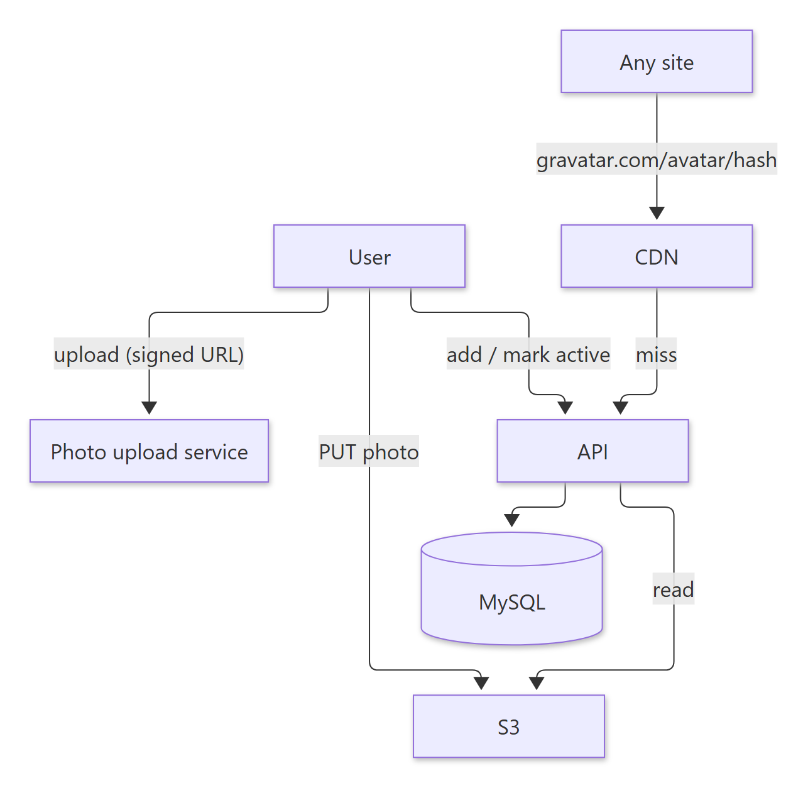

Diagram source (Mermaid)

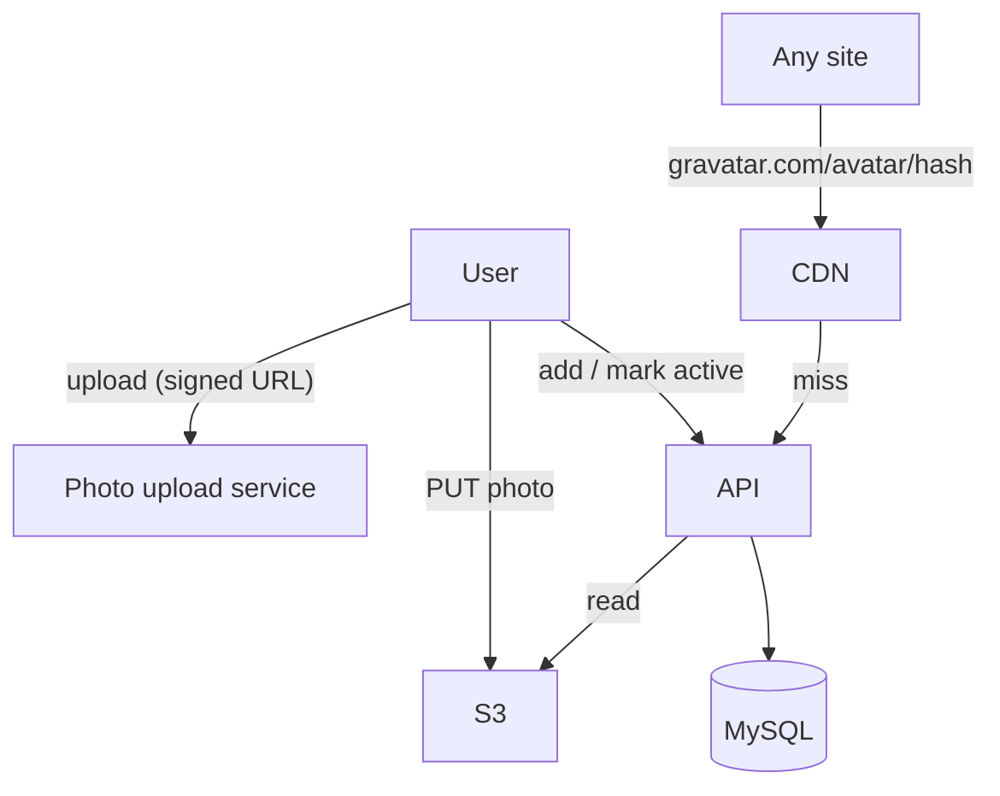
```mermaid
flowchart TB
    U["User"] -- "upload (signed URL)" --> PUS["Photo upload service"]
    U -- "PUT photo" --> S3["S3"]
    U -- "add / mark active" --> API["API"] --> DB[("MySQL")]
    U2["Any site"] -- "gravatar.com/avatar/hash" --> CDN["CDN"] -- "miss" --> API
    API -- "read" --> S3
```

1. **Upload**: same pattern as before. Ask the photo upload service for a random id + signed URL for `s3://gravatar-images/{user_id}/{random_photo_id}`, then upload to S3.
2. **Register**: `POST` to add the photo to the `photos` table.
3. **Mark active** (in one transaction):
   `UPDATE photos SET is_active = false WHERE user_id = ? AND is_active = true;`
   `UPDATE photos SET is_active = true WHERE user_id = ? AND id = ?;`
4. **Render**: `api.gravatar.com/photos/{hash}` looks up the active photo (`photos JOIN users WHERE users.hash = ? AND is_active`), reads it from S3 and returns it.
5. **Serve via CDN**: map `avatar.gravatar.com/{hash}` → `api.gravatar.com/photos/{hash}`. You get the CDN's speed and scale, plus a clean URL for users.

### 3.3 Optimisation: denormalise

- Put `active_photo_id` (or even the active S3 key) on `users`. Rendering becomes **one lookup by hash, no join**, and "mark active" becomes a single-row update.

**Also in this session:** how GitHub, Reddit and Dev.to generate **dynamic OG images** (link-preview cards).
**Watch:** "How Instagram counts hashtags".

🔁 Recall: How does Gravatar find the right picture from a URL?

The URL holds hash(email). Look up the user by hash, find their active photo (join or denormalised `active_photo_id`), read it from S3. The CDN caches the response.

🔁 Recall: Two ways to keep exactly one active photo per user?

Flip flags in one transaction (old → false, new → true), optionally enforced by a unique partial index. Or store `active_photo_id` on the users row, so there's nothing to keep in sync.

---

## What these notes add beyond the slides

- **HS256 vs RS256:** the slide's JWT header says `HS256` (HMAC, a **shared secret**) but the flow uses a private key to sign and a public key to verify. That's **RS256/ES256** (asymmetric). With HS256 every verifier holds the signing secret, so the "posts service can only verify" property is lost.
- **Make "one active photo" enforceable:** a **unique** partial index `UNIQUE (user_id) WHERE is_active` makes the DB reject a second active row, so concurrent "mark active" requests can't leave two.
- **CDN cache vs "current picture":** if `avatar/{hash}` is cached for hours, changing the active photo won't show up. Use short TTLs, or purge that path on change.
- **Signed upload URLs should be tight:** short expiry, fixed content-type and size limits, so a leaked URL can't be used to dump arbitrary data.

## One-page memory card

<!-- diagram:f7-08 -->
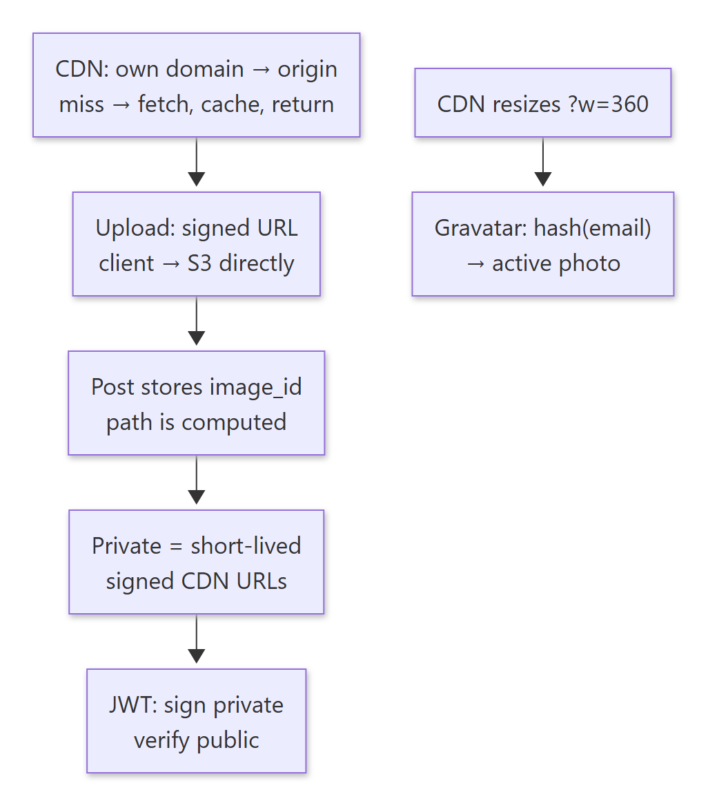

Diagram source (Mermaid)

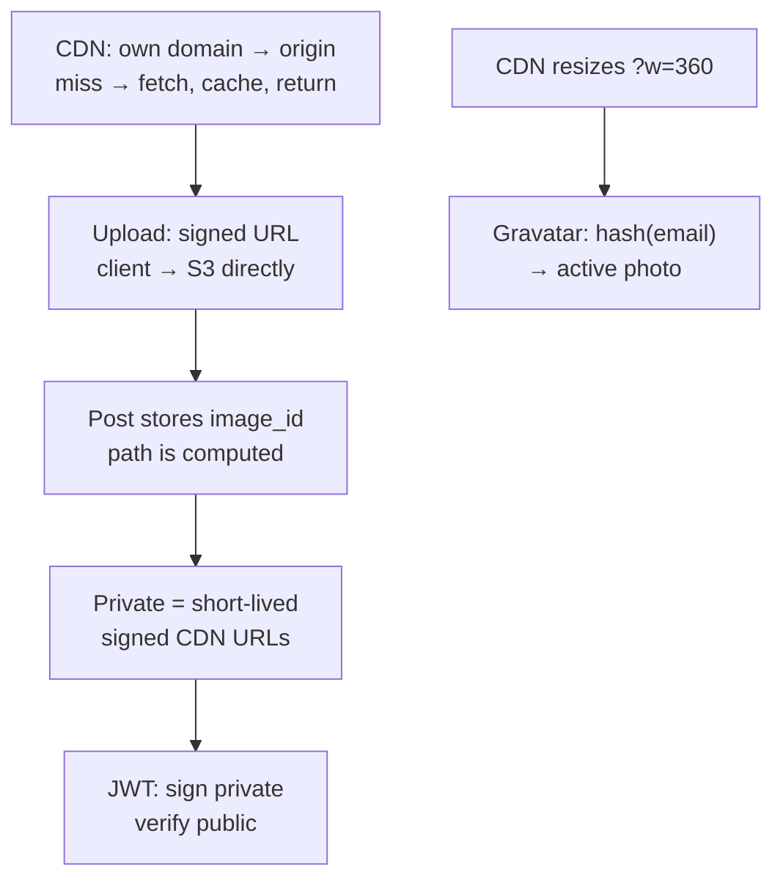
```mermaid
flowchart TB
    M1["CDN: own domain → origin<br/>miss → fetch, cache, return"]
    M2["Upload: signed URL<br/>client → S3 directly"]
    M3["Post stores image_id<br/>path is computed"]
    M4["Private = short-lived<br/>signed CDN URLs"]
    M5["JWT: sign private<br/>verify public"]
    M6["CDN resizes ?w=360"]
    M7["Gravatar: hash(email)<br/>→ active photo"]
    M1 --> M2 --> M3 --> M4 --> M5
    M6 --> M7
```

