# 04-02 · Arpit Bhayani's session notes: Hashtag service + Newly-unread message indicator

> Source: `04-02.pdf` (System Design Masterclass, Google Drive, view-only). Study notes in my own words,
> not a copy. Pages covered: 1–19 of 19. Unreadable pages: none.
> The notification system is covered in a separate YouTube video (plus Razorpay's notification system), not in these slides.

## Map of the session

<!-- diagram:f8-01 -->
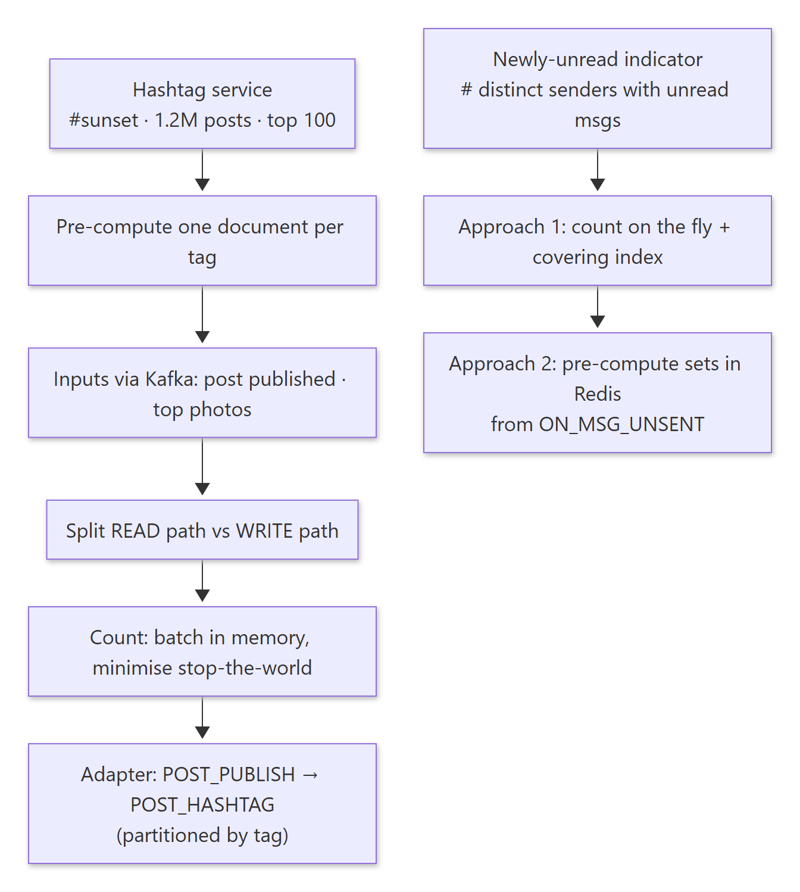

<details><summary>Diagram source (Mermaid)</summary>

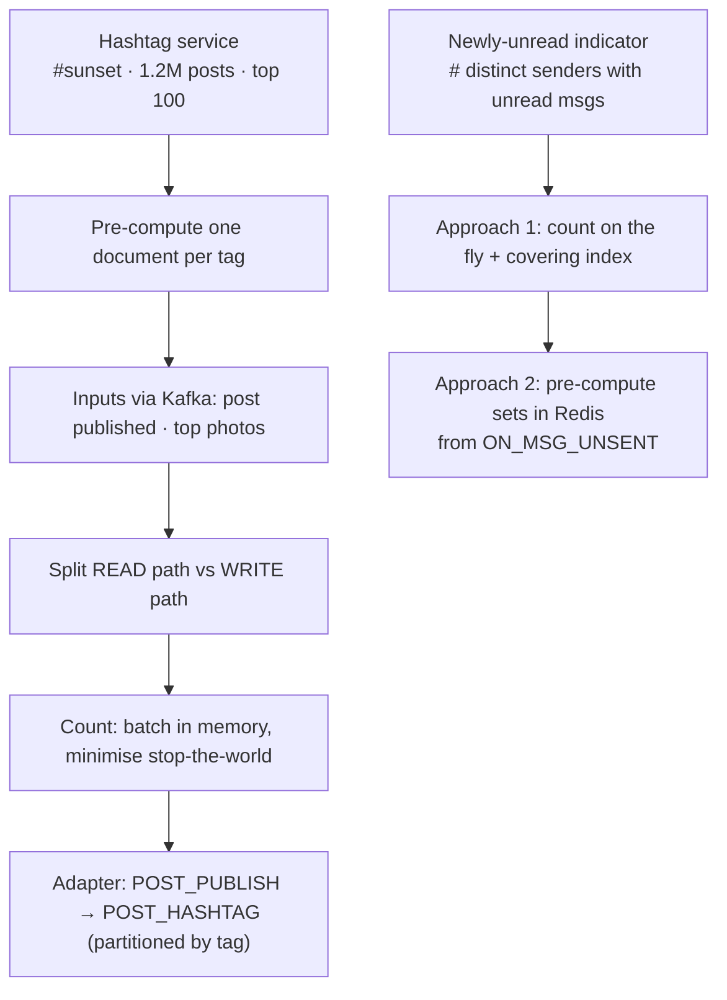

</details>

Agenda: **Hashtag service · Designing the newly-unread message indicator.**

---

## 1. Hashtag service

> 🧠 Anchor: The hashtag page (**#sunset · 1.2M posts · top 100 photos**) must load **super fast**, so **pre-compute everything into one document per hashtag.**

The aim is the best user experience while being clear about the trade-offs.

**Assumptions:** millions of hashtags; some service already decides the "top" photos for a hashtag and tells us.
**Brainstorm:** storage, counting at large volume, inter-service communication, partial updates (posts service → hashtag service), super-fast response times, avoiding N+1 queries, minimising "stop the world".
- "Pagination is over-optimisation" here: absolute correctness isn't necessary. Lazy-load more as the user scrolls (`GET /tags/<name>?page=1`).

### 1.1 Storage: what goes in the hashtag document?

```text
{ id: "sunset", total_posts: 1200000, top_100: [ … ] }      # partitioning key: tag
```

| Store in `top_100` | Pros | Cons |
|---|---|---|
| 1. List of post ids | Less data/storage | Extra enrichment calls to the posts DB per request (N+1) |
| 2. Entire post details (~2.5 KB each: id, user, img_url, caption, …) | Fast: no enrichment, one read | More data; copies can go **inconsistent**, and the update time and memory are high |

The session picks **pre-computed, fully enriched** documents. That's what "super-fast" means.

### 1.2 Inputs

> 🧠 Anchor: **Kafka is the glue.** The hashtag service just consumes events.

<!-- diagram:f8-02 -->
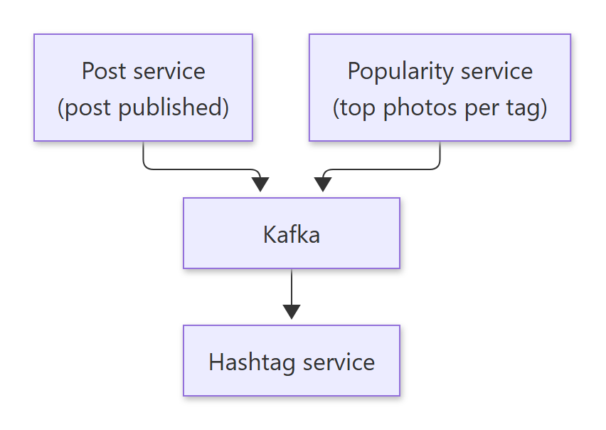

<details><summary>Diagram source (Mermaid)</summary>

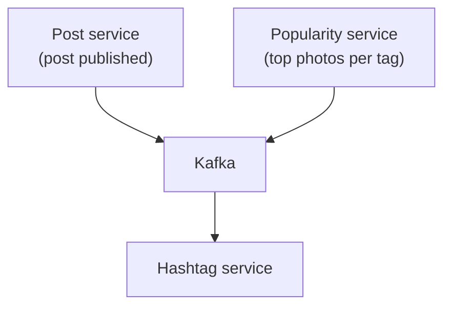

</details>

- Event 1: a post was published (→ count++).
- Event 2: the top photos for a hashtag were re-evaluated (→ replace `top_100`).
- Key requirement: one request, `/hashtag/<tag>`, returns `{tag, total_photos, top_photos[…]}`. **Everything** is returned in a single response, **pre-computed and pre-evaluated**. This is the core of the system.

### 1.3 Separate the READ path and the WRITE path

> 🧠 Anchor: **Identify the read path and the write path, and optimise them independently.**

<!-- diagram:f8-03 -->
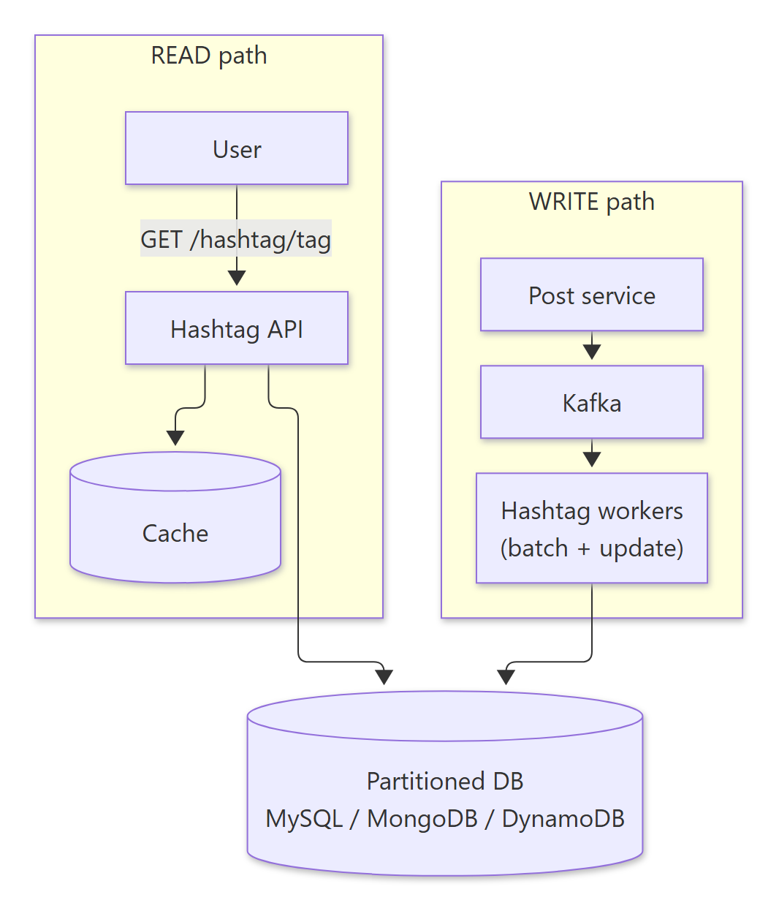

<details><summary>Diagram source (Mermaid)</summary>

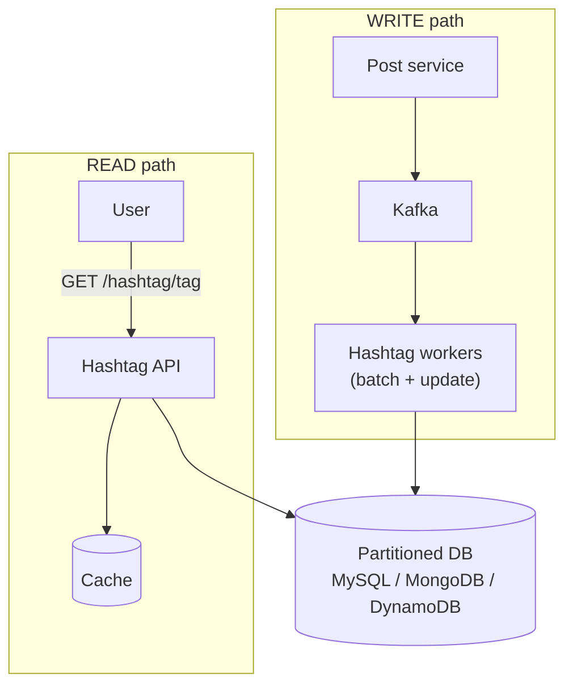

</details>

| Read path optimisations | Write path optimisations | Storage requirements |
|---|---|---|
| Central cache · API does the bare minimum · DB handles key-value reads (tag → details) | Ingest into Kafka · read from Kafka · quick in-memory counting · batch writes to the DB | Partial updates · atomicity · key-based access |

**Main hashtag API servers don't count.** Worker nodes batch and update.

### 1.4 Counting at high volume: three worker designs

| # | Design | Writes to DB |
|---|---|---|
| 1 | Post service writes the hashtag DB directly | One per post per tag (heavy coupling) |
| 2 | Naive Kafka consumer: for each tag in the post, `db.update(tag, count++)` | One per tag per event |
| 3 | **Batch:** accumulate `m[tag] += 1` in memory, flush every N events or 1 min with `db.incr(tag, count)`, then commit the Kafka offset | One per tag per batch ✅ |

```text
loop:
  msg  = kafka.get_msg()
  for tag in extract_tags(msg.caption): m[tag] += 1
  if processed == N or timer_expired(1 min):
      flush(m); kafka.commit()
```

### 1.5 Minimising "stop the world" during a flush

> 🧠 Anchor: Hold the lock **only to swap maps**, then write the old map to the DB **outside** the lock.

| Strategy | Inside the lock | Cost |
|---|---|---|
| Stop the world | Loop over the map writing to the DB, clear it, reset the count | Consumers blocked for the whole DB write |
| Deep copy | Copy the map, clear the original; write the copy async | Copying a big map is slow |
| **Minimal stop the world** | **Swap pointers** (`ma, mp = mp, ma`), unlock; `go writeToDB(mp)` | ✅ Lock held for O(1) |

### 1.6 The partitioning problem → an adapter

> 🧠 Anchor: `POST_PUBLISH` is partitioned by **post/user**, but counting batches well only if each **hashtag** goes to one consumer. So **re-partition**.

- A post with 8 hashtags needs **one event per hashtag** so each tag can be counted and batched efficiently.
- Write an **adapter** (hashtag extraction): read `POST_PUBLISH` → extract the hashtags → emit *n* events to a `POST_HASHTAG` topic **partitioned by hashtag**.
- Now each counting server owns a set of tags, so its in-memory batches are complete and there's no cross-server contention on the same tag.

<!-- diagram:f8-04 -->
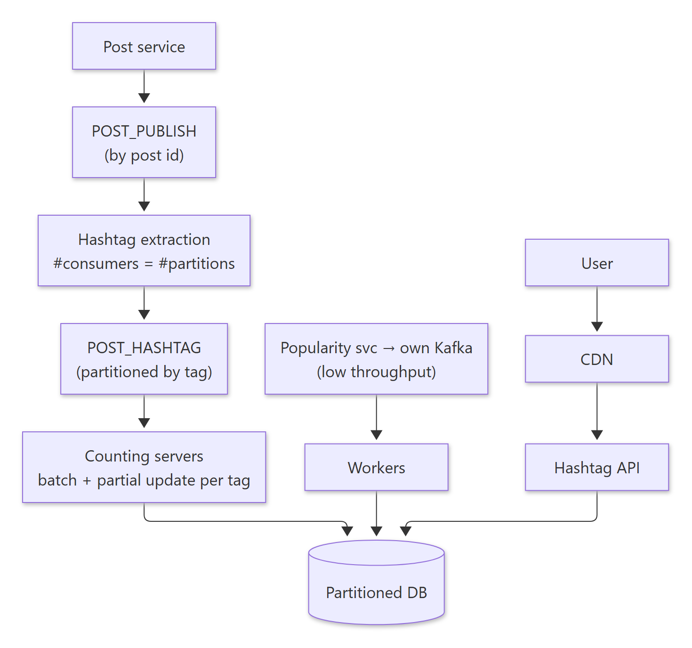

<details><summary>Diagram source (Mermaid)</summary>

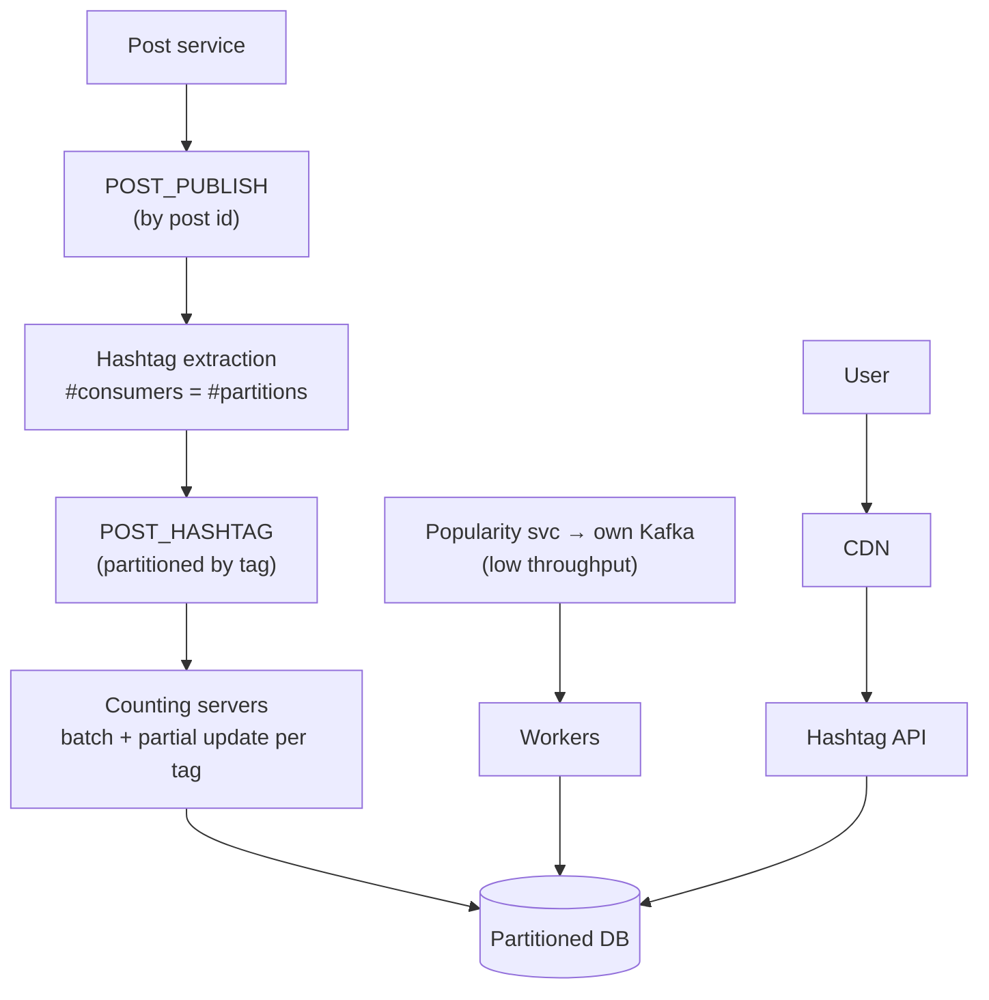

</details>

**Two options inside the extraction step:**

| Option | How | Trade-off |
|---|---|---|
| 1. Kafka adapter | Re-publish per-tag events to `POST_HASHTAG`; counting servers aggregate | Less simple, more moving parts, slower, but **more efficient** |
| 2. Threads | The extraction consumer counts per tag in-process and writes directly | Simpler and faster, but less efficient (each consumer sees every tag, so batches are smaller) |

- The popularity service's per-hashtag "top photos" updates are **not high-throughput**, so simple workers write them straight to the DB.
- HA of brokers → **dead-letter queues** for messages that keep failing.
- Reads go through a **CDN** in front of the hashtag API.

**Key takeaways:** Kafka as glue · the adapter pattern · effective batching and counting · read- and write-path optimisations.

<details><summary>🔁 Recall: Why re-partition from POST_PUBLISH to POST_HASHTAG?</summary>

Counting batches well only if all events for a tag land on one consumer. POST_PUBLISH is keyed by post/user, so an adapter emits one event per hashtag into a topic keyed by hashtag.
</details>

<details><summary>🔁 Recall: How do you flush in-memory counts without blocking consumers?</summary>

Under the lock, swap the active map with an empty one (O(1)), release the lock, then write the old map to the DB asynchronously. Commit Kafka offsets after the write succeeds.
</details>

<details><summary>🔁 Recall: Enriched post details vs post ids in the hashtag doc?</summary>

Ids are small but need N enrichment lookups per read. Full details make the read one fetch, but cost more storage and can go stale. The session chooses pre-enriched for speed.
</details>

---

## 2. Newly-unread message indicator

> 🧠 Anchor: The badge shows **how many different people** sent you messages you haven't read, **not** how many messages. 100s of unread messages from 3 people → **③**.

**Requirements:** near-realtime; update when new messages arrive.
`# new unreads = # distinct senders with at least one unread message`.

### 2.1 Approach 1: count on the fly (MySQL)

| user | messages | user_activity |
|---|---|---|
| id, … | id, msg, from, to, timestamp | user_id (PK), last_read_at |

```sql
SELECT COUNT(DISTINCT from_user) FROM messages
WHERE to_user = ? AND timestamp > :last_read_at;
```

- A pretty decent approach, but it **may not scale**.
- **Index choice matters** (the session walks through each):
  - `idx(to)`: finds the user's rows, but must then fetch each to check the time and sender.
  - `idx(timestamp)`: scans everyone's recent messages.
  - `idx(ts, to)`: the range on `ts` comes first, so `to` can't narrow it well.
  - **`idx(to, ts, from)`: a covering index.** Equality on `to`, range on `ts`, and `from` is read straight from the index with no table lookup. ✅

### 2.2 Approach 2: pre-computed (Day N)

> 🧠 Anchor: **Count at write time, not read time.** Undelivered messages feed a **per-user Redis set of senders**; the badge is just the set's size.

- **Input:** when is a message "unread"? When it **wasn't delivered**. WebSockets know whether the user is connected (or an online/offline service does), so the messaging service emits `ON_MSG_UNSENT {src, dest, msg}` to Kafka.

<!-- diagram:f8-05 -->
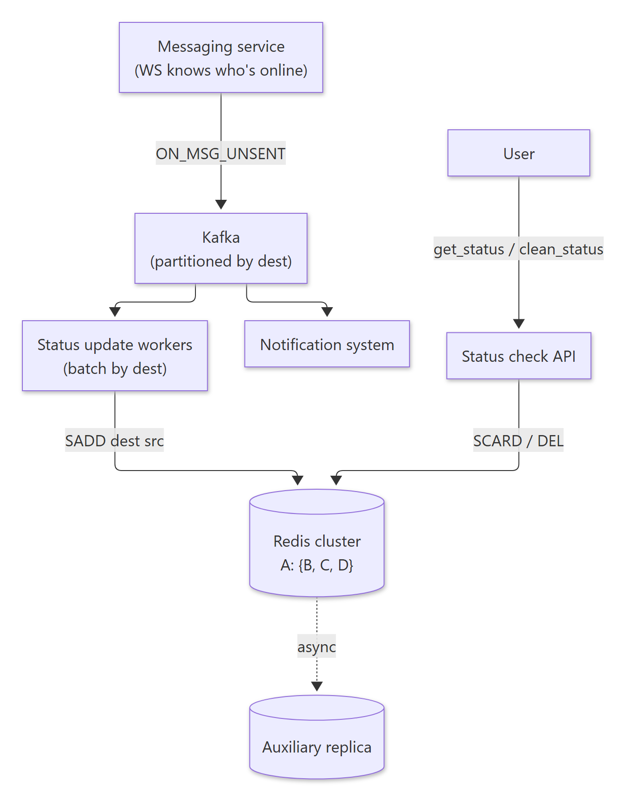

<details><summary>Diagram source (Mermaid)</summary>

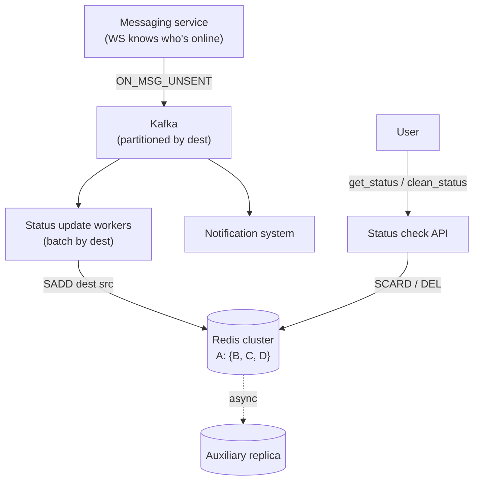

</details>

- Workers do `SADD(dest, src)`. Sets dedupe for free: 10 messages from A, C and B leave `user_id → {A, B, C}`.
- **Read:** `get_status` = size of the set. **Clean** when the user reads (`DEL`/`SREM`).
- Batch by `dest` in workers, since Kafka is partitioned by destination.
- **Size estimate:** 1M users × (4 B + 100 senders × 4 B) ≈ **404 MB**, which fits in Redis comfortably.
- The same `ON_MSG_UNSENT` stream can also feed the **notification system**.
- This is "not your Day-0 solution". Start with Approach 1.

**Exercises:**
1. Implement all 3 hashtag worker approaches: naive, naive + batch, efficient batch.
2. Populate `on_msg_unsent` (use WebSockets to know who is online).
3. Run Redis in cluster mode, write data and see how it's distributed.
4. Implement the naive unread indicator: without an index, with the mentioned index, and with different index orders; compare response times.

<details><summary>🔁 Recall: What does the unread badge count, and what Redis structure fits?</summary>

The number of distinct senders with unread messages. A Redis SET per recipient (SADD sender) dedupes automatically; the badge is SCARD.
</details>

<details><summary>🔁 Recall: Best index for COUNT(DISTINCT from) WHERE to = ? AND ts > ?</summary>

A covering composite index (to, ts, from): equality column first, then the range column, then the selected column, so the query never touches the table.
</details>

---

## What these notes add beyond the slides

- **Index column order rule:** equality columns first, then range, then columns you only read. After a range column, later columns can't be used to *seek*, only to cover.
- **At-least-once + batching:** commit Kafka offsets *after* the batched DB write, or a crash loses counts. If a batch is retried, increments can double. Accept approximate counts (fine for "1.2M posts"), or store per-partition offsets alongside the counts.
- **Hot hashtags** (#love, #instagood) can overload one `POST_HASHTAG` partition. Pre-aggregating in the extraction step (the "threads" option) or salting hot keys spreads that load.
- **Arithmetic checked:** 1M × (4 + 400) B = 404 MB ✔.

## One-page memory card

<!-- diagram:f8-06 -->
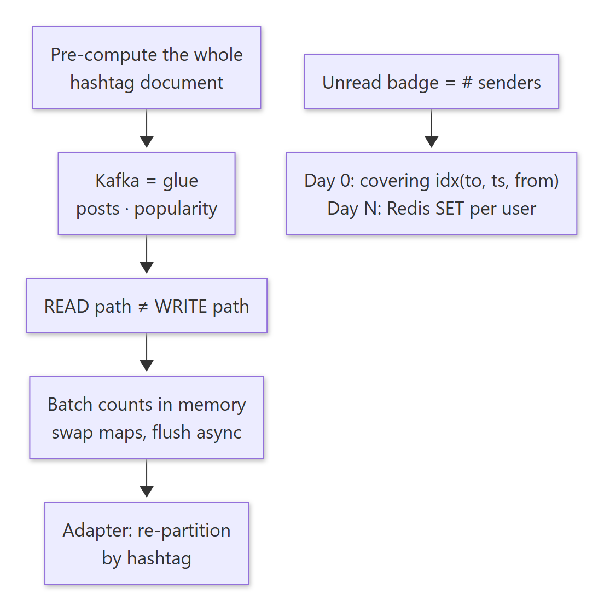

<details><summary>Diagram source (Mermaid)</summary>

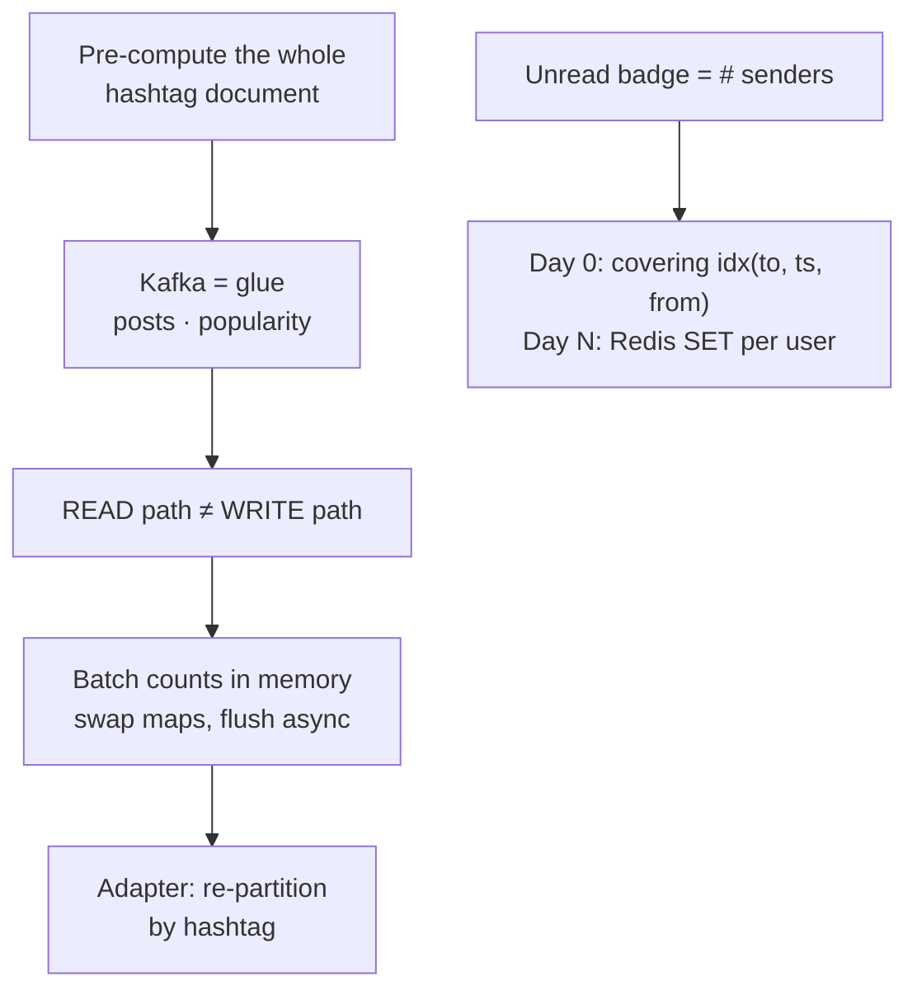

</details>
