# 05-01 · Arpit Bhayani's session notes: Designing a distributed cache (Redis / DiceDB internals, consistent hashing)

> Source: `05-01.pdf` (System Design Masterclass, Google Drive, view-only). Study notes in my own words,
> not a copy. Pages covered: 1–21 of 21. Unreadable pages: none.
> Pages 3–5 are a whiteboard overview; pages 6–13 go through the same ideas cleanly, and the notes follow those.

## Map of the session

<!-- diagram:f9-01 -->
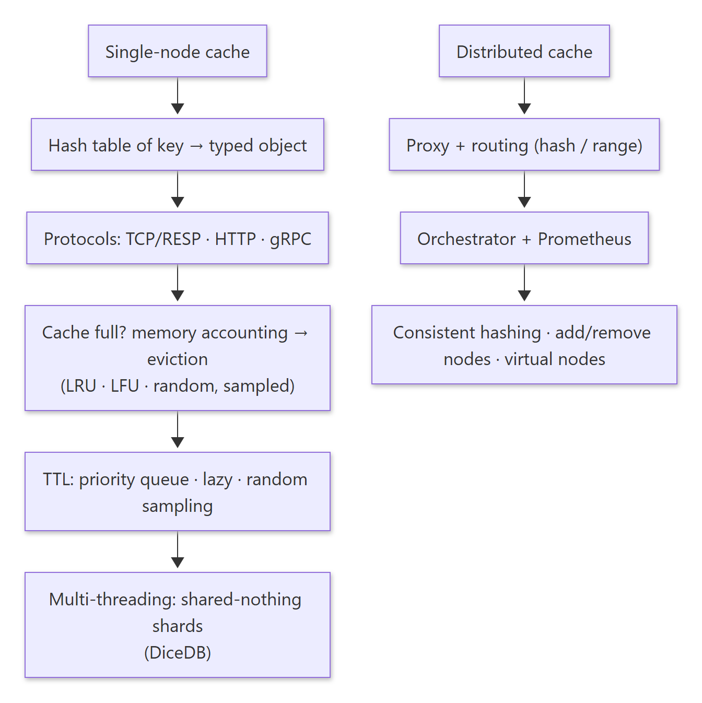

Diagram source (Mermaid)

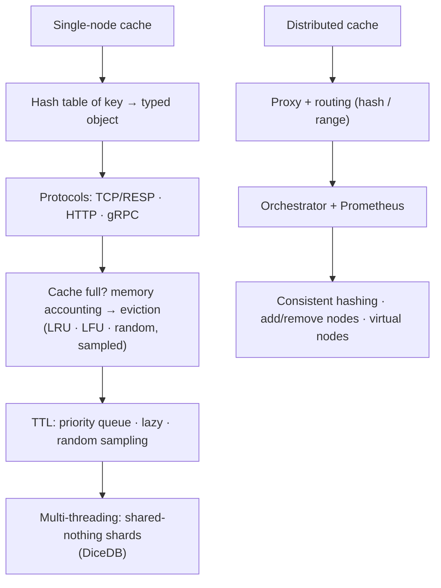

Agenda: **Designing a distributed cache: single node (Redis / DiceDB internals) → distributed (consistent hashing + operational complexities).** Guiding principle: spot the overheads and the trade-offs.

---

## 1. Requirements and brainstorm

> 🧠 Anchor: **High throughput, low latency, distributed.** `GET`, `PUT`, `DEL`, `TTL`, plus a few data structures (set, list, geo, HLL, Bloom filter). **Scale is the default.**

Brainstorm: communication, storage, cache full, eviction, TTL.

---

## 2. Single-node cache

### 2.1 Storage

> 🧠 Anchor: A cache is a **hash table**: `key → object { type, data }`. The **type** decides which operations are allowed.

- Bare minimum: GET / PUT / DEL. Extend to complex structures (sets, lists…) by giving each key a typed object.
- `SET k1 "arpit"`, `SET k2 22`, `INCR k1` (type error), `SADD k3 "x"` → `k3 → {x}`.
- Each object carries overhead: value pointer + type + `expires_at` + `last_accessed_at` (≈ 8 + 8 + 8 + 1 ≈ 25 B on the slide). With millions of keys, that overhead matters.

### 2.2 Communication

> 🧠 Anchor: Support **raw TCP, HTTP and gRPC** by abstracting the protocol layer away from the hash table.

| Protocol | Pros | Cons |
|---|---|---|
| HTTP | Simple; great tooling (curl, requests) | Huge per-request overhead (headers) for tiny payloads |
| Raw TCP + a wire protocol (Redis **RESP**: `SET k v`) | Minimal overhead, fast | Needs custom clients |
| gRPC | Typed, HTTP/2 multiplexing | Heavier stack |

<!-- diagram:f9-02 -->
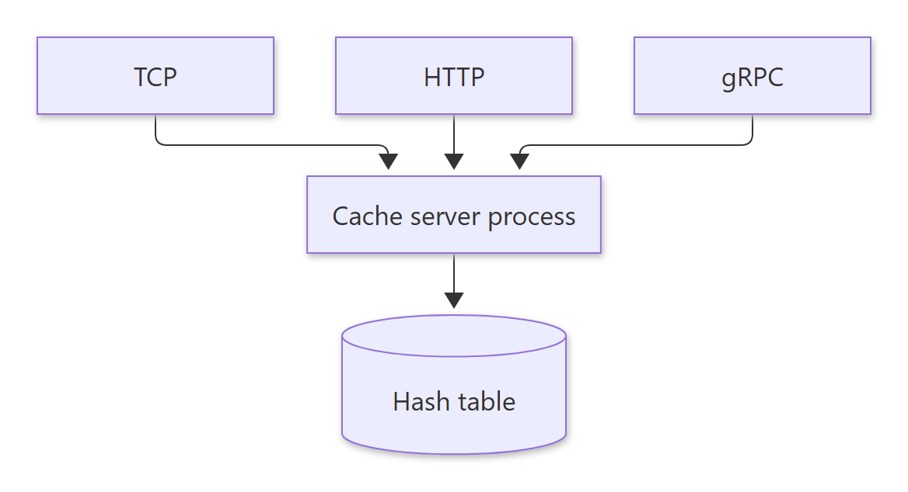

Diagram source (Mermaid)

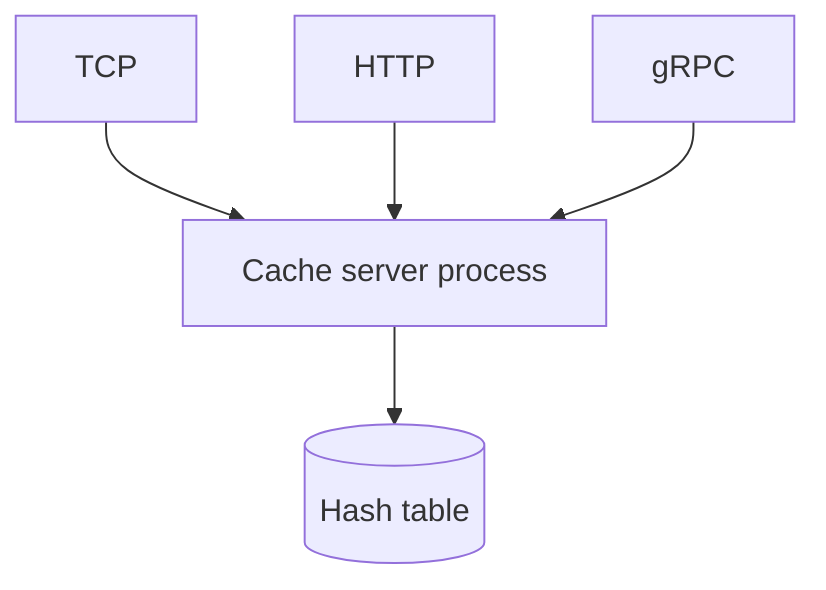

### 2.3 Cache full → eviction

> 🧠 Anchor: You can trigger eviction only **once you know the cache is full**, so **account for memory** on every allocation.

**How do you know it's full?**
- Cap the **number of keys**, or
- Cap the **cumulative size of values**: wrap allocation (`zmalloc`) to keep `total_usage += size` and `zfree` to subtract. If `total_usage + a > max_mem`, evict first. (Could the OS tell you? Not cheaply or precisely enough.)

**Eviction algorithms:**

| Algorithm | Evicts | Good for |
|---|---|---|
| LRU | Least recently used | Recency-heavy traffic (CDN, Google News) |
| LFU | Least frequently used | Stable popularity (Wikipedia) |
| Random | Any key | Cheap, surprisingly OK |

- Read about **O(1) LRU and LFU** implementations.
- **Exact LRU costs memory:** a doubly linked list adds ~3 × 8 B pointers per key, which adds up to many MB at scale. That's a space-vs-time-vs-correctness trade-off.
- **Redis approximates LRU with sampling:** sample a few random keys, keep the best candidates in an **eviction pool** (~16 slots, sorted by idle time) and evict the least recent. No list, and no CPU/page thrashing from maintaining one.

### 2.4 TTL handling

> 🧠 Anchor: Expiry = **absolute time per key**. Delete expired keys **lazily on access** *and* **actively by random sampling**.

| Approach | How | Trade-off |
|---|---|---|
| 1. Priority queue | Min-heap ordered by absolute expiry; free from the top | Simple and consistent, but an extra data structure |
| 2. Lazy (passive) deletion | On GET: if expired → delete, return nil | Keys never fetched are never deleted |
| 3. **Random sampling** (Redis, active) | Sample 20 keys with TTLs, delete the expired ones; if > 25% were expired, repeat | Bounded CPU per cycle; keeps expired keys to < ~25% |

- The idea behind #3: if the sample has < 25% expired keys, the whole population probably does too. This is **not suitable for disk-backed DBs**, where random sampling means random I/O.
- In practice, combine lazy (which catches most, ~90%) with active (the remaining ~10%).
- **But Redis is single-threaded, so how does background work run?** Through its event loop: `activeExpireCycle` (expire.c), `databasesCron` / `serverCron` (server.c), `aeCreateTimeEvent` / `processTimeEvents` (ae.c, which fires events whose `when < now`), `aeProcessEvents` and `aeMain` (ae.c). Timers are interleaved with I/O on one thread.

🔁 Recall: How does Redis expire keys without scanning everything?

Lazily on access, plus an active cycle that samples ~20 keys with TTLs, deletes the expired ones, and repeats while more than 25% of the sample was expired.

🔁 Recall: Why does Redis approximate LRU instead of keeping a linked list?

A DLL costs extra pointers per key (memory) and pointer-chasing on every access (CPU, cache misses). Sampling plus a small eviction pool gets close to LRU cheaply.

### 2.5 Going multi-threaded (DiceDB)

> 🧠 Anchor: To maximise throughput, **minimise contention**, which leads to **shared-nothing**: one hash-table shard per core, owned by one thread.

<!-- diagram:f9-03 -->
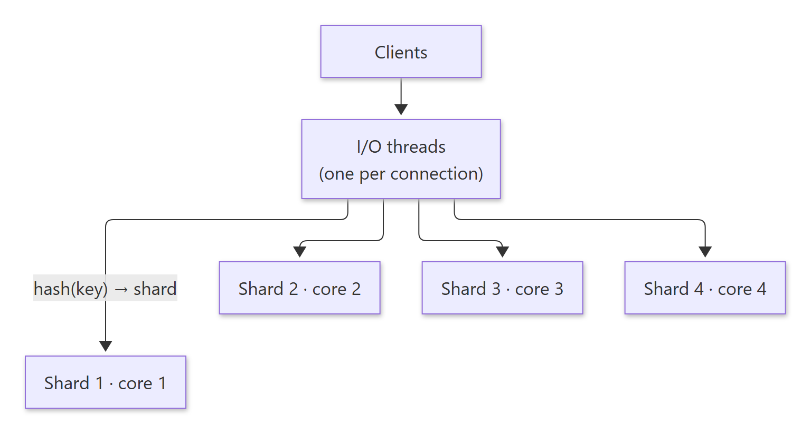

Diagram source (Mermaid)

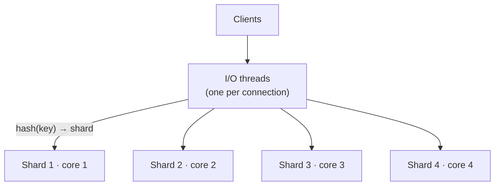

- A single hash table + many threads → **contention** (mutexes slow everything down). A single-threaded server leaves the other cores idle.
- **Split into N hash tables (shards), N = #cores.** 12 threads contending on one lock becomes 3 threads per lock: better throughput, all cores used. On a 4-core box handling 12 threads per core, that's **48 threads**.
- Two remaining concerns: (1) any thread touching any of the 4 maps still causes contention, page thrashing and poor CPU locality; (2) there's still contention within one table.
- Fix: **affinity**. Pin a **data thread** to each core, owning its local hash table. **I/O threads** (one per client connection) find which shard owns key *k* (`hash`) and hand the operation to it.
- DiceDB claims ~10× Redis's throughput this way.

---

## 3. Distributed cache

> 🧠 Anchor: Many single-node caches working as **one coherent cache**. The core problem is **data ownership: which node owns which key?**

### 3.1 Routing

<!-- diagram:f9-04 -->
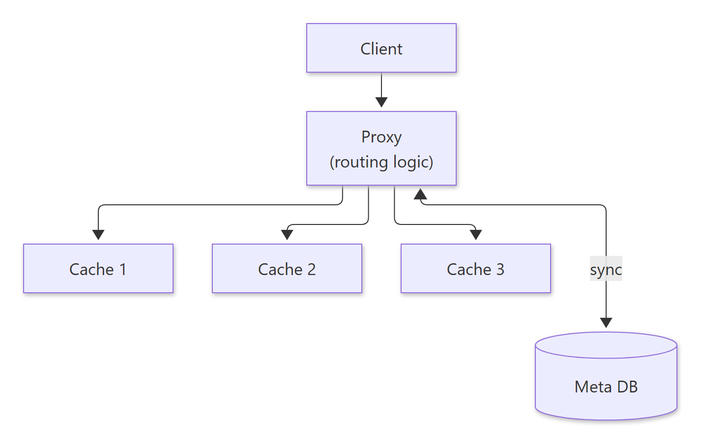

Diagram source (Mermaid)

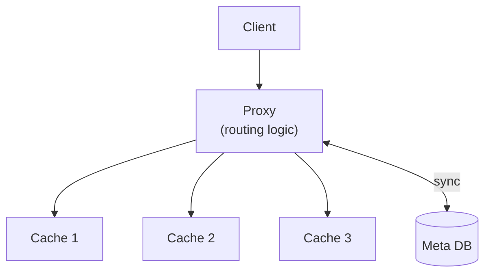

- **Hash-based:** `i = hash(key) % 3`. **Range-based:** cache 1: a–j, cache 2: j–p, cache 3: q–z.
- The routing logic can live in a **proxy** (synced with a meta DB), or in the **client** (as with Redis Cluster, where the client knows the slots), or nodes can **forward** among themselves (a DHT such as Kademlia/Chord, as in IPFS).
- **Exercise:** watch the Kademlia DHT video and read the Kademlia and Chord papers.

### 3.2 Orchestrator

- Monitors the uptime of cache servers (heartbeats) and handles **failovers**. Metrics come from **Prometheus**. State lives in the meta DB.
- Goal: a **truly elastic** cache that scales up and down dynamically. Doing that efficiently comes down to data ownership.

### 3.3 Why `hash % N` breaks

> 🧠 Anchor: Change N and **most keys move**. Going from 2 to 3 nodes, the slide's 6-key example moves 3 of 6 (50%).

| Key | hash % 2 | hash % 3 |
|---|---|---|
| K1 | cache 0 | cache 0 |
| K2 | cache 0 | **cache 2** |
| K3, K4 | cache 1 | cache 1 |
| K5 | cache 1 | **cache 0** |
| K6 | cache 0 | **cache 2** |

### 3.4 Consistent hashing

> 🧠 Anchor: Put **nodes and keys on the same ring**; a key belongs to the **next node clockwise**. Adding or removing a node only moves the keys of **one neighbour's arc**.

<!-- diagram:f9-05 -->
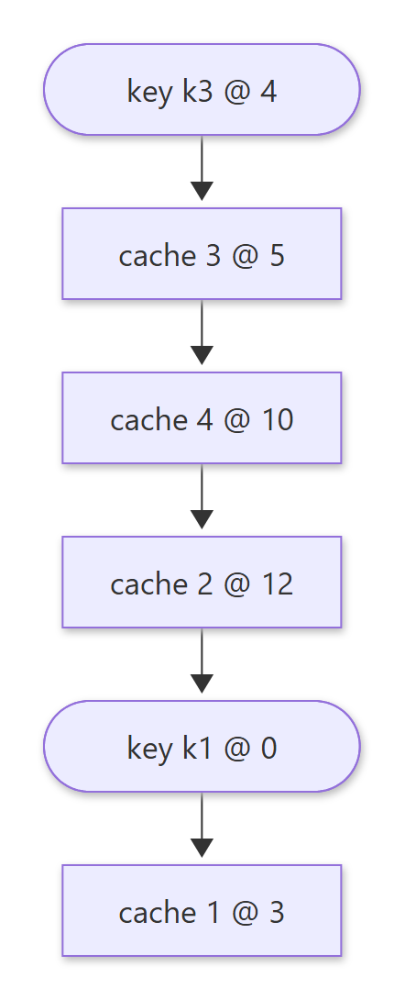

Diagram source (Mermaid)

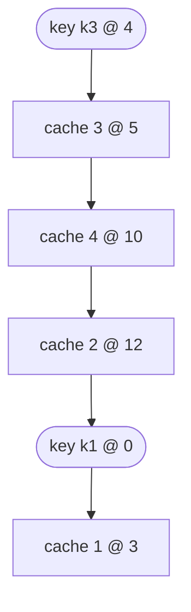

- Implementation: a **sorted array** of node positions; binary-search the key's hash for the next position (wrapping around).

**Adding cache 5 between cache 2 and cache 1 (minimal data transfer):**
1. Create a fresh node.
2. Find its place on the ring (it takes part of cache 1's range).
3. Take a snapshot of cache 1 (could take ~10 min).
4. Load the snapshot on cache 5.
5. Set up replication cache 1 → cache 5.
6. Wait for replication to catch up (watch the replication log).
7. When the lag is ≈ 0: briefly **stop the world** for cache 1 (≈ 1 s), wait until the lag is exactly 0, add cache 5 to the ring, **resume**.
8. Delete the now-unowned data from cache 1 (and the extra copy on cache 5).

**Removing a server:** graceful shutdown (hand its arc to the next node) vs abrupt outage (the next node starts cold for that arc).

**Operational goals:** no-downtime movement; minimal network reads and transfers (elasticity).

### 3.5 Skew and virtual nodes

> 🧠 Anchor: One hash per node can leave **uneven arcs**. Give each node **several positions** (virtual nodes) using multiple hash functions, so load evens out.

- What's the chance that *both* hash functions are skewed? Low. The ring becomes c2(0), c1′(5), c3(10), c2′(15), c3′(21), c1(30), …
- The slide's caution: virtual nodes work great for **stateless** routing (load balancers), but for **stateful** data ownership they make moving data more complex (one node's data is scattered across many arcs).

**Exercises:**
1. Implement consistent hashing with load-balancer routing.
2. Implement virtual nodes to solve skew.

🔁 Recall: Why consistent hashing over hash % N?

With hash % N, changing N remaps most keys. On a ring, adding or removing a node only moves the keys in one arc, roughly 1/N of the data.

🔁 Recall: Steps to add a node with near-zero downtime?

Snapshot the neighbour that owns the arc, load it on the new node, replicate until the lag is ~0, briefly pause writes until the lag is 0, update the ring, resume, then clean up the data that moved.

🔁 Recall: What do virtual nodes fix?

Uneven arc sizes (skew). Each physical node gets many ring positions, so keys and load spread evenly, and a departing node's load spreads across many nodes.

---

## What these notes add beyond the slides

- **Expected movement with `% N`:** going from N to N+1 nodes moves about **N/(N+1)** of the keys (2 → 3 ≈ 67%). The slide's 50% is just its 6-key sample. Consistent hashing moves about **1/(N+1)**.
- **Virtual nodes and stateful systems:** Cassandra and Dynamo *do* use vnodes for stateful data. The benefit is that rebuilding a failed node streams from many peers in parallel. The cost is more ranges to track and move, which is the slide's point. Both views are fair.
- **Redis Cluster doesn't use a ring:** it uses **16,384 hash slots** (`CRC16(key) % 16384`) assigned to nodes. Moving slots is the unit of rebalancing.
- **Eviction pool size:** Redis's `EVPOOL_SIZE` is 16, and `maxmemory-samples` defaults to 5.

## One-page memory card

<!-- diagram:f9-06 -->
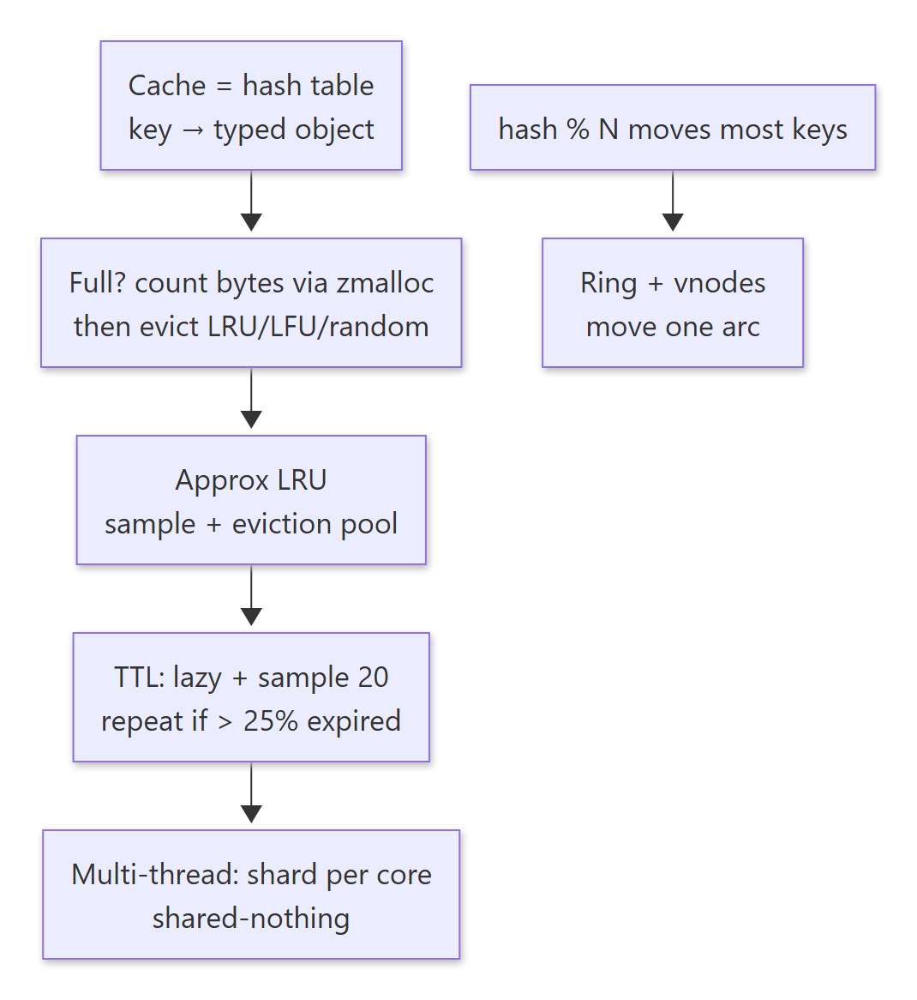

Diagram source (Mermaid)

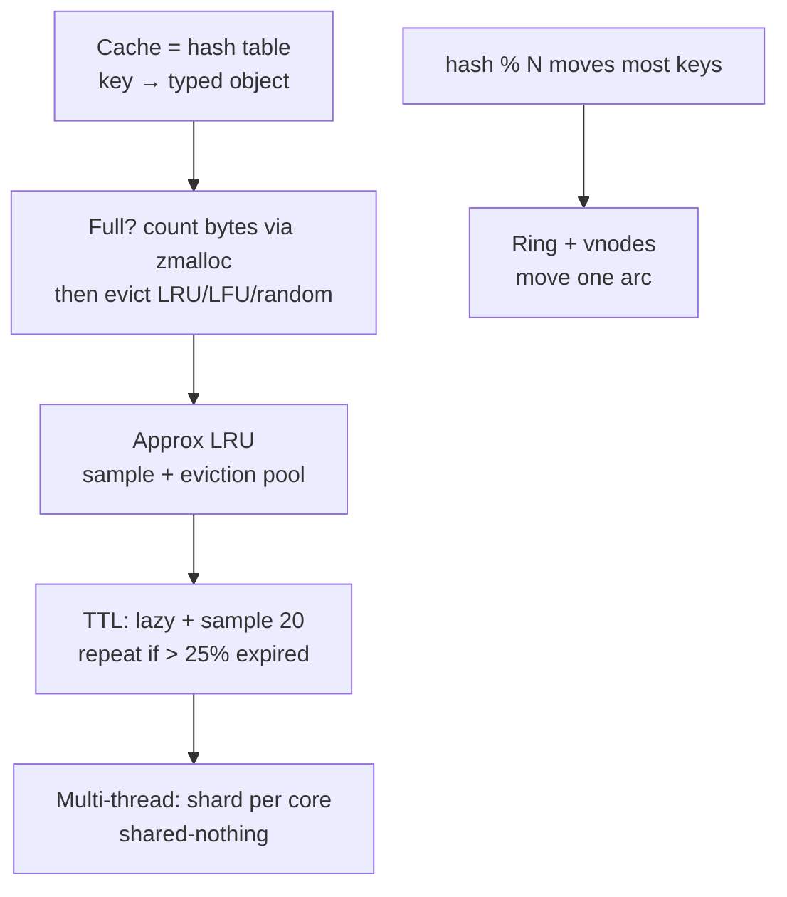

