# 05-02 · Arpit Bhayani's session notes: Word dictionary without a DB, a superfast KV store (Bitcask), WAL recovery

> Source: `05-02.pdf` (System Design Masterclass, Google Drive, view-only). Study notes in my own words,
> not a copy. Pages covered: 1–20 of 20. Unreadable pages: none.
> Pages 3–4 and 14 are whiteboard overviews; the clean pages that follow each cover the same ideas.

## Map of the session

<!-- diagram:f10-01 -->
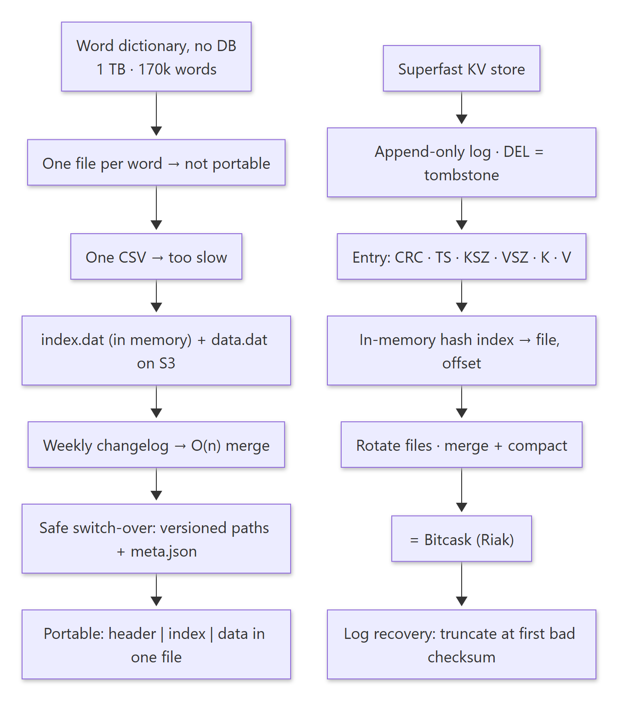

Diagram source (Mermaid)

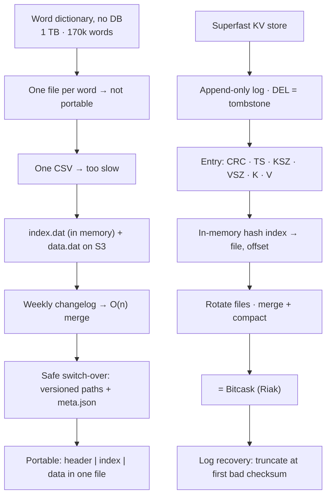

Agenda: **Word dictionary without using any DB · Superfast KV store · WAL recovery.** The theme: storage/compute separation and file layouts.

---

## 1. Word dictionary without any database

**Requirements:**
- **No traditional database**: be creative.
- Words and meanings are updated **weekly** (through a changelog).
- A lookup is always a single word.
- The dictionary is **1 TB** with **170,000 words**; no repeated entries.
- **Portable** (ideally one file), scalable (storage and API servers), "easily" persistent. Response time *can* be high.
- This is the foundation of **data lakes** and **multi-tiered storage**.

### 1.1 Approach 1: one file per word on S3

- `s3://word-dictionary/a/apple.txt`, `…/a/america.txt`, …, `…/z/zoo.txt` (a folder per starting letter).
- `get_word(w)` → build the S3 path → read the file → return the meaning. API servers sit behind an LB.
- ❌ **Breaks portability** (170k files).

### 1.2 Approach 2: everything in one file (CSV)

- `word, meaning` per line, sorted. Simplest format, but the file is **1 TB**.
- A lookup would traverse the whole dictionary. ❌ **Too slow and expensive.**

### 1.3 Make lookups fast: indexing

> 🧠 Anchor: The universal strategy to make lookups faster is **an index**. Keep a small `word → (offset, length)` file **in memory**; read just that byte range from the big data file.

<!-- diagram:f10-02 -->
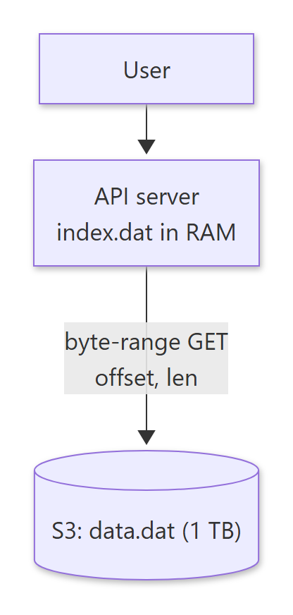

Diagram source (Mermaid)

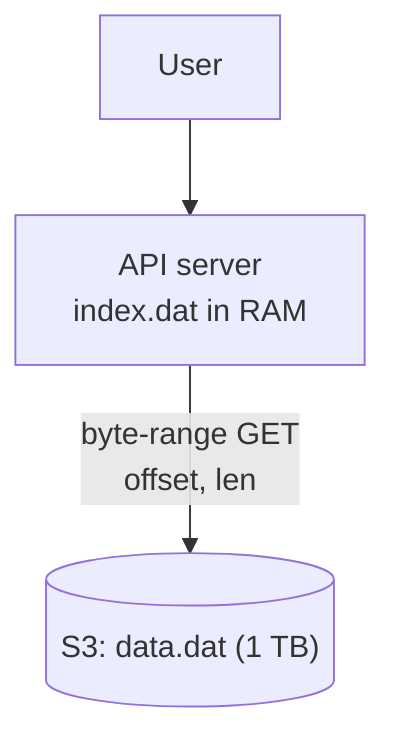

- `index.dat`: `a: 0:127`, `abandon: 127:130`, `ability: 257:100`, …, `zoo: 1023895:196`. It's a separate file on S3.
- **Size of index.dat:** entry ≈ avg word length (4.7) + separators/newline (3) + offset and length (2 × 4 B) = **15.7 B**. Times 171,476 words ≈ **2.69 MB**. It fits in memory trivially.
- **Flow:** on boot, the API server loads the index into memory → a request arrives → look up the offset in memory → read that range from S3 → return the meaning.

### 1.4 Weekly updates: merge a changelog

> 🧠 Anchor: Dictionary and changelog are both **sorted**, so updating is **merging two sorted lists**: O(n), like the merge step of merge sort.

Procedure: spin up a new server → download the dictionary and changelog locally → merge in O(n) to create the new dict + index → upload both to S3.

| Dictionary | Changelog | New dictionary |
|---|---|---|
| a – a′, b – b′, c – c′, d – d′, f – f′, g – g′, h – h′ | c – c″, e – e′, f – f″ | a – a′, b – b′, **c – c″**, d – d′, **e – e′**, **f – f″**, g – g′, h – h′ |

- Store records in **binary encoding** (e.g. `[3][5]abc defgh…` length prefixes) rather than delimited text.

### 1.5 Switching to the new version safely

> 🧠 Anchor: Overwriting `data.dat` in place makes servers with the **old index** read **garbage** from the new file. **Write new versions to new paths, then flip a pointer.**

- If `apple → (100, 1024)` in an old index points into a new `data.dat`, users see random text.

| Transition | How | Issue |
|---|---|---|
| 1. Periodic refresh | Servers poll and reload the index | A window of garbage responses; needs graceful reload |
| 2. Reactive Pub/Sub | A standalone job uploads, then publishes on Redis; API servers reload | Still a race unless the files are versioned |
| 3. **Parallel setup** ✅ | Upload to `s3://word-dictionary/001/{index,data}.dat`, `/002/…`; update `meta.json` → `{index: "002/index.dat", data: "002/data.dat"}` | Old servers keep serving the old files; new servers load the new meta |

### 1.6 Portability: one file with a header

> 🧠 Anchor: To put index and data in **one file**, don't use a separator. Prefix a **fixed-length header** that stores where the index and data start, plus metadata.

<!-- diagram:f10-03 -->
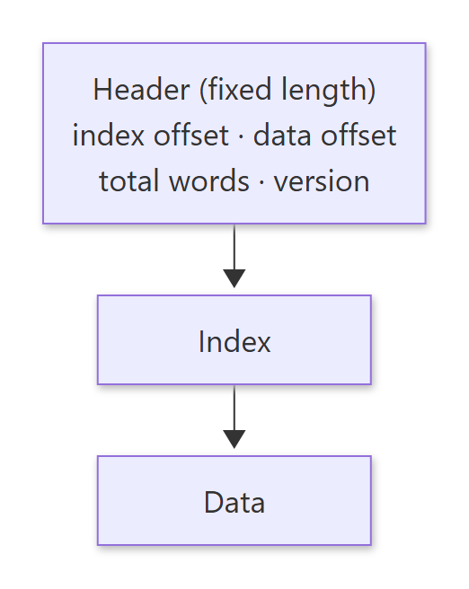

Diagram source (Mermaid)

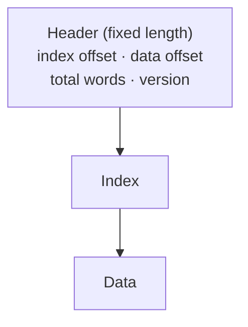

- New flow: the API server reads the fixed-width header → loads the index → starts serving.
- **Real world:** **multi-tiered storage**, with recent orders in MySQL and historical orders on S3, still queryable (Athena, data lakes). More on that next session.

**Exercises:**
1. Build the word dictionary locally as one file (header + index + data).
2. Write a simple API/CLI that returns a meaning using only local disk reads, no network.
3. Write `merge(dict, changelog) → new dict`.

🔁 Recall: How do you serve a 1 TB dictionary with no DB and fast lookups?

Keep a ~2.7 MB index (word → offset, length) in each API server's memory; fetch only that byte range from the big data file on S3.

🔁 Recall: Why version the files instead of overwriting data.dat?

Servers holding the old index would read wrong offsets in the new file and return garbage. Versioned paths + a meta.json pointer let old servers keep the old pair while new servers load the new pair.

---

## 2. A superfast KV store

**Requirements:** superfast reads, writes and deletes, plus **full persistence** (even on HDD).

### 2.1 Log-structured storage

> 🧠 Anchor: **Append-only, sequential writes, no random updates.** No disk seeks during writes means high write throughput, even on HDD.

- Sequential vs random I/O on HDD is a huge difference (the slide cites ~5000×). SSDs gain less from it.
- Simplest design: a single file of KV pairs. `PUT(k, v)` = append, which is lightning fast.
- `DEL(k)` = `PUT(k, -1)`: a **tombstone** append, also lightning fast.

### 2.2 What one entry looks like

> 🧠 Anchor: `CRC | TS | KSZ | VSZ | K | V`. Sizes tell you **how much to read**; the CRC tells you whether it's **intact**.

<!-- diagram:f10-04 -->
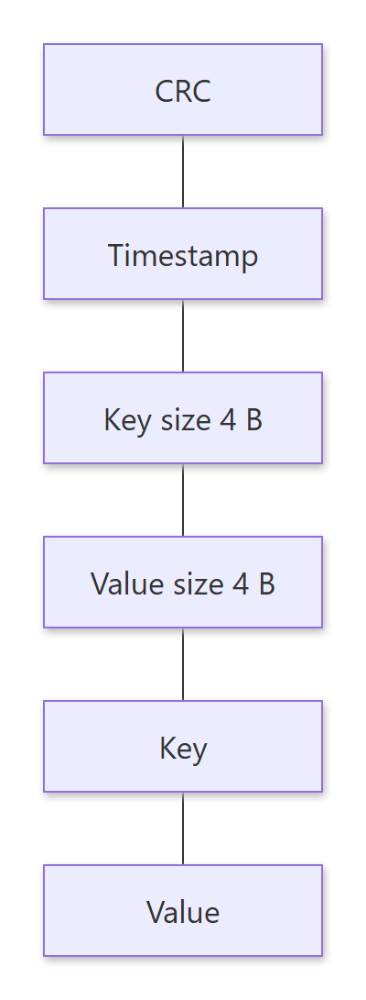

Diagram source (Mermaid)

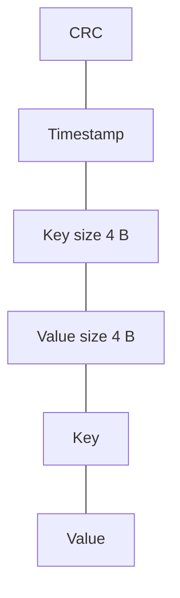

- Keys and values are variable length, so "read until newline" doesn't work. Read KSZ and VSZ (4 B each), then read exactly that many bytes.
- **Integrity:** if the machine crashes while writing the value, the entry is partial. A **CRC** detects corrupt entries.
- **Timestamp** resolves conflicts (the latest wins).

### 2.3 Fast GET: an in-memory hash index

> 🧠 Anchor: `key → (file_id, value_size, value_pos, ts)` in memory. GET = **one hash lookup + one disk seek + one read**, which is O(1).

- **Limitation:** every key must fit in memory (values don't).

### 2.4 When the file grows: rotate, then merge and compact

<!-- diagram:f10-05 -->
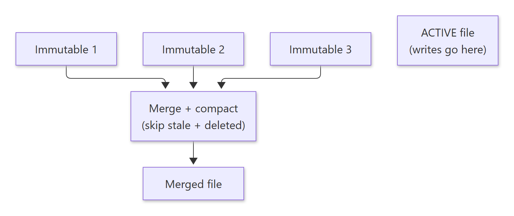

Diagram source (Mermaid)

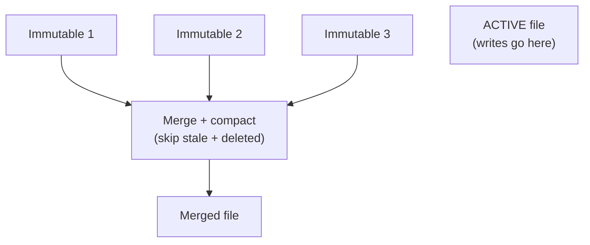

- **Rotate** every *t* bytes: the old file becomes **immutable**, and a new **active** file takes writes. Reads may hit any file.
- **Merge and compact** the immutable files: keep only the latest value per key, and drop stale and deleted entries. Disk usage becomes a sawtooth.
- Offsets change after a merge, so **update the in-memory index atomically**.

### 2.5 What we built is **Bitcask**

- Strengths: fast reads, writes and deletes · high throughput, low latency · saturates disk I/O · easy backups (just copy the immutable files).
- Limitation: keys must fit in memory.
- Bitcask is the storage engine of **Riak** (each Riak node runs a Bitcask instance behind a proxy). Also see **MyRocks** (RocksDB as a MySQL engine) for the LSM variant.

🔁 Recall: How does Bitcask handle PUT, DEL and GET?

PUT appends an entry and updates the in-memory index (key → file, offset). DEL appends a tombstone. GET looks up the index and does one disk read.

🔁 Recall: Why rotate files, and what does compaction do?

Rotation keeps the active file small and makes older files immutable (safe to read, back up, merge). Compaction rewrites the immutable files keeping only each key's latest live value, dropping stale and deleted entries, then atomically swaps the index pointers.

---

## 3. Log (WAL) recovery

> 🧠 Anchor: A crash can only corrupt the **last** entry of an append-only log. On restart, scan, verify each CRC, and **truncate at the first bad one**.

1. Start from the top of the file.
2. Read entry by entry (CRC | KSZ | VSZ | K | V).
3. Validate each with its checksum.
4. On a mismatch, **truncate** the file at that offset.
5. Start the database.

- Almost every database uses this process to repair a corrupt log.

**Exercises:**
1. Benchmark sequential vs random I/O.
2. Implement Bitcask, especially the merge and compaction phase.
3. Simulate integrity failures (partial writes) and recover.

🔁 Recall: How does an append-only store recover after a crash?

Scan entries from the start, checking each CRC. The first failing entry (always the torn last write) and everything after it is truncated; then the index is rebuilt.

---

## What these notes add beyond the slides

- **4-byte offsets can't address a 1 TB file.** 2³² B = 4 GB. The size estimate uses 2 × 4 B, but a 1 TB `data.dat` needs **8-byte offsets** (the brainstorm page hints at this). The index becomes ≈ 171,476 × 23.7 B ≈ 4 MB, still tiny.
- **Bitcask boots faster with hint files:** during merge it writes a small "hint" file (key → position) next to each data file, so on restart the index is rebuilt without scanning all the values.
- **Bitcask vs LSM:** Bitcask keeps *all keys* in RAM (fast, limited key count). LSM trees (LevelDB/RocksDB) keep sorted runs on disk with sparse indexes plus Bloom filters, so the key count isn't bounded by RAM and range scans work.
- **Arithmetic checked:** 15.7 B × 171,476 = 2,692,173 B ≈ 2.6 MB ✔.

## One-page memory card

<!-- diagram:f10-06 -->
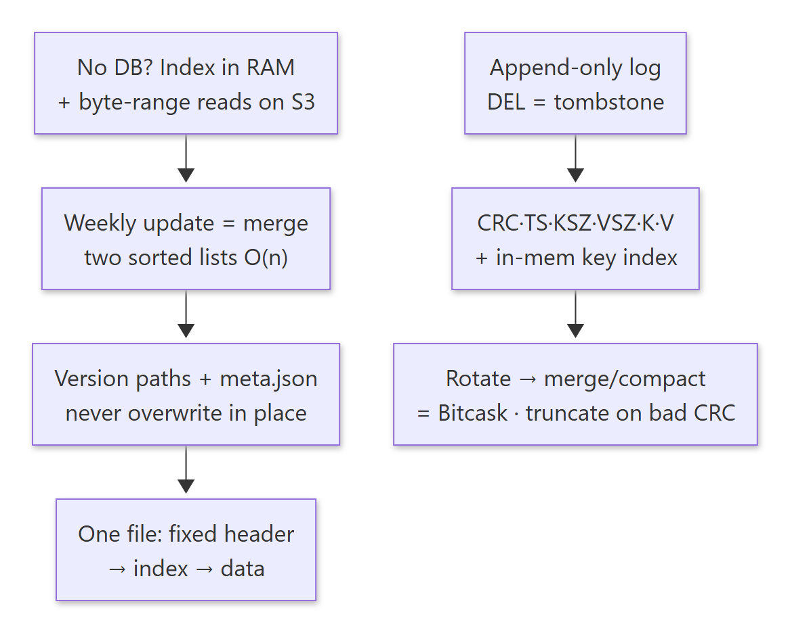

Diagram source (Mermaid)

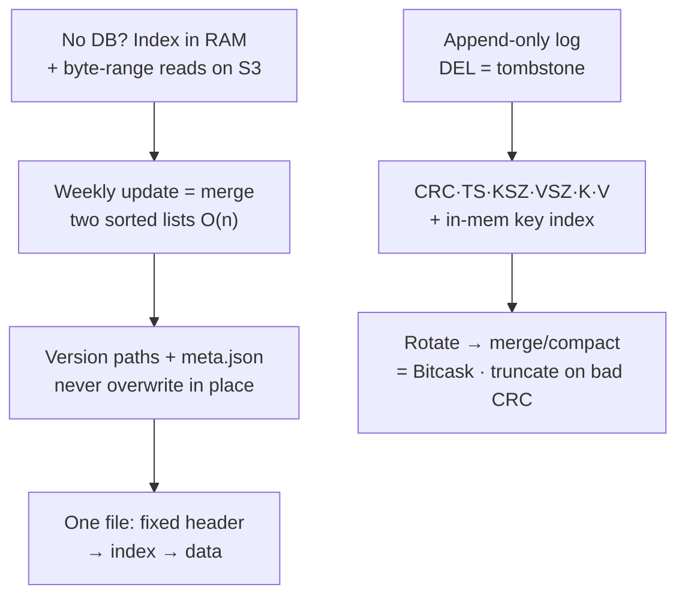

