# 06-01 · Arpit Bhayani's session notes: LSM trees, Multi-tiered order storage (Amazon), Event ingestion

> Source: `06-01.pdf` (System Design Masterclass, Google Drive, view-only). Study notes in my own words,
> not a copy. Pages covered: 1–16 of 16. Unreadable pages: none.
> Pre-reads named for the next session: "How video works" and the Google File System video (needed before the S3 discussion).

## Map of the session

<!-- diagram:f11-01 -->
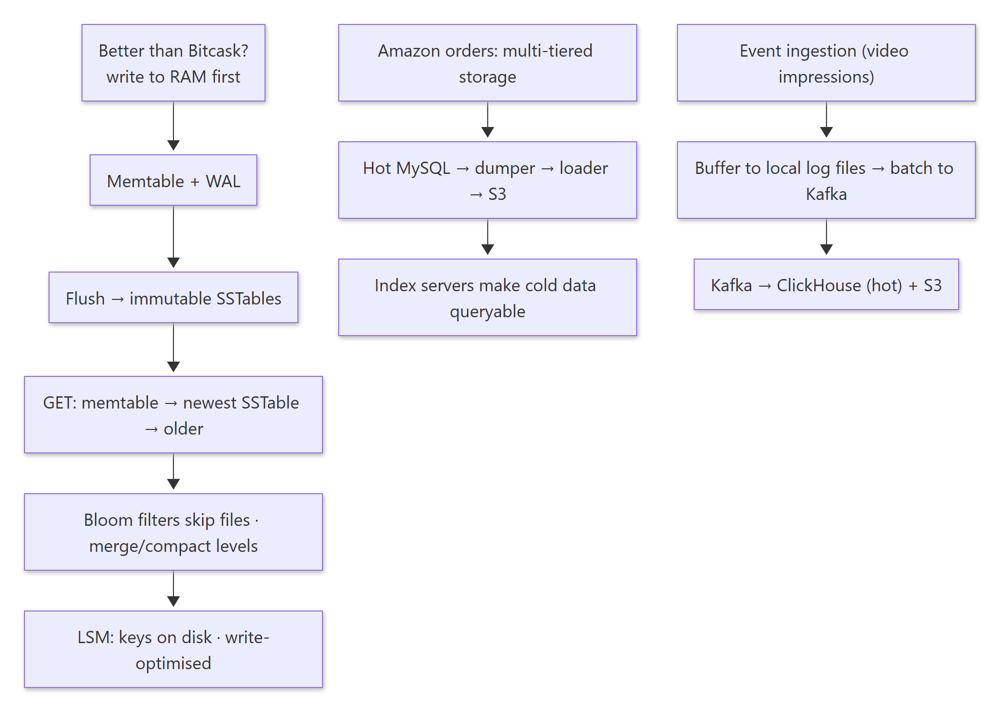

<details><summary>Diagram source (Mermaid)</summary>

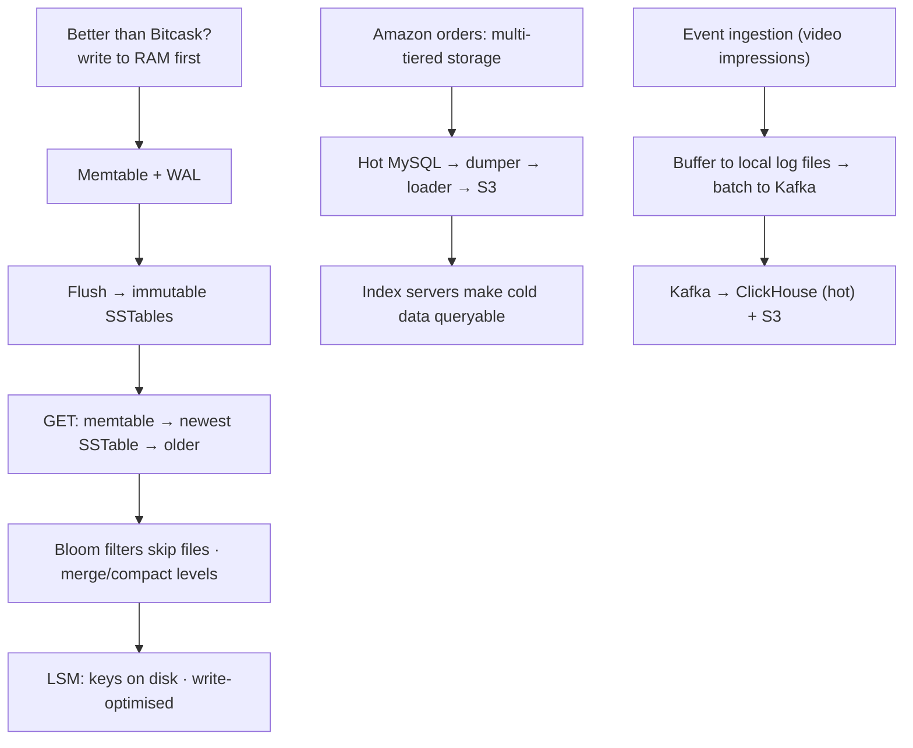

</details>

Agenda: **LSM trees: the intuition · Multi-tiered, cost-efficient orders at Amazon · Event ingestion.**

---

## 1. LSM trees: attempting to beat Bitcask

> 🧠 Anchor: Bitcask = append-only files + an in-memory index of **all keys**. Core idea: **write to RAM first** (sync), flush to disk later (async, periodic). Writes get even faster, and keys no longer need to fit in RAM.

<!-- diagram:f11-02 -->
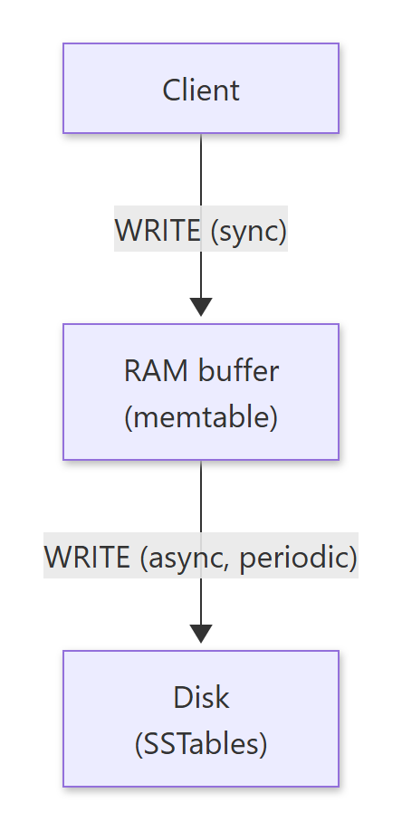

<details><summary>Diagram source (Mermaid)</summary>

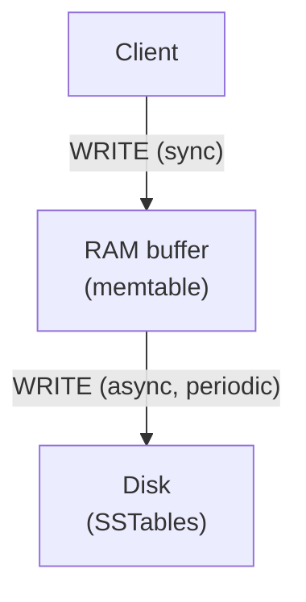

</details>

Brainstorm: in-memory data structure · operations pseudocode · on-disk layout · optimisations · durability · tunability and observability.

### 1.1 Operations

```text
put(k, v):  wal.write(k, v); map.put(k, v)
            if map.is_full(): map.dump(); wal.truncate()
del(k):     map.soft_del(k)                       # tombstone
get(k):     v = map.get(k);       if v: return v   # newest first
            v = disk.get(k);      if v: return v
            return None
on_load():  map = wal.load()                       # replay after a crash
```

- **Reads:** check RAM first. If the key is in memory, it's the **most recent value**. Otherwise check the disk; if it's not there either → NotFound.
- **Periodic flush:** every *t* minutes (or when the buffer is full) the memtable is flushed to disk in one go. Memory use is a sawtooth.
- **Where to flush?** Appending to one existing file means a long file and a long flush. **A new file on every flush** is faster and more efficient (flush everything in one shot).

### 1.2 SSTables

> 🧠 Anchor: Each flush writes a **Sorted String Table**: keys **sorted**, plus an **index** of key → offset. Files are immutable: `001.sst`, `002.sst`, … `005.sst`.

<!-- diagram:f11-03 -->
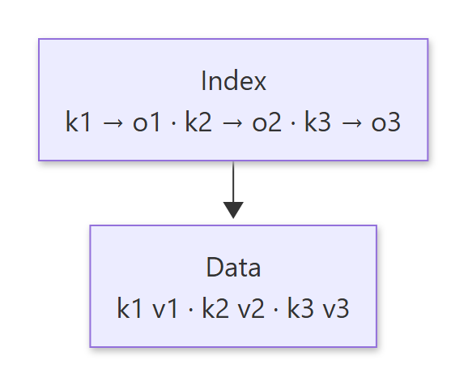

<details><summary>Diagram source (Mermaid)</summary>

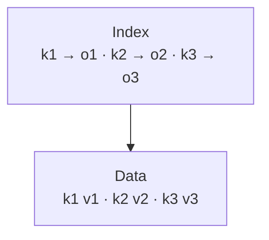

</details>

- `GET(k)`: look in the memtable; if absent, go from the **newest** SSTable to the oldest. In each file, check its **index** rather than scanning. Not found anywhere → 404.
- **Merge and compaction:** many immutable files pile up, so merge them. Since each file is sorted, merging is O(n), the same "merge n sorted lists" as last week's dictionary + changelog.

### 1.3 Bloom filters: skip files that can't have the key

> 🧠 Anchor: **"No" is certain, "yes" is maybe.** A per-file bit array lets a GET skip files that definitely don't contain the key.

- Worst case: a key that doesn't exist forces you to check *k* files. A set per file would be exact but too big at scale.
- **Bloom filter:** hash the key to bit positions. On insert, set those bits. On lookup, if any bit is 0 → **definitely not present**; if all are 1 → **maybe present** (go and check).
- Slide example: apple → 3, banana → 2, cat → 3 (bits 2 and 3 set). Is "dog" present? hash → 6, bit 6 = 0 → **No**. Is "elephant"? hash → 2, bit 2 = 1 → **Maybe**.
- Reference: `github.com/arpitbbhayani/abloom` (a sketch data structure).

### 1.4 Durability: the WAL

- Append every update and delete to a **WAL file** first. It's truncated after every successful flush. Recovery replays it (log recovery and corruption handling were covered last week).
- Durability is tunable (how often to fsync the WAL).

### 1.5 Levels and why LSM

- SSTables are organised into **levels** (L1, L2, L3, L4…). Compaction merges files down into larger, older levels, and each level can carry a Bloom filter.
- **If we write to disk on every write, how is this faster than Bitcask? It isn't.** For **zero data loss** you still need a WAL write per request.
- **How is it better than Bitcask?** **Keys are disk-bound, not memory-bound**, with comparable write amplification. (Why not Redis? Redis is memory-bound.)
- Spectrum of speed vs capacity: Redis (in-memory) → Bitcask → LSM → B+ tree DBs.
- **B+ trees are great for read-heavy workloads; LSMs are optimised for write-heavy ones.**
- Who uses LSM? **RocksDB, LevelDB, BadgerDB** (and Cassandra, ScyllaDB).

<details><summary>🔁 Recall: Walk through a GET in an LSM tree.</summary>

Memtable first (the freshest value). Then SSTables from newest to oldest: consult each file's Bloom filter (skip on "no"), then its index for the offset, and read. Return the first hit; a tombstone means deleted.
</details>

<details><summary>🔁 Recall: Bitcask vs LSM in one line?</summary>

Bitcask keeps every key in RAM (fast but bounded by memory). LSM keeps sorted runs on disk with indexes and Bloom filters, so the key count is bounded by disk.
</details>

<details><summary>🔁 Recall: What does a Bloom filter answer, and with what errors?</summary>

"Could this key be in this set?" No = definitely absent. Yes = possibly present (false positives happen, false negatives never do).
</details>

---

## 2. Designing a cost-efficient orders system for Amazon

> 🧠 Anchor: **Move orders between stores by age** to take load off the transactional DB, **without losing the ability to query them.**

**Brainstorm:** extraction, transformation, loading, file structure, querying, and how to route a query across multiple tiers.

### 2.1 Access pattern

- The orders service (with payments, logistics and customer support around it) writes to a **transactional MySQL**. Scale this.
- An order's life cycle: lots of reads and writes early on (hot, plus replicas), then infrequent reads, then very rare reads for **compliance** (cold).

### 2.2 Architecture

<!-- diagram:f11-04 -->
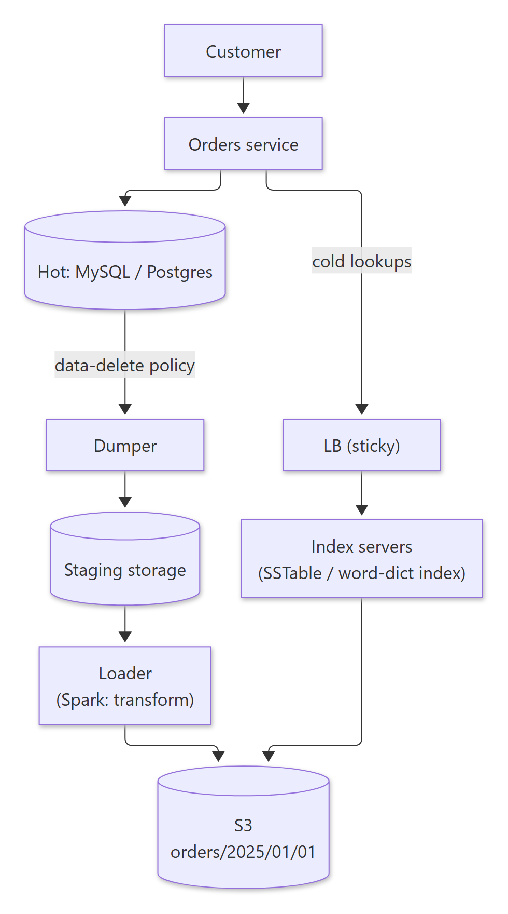

<details><summary>Diagram source (Mermaid)</summary>

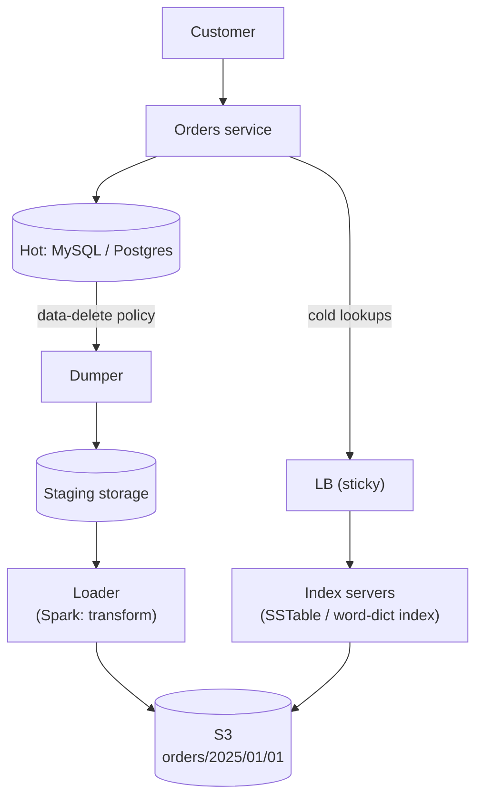

</details>

- A **dumper** pulls aged orders out of the hot DB (respecting a data-deletion policy) into **staging**. A **loader** (Spark) transforms them and writes to S3, partitioned like `s3://orders/2025/01/01`, and similarly for payments.
- Files on S3 use the **SSTable / word-dictionary layout** (index + data), so **index servers** behind a sticky LB keep the index in memory and do byte-range reads. Hive/Athena-style query engines can sit on the same files.
- **Overhead calculation:** hot ≈ 5 ms, cold ≈ 100 ms. Naive tiering: a hit costs 5 ms, a miss costs 5 + 100 ms (check hot, then go cold). That's fine because misses are rare old orders.

<details><summary>🔁 Recall: How do you keep old orders queryable after moving them off MySQL?</summary>

Dump them by age, transform them into indexed files on S3 (index + data, partitioned by date), and serve lookups from index servers holding the index in memory, or query engines over S3. Hot misses fall through to the cold tier.
</details>

---

## 3. Event ingestion (e.g. YouTube video impressions)

> 🧠 Anchor: **Goal: high write throughput for semi-structured data.** Don't write each event synchronously. **Buffer locally, batch, ship.**

### 3.1 What's wrong with the naive version?

1. A **synchronous write to the DB** per impression. Make it async.
2. **Kafka may not keep up** with one message per event (back-pressure on ingestion).

### 3.2 Buffer to local log files, then batch

```text
bw = 0
fp = open(<ts>.log)
process_event(e):
    data = e.json(); fp.write(data); bw += len(data)
    if bw >= max_log_size:          # e.g. 1 MB
        fp.close(); fp = open(<new ts>.log); bw = 0
```

<!-- diagram:f11-05 -->
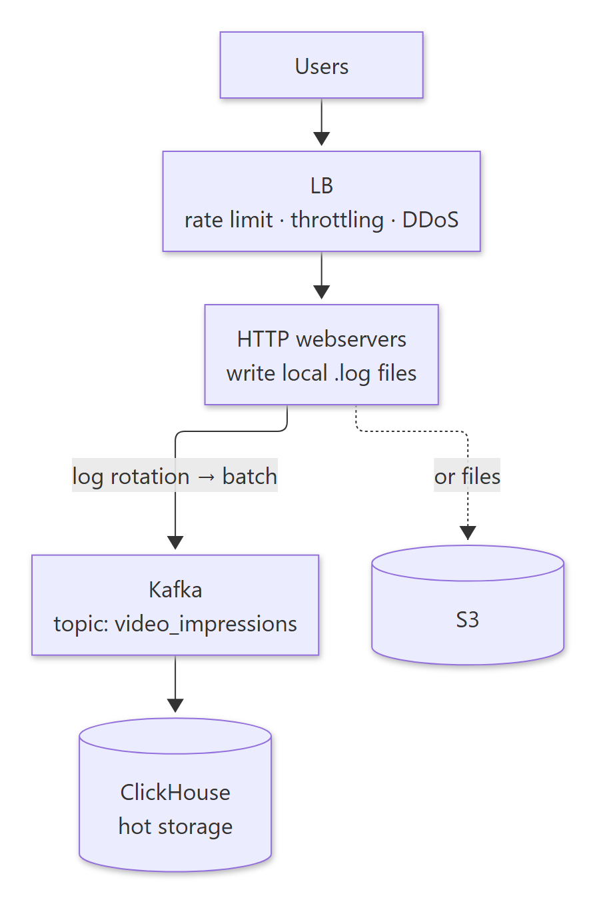

<details><summary>Diagram source (Mermaid)</summary>

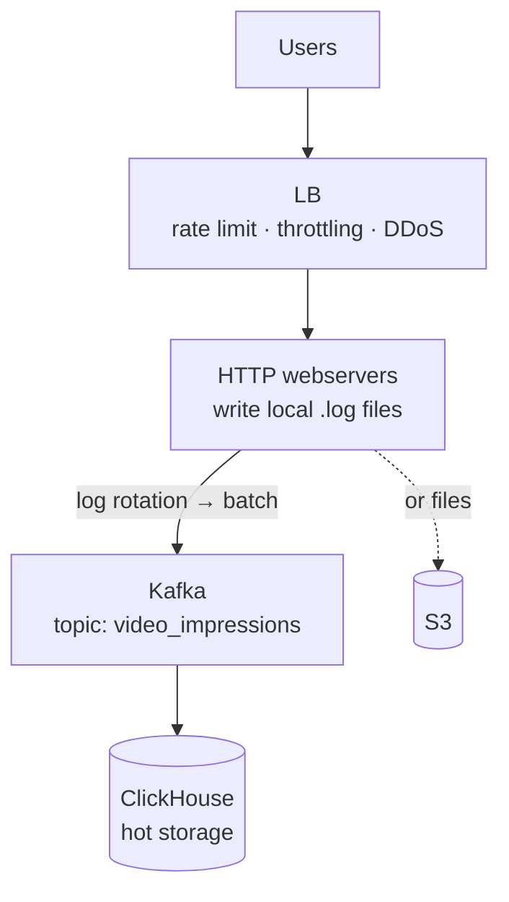

</details>

- Webservers write events into **rotating local log files**. A **log-file reader/batcher/emitter** ships each closed file as a batch, so far fewer, bigger messages reach Kafka. (Should the batcher flush every N messages or every ~10 s? Either; it's a tunable.)
- Kafka topic `video_impressions` → consumers load into **ClickHouse** (hot analytical storage), with S3 for the raw files.
- **Partition key:** *not* `video_id`. A viral video would make one partition hot. Spread the load (round-robin or random).
- Stickiness at the LB isn't required. Rate limiting and throttling at the edge protect against floods and DDoS.

<details><summary>🔁 Recall: Why write impressions to local log files before Kafka?</summary>

Each event becomes a cheap local append. Rotated files are shipped as large batches, so Kafka sees far fewer requests and the webservers never block on a remote write per event.
</details>

<details><summary>🔁 Recall: Why not partition impressions by video_id?</summary>

Popularity is skewed: a viral video would overload a single partition. Spread events evenly instead.
</details>

---

## What these notes add beyond the slides

- **Write amplification vs read amplification:** LSMs trade extra compaction rewrites (write amplification) and multi-file lookups (read amplification, reduced by Bloom filters) for cheap sequential writes. B+ trees update in place: fewer rewrites, but random I/O.
- **Bloom filter sizing:** about **10 bits per key gives ~1% false positives** (with ~7 hash functions). That's why per-SSTable filters are cheap enough to keep in memory.
- **Local log buffering trades durability for throughput.** Events in an unshipped file are lost if the host dies. That's fine for impressions (approximate counts are OK); not fine for payments.

## One-page memory card

<!-- diagram:f11-06 -->
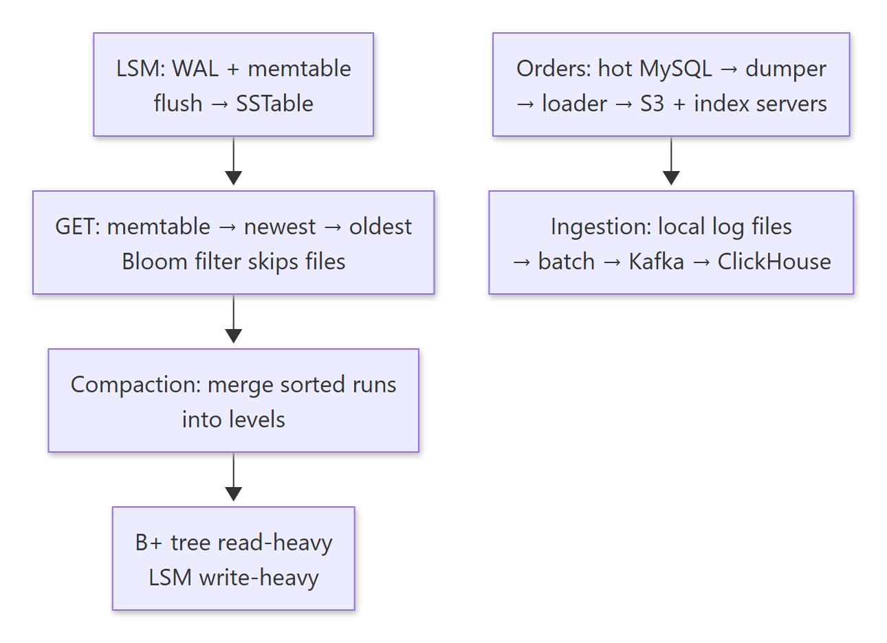

<details><summary>Diagram source (Mermaid)</summary>

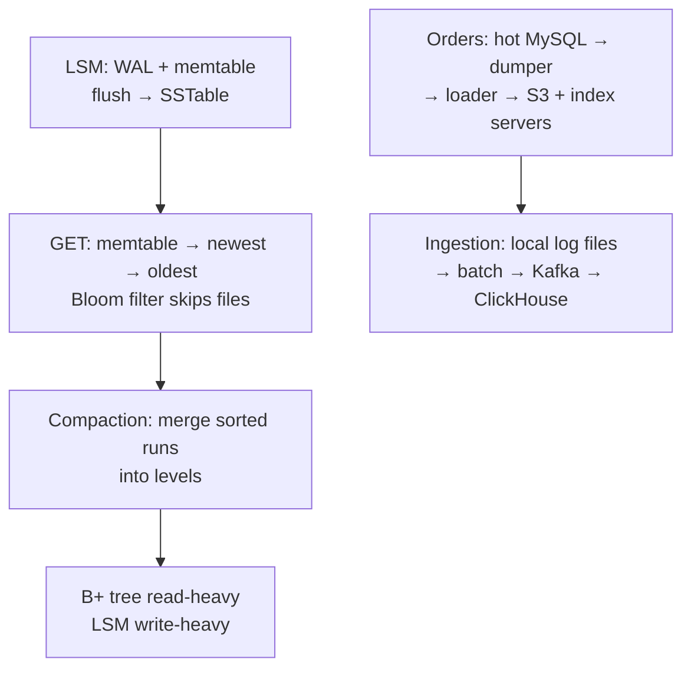

</details>
