# 06-02 · Arpit Bhayani's session notes: High-throughput systems: Live streaming (CDN + ads) and Designing S3

> Source: `06-02.pdf` (System Design Masterclass, Google Drive, view-only). Study notes in my own words,
> not a copy. Pages covered: 1–22 of 22. Unreadable pages: none.

## Map of the session

<!-- diagram:f12-01 -->
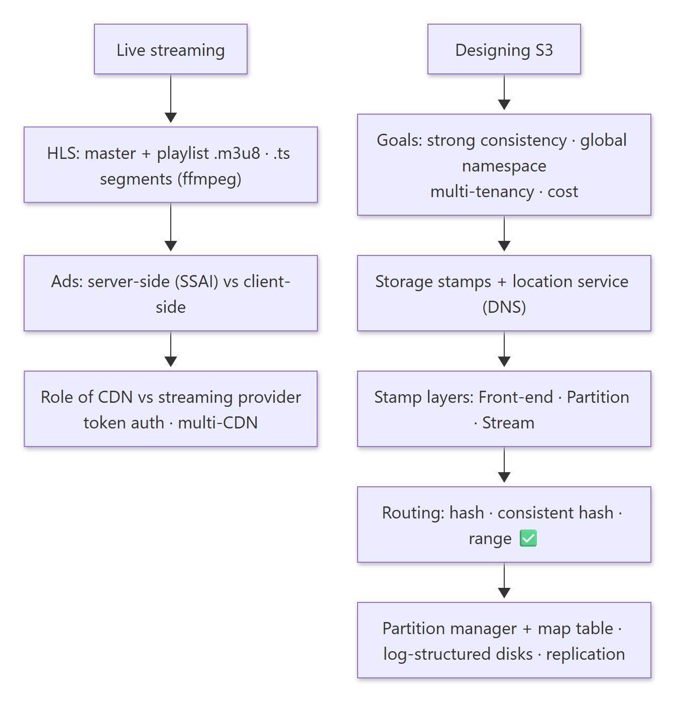

Diagram source (Mermaid)

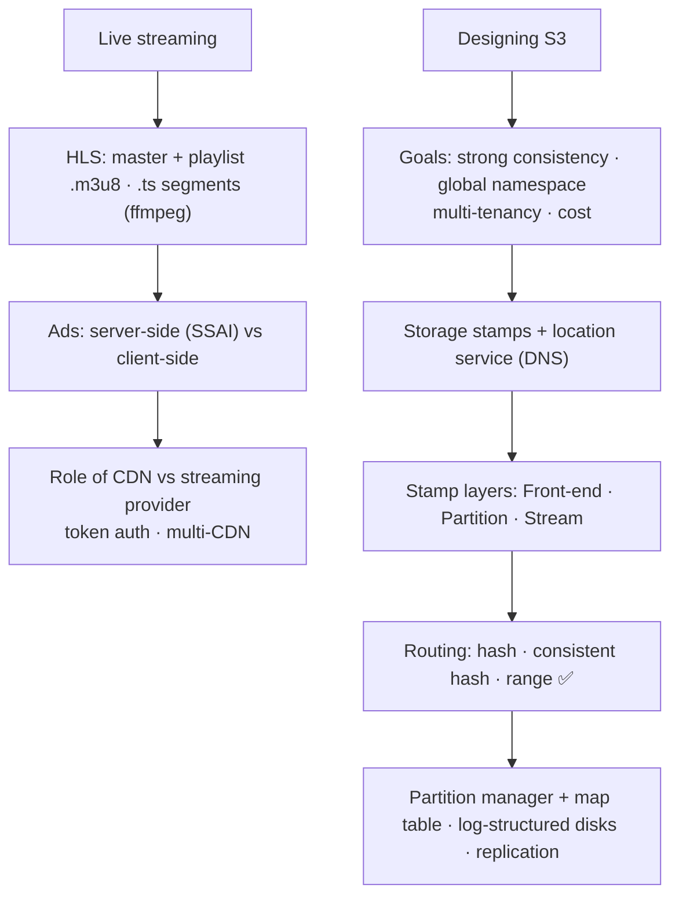

Agenda: **Live streaming: the role of the CDN + ads serving · Designing S3.**

---

## 1. Live streaming

> 🧠 Anchor: Video is cut into **small segments** (e.g. 10 s `.ts` files) listed in an **`.m3u8` playlist**. Players keep re-fetching the playlist; live = new lines are **appended**.

- To understand the operational side of running live streaming at scale, the session points to a podcast with JioCinema's engineering team.
- To understand transcoding: **ffmpeg, m3u8, HLS**.

### 1.1 HLS files

| File | Holds |
|---|---|
| **Master** `.m3u8` | One line per rendition: bandwidth (e.g. 2 Mbps), resolution (640×360, 800×480, 1280×720) → the playlist file for that rendition |
| **Playlist** `.m3u8` | `#EXT-X-TARGETDURATION`, `#EXT-X-PLAYLIST-TYPE` (VOD or EVENT/live), then `#EXTINF:5.0, segment_0.ts`, `segment_1.ts`, … |

- The **master doesn't change**. A **playlist can only grow**: new lines are appended as segments are created and processed. Media players reload it periodically.
- Making the chunks and playlist (the gist of the ffmpeg command): input video → H.264 video codec + AAC audio codec → `hls_time 10` (10 s per chunk) → VOD playlist type → segment filenames `segment%06d.ts`, numbered from 0 → `index.m3u8`.

### 1.2 Ads in live streaming

> 🧠 Anchor: **SSAI** stitches ads into the stream **on the server**: seamless and hard to block. **CSAI** inserts them **in the player**: simpler, but you see a glitch or spinner and ad-blockers can catch it.

| | Server-side ad insertion (SSAI) | Client-side ad insertion (CSAI) |
|---|---|---|
| Where | Ads stitched into the stream at the server | Player inserts ads on "cue" events (JavaScript on player events) |
| UX | Seamless playback, no buffering between content and ads | Typical loading spinner or glitch on switch |
| Blockers | Hard to detect | Easier to block (think of ad markers) |

Other formats: **banner ads** (on cue → fetch the ad, render it) and **bumper ads** (short, non-skippable, ~6 s).

**How SSAI works** (in live streaming the client periodically re-requests the `.m3u8` for new segments, which keeps the stream continuous):

<!-- diagram:f12-02 -->
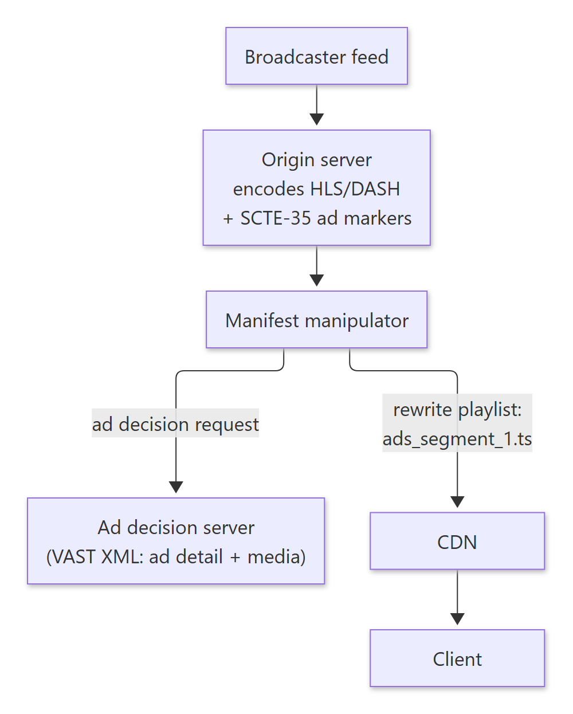

Diagram source (Mermaid)

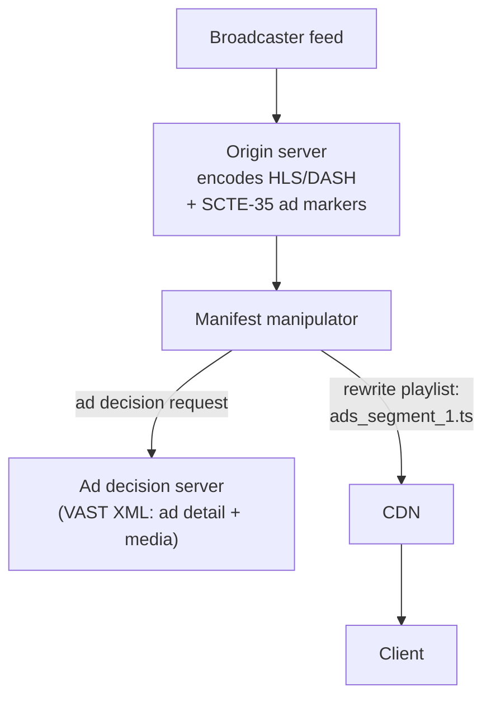

- The ad decision server (which ad to show) is a complex system in its own right, and out of scope here.
- The manifest manipulator downloads the ad, splits it into segments and **inserts the ad segment lines** into the playlist. The client just plays what it's told. (YouTube's SSAI works this way.)

### 1.3 If the CDN does everything, what does the streaming provider do?

<!-- diagram:f12-03 -->
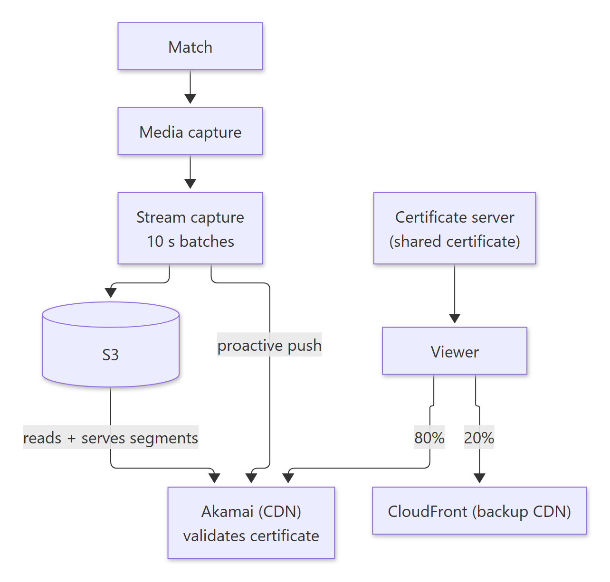

Diagram source (Mermaid)

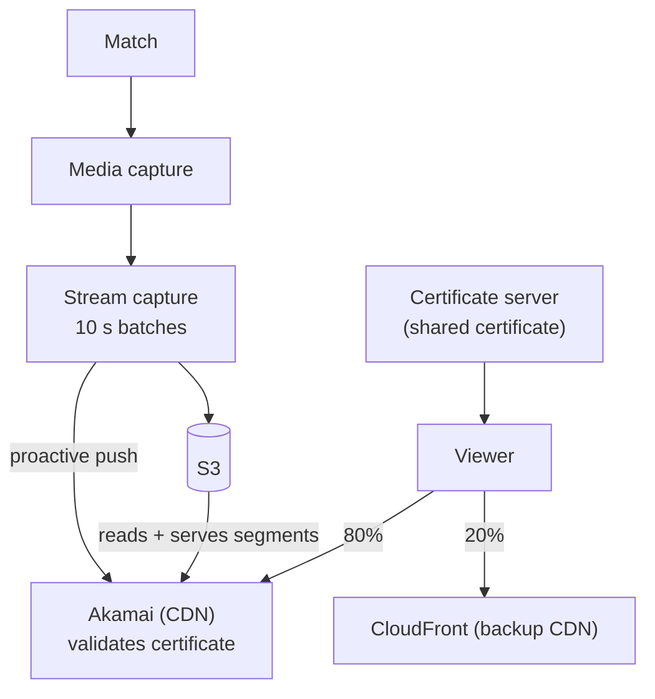

- **Private streams stay private** with **token auth at the CDN**: a certificate server issues signed tokens (a certificate shared with Akamai), and the CDN validates them per request (e.g. `match_id/364/…`).
- **Multi-CDN:** most traffic on one CDN, a share on a backup CDN. **Keep testing performance** and **switch in real time** if one degrades.
- The provider runs capture, packaging, auth, ads and the CDN strategy. The CDN does the delivery.

🔁 Recall: What's in a master vs a playlist m3u8, and how does "live" work?

Master: renditions (bandwidth/resolution → playlist URL); it doesn't change. Playlist: an ordered list of short .ts segments with durations; for live, new segments are appended and players re-fetch the playlist periodically.

🔁 Recall: SSAI vs CSAI?

SSAI rewrites the playlist on the server so ad segments are part of the stream: seamless and hard to block. CSAI has the player fetch and play ads on cue events: simpler, but glitchy and blockable.

---

## 2. Designing S3

> 🧠 Anchor: S3 is "just a KV store": `path → blob`. Requirements: **blob storage**, a network file system, **scalable and cheap**.

- Brainstorm: storage, routing, hot partitions, access, load balancing. The **biggest challenge is storage**.
- **Most important design decision:** **directories are logical and virtual.** Everything is path-based. (Read-heavy or write-heavy? Both.)

### 2.1 Design goals

| Goal | Meaning |
|---|---|
| 1. **Strong consistency** | `WRITE(f, "ball")` → `READ(f)` returns "ball" |
| 2. **Global namespace** | `insta-images` / `bucket1/a.txt` is reachable from all regions under the same name; no regionalised exclusion |
| 3. **Multi-tenancy** | Load from one customer must not affect others |
| 4. **Cost efficiency** | Separate infra per customer isn't an option; shared hardware reduces storage and compute cost |

### 2.2 Global partitioned namespace

- `s3://instaimages/user_123/photo_1.jpg` = **bucket** + **key**. It's globally addressable; region doesn't matter; there's no explicit disjoint partitioning.

### 2.3 Architecture: storage stamps + location service

> 🧠 Anchor: A **storage stamp** is a cluster of N racks (10–20 racks × ~18 storage nodes ≈ **30–50 PB**). A **location service** maps each account/namespace to a stamp and replicates across stamps.

- Each rack has redundant networking and power. Stamps scale horizontally.
- Keep each stamp at **≤ 70%** utilisation (storage and network); the remaining **30% is reserved** to absorb rack failures within the stamp.
- **Location service:** maps namespace → storage stamp; manages account replication across stamps (redundancy, disaster recovery). It's deployed multi-region and is aware of everything.

<!-- diagram:f12-04 -->
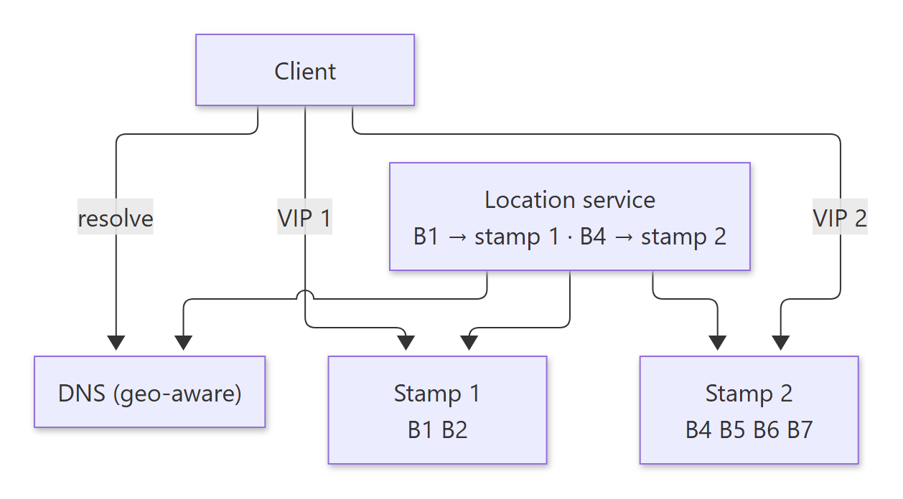

Diagram source (Mermaid)

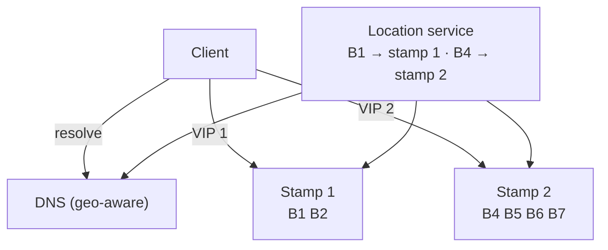

- High availability means **redundancy**. The location service can add new stamps easily (horizontal scalability).
- **When a stamp fills up:** create a new stamp → assign new accounts to it → if one account grows huge, pick one: move smaller accounts to another stamp, or **split the namespace** and let the location service balance it (rare).
- Post-read: how Google balances load with **Anycast**.

### 2.4 Inside a storage stamp: three layers

> 🧠 Anchor: **Front-end → Partition → Stream.** These aren't microservices; each is a group of servers solving one problem.

<!-- diagram:f12-05 -->
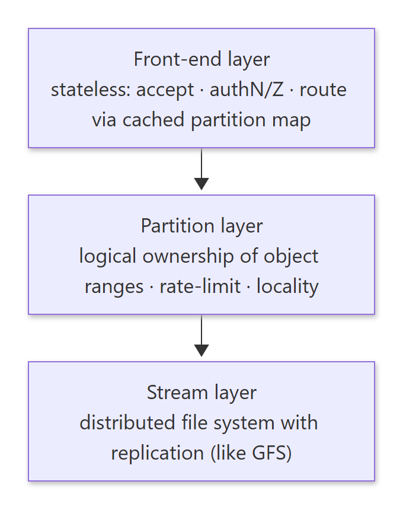

Diagram source (Mermaid)

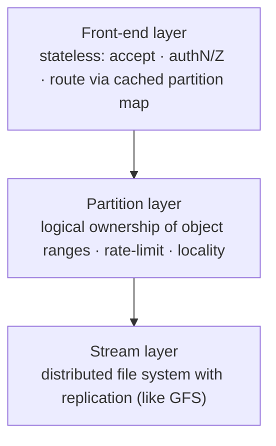

**Stream layer (files):** a distributed file system with replication. It knows how to store and replicate files, e.g. 3 files with RF = 2 across regular VMs (storage nodes), with a coordinator. Read any distributed-FS paper (e.g. the Google File System) for the gist.

**Front-end layer:**
- A set of stateless servers in the stamp: accept requests (`GET s3://bucket1/file.txt` from the LB), **authenticate and authorise**, and **route** to the right partition server using a **cached partition map**.
- **Large objects (1 GB)** can't go in "one" request, so front-ends **stream** data to and from the stream/partition layer over persistent connections, sending as soon as data is available. Transfer-encoding chunked and HTTP streaming give a massive efficiency boost.
- Exercise: a TCP server that reads a 1 GB file and streams it to a client that receives it as a stream.

**Partition layer:**
- Should front-ends talk to the coordinator directly? Throttling and isolation become hard, and so does ownership. So the partition layer gives **logical ownership** of a partition (and locality), along with optimisation and mutual exclusion for multi-tenancy.
- The partition server process is **co-located** with the stream layer on each storage node.
- A path like `s3://insta-images/user1/photo1.jpg` tells the location service which stamp. **Within the stamp**, where does the file go?

### 2.5 Routing: which partition server owns what?

> 🧠 Anchor: **Range-based partitioning** wins for S3: it keeps an object's locality, gives control and isolation, and lets you **split a hot range in two**.

| Strategy | How | Pros | Cons |
|---|---|---|---|
| 1. Hash | `f(key) % n` | Near-random, uniform; no explicit config | Changing n → rebalancing and re-indexing; one bucket's files spread across nodes; **no tenant isolation** |
| 2. Consistent hashing | Partitions and keys on a ring; the next node owns the data | Minimal transfer when nodes change; near-uniform | Still no tenant isolation; one tenant's workload affects others |
| 3. **Range** ✅ | `[a–e]`, `[f–h]`, `[i–k]`, … | Easier performance isolation; **locality**; control over placement | Needs a map (below) |

- Hash-based approaches **lose the locality of objects**. We want more control.
- **Hot node?** Scale out by **splitting** its range in two (e.g. `[a–z]` → `[a–m]` + `[n–z]`, mutually exclusive). Also **throttle** requests per account beyond a limit.

### 2.6 Partition map table + partition manager

<!-- diagram:f12-06 -->
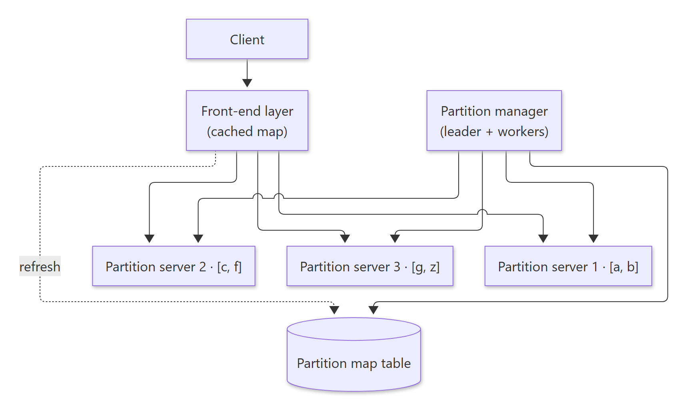

Diagram source (Mermaid)

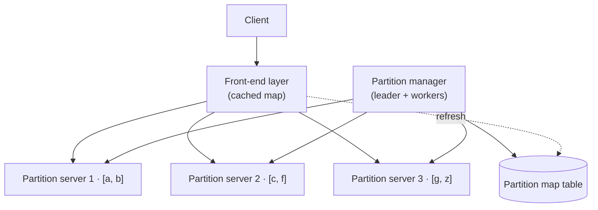

- The **partition map table** records which partition lives on which node. The **partition manager** manages partition movement and assignment.
- **One partition is owned by exactly one partition server**, but one server can own **many** partitions.
- The partition layer adds **rate limits/throttling** and **hot-partition handling**. Compute load is isolated while data stays on the same storage nodes (logical vs physical).
- **No SPOF in the manager:** a leader + workers. Workers do the heavy lifting; the leader watches them. If the leader dies → re-election.

### 2.7 Storage layer: what kind of disk, and why?

- The storage spectrum runs cache → RAM → SSD → disk → tape. **Spinning HDDs are cheap**. Getting write performance out of them means **no disk seeks**, so use **log-structured storage**.
- When writes hit the stream layer, it **always writes sequentially**. No random writes.

### 2.8 Data durability

> 🧠 Anchor: The only way to achieve durability is **duplicating data**: **sync** replicas inside the stamp, **async** copies across DCs and regions.

- Storage node 1 → **SYNC** → storage node 2 (same stamp, different rack). **ASYNC** → storage node 3 (replicated across DCs). Async also feeds cross-region S3 replication. (Business continuity plan.)

**Papers to read:** *Windows Azure Storage: A highly available cloud storage service with strong consistency* (this design closely follows it) · building a database on S3 (**SlateDB**, **Rockset**) · GFS, HDFS, Facebook's SCUBA.

🔁 Recall: What are S3's four design goals?

Strong consistency, a global namespace, multi-tenancy (isolation), cost efficiency (shared hardware).

🔁 Recall: Name the three layers in a storage stamp and their jobs.

Front-end: stateless; auth and routing via a cached partition map; streams large objects. Partition: logical ownership of key ranges, throttling, hot-range splitting. Stream: replicated, append-only distributed file system on the disks.

🔁 Recall: Why range partitioning over hashing for S3?

It keeps a bucket's objects together (locality), allows per-tenant isolation and control, and lets you split a hot range. Hashing scatters tenants and needs rebalancing when n changes.

🔁 Recall: Why keep stamps at 70% utilisation?

The 30% headroom absorbs rack failures (re-replicating the lost data) without overflowing the stamp.

---

## What these notes add beyond the slides

- **Name check:** the "storage stamp / location service / front-end · partition · stream" design is **Windows Azure Storage** (SOSP 2011). Amazon S3's internals differ in detail, but this is the canonical public design to describe in interviews, and the slides recommend that paper.
- **Partition map consistency:** front-ends cache the map. When a partition moves, a stale front-end hits the wrong server, which must reject the request so the front-end refreshes. Ownership needs a lease or epoch so two servers never both serve a range.
- **The 70/30 rule** is capacity planning for failure: the slack must be at least the largest failure domain you plan to survive (a whole rack ≈ 1/10 – 1/20 of a stamp).

## One-page memory card

<!-- diagram:f12-07 -->
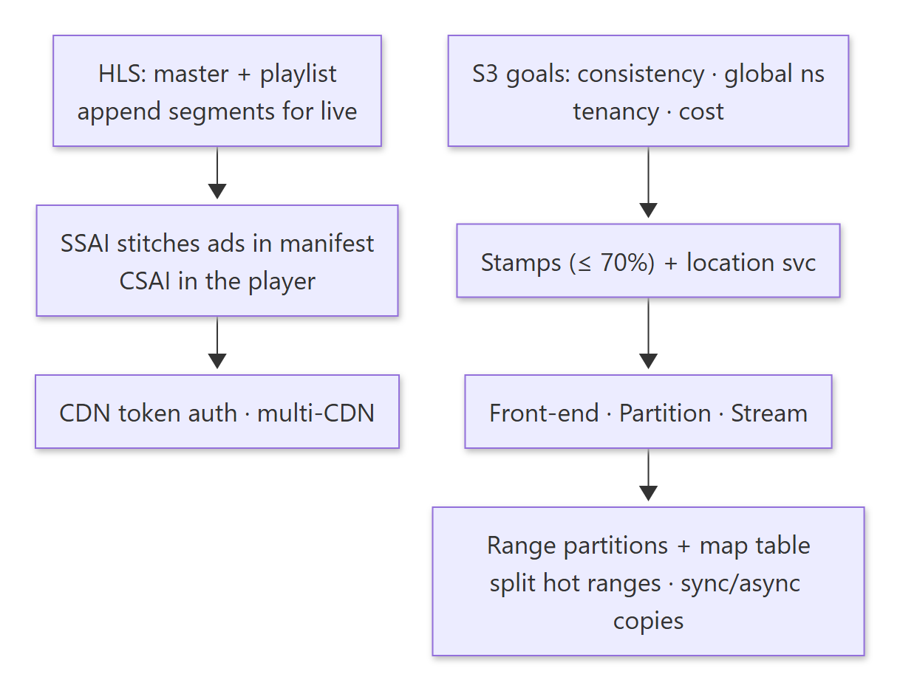

Diagram source (Mermaid)

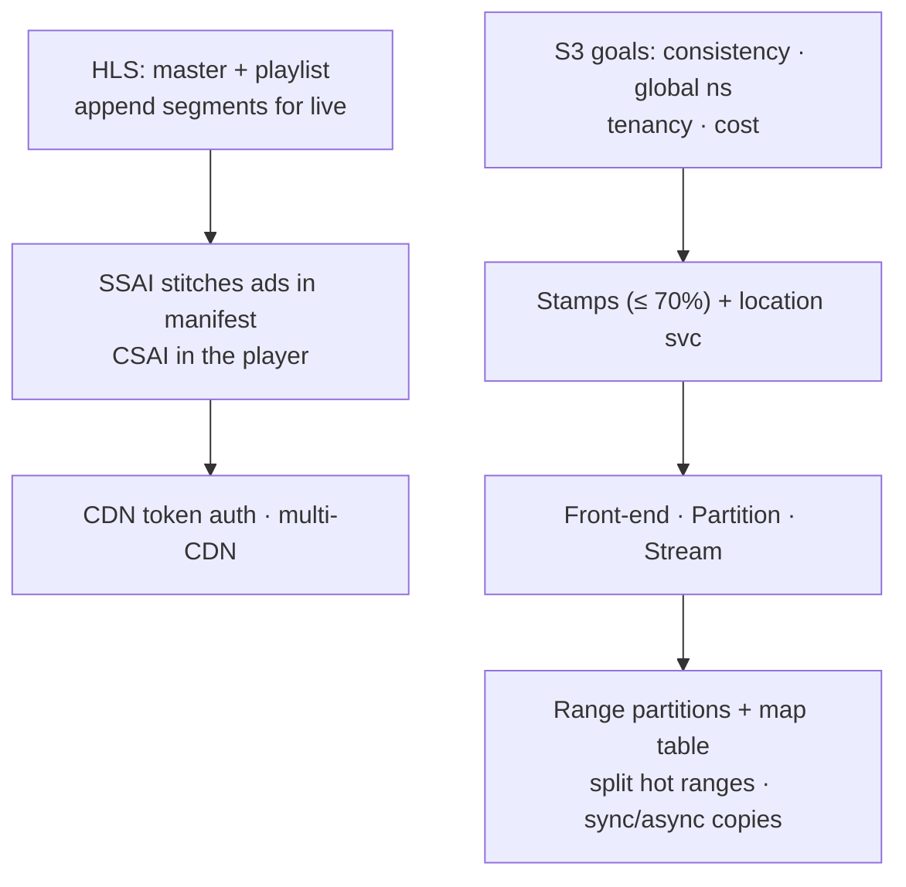

