# 07-01 · Arpit Bhayani's session notes: Information retrieval: Recent searches, Cricbuzz live commentary, Elasticsearch in production

> Source: `07-01.pdf` (System Design Masterclass, Google Drive, view-only). Study notes in my own words,
> not a copy. Pages covered: 1–19 of 19. Unreadable pages: none.
> Pages 3–4 and 10 are whiteboard overviews; the clean pages after them cover the same ideas.

## Map of the session

<!-- diagram:f13-01 -->
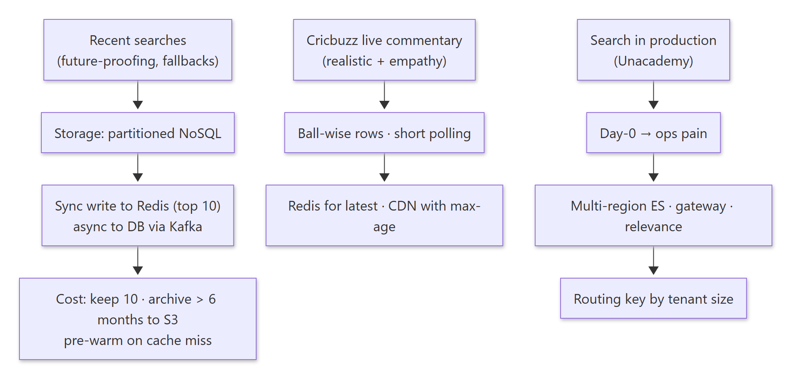

Diagram source (Mermaid)

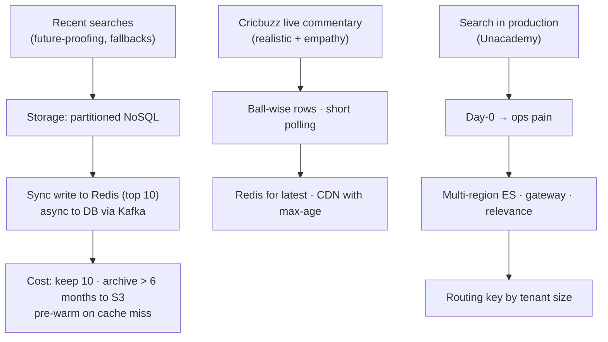

Agenda: **Designing recent searches · Designing Cricbuzz's text commentary · Running Elasticsearch in production.**

---

## 1. Designing "recent searches"

> 🧠 Anchor: **50% of users tap the search bar within the first 5 s**, and **30% of all searches happen through recent searches**. So recent searches must be **ready before the user asks**.

Focus area: future-proofing and fallbacks.

**Key questions:** bounded or unbounded data? Is stale data OK? Cross-device consistency? How to store it? Data guarantees? Cost efficiency? Order of operations? A better UX and fallbacks?

### 1.1 Storage

- We store users' **search queries**: a large volume, **high write throughput**, no relations, and access is always **per user**. So use a **partitioned NoSQL DB** (MongoDB, Elasticsearch).
- Decisions: one record per query per user, or one record per user? Should the write from the API to the DB be **sync or async**?
  - Async → via SQS or Kafka. Sync → can the DB take it? (Search is one of the most-hit APIs.) There's also a delay before the record shows up in the DB.

### 1.2 Let user behaviour drive the design

| Behaviour | Implication |
|---|---|
| 50% tap the search bar within 5 s | **High read** requests; recent searches must update in near real time and be **pre-loaded** |
| 30% of searches go through recent searches | **High write** ingestion |

- The delay between a search and it being persisted should be **zero**: (1) do a **synchronous write**; (2) because it's both read- and write-heavy, use an **in-memory store** holding the **pre-computed** result. Quick lookups, no disk, no separate index needed.
- Why not read straight from the partitioned DB? A user's records are physically scattered (`u1, sachin` · `u2, sehwag` · `u1, laxman` …), so a LIST per user is expensive at huge read volume.

### 1.3 Final design

<!-- diagram:f13-02 -->
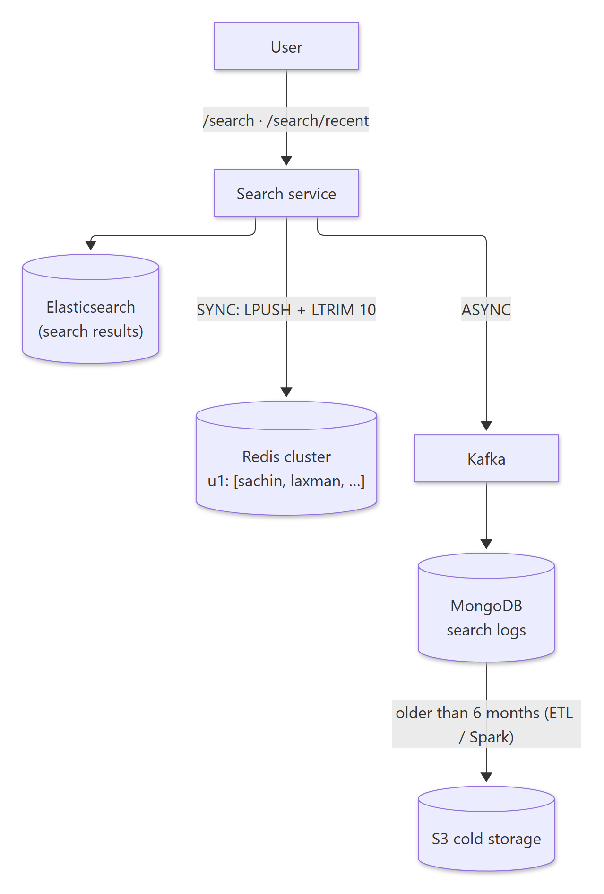

Diagram source (Mermaid)

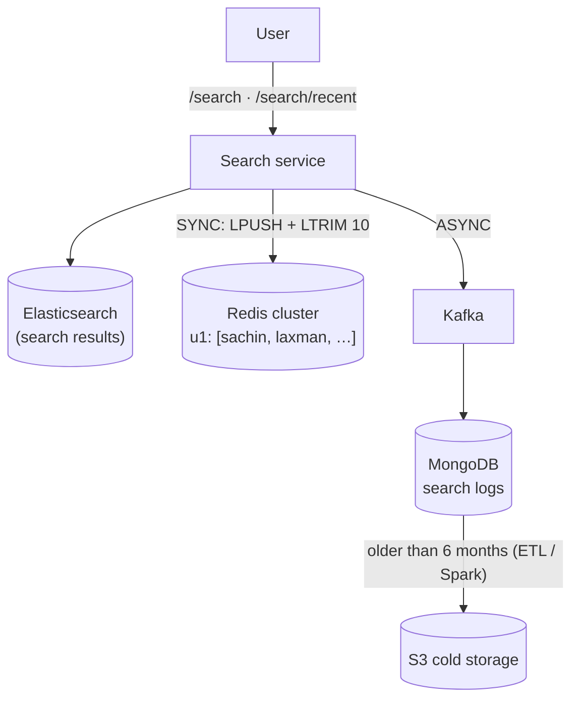

- **SYNC write to the in-memory store, ASYNC to the partitioned DB.** Async helps extensibility (other consumers can use the stream), and losing a Kafka write occasionally is OK at this volume.
- Redis holds `u1 → ["sachin", "laxman", …]`: the **pre-computed** recent 10. Extremely fast reads with no processing, and the same on every device.
- The search log has many other uses: imagine you're at a marketplace. Aggregate `query → count` (trending), sort per user by time, do analysis (fuzzy matching, related queries), keyed by user, query, region and timestamp. Writes are heavy, so it's a **cheap, persistent** log.
- **DLQ** if the Redis update fails: `try: redis.update(u, q) except: dlq.push(u, q)`.

### 1.4 Cost optimisation

1. Redis stores **only the recent 10** per user, not every query.
2. Historical queries may never be accessed again, so **archive** anything **older than 6 months** to S3 via ETL jobs (Spark). That saves a lot of money and compute. Whether old history is shown at all, or with higher latency, is a **product call**.
- **Storage estimate:** 10 queries × 16 B × 1M users = 160 MB.

### 1.5 UX: what if recent searches aren't in Redis?

- Keys get deleted from Redis (DAU ≪ total users). Fetching from the DB on demand takes time, which is poor UX.
- **Pre-warm** instead: as soon as the user opens the app, load their recent searches into Redis, so they're ready by the time the search bar is tapped.

🔁 Recall: Why write recent searches synchronously to Redis but asynchronously to the DB?

Users expect to see what they just searched immediately (zero delay) and reads are very hot, so a pre-computed in-memory list per user is written sync. The full history is for analytics and backup, so an async Kafka write is fine.

🔁 Recall: Two cost optimisations for recent searches?

Keep only the last 10 per user in Redis; archive logs older than 6 months from the DB to S3.

---

## 2. Designing Cricbuzz's live text commentary

> 🧠 Anchor: **Design realistically, with empathy.** Commentary changes about once a minute, so **short polling + caching** beats WebSockets.

**Requirements:** users see live text commentary (Cricbuzz is India's 8th most-visited site) · cost-efficient architecture · good user experience.
**Brainstorm:** storage, access, cost optimisation, communication; the user interfaces (users and commentators).

### 2.1 Storage

- Per match, store **ball-wise commentary**: `match_commentary(match_id, innings, ball, text)`.
- About 600 rows per ODI × ~50,000 matches.

### 2.2 Access

- The API fetches the **latest commentary** (last ~15 balls). **No per-user offset**; just show the latest.
- **Short polling ✓, WebSockets ✗.** Sockets would be expensive and underused (about **one event per minute**). This isn't a "realtime" use case.
- Everyone fetches the same latest entries, so **cache them in Redis**. New commentary → write the **cache and the DB** directly (you can't wait for cache invalidation).

<!-- diagram:f13-03 -->
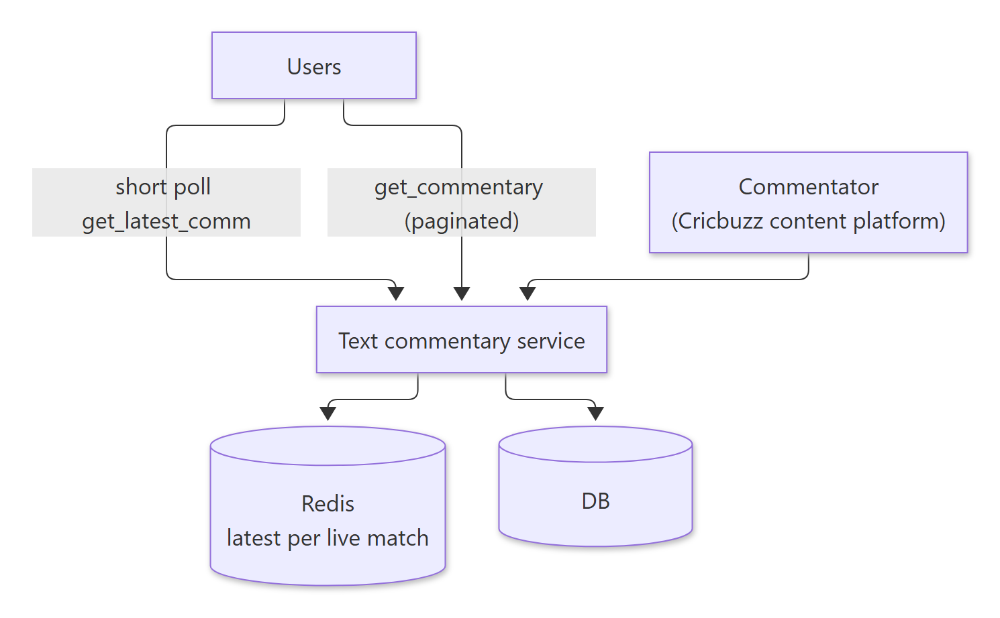

Diagram source (Mermaid)

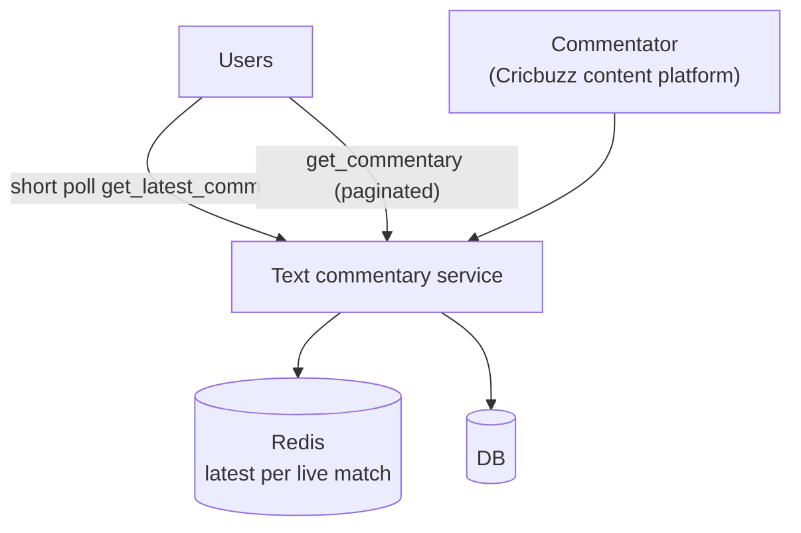

- **Cost:** archival + short polling. **Durability:** retry. **Good UX:** direct updates to Redis; reads of the latest commentary come from Redis.
- **Consistency:** Redis is updated by the commentary service when a commentator writes. The ball entry is always **upserted** (overwritten if it already exists).

### 2.3 Serving via CDN (without Redis)

- `/matches/<mid>/commentary` → the last 20 entries. `/matches/<mid>/commentary?page=1` → subsequent pages.
- Put a **CDN** in front with **`Cache-Control: max-age=5`** and **cache prefreshing at ~90%** of the TTL. The latest commentary comes from the CDN; page 1 onwards and other APIs go to the API.
- Prefreshing works because the TTL is small: the CDN re-fetches *before* expiry, so users never wait on a miss.

🔁 Recall: Why short polling, not WebSockets, for cricket commentary?

Updates are about one per minute and everyone reads the same data. Persistent sockets for millions would be expensive and mostly idle; cached short polls (Redis or CDN with a few seconds' max-age) are cheaper and good enough.

---

## 3. Running Elasticsearch in production (Unacademy)

> 🧠 Anchor: Search is a **platform**: it's everywhere (live search, recent updates, dashboards, …), so it needs stability, relevance experiments, and **tenant isolation**.

**Requirements:** better stability and reliability · improved relevance and search experimentation · large customer growth · a consistent search experience across all microservices and features.

### 3.1 Day-0 architecture and its pain

<!-- diagram:f13-04 -->
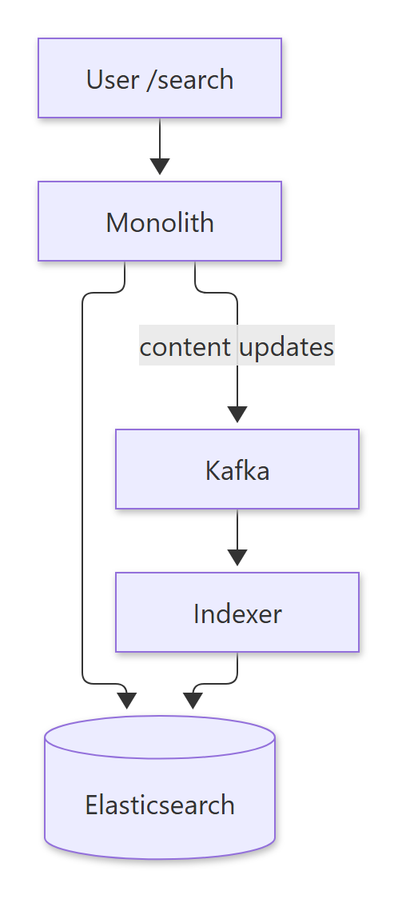

Diagram source (Mermaid)

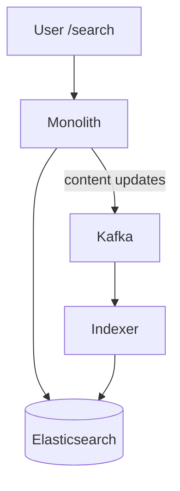

**Operational concerns:**
1. When ES goes down or is unhealthy, getting back to health is painful: time-consuming and needs expertise.
2. The Day-0 architecture is fine early on but limits performance and experimentation at scale.
3. Debugging ES needs core expertise.
4. No automatic replication or latency-based routing.
5. Large tenants need *many* nodes, which shoots up the cost.
6. Rate limiting and throttling are missing.

### 3.2 New architecture

<!-- diagram:f13-05 -->
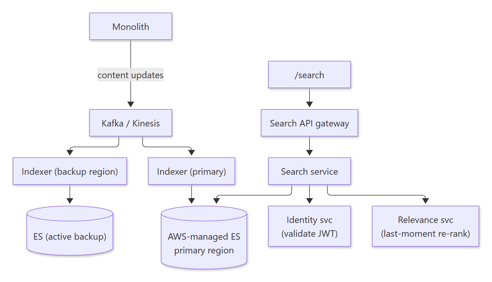

Diagram source (Mermaid)

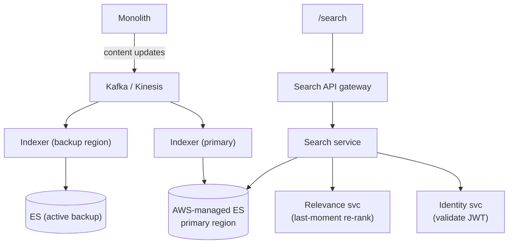

- **Write path:** content updates go to Kafka/Kinesis, and separate indexers fill the primary *and* a backup-region ES cluster.
- **Read path:** search API gateway → search service → identity (JWT validation) + relevance (**re-ranks results at the last moment**) → managed ES.
- **Multi-region failover + latency-based routing.** If there's a single region and it has a maintenance window or outage: copy (~2 h), load, sync, fail over, switch back when done. Latency-based routing is a nice by-product (e.g. a user travelling, or switching from office Wi-Fi to mobile hotspot).

### 3.3 Hot shards → routing keys by tenant size

> 🧠 Anchor: Some tenants are far bigger than others, so random distribution creates **hot shards** and **under-used shards**. Use a **routing key**, sized by tenant.

- An ES index has multiple shards; the **routing key** decides which shard a document lands on: `PUT /index-airbnb/_doc/1?routing=xyz`. The classic routing key is `tenant_id`.
- **Strategy:**
  - **Small tenant** → all its docs on **one shard**: `shard = tenant_id % NUM_SHARDS` (e.g. 729 % 10 = shard 9).
  - **Large tenant** → **split across several shards**: `routing = tenant_<id>_<doc_id % N>` (e.g. tenant_729_2, tenant_729_1).
- Benefits: (1) scalable even for large tenants; (2) handles the **noisy-neighbour** problem; (3) no custom service or config, just pass the routing key; (4) operationally simple.

🔁 Recall: How does the routing-key strategy avoid hot shards?

Small tenants are pinned to one shard (tenant_id % shards), so their queries hit one shard. Large tenants spread across N shards by adding doc_id % N to the routing key, so no single shard carries a giant tenant.

🔁 Recall: What did the production search revamp add over Day 0?

Separate indexers writing to a primary and a backup-region ES; a search gateway with identity (JWT) and relevance re-ranking; multi-region failover and latency-based routing; routing keys for tenant isolation.

---

## What these notes add beyond the slides

- **Redis recipe for "recent 10":** `LREM key 0 q` (dedupe) → `LPUSH key q` → `LTRIM key 0 9`, in a `MULTI` or Lua script so concurrent searches don't interleave.
- **Arithmetic checked:** 10 × 16 B × 1M = 160 MB ✔ (that's raw bytes; Redis per-key and list overhead easily doubles it).
- **CDN prefresh** (refresh at ~90% of TTL) is "stale-while-revalidate" in standard HTTP terms: `Cache-Control: max-age=5, stale-while-revalidate=…`.
- **ES routing caveat:** with a custom routing key, queries must pass the same routing to stay on one shard. Otherwise ES fans the query out to all shards and the isolation benefit is lost.

## One-page memory card

<!-- diagram:f13-06 -->
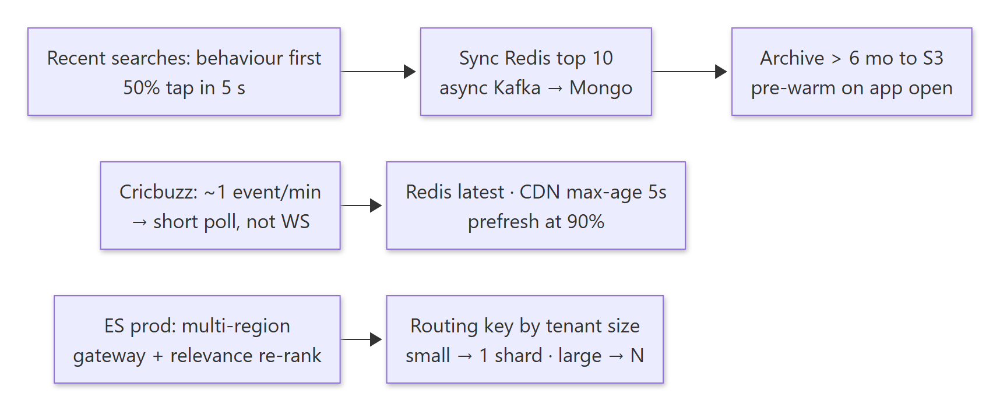

Diagram source (Mermaid)

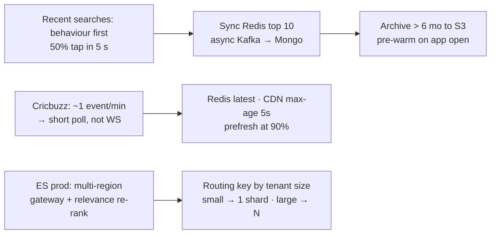

