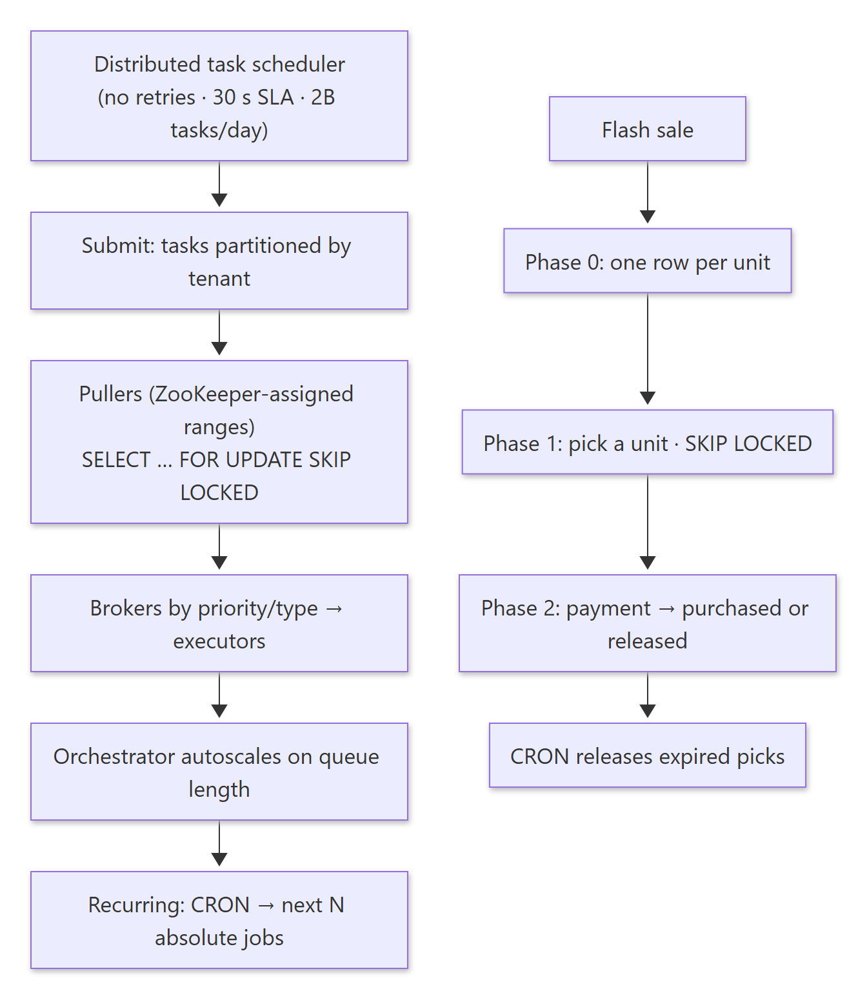
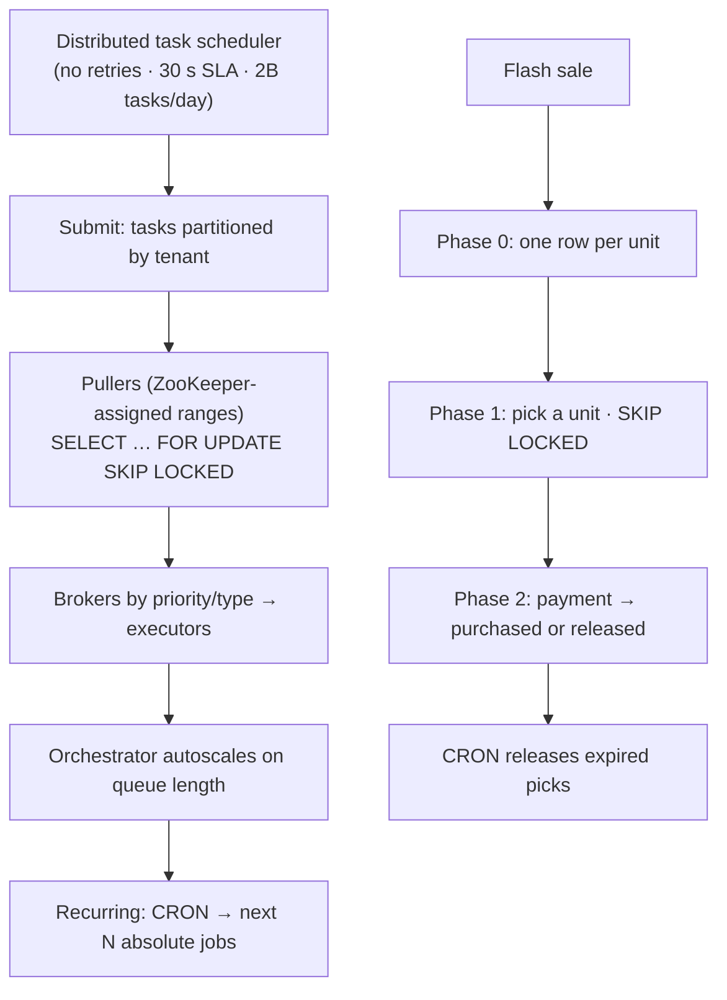
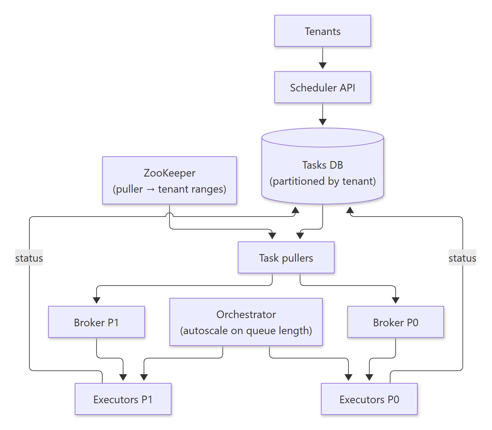
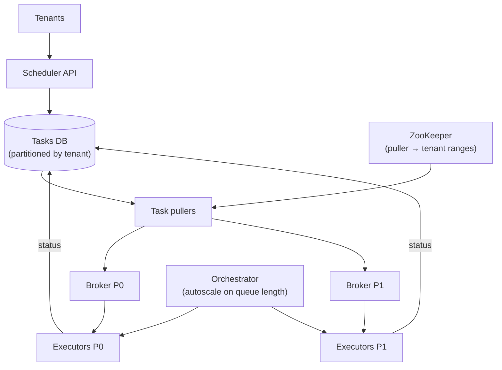
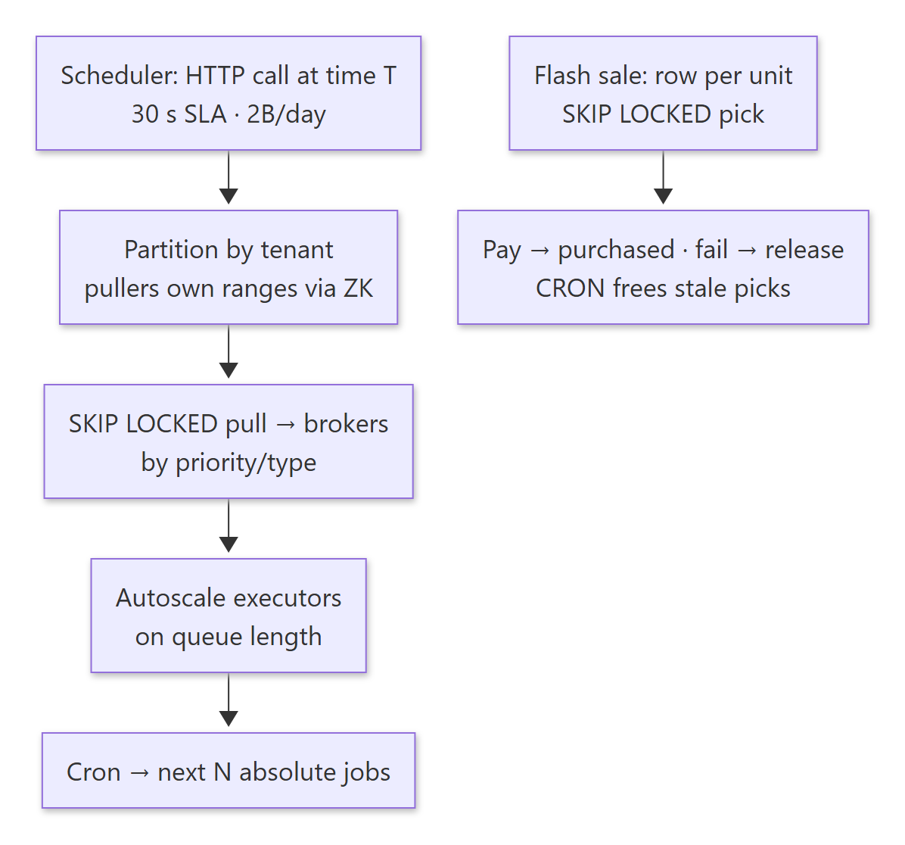
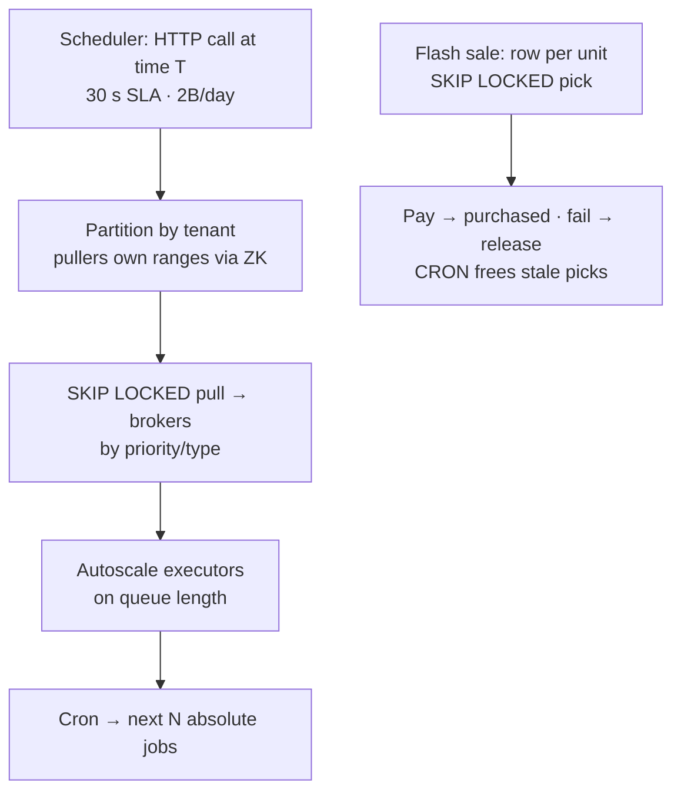

# 07-02 · Arpit Bhayani's session notes: Distributed task scheduler + Flash sale

> Source: `07-02.pdf` (System Design Masterclass, Google Drive, view-only). Study notes in my own words,
> not a copy. Pages covered: 1–17 of 17. Unreadable pages: none.
> Pages 4–6 are whiteboard drafts; the clean pages 7–11 cover the same design and the notes follow those.

## Map of the session

<!-- diagram:f14-01 -->


<details><summary>Diagram source (Mermaid)</summary>



</details>

Agenda: **Distributed task scheduler · Flash sale.**

---

## 1. Distributed task scheduler (without retries)

> 🧠 Anchor: Like **Dkron / AWS CloudWatch Events**: run a task **at a fixed time** or **on a CRON**, within a **30-second SLA**, for many tenants (~**2B tasks/day**). Executing a task means **making an HTTP call**; the target service does the real work.

**Requirements:**
- Schedule a task to run at a certain time (fixed) or as a recurring task (cron).
- **30 s SLA**: a task scheduled at 10:01:00 must start before 10:01:30.
- Minute-level granularity. Multi-tenant (2B tasks/day; each tenant is a team in the org).
- Extreme scale + SLA → multi-tenancy, replicable infra, good unit economics.

**Brainstorm:** store, pick, execute, task routing, multi-tenancy. A strict SLA means the system must be **horizontally scalable and fault tolerant**, and every component you add must respect that.

### 1.1 Submitting a task

- A task is defined by a **command**: a self-contained script or HTTP call that has everything it needs to run.
- Multi-tenant: many microservices and consumers use it. At ~2B tasks/day one DB node isn't enough, so **partition tasks by tenant** (customer/microservice).

### 1.2 Execution

- A set of **executor nodes** runs tasks, segregated by **priority** (P0 vs P1) and **type** (memory-heavy vs CPU-heavy).
- Executors report **status** back to the DB. An **orchestrator autoscales** executors based on **queue length** at the brokers and on predicted scale.
- From storage to execution: **pick tasks as fast as possible**, then send them for execution as fast as possible.

<!-- diagram:f14-02 -->


<details><summary>Diagram source (Mermaid)</summary>



</details>

### 1.3 Task pullers

> 🧠 Anchor: Pullers **pull due tasks and enqueue them**. Each owns a **range of tenants** (kept in ZooKeeper), so they never compete, and a dead puller's range gets reassigned.

- They must be **horizontally scalable and fast**.
- On boot, a puller asks ZooKeeper for a range of services/customers, queries the DB for those tenants' due tasks, and enqueues them.
- **Fault tolerant:** if a puller dies, its range is assigned to another puller.

### 1.4 Pulling fast and safely (plain MySQL)

```sql
-- jobs(id, job, scheduled_at, picked_at, started_at, ended_at)
SELECT * FROM jobs
WHERE scheduled_at <= NOW() + 5s       -- slight look-ahead
  AND picked_at IS NULL
ORDER BY scheduled_at ASC
LIMIT 10
FOR UPDATE SKIP LOCKED;
-- then UPDATE jobs SET picked_at = NOW() WHERE id IN (...)  (same txn) and enqueue
```

- `SKIP LOCKED` lets several pullers grab **different** rows concurrently without blocking each other (the same trick as airline seats in 02-01).
- **Measure the SLA in parts:** `picked_at − scheduled_at` (pull lag) and `started_at − picked_at` (queue lag). The total must stay under 30 s.
- Properties: high availability, fault tolerance, true horizontal scalability, single-node efficiency.

### 1.5 Recurring tasks

> 🧠 Anchor: **CRON → absolute → regular flow.** Expand a cron schedule into its **next N concrete runs** and insert them as normal jobs.

| tasks | jobs |
|---|---|
| id, task, schedule (cron), scheduled_at | id, task_id, scheduled_at, picked_at, started_at/ended_at |

- When a task is created: compute its **next 10 executions** and add them to `jobs`.
- When a job is picked: compute the next one(s) and add them (e.g. 10:00 → 10:01 … 10:05).
- Insert with `INSERT … ON CONFLICT DO NOTHING` so re-computing never creates duplicates.

**Exercises** (very similar to a task scheduler): build SQS on top of MySQL · build Kafka on top of MySQL · build any primitive broker using Bitcask as its storage engine.

<details><summary>🔁 Recall: How do many pullers fetch due tasks without stepping on each other?</summary>

Each puller owns a disjoint tenant range from ZooKeeper, and within that it uses SELECT … WHERE scheduled_at <= now AND picked_at IS NULL ORDER BY scheduled_at LIMIT n FOR UPDATE SKIP LOCKED, then marks the rows picked in the same transaction.
</details>

<details><summary>🔁 Recall: How are cron tasks executed in this design?</summary>

The cron expression is expanded into the next N absolute run times, inserted as ordinary jobs (idempotently). Each pick schedules more, so they flow through the normal path.
</details>

<details><summary>🔁 Recall: What scales the executors?</summary>

An orchestrator watching broker queue length (and predicted load), autoscaling executor fleets per priority or type.
</details>

---

## 2. Flash sale

> 🧠 Anchor: **Fixed inventory + contention.** Model it like a real store: **one row per physical unit**, and let people "pick it off the shelf" with `SKIP LOCKED`.

**Setup:** a fixed set of items and units (e.g. **Mi 8 × 10,000 units**); many people come in to buy in a short window. Brainstorm: breakdown and empathy. (Pre-read: Shopify's flash-sale talk.)

### 2.1 The naive approach

- `product(id, name, qty)` and `UPDATE product SET qty = qty − 1 WHERE id = ?` inside a transaction with `SELECT … FOR UPDATE`.
- **Every buyer locks the same row**, so everything serialises on one hot row.

### 2.2 Phase 0: prepare the stock

| units: id | item_id | picked_at | picked_by | purchased_by |
|---|---|---|---|---|
| 1 … 10000 | 720 | NULL | NULL | NULL |

Selling 10,000 Mi 8 phones (item 720) → **10,000 rows** in `units`.

### 2.3 Phase 1: let them pick it (add to cart)

> 🧠 Anchor: High throughput + contention → **only N should succeed**. `FOR UPDATE SKIP LOCKED LIMIT 1` gives each buyer a *different* free unit, non-blocking.

```sql
BEGIN;
SELECT * FROM units
WHERE item_id = 720 AND picked_at IS NULL
ORDER BY id LIMIT 1
FOR UPDATE SKIP LOCKED;
UPDATE units SET picked_at = NOW(), picked_by = 1023 WHERE id = ?;
COMMIT;   -- then add to cart
```

- Both queries run in **one transaction**. `SKIP LOCKED` ensures non-sequential, non-blocking execution, and `FOR UPDATE` makes the unit unavailable to others.

### 2.4 Phase 2: payment

- **Success:** set `purchased_by = ?, purchased_at = NOW()` (check that `picked_at` is still yours), create the order, etc.
- **Failure:** make the unit available again: `picked_at = NULL, picked_by = NULL`.
- ⚠ **You can't have a distributed transaction spanning add-to-cart and payment.** They're separate steps with compensation.

### 2.5 Abandoned carts

- A **CRON job** releases "expired" picks:
  `UPDATE units SET picked_at = NULL, picked_by = NULL WHERE picked_at < NOW() − 12 min AND purchased_by IS NULL;`
- Optionally keep some **extra inventory** as a buffer.

**Similar systems** (fixed inventory + contention): any ticket booking site, BookMyShow, IRCTC, hotel booking.

<details><summary>🔁 Recall: Why one row per unit instead of a qty column?</summary>

A qty column makes every buyer lock the same row (serialised). Per-unit rows let SKIP LOCKED hand each concurrent buyer a different free row, so contention spreads across 10,000 rows.
</details>

<details><summary>🔁 Recall: What happens to units picked but never paid for?</summary>

A periodic job clears picked_at and picked_by for units picked more than ~12 minutes ago and not purchased, returning them to stock.
</details>

---

## What these notes add beyond the slides

- **"Without retries" is a deliberate scope cut.** Real schedulers need at-least-once execution plus idempotency on the target (the HTTP endpoint gets an idempotency key), retries with backoff, and a DLQ.
- **Look-ahead window:** `scheduled_at <= NOW() + 5s` lets pullers enqueue a few seconds early, absorbing pull lag within the 30 s SLA. Executors can sleep until the exact time if precision matters.
- **2B tasks/day ≈ 23k tasks/s on average** (peaks much higher, e.g. on-the-hour crons), which is why one DB node isn't enough.
- **Flash sale at extreme scale:** even per-unit rows can strain one DB. A common next step is a **pre-loaded token queue** (e.g. a Redis list of unit ids: `LPOP` = pick), with the DB updated asynchronously.

## One-page memory card

<!-- diagram:f14-03 -->


<details><summary>Diagram source (Mermaid)</summary>



</details>
