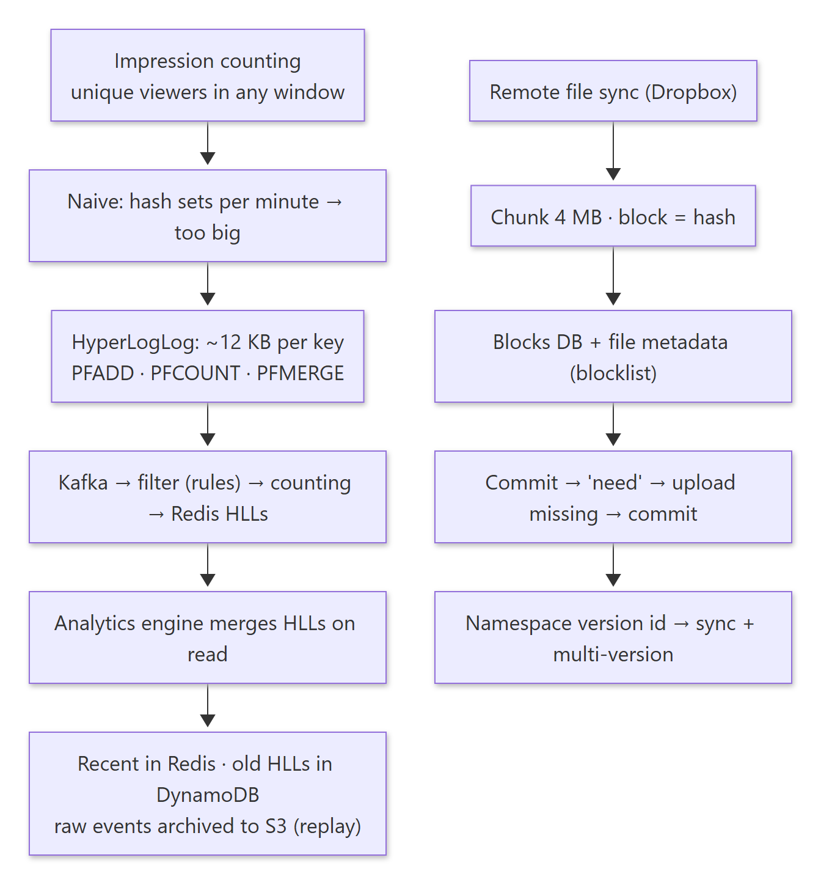
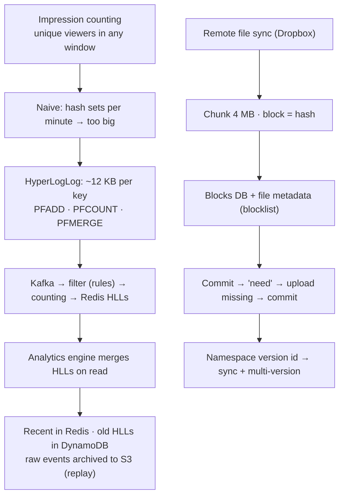
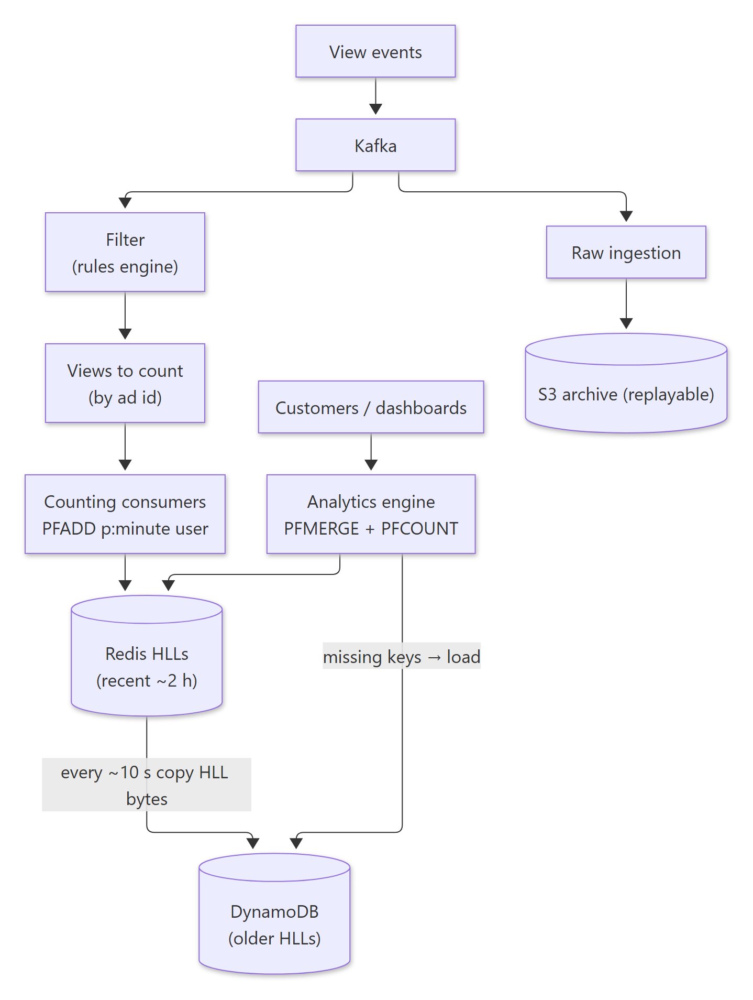
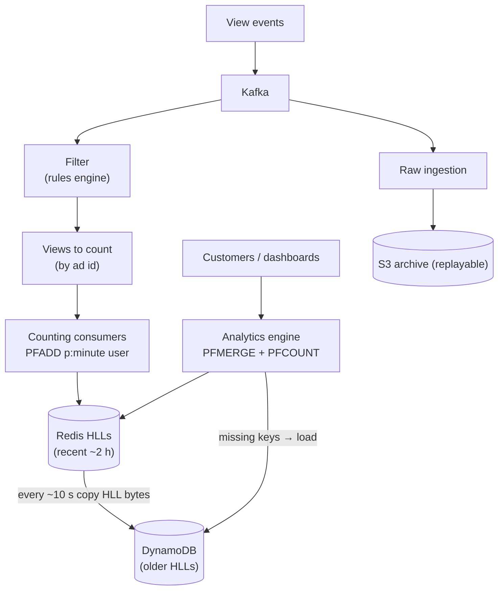
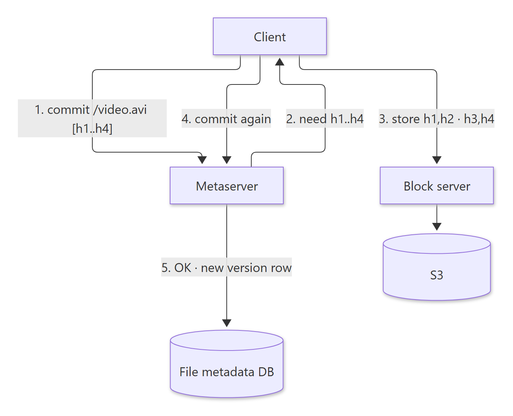
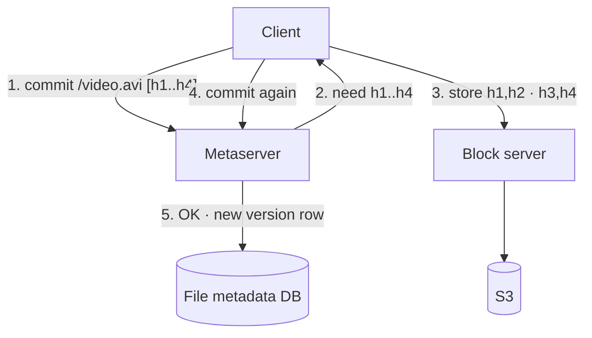
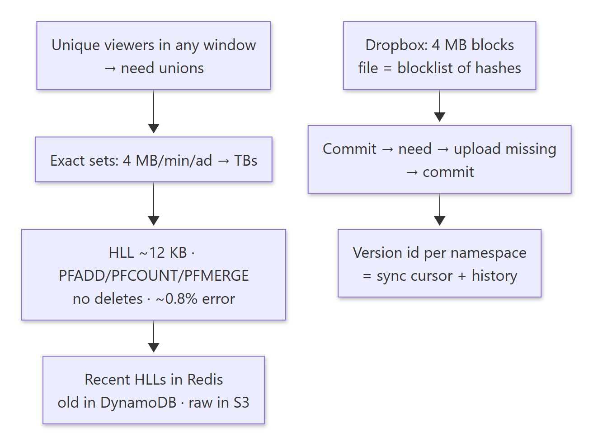
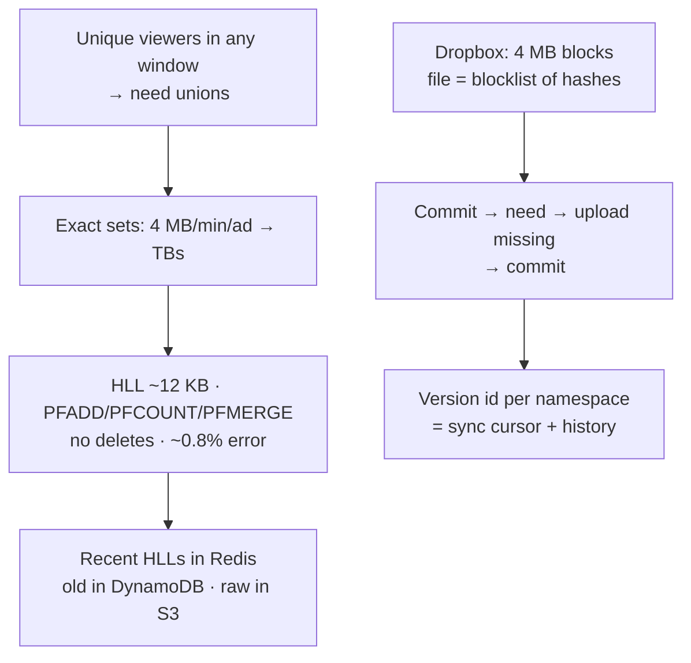

# 08-01 · Arpit Bhayani's session notes: Impression counting (HyperLogLog) + Remote file sync (Dropbox)

> Source: `08-01.pdf` (System Design Masterclass, Google Drive, view-only). Study notes in my own words,
> not a copy. Pages covered: 1–22 of 22. Unreadable pages: none.
> Pages 5 and 10 are whiteboard drafts; the clean pages around them cover the same design.

## Map of the session

<!-- diagram:f15-01 -->

Diagram source (Mermaid)

Agenda: **Impressions counting · Remote file sync.**

---

## 1. Impression counting

> 🧠 Anchor: "Total **unique** visitors in the last *n* time units", with *n* chosen **at runtime**. It powers views on LinkedIn posts, YouTube videos, Google search results, Reddit posts, AdSense ads, Instagram photos, TikTok videos.

- Problem: not everyone reacts, so how do you measure engagement? Ad-tech firms want to render a graph of how a campaign performed.
- **Requirements:** realtime or near-realtime · no fixed aggregates (n is chosen at runtime) · each user counted once per time window · the count can be a close **approximation** · some rules to filter out unwanted events.

### 1.1 What we must answer

- "Count **distinct** users on a post (ad) from 04/01/2022 to 08/01/2022 10:00" and render the dashboard.
- Example stream: 10:00 A, 10:00 B, 10:01 C, 10:01 B, 10:02 B, 10:02 A → **3** unique (A, B, C) in 10:00–10:02. Then 10:03–10:05 has {A, B, D, E} = **4**. 10:00–10:05 = {A, B, C, D, E} = **5**. Windows **overlap**, so you can't just add the counts.

### 1.2 Naive: a hash set per time bucket

- `p1:20220401_1200 = {a, b, c, d, e, f}`, `…_1300 = {a, c, z, w, x}`, `…_1400 = {c, d, f, l, z}`. Total unique = **set union** = 10.
- Taxing on CPU and memory, and slow to compute. **Granularity is critical.**
- **At scale:** user_id ≈ 4 B, and 1M people view an ad in one minute → **4 MB**. Unique visitors in the last hour → 60 × 4 MB = **240 MB** of processing for one ad. Thousands of customers each checking their campaigns → 5000 × 240 MB = **1,200 GB**. Not sustainable.

### 1.3 Approximate it: cardinality estimation with HyperLogLog

> 🧠 Anchor: Trade a little accuracy for a huge saving in space. An **HLL** estimates the cardinality of a set (and of unions) in about **12 KB**, versus **4 MB** for the exact set (~0.3%).

- Space vs time vs accuracy (and money). This is the **cardinality estimation problem**: efficiently approximate the cardinality of the set you get after *n* unions.
- HyperLogLog builds on the **Flajolet–Martin** algorithm (the session points to Arpit's blog post on it). Here it's used as a black box.
- **Redis gives you HLL out of the box:**

| Operation | Redis command | Cost |
|---|---|---|
| Add an element | `PFADD key elem` | O(1) |
| Count (cardinality) | `PFCOUNT key` | O(1) |
| Merge N HLLs | `PFMERGE dest k1 k2 …` | O(N) |
| Raw bytes (to persist or move) | `GET key` / `SET key bytes` | |

- ⚠ **You can't delete from an HLL** (like a Bloom filter, it's lossy).
- Keys like `p1:20220401_1200` = an HLL of the unique visitors to post p1 in that minute.
- **Total unique for p1 over a range:** `PFMERGE temp p1:…1200 p1:…1300 …` → `PFCOUNT temp`.

### 1.4 Architecture

<!-- diagram:f15-02 -->

Diagram source (Mermaid)

- **Filter rules** (realistic): 0 views if a user watches their own video; a minimum watch time (e.g. 5 s); many views from one user within a minute count as 1.
- **Write path:** counting consumers read from Kafka and `PFADD post:minute user_id` into the right HLL. (Events always move forward in time.)
- **Read path:** a separate analytics engine reads the relevant HLLs from Redis, merges them, computes the cardinality (`PFMERGE` + `PFCOUNT`) and responds.

### 1.5 Does it work at scale?

> 🧠 Anchor: YouTube has millions of videos and billions of events, so you **can't keep every HLL in Redis**. Keep the **last 30 min to 2 h** in Redis; **periodically copy HLL bytes to a cheap KV store** (DynamoDB) and **load them back on demand**.

1. HLLs are always updated in Redis (only Redis knows HLL semantics).
2. Every ~10 s, HLLs are copied from Redis to DynamoDB (`GET p1:…1200` → raw bytes).
3. If a key isn't in Redis, it's brought in from DynamoDB.
4. For an analytics query, all relevant HLLs are brought into Redis, then the cardinality is computed.
- Data is immutable once a minute has passed, so it's safe to cache and copy. You can also pre-aggregate hour or day HLLs to optimise long-range queries.

### 1.6 Robustness: replayability and cost

- **What if the rule engine had a bug and you need to replay events?** Archive raw events (ETL) to **S3** (storage-optimised, durable) so they can be replayed later. Filtered events also go to S3.
- A temp database + aggregator handle hot data; a customer console (B2B) reads through the read path.

🔁 Recall: Why can't you sum per-minute unique counts to get the hourly unique count?

The same user appears in several minutes; summing double-counts them. You need a union. HLLs support merge (PFMERGE), so you merge the per-minute HLLs, then count.

🔁 Recall: HLL trade-offs?

About 12 KB per key regardless of cardinality, O(1) add and count, mergeable; but approximate (~0.81% standard error in Redis) and no deletes.

🔁 Recall: How does the design keep Redis costs bounded?

Only the recent window lives in Redis. HLL bytes are periodically copied to DynamoDB and reloaded on demand for older ranges; raw events are archived to S3 for replay.

---

## 2. Remote file sync (Dropbox)

> 🧠 Anchor: Files uploaded from one device must be **uploaded efficiently** and **synced efficiently** to the others. Two challenges: **resumable uploads/downloads**, and how clients **learn about changes**.

**Brainstorm:** resumable uploads and downloads · the core intuition is identifying *what changed* · multi-versioning.

### 2.1 Chunking makes it better

> 🧠 Anchor: Split a file into **4 MB blocks**; each block's **hash** is its identifier. A file = its **blocklist** `[h1, h2, h3, h4]`.

- A 14 MB `video.avi` → blocks of 4 + 4 + 4 + 2 MB → `h1…h4`. That gives **parallel and resumable** uploads.
- How to store a file on S3? (1) each chunk as a new object, or (2) S3 multipart upload. Store blocks content-addressed: `s3://my-dropbox/<account-id>/<block-hash>`. Identical blocks are stored once (dedupe).

### 2.2 Metadata

| Blocks DB | File metadata DB |
|---|---|
| namespace (account) id · block hash · actual block (S3 path) | namespace id · relative path (`/video.avi`) · blocklist (`h1, h2, h3, h4`) · **version id** (monotonically increasing per account) |

- The blocks table answers "does this account already have block h?". The version id turns out to be crucial (see 2.4).

### 2.3 Upload protocol

<!-- diagram:f15-03 -->

Diagram source (Mermaid)

1. The client asks the metaserver to commit `/video.avi` with hashes `h1…h4`.
2. The metaserver checks the blocks DB: **none exist**, so it replies "need h1–h4".
3. The client uploads blocks to the **block server**, two at a time, waiting for acks until all are uploaded.
4. The client **re-commits**; this time it succeeds and a new row is added to the file metadata DB.

**A file changed?** A few bytes changed inside block 3: the new blocklist is `h1, h2, h3′, h4`. Commit → the metaserver says "need h3′" → upload **one 4 MB block** → re-commit → version 2.

### 2.4 How clients learn what changed: the version id

> 🧠 Anchor: **Sequentialise** updates per namespace. Every change increments the namespace's **version id**. A client says "I'm at version 2, what's new?", **just like a Kafka offset**.

| version | namespace | path | blocklist |
|---|---|---|---|
| 1 | arpit | /video.avi | h1 h2 h3 h4 |
| 2 | arpit | /video.avi | h1 h2 h3′ h4 |
| 3 | arpit | /photo.jpg | h6 |
| 4 | arpit | /notes.txt | h7 h8 |
| 5 | arpit | /photo.jpg | h6′ |

- It's a unified way of notifying all clients: any update is just the next row in the table. The metaserver forwards everything after the client's cursor.

### 2.5 Multi-versioning for free

- Old versions are just old rows, so you can reconstruct any version: `v1 of video.avi = h1, h2, h3, h4`. h3 is still present on the block server, so the file can be rebuilt easily.
- **Similar systems:** S3 versioning; Google Drive and multi-versioning.

🔁 Recall: How does Dropbox upload only what changed?

Files are split into 4 MB blocks identified by hash. On commit, the metaserver compares the blocklist with the blocks it already has and asks only for the missing hashes; the client uploads those, then re-commits.

🔁 Recall: How do other devices discover changes?

Every commit appends a row with an incrementing per-namespace version id. A device stores the last version it applied and asks for everything after it, like a Kafka consumer offset.

---

## What these notes add beyond the slides

- **Arithmetic check:** 12 KB / 4 MB ≈ **0.3%**. The slide's "0.15% of space" doesn't follow from those numbers (0.15% would be ~6 KB). Redis dense HLLs are 12 KB (sparse encoding is smaller for low cardinalities).
- **HLL error:** Redis HLL has a **0.81% standard error**, which is fine for "views", not for billing.
- **Content-defined chunking:** fixed 4 MB blocks mean inserting one byte near the start shifts every block (all hashes change). Rolling-hash chunking (as in rsync/LBFS) keeps boundaries stable.
- **Block hashes per account:** Dropbox scopes dedupe per namespace; global cross-user dedupe can leak information (a hash collision proves someone has the file).

## One-page memory card

<!-- diagram:f15-04 -->

Diagram source (Mermaid)

