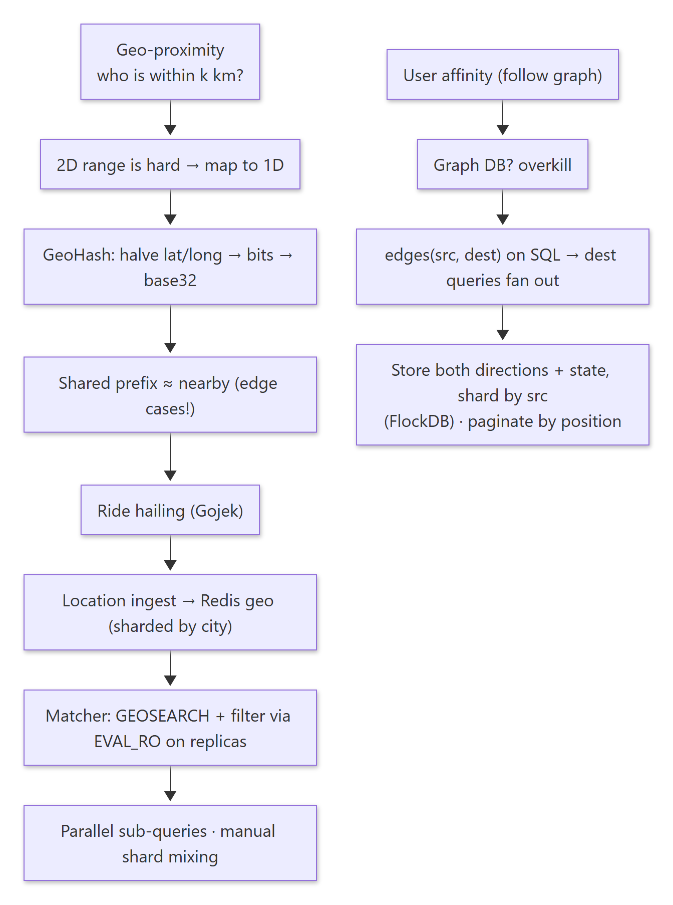
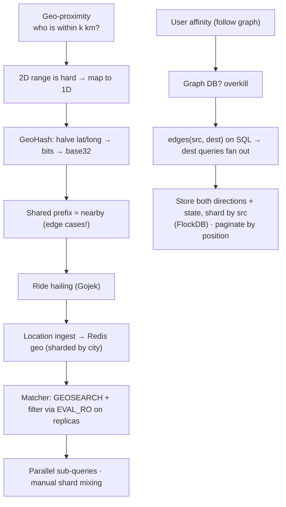
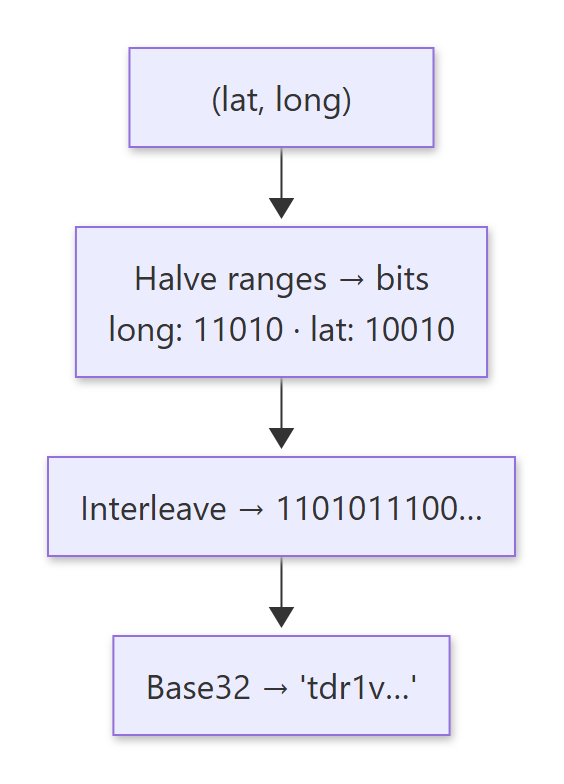
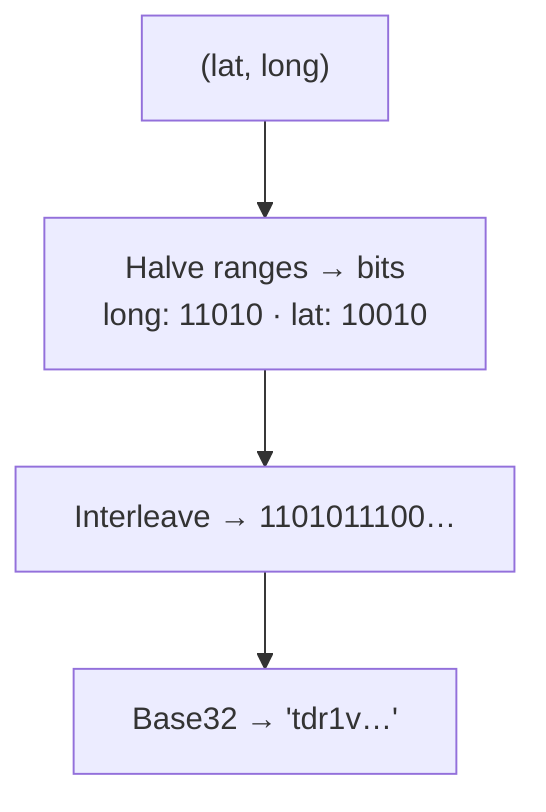
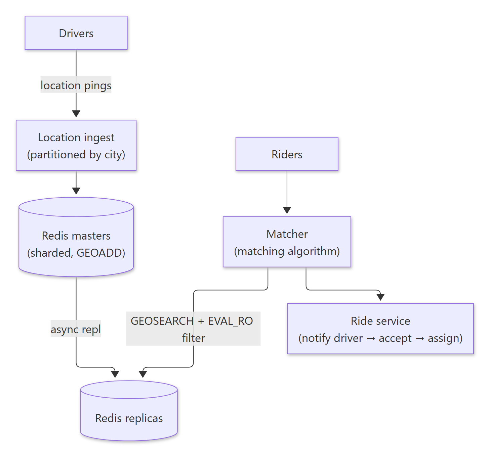
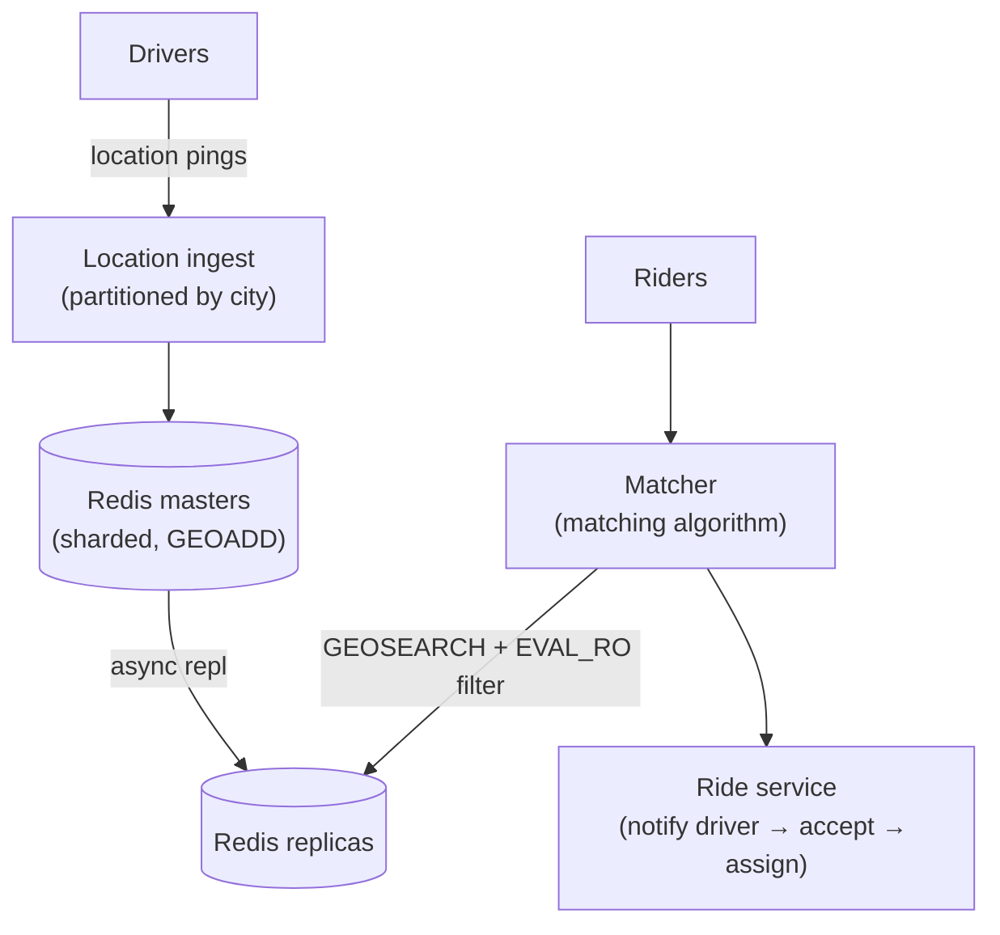
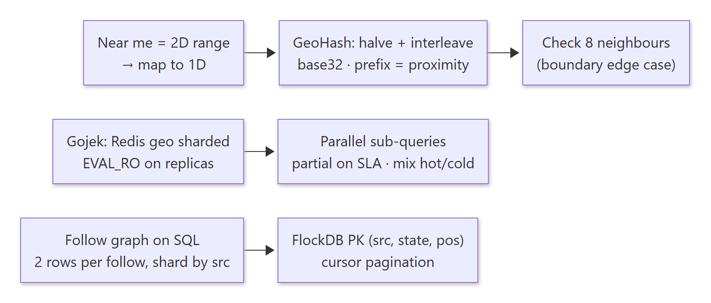
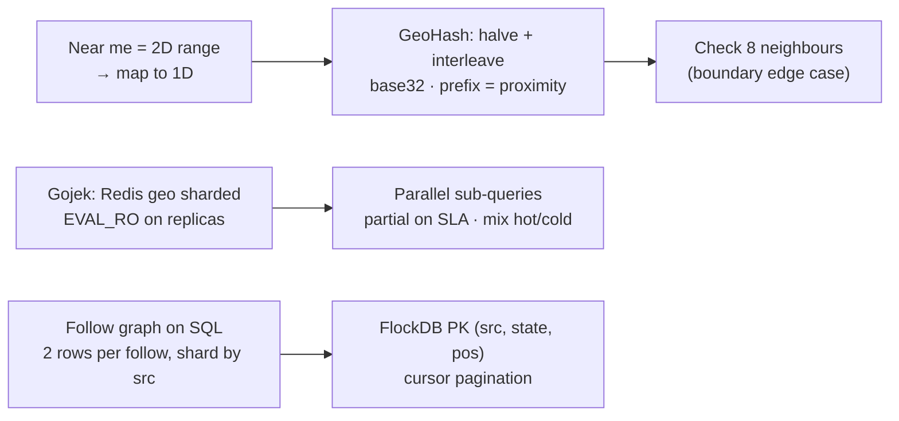

# 08-02 · Arpit Bhayani's session notes: Geo-proximity & ride hailing (Uber/Gojek) + User affinity (follow graph)

> Source: `08-02.pdf` (System Design Masterclass, Google Drive, view-only). Study notes in my own words,
> not a copy. Pages covered: 1–24 of 24. Unreadable pages: none.
> Pages 4 and 10 are whiteboard drafts; the clean pages after them cover the same ideas.

## Map of the session

<!-- diagram:f16-01 -->


<details><summary>Diagram source (Mermaid)</summary>



</details>

Agenda: **Geo-proximity & ride-hailing service (Uber) · User affinity service.**

---

## 1. Geo-proximity

> 🧠 Anchor: It's what makes Tinder, Ola, Uber, Swiggy, Zomato, Google Stores, Facebook nearby friends, Yulu and Zoomcar possible: **efficiently finding who or what is near you.**

**Problem statement:** find the people within *k* km radius of you.

### 1.1 Why is it so hard?

- Naive: for every point *p*, check `d(p, a) ≤ k`, which is **O(n)** per query.
- Bounding box: `xa − k < xb < xa + k` and `ya − k < yb < ya + k`. With points sorted by x and y you can binary-search each axis, but you're intersecting **two** range results. In-memory and multi-dimensional, that gets complicated.
- **One dimension is easy:** segment trees or a sorted index answer range queries efficiently.
- So **map (x, y) → z**, a single number, so that nearby points get nearby z. Space-filling curves (**Z-order**, **Hilbert curve**) do this. Interleave the bits: A = (10011), C = (10010) → close values.

### 1.2 GeoHash

> 🧠 Anchor: **Divide and conquer.** Repeatedly halve the longitude range (left = 0, right = 1) and the latitude range (bottom = 0, top = 1), interleave the bits, and encode in **base 32**.

<!-- diagram:f16-02 -->


<details><summary>Diagram source (Mermaid)</summary>



</details>

- Worked example (Bengaluru, lat 12.9783, long 77.5999): long range [−180, 180]: mid 0 → 77.6 > 0 → **1** → [0, 180]; mid 90 → < → **0** → [0, 90]; mid 45 → > → **1**; mid 67.5 → **1**; mid 78.75 → < → **0** … Do the same for latitude, interleave, then base32.
- **Zoom in = more bits on the right; zoom out = remove bits from the right.** A longer prefix means a smaller cell.
- 32-bit numbers aren't human-readable, so GeoHash uses **base 32**, splitting each level into **32 blocks** (a 4 × 8 grid of characters).
- **Closer points → longer common prefix.** `gzzksb` and `gzzksx` are close. The data structure for prefix matching is a **trie**.
- **Edge case:** some points that are physically near can have very different GeoHashes (on either side of a cell boundary). Also query the **8 neighbouring cells**.

**The algorithm is so simple it's one SQL query:**

```sql
-- find all people in (roughly) Bangalore
SELECT * FROM people WHERE SUBSTR(geohash, 1, 5) LIKE 'tdr1v%';
```

**You don't need to build GeoHash from scratch:** geospatial databases (Redis, Elasticsearch, MongoDB) do it for you. Insert or update (lat, long), then ask for the points within 5 km of (lat, long). (Alex Xu has a good video on a proximity service.)

<details><summary>🔁 Recall: Why convert 2D coordinates into a 1D value?</summary>

1D range queries are cheap (sorted index, B-tree, prefix). Space-filling curves and GeoHash map nearby 2D points to nearby 1D values, so "near me" becomes a prefix or range lookup.
</details>

<details><summary>🔁 Recall: GeoHash's main gotcha?</summary>

Points just across a cell boundary can have very different prefixes. Always search the 8 neighbouring cells as well as your own.
</details>

---

## 2. Ride hailing (Gojek / Uber)

> 🧠 Anchor: **Availability and low latency over consistency.** A driver's location being slightly stale is fine, since locations don't change drastically in a second.

**Brainstorm (high-level design):** users, riders and drivers · location ingestion (write-heavy) · matching (read-heavy) · the ride service (rating, payment method, area, type of vehicle).

### 2.1 Architecture

<!-- diagram:f16-03 -->


<details><summary>Diagram source (Mermaid)</summary>



</details>

- **Ride flow:** find the closest drivers → notify one for acceptance → if yes, assign.
- **Key design decision: Redis to store and query location.** (1) In-memory, so fast. (2) Supports geo queries (`GEOADD`, `GEOSEARCH`). (3) **Multi-master, multi-replica**: data is sharded and stored on exclusive masters, each with its own replicas.

### 2.2 Challenge: filtering drivers with EVAL on replicas

- Filtering drivers by constraints (vehicle type, rating, …) happens through a Lua **EVAL** command. **Redis doesn't run `EVAL` on replicas**, because a script could contain commands that update data. Fire it on a replica and it replies `MOVED <master ip>`.
- Gojek wanted EVAL on replicas for filtering, so they: (1) raised an issue with the Redis team and proposed an **`EVAL_RO`** (read-only) command; (2) updated **go-redis** so it can run on replicas. (See the commits, the issues, and their engineering blog.)

### 2.3 Availability with low latency

- Instead of one big `GEOSEARCH` on a single node or replica, **split the query into smaller queries** (sub-regions) and **fire them in parallel** on multiple nodes:
  - If one node is slow, the others still respond.
  - Parallel execution makes the computation quicker.
  - **Send a partial response if the SLA is breached.**

### 2.4 Hot shards

- Splitting queries into smaller regions helps with hot shards to some extent. The key step is to **shard the data so that peak-load regions and low-traffic regions are mixed** across masters.
- That allocation was done **manually** (by Gojek's ADS service), because native Redis sharding has no business context.
- **Impact:** a truly horizontally scalable system. To handle more load, just add more nodes. Highly available, low latency.

<details><summary>🔁 Recall: Why did Gojek need EVAL_RO?</summary>

Driver filtering runs as a Lua script via EVAL, which Redis refuses on replicas (it could write). EVAL_RO marks a script read-only so it can run on replicas and spread the read-heavy matching load.
</details>

<details><summary>🔁 Recall: How does the matcher stay fast when a node is slow?</summary>

It splits the search area into smaller GEOSEARCH queries, runs them in parallel across nodes, and returns partial results if the SLA would be breached.
</details>

---

## 3. User affinity (follow / following)

> 🧠 Anchor: Potentially **n × n** edges (everyone follows everyone). A graph DB seems obvious, but it's **overkill**: no sophisticated graph algorithms, painful to manage, expensive, and **pagination is tricky**.

**Requirements:**
- Use a **relational DB**.
- Pagination must be **extremely efficient**: no matter how deep you scroll, the performance should be the same.
- Follower and following counts must be accurate and quick.
- Very quickly answer "does A follow B?"
- Very fast writes, at massive scale.

### 3.1 First cut: an edges table

| src | dest |
|---|---|
| A | B |
| B | C |
| C | B |
| C | A |

- A follows B → insert `(src=A, dest=B)`.
- People who follow B: `SELECT * FROM edges WHERE dest = B`. People B follows: `SELECT * FROM edges WHERE src = B`.
- **Challenges:** both queries need indexes on **both columns** (expensive), and how do you grow beyond one DB node?

### 3.2 Shard by src, and the problem

- 4 shards, `src` is the partition key. "People B follows" → one shard ✅. "Followers of B" (`dest = B`) → **fire the query across all shards, merge, return** ❌.

### 3.3 Fix: store both directions, keep everything on src

> 🧠 Anchor: For each follow, write **two rows**: `(A, B, FOLLOWS)` and `(B, A, FOLLOWED_BY)`. Shard by `src`, and **both** queries hit one shard.

| src | dest | state |
|---|---|---|
| A | B | FOLLOWS |
| B | A | FOLLOWED_BY |

```sql
-- followers of B
SELECT * FROM edges WHERE src = B AND state = 'FOLLOWED_BY';
-- people B follows
SELECT * FROM edges WHERE src = B AND state = 'FOLLOWS';
```

- No index on `dest` is needed any more, and the dataset shards cleanly on `src`.

### 3.4 Twitter's FlockDB

> 🧠 Anchor: A **graph DB on a relational DB**. Edges: `source_id, destination_id, position, state`. **PK (source_id, state, position)**: every query and pagination is served from that one primary index.

| Column | Type | Meaning |
|---|---|---|
| source_id | int64 | Node the edge starts from |
| destination_id | int64 | Node it points to |
| position | int64 | Cursor and sort key (e.g. a timestamp for the following graph) |
| state | int8 | Positive, negative, archived, … (when an edge is deleted, change its state, which makes restoration possible) |

- **Primary key:** `(source_id, state, position)` → equality on source and state, range and sort on position.
- **Unique index:** `(source_id, destination_id, state)`, which answers "does A follow B?" quickly.
- Data is partitioned by node, so no query requires cross-partition execution.
- **Pagination by `position`, not LIMIT/OFFSET**, so any page is equally fast:

```sql
SELECT * FROM edges
WHERE src = B AND state = 'FB' AND position > :last_seen
ORDER BY position ASC LIMIT 2;          -- O(log n + k)
```

<details><summary>🔁 Recall: Why write two rows per follow?</summary>

So both "who follows B" and "whom B follows" are lookups on src = B, on one shard, with no dest index and no scatter-gather.
</details>

<details><summary>🔁 Recall: FlockDB's primary key and why?</summary>

(source_id, state, position): equality on source and state picks one user's edge list of one kind, and position gives ordering and cursor pagination straight off the clustered index.
</details>

---

## What these notes add beyond the slides

- **GeoHash precision:** 5 characters ≈ 4.9 km × 4.9 km, 6 characters ≈ 1.2 km × 0.6 km. Pick the prefix length from the search radius, then add the 8 neighbours.
- **Redis GEO is GeoHash inside:** `GEOADD` stores a 52-bit interleaved GeoHash as the score in a sorted set, and `GEOSEARCH` turns the radius into score ranges over the cell and its neighbours.
- **Two rows per follow need atomicity:** both rows live on *different* shards (src = A and src = B), so it isn't one local transaction. Use an outbox/async repair or idempotent retries; FlockDB applies writes idempotently and in order per edge.
- **Accurate follower counts:** keep a counter row per (user, state), updated alongside the edges, rather than `COUNT(*)` at read time.

## One-page memory card

<!-- diagram:f16-04 -->


<details><summary>Diagram source (Mermaid)</summary>



</details>
